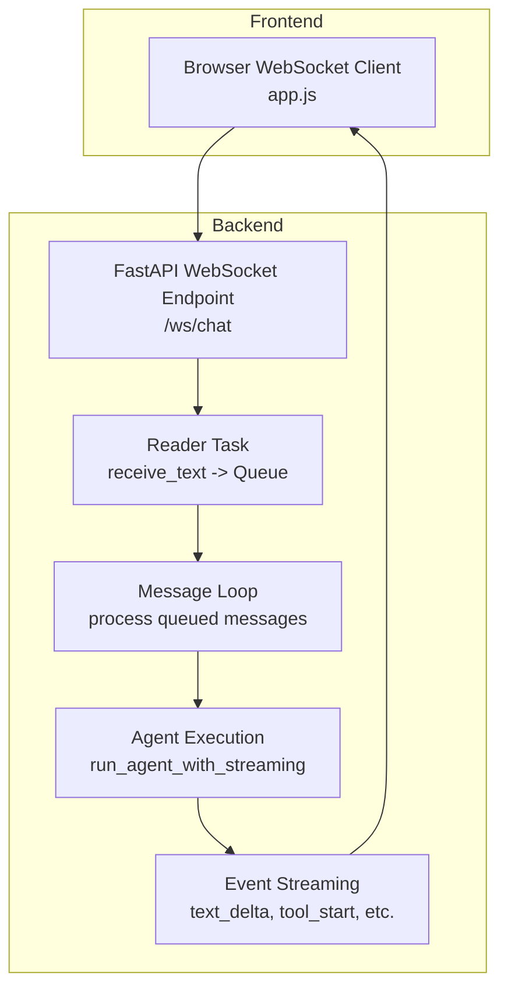
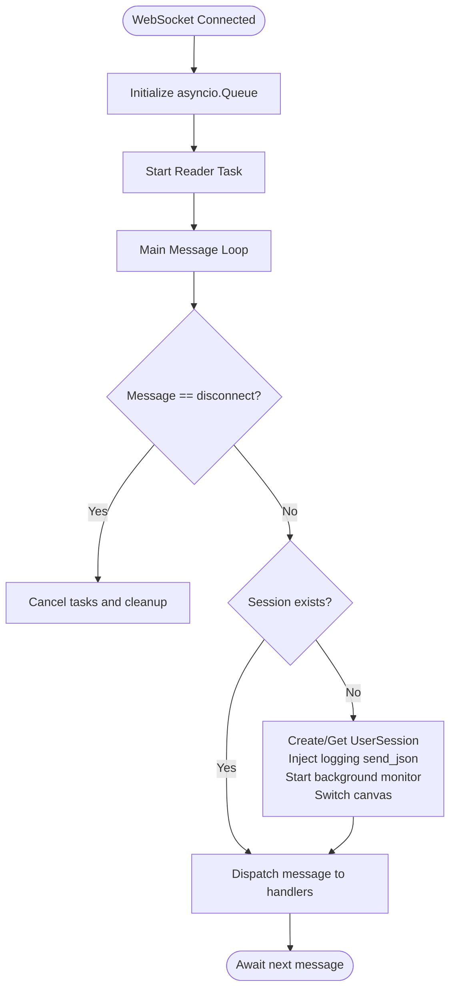
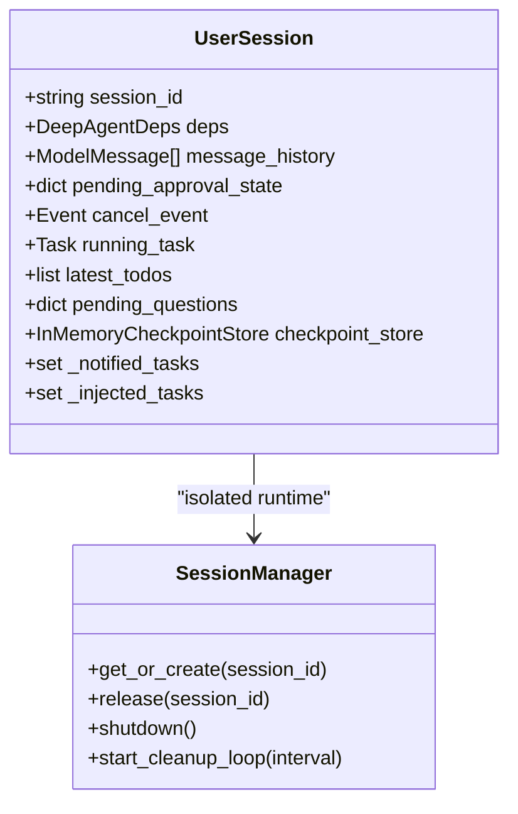
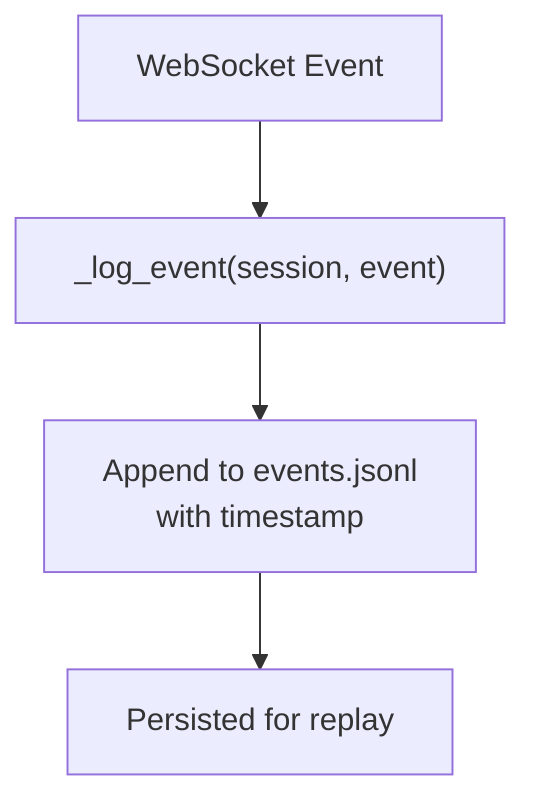
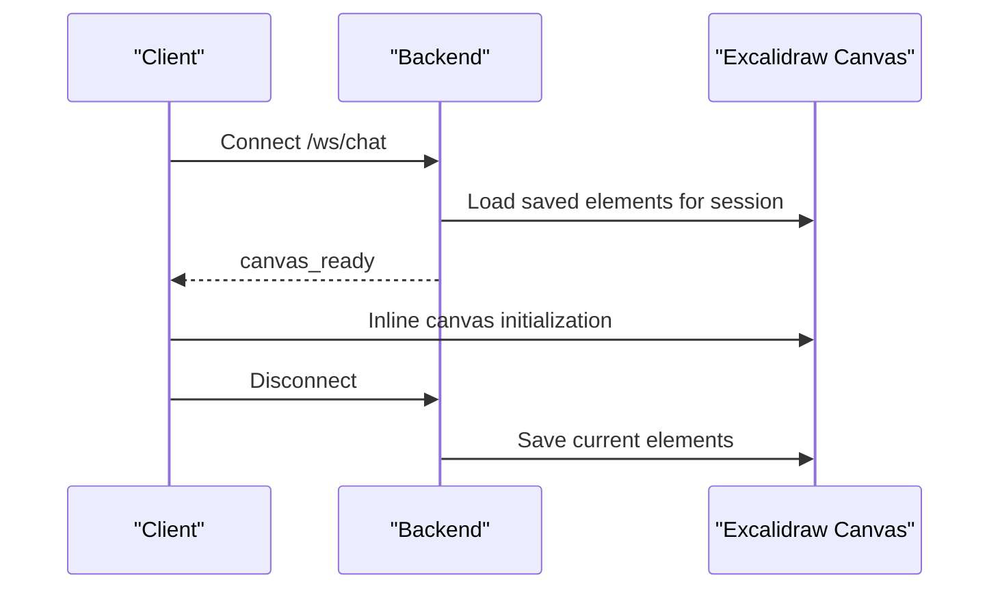
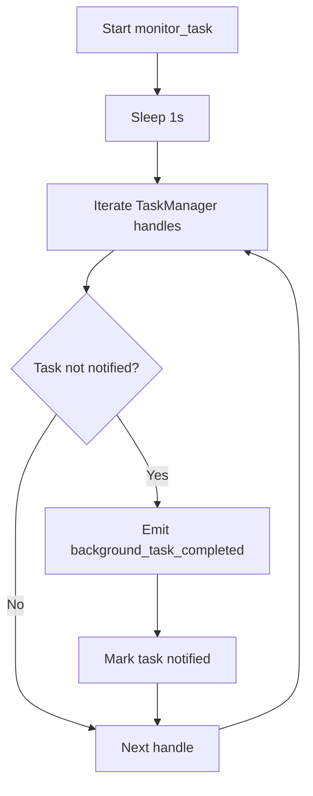
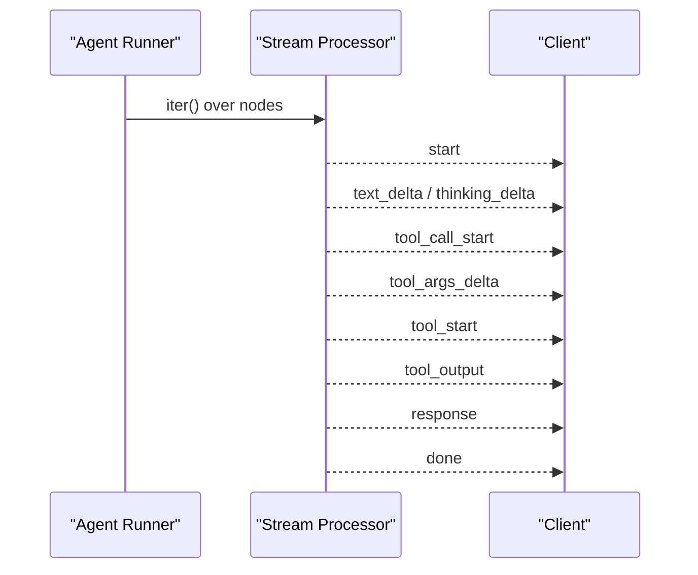
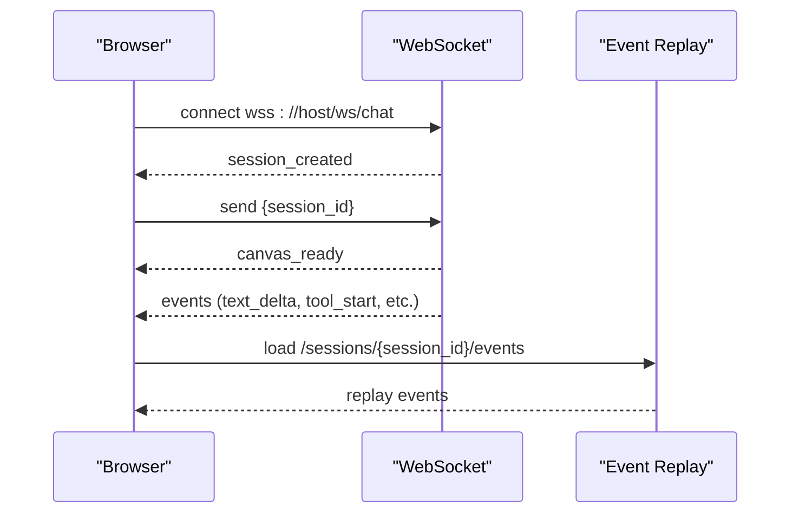
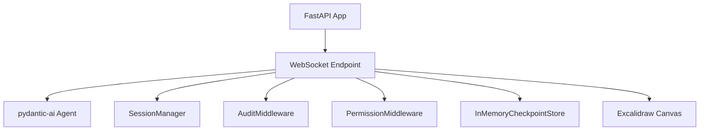

# WebSocket Streaming Implementation

<cite>
**Referenced Files in This Document**
- [app.py](file://apps/deepresearch/src/deepresearch/app.py)
- [app.js](file://apps/deepresearch/static/app.js)
- [app.py](file://examples/full_app/app.py)
- [app.js](file://examples/full_app/static/app.js)
</cite>

## Table of Contents
1. [Introduction](#introduction)
2. [Project Structure](#project-structure)
3. [Core Components](#core-components)
4. [Architecture Overview](#architecture-overview)
5. [Detailed Component Analysis](#detailed-component-analysis)
6. [Dependency Analysis](#dependency-analysis)
7. [Performance Considerations](#performance-considerations)
8. [Troubleshooting Guide](#troubleshooting-guide)
9. [Conclusion](#conclusion)

## Introduction
This document explains the WebSocket streaming implementation for real-time chat with the research agent. It covers the `/ws/chat` endpoint, message queuing with asyncio.Queue, the reader/writer task pattern, session management, event logging for JSONL persistence, canvas switching functionality, and background task monitoring. It also provides practical examples of WebSocket connection handling, message processing, and real-time event broadcasting.

## Project Structure
The WebSocket streaming implementation spans two primary applications:
- DeepResearch application: production-grade implementation with Excalidraw canvas isolation, JSONL event logging, and background task monitoring
- Full App example: simplified demonstration of the same streaming patterns with a focus on core protocol and event types

Both share the same fundamental architecture:
- FastAPI WebSocket endpoint at `/ws/chat`
- Reader task consuming WebSocket frames and enqueuing messages
- Main loop processing queued messages and driving agent execution
- Real-time event streaming to the client



**Diagram sources**
- [app.py:719-912](file://apps/deepresearch/src/deepresearch/app.py#L719-L912)
- [app.js:74-105](file://apps/deepresearch/static/app.js#L74-L105)

**Section sources**
- [app.py:719-912](file://apps/deepresearch/src/deepresearch/app.py#L719-L912)
- [app.js:74-105](file://apps/deepresearch/static/app.js#L74-L105)

## Core Components
This section outlines the essential building blocks of the WebSocket streaming system.

- WebSocket endpoint (`/ws/chat`)
  - Accepts WebSocket connections and initializes session state
  - Implements reader/writer task pattern with asyncio.Queue
  - Streams structured events to the client

- Session management
  - Creates or retrieves UserSession keyed by session_id
  - Isolates Docker runtime per session via SessionManager
  - Tracks message history, pending approvals, and cancellation events

- Message queuing with asyncio.Queue
  - Reader task decodes incoming WebSocket frames and enqueues JSON payloads
  - Main loop dequeues and processes messages concurrently
  - Handles disconnection by injecting a sentinel message

- Real-time event streaming
  - Emits structured events: start, text_delta, thinking_delta, tool_call_start, tool_args_delta, tool_start, tool_output, response, done, error, approval_required, middleware_event, ask_user_question, checkpoint_saved, checkpoint_rewind, background_task_completed, report_updated
  - Maintains streaming state for cancel recovery and partial history persistence

- Event logging (JSONL)
  - Persists all WebSocket events to events.jsonl under each session's workspace
  - Enables full-fidelity replay of sessions via /sessions/{session_id}/events

- Canvas switching (Excalidraw)
  - Isolates Excalidraw canvas per session
  - Saves current canvas state on disconnect and loads on connect
  - Notifies frontend when canvas is ready

- Background task monitoring
  - Polls TaskManager for completed/failed tasks
  - Pushes notifications to clients via background_task_completed events

**Section sources**
- [app.py:248-264](file://apps/deepresearch/src/deepresearch/app.py#L248-L264)
- [app.py:271-283](file://apps/deepresearch/src/deepresearch/app.py#L271-L283)
- [app.py:366-405](file://apps/deepresearch/src/deepresearch/app.py#L366-L405)
- [app.py:497-560](file://apps/deepresearch/src/deepresearch/app.py#L497-L560)
- [app.py:719-912](file://apps/deepresearch/src/deepresearch/app.py#L719-L912)

## Architecture Overview
The WebSocket streaming pipeline follows a producer-consumer pattern:
- Producer: WebSocket reader task continuously receives frames and enqueues JSON messages
- Consumer: Main loop processes messages, manages sessions, and orchestrates agent execution
- Agent: Executes model requests and tool calls, streaming intermediate results
- Publisher: Emits structured events to the client in real time

```mermaid
sequenceDiagram
participant Client as "Client"
participant WS as "WebSocket Endpoint"
participant Reader as "Reader Task"
participant Loop as "Message Loop"
participant Agent as "Agent Runner"
participant Events as "Event Stream"
Client->>WS : Connect /ws/chat
WS->>Client : session_created or canvas_ready
WS->>Reader : receive_text()
Reader->>Loop : put(json_message)
Loop->>Agent : run_agent_with_streaming(user_prompt)
Agent->>Events : emit start, text_delta, tool_start, etc.
Events-->>Client : Real-time events
Client->>WS : message (cancel, approval, question_answer)
WS->>Loop : enqueue message
Loop->>Agent : handle cancellation/approval
Agent-->>Client : cancelled, done, or error
```

**Diagram sources**
- [app.py:719-912](file://apps/deepresearch/src/deepresearch/app.py#L719-L912)
- [app.py:981-1100](file://apps/deepresearch/src/deepresearch/app.py#L981-L1100)

## Detailed Component Analysis

### WebSocket Endpoint and Reader/Writer Pattern
The `/ws/chat` endpoint establishes the WebSocket connection, sets up the reader task, and runs the main message loop. The reader task consumes WebSocket frames, decodes JSON, and enqueues messages into an asyncio.Queue. The main loop dequeues messages, performs session management, and triggers agent execution.

Key behaviors:
- Accepts WebSocket connections and validates agent readiness
- Creates or retrieves UserSession based on session_id
- Injects a logging wrapper around websocket.send_json to persist events to JSONL
- Starts background task monitoring for push notifications
- Switches Excalidraw canvas to isolate per session
- Emits canvas_ready when the canvas is prepared



**Diagram sources**
- [app.py:719-784](file://apps/deepresearch/src/deepresearch/app.py#L719-L784)
- [app.py:734-742](file://apps/deepresearch/src/deepresearch/app.py#L734-L742)

**Section sources**
- [app.py:719-784](file://apps/deepresearch/src/deepresearch/app.py#L719-L784)
- [app.py:734-742](file://apps/deepresearch/src/deepresearch/app.py#L734-L742)

### Session Management and Canvas Isolation
Session management ensures each client connection has an isolated runtime environment and persistent state:
- UserSession encapsulates message history, pending approvals, cancellation events, running tasks, and todo lists
- get_or_create_session creates or restores sessions with isolated Docker containers via SessionManager
- Canvas switching saves current canvas state and loads the target session's canvas on connect
- Ask-user callback enables interactive planning flows



**Diagram sources**
- [app.py:248-264](file://apps/deepresearch/src/deepresearch/app.py#L248-L264)
- [app.py:562-602](file://apps/deepresearch/src/deepresearch/app.py#L562-L602)

**Section sources**
- [app.py:248-264](file://apps/deepresearch/src/deepresearch/app.py#L248-L264)
- [app.py:562-602](file://apps/deepresearch/src/deepresearch/app.py#L562-L602)

### Event Logging and JSONL Persistence
All WebSocket events are persisted to events.jsonl under each session's workspace directory. This enables:
- Full-fidelity session replay via /sessions/{session_id}/events
- Auditing and debugging of agent interactions
- Recovery of partial responses on cancellation



**Diagram sources**
- [app.py:271-283](file://apps/deepresearch/src/deepresearch/app.py#L271-L283)
- [app.py:1751-1768](file://apps/deepresearch/src/deepresearch/app.py#L1751-L1768)

**Section sources**
- [app.py:271-283](file://apps/deepresearch/src/deepresearch/app.py#L271-L283)
- [app.py:1751-1768](file://apps/deepresearch/src/deepresearch/app.py#L1751-L1768)

### Canvas Switching Functionality
Canvas switching isolates Excalidraw canvases per session:
- On connect, the backend switches to the session's canvas state
- On disconnect, the current canvas is saved for later retrieval
- The frontend receives canvas_ready to safely initialize the inline canvas



**Diagram sources**
- [app.py:497-560](file://apps/deepresearch/src/deepresearch/app.py#L497-L560)
- [app.js:306-310](file://apps/deepresearch/static/app.js#L306-L310)

**Section sources**
- [app.py:497-560](file://apps/deepresearch/src/deepresearch/app.py#L497-L560)
- [app.js:306-310](file://apps/deepresearch/static/app.js#L306-L310)

### Background Task Monitoring
The backend polls TaskManager for completed or failed tasks and pushes notifications to clients:
- Runs a periodic monitor task that checks task handles
- Emits background_task_completed events with task metadata
- Tracks notified and injected tasks to avoid duplicates



**Diagram sources**
- [app.py:366-405](file://apps/deepresearch/src/deepresearch/app.py#L366-L405)

**Section sources**
- [app.py:366-405](file://apps/deepresearch/src/deepresearch/app.py#L366-L405)

### Real-Time Event Broadcasting
The agent streams structured events to the client as it executes:
- Model request streaming emits text_delta and thinking_delta
- Tool call streaming emits tool_call_start, tool_args_delta, tool_start, and tool_output
- Additional events: start, response, done, error, approval_required, middleware_event, ask_user_question, checkpoint_saved, checkpoint_rewind, background_task_completed, report_updated



**Diagram sources**
- [app.py:981-1100](file://apps/deepresearch/src/deepresearch/app.py#L981-L1100)
- [app.py:1137-1196](file://apps/deepresearch/src/deepresearch/app.py#L1137-L1196)
- [app.py:1214-1360](file://apps/deepresearch/src/deepresearch/app.py#L1214-L1360)

**Section sources**
- [app.py:981-1100](file://apps/deepresearch/src/deepresearch/app.py#L981-L1100)
- [app.py:1137-1196](file://apps/deepresearch/src/deepresearch/app.py#L1137-L1196)
- [app.py:1214-1360](file://apps/deepresearch/src/deepresearch/app.py#L1214-L1360)

### Frontend WebSocket Handling and Event Replay
The frontend establishes the WebSocket connection, handles events, and supports session replay:
- Connects to /ws/chat with automatic reconnection
- Parses events and renders UI updates (messages, tools, todos)
- Supports JSONL event replay for full fidelity restoration
- Manages Excalidraw canvas visibility and iframe reloading



**Diagram sources**
- [app.js:74-105](file://apps/deepresearch/static/app.js#L74-L105)
- [app.js:107-163](file://apps/deepresearch/static/app.js#L107-L163)

**Section sources**
- [app.js:74-105](file://apps/deepresearch/static/app.js#L74-L105)
- [app.js:107-163](file://apps/deepresearch/static/app.js#L107-L163)

## Dependency Analysis
The WebSocket streaming system integrates several subsystems:
- FastAPI WebSocket routing and lifecycle management
- pydantic-ai agent execution with streaming node iteration
- SessionManager for isolated Docker runtime per session
- AuditMiddleware and PermissionMiddleware for auditing and safety
- InMemoryCheckpointStore for conversation persistence
- Excalidraw integration for visual collaboration



**Diagram sources**
- [app.py:636-692](file://apps/deepresearch/src/deepresearch/app.py#L636-L692)
- [app.py:719-912](file://apps/deepresearch/src/deepresearch/app.py#L719-L912)

**Section sources**
- [app.py:636-692](file://apps/deepresearch/src/deepresearch/app.py#L636-L692)
- [app.py:719-912](file://apps/deepresearch/src/deepresearch/app.py#L719-L912)

## Performance Considerations
- Reader/writer task pattern with asyncio.Queue ensures non-blocking message processing
- JSONL event logging is append-only and lightweight, minimizing overhead
- Canvas switching uses HTTP calls to Excalidraw API; timeouts are configured to prevent stalls
- Background task monitoring polls periodically to balance responsiveness and resource usage
- Message history persistence occurs after agent completion to reduce write frequency

## Troubleshooting Guide
Common issues and resolutions:
- WebSocket disconnects
  - The reader task injects a sentinel message to terminate the main loop gracefully
  - Canvas state is saved on disconnect to preserve progress

- Empty or invalid messages
  - The backend validates message presence and responds with error events when messages are empty

- Approval flows
  - When the agent requests approvals, the backend emits approval_required and waits for user responses
  - The frontend displays approval dialogs and forwards responses back to the backend

- Cancellation
  - Clients can send cancel requests; the backend cancels running tasks and persists partial history

- Session replay
  - Use /sessions/{session_id}/events to fetch JSONL events and replay UI state

**Section sources**
- [app.py:739-740](file://apps/deepresearch/src/deepresearch/app.py#L739-L740)
- [app.py:802-818](file://apps/deepresearch/src/deepresearch/app.py#L802-L818)
- [app.py:1103-1130](file://apps/deepresearch/src/deepresearch/app.py#L1103-L1130)
- [app.py:1751-1768](file://apps/deepresearch/src/deepresearch/app.py#L1751-L1768)

## Conclusion
The WebSocket streaming implementation provides a robust, real-time communication channel between the client and the research agent. Through the reader/writer task pattern, message queuing, and structured event streaming, it delivers a responsive and auditable user experience. Features like JSONL persistence, canvas isolation, and background task monitoring enhance reliability and usability for complex workflows.