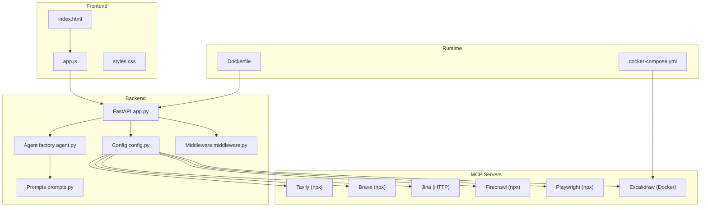
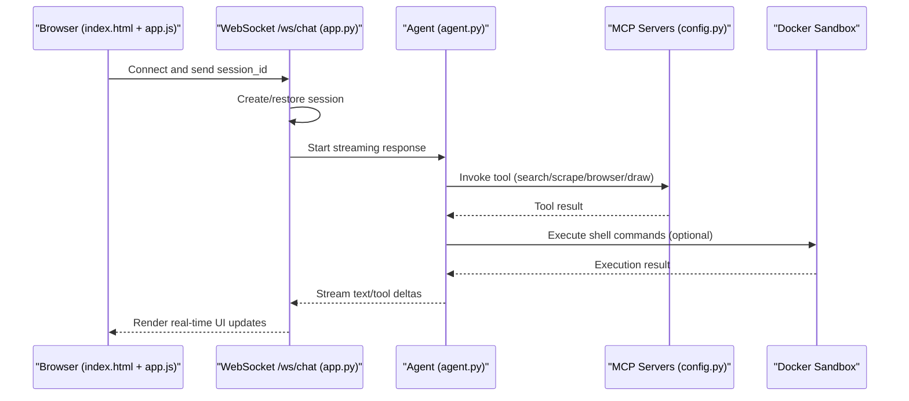
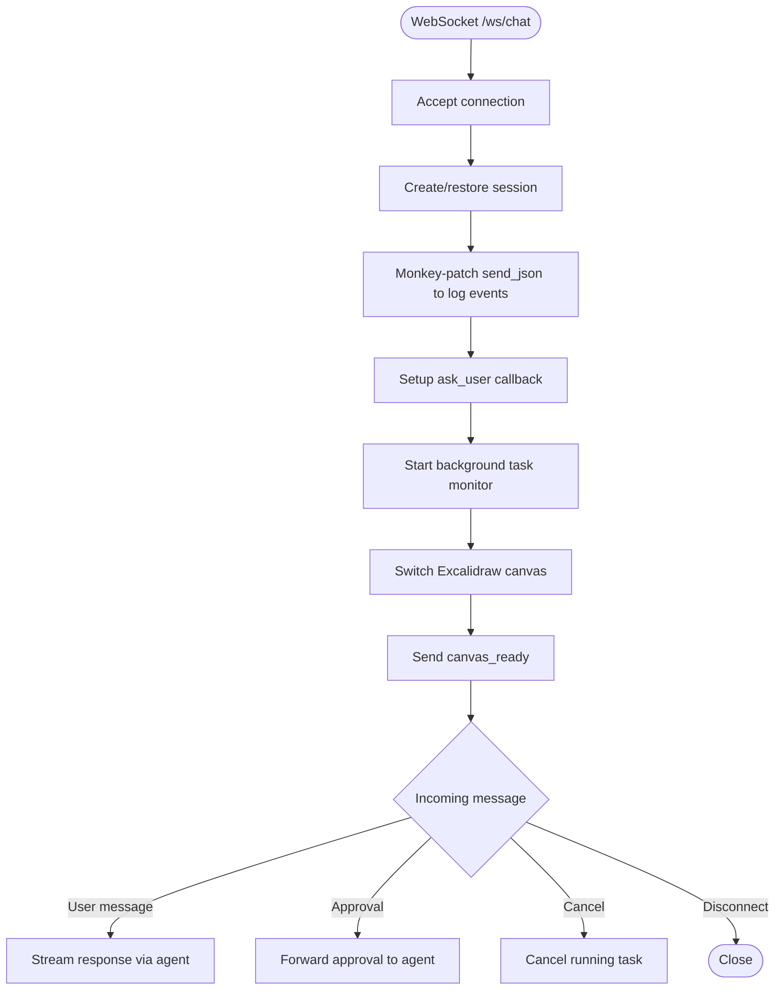
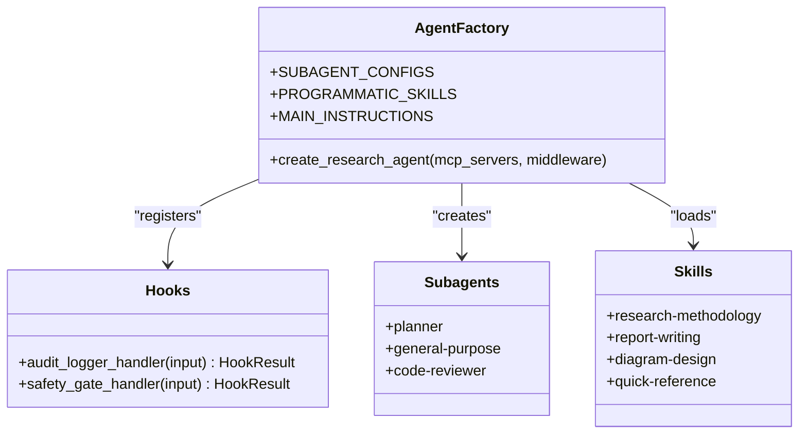
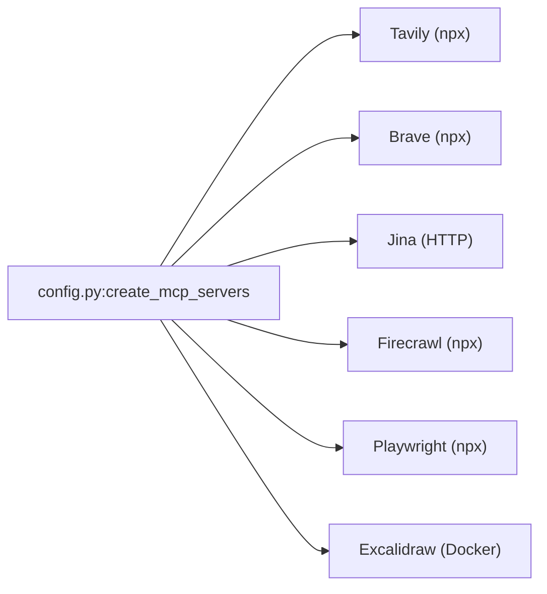
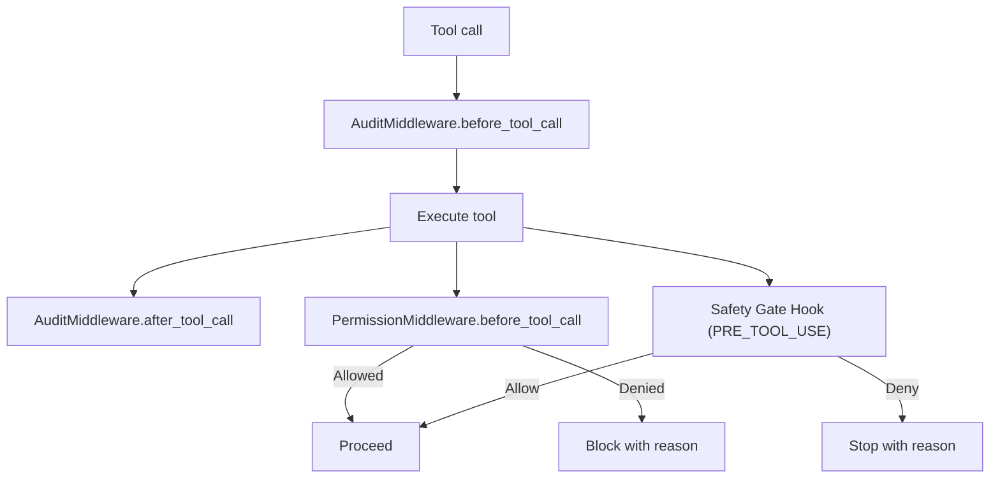
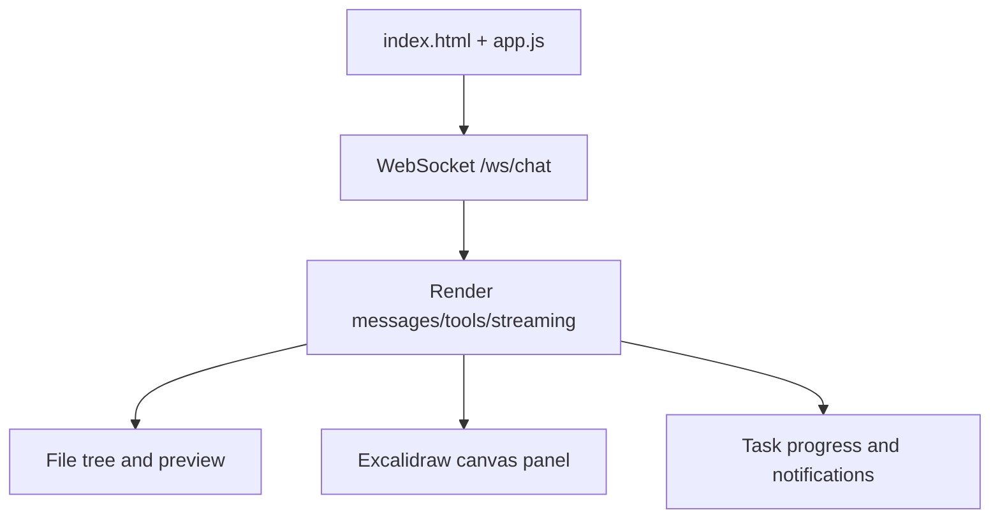
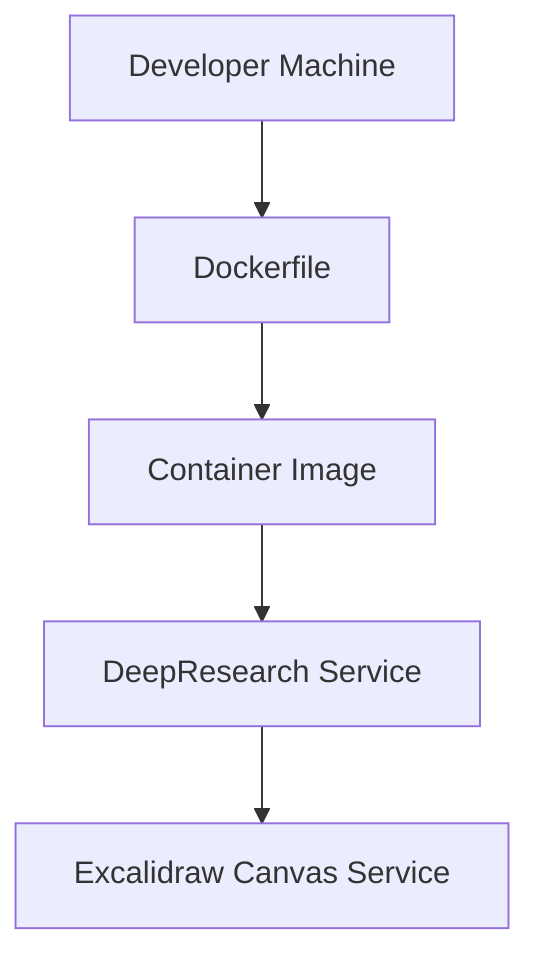
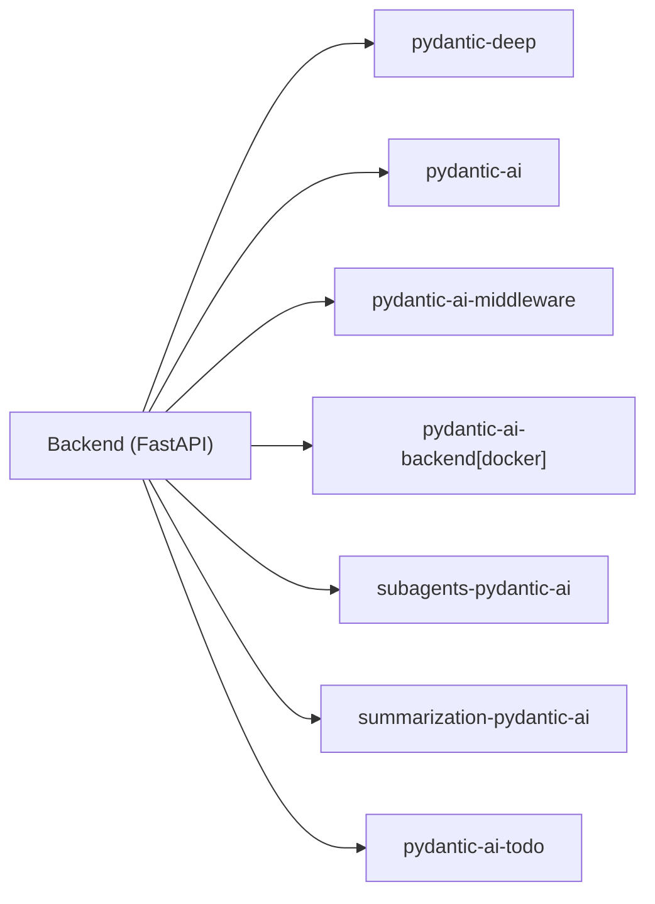

# DeepResearch Web Application

<cite>
**Referenced Files in This Document**
- [app.py](file://apps/deepresearch/src/deepresearch/app.py)
- [agent.py](file://apps/deepresearch/src/deepresearch/agent.py)
- [config.py](file://apps/deepresearch/src/deepresearch/config.py)
- [prompts.py](file://apps/deepresearch/src/deepresearch/prompts.py)
- [middleware.py](file://apps/deepresearch/src/deepresearch/middleware.py)
- [index.html](file://apps/deepresearch/static/index.html)
- [app.js](file://apps/deepresearch/static/app.js)
- [styles.css](file://apps/deepresearch/static/styles.css)
- [Dockerfile](file://apps/deepresearch/Dockerfile)
- [docker-compose.yml](file://apps/deepresearch/docker-compose.yml)
- [pyproject.toml](file://apps/deepresearch/pyproject.toml)
- [README.md](file://apps/deepresearch/README.md)
- [SKILL.md (research-methodology)](file://apps/deepresearch/skills/research-methodology/SKILL.md)
- [DEEP.md](file://apps/deepresearch/workspace/DEEP.md)
- [MEMORY.md](file://apps/deepresearch/workspace/MEMORY.md)
</cite>

## Table of Contents
1. [Introduction](#introduction)
2. [Project Structure](#project-structure)
3. [Core Components](#core-components)
4. [Architecture Overview](#architecture-overview)
5. [Detailed Component Analysis](#detailed-component-analysis)
6. [Dependency Analysis](#dependency-analysis)
7. [Performance Considerations](#performance-considerations)
8. [Troubleshooting Guide](#troubleshooting-guide)
9. [Conclusion](#conclusion)
10. [Appendices](#appendices)

## Introduction
DeepResearch is a complete AI-powered research assistant with a FastAPI backend and a React-like single-page frontend. It integrates with MCP (Model Context Protocol) servers for web search, web scraping, browser automation, and diagram generation. The system runs inside Docker-managed sandboxed environments for secure file operations and code execution. Users interact via a WebSocket stream for real-time responses, with a dark-themed UI and rich tooling for research, planning, subagents, and report generation.

## Project Structure
The application is organized into:
- Backend: FastAPI application with WebSocket streaming, agent factory, MCP server integration, and middleware/hooks
- Frontend: Single-page app with HTML/CSS/JS for chat, file tree, Excalidraw canvas, and tool rendering
- Docker: Containerized runtime with optional Excalidraw canvas service
- Skills and workspace: Domain-specific skills and persistent context files

**Diagram sources**
- [app.py:636-692](file://apps/deepresearch/src/deepresearch/app.py#L636-L692)
- [agent.py:376-430](file://apps/deepresearch/src/deepresearch/agent.py#L376-L430)
- [config.py:58-151](file://apps/deepresearch/src/deepresearch/config.py#L58-L151)
- [Dockerfile:1-48](file://apps/deepresearch/Dockerfile#L1-L48)
- [docker-compose.yml:1-29](file://apps/deepresearch/docker-compose.yml#L1-L29)

**Section sources**
- [README.md:158-183](file://apps/deepresearch/README.md#L158-L183)
- [pyproject.toml:1-37](file://apps/deepresearch/pyproject.toml#L1-L37)

## Core Components
- FastAPI backend with WebSocket streaming for real-time chat
- Agent factory with hooks, subagents, skills, and instructions
- MCP server integrations for web search, scraping, browser automation, and diagrams
- Docker-based sandboxed execution environment
- React-like frontend with dark theme and file operations
- Session management with persistence and canvas isolation

**Section sources**
- [app.py:636-692](file://apps/deepresearch/src/deepresearch/app.py#L636-L692)
- [agent.py:376-430](file://apps/deepresearch/src/deepresearch/agent.py#L376-L430)
- [config.py:58-151](file://apps/deepresearch/src/deepresearch/config.py#L58-L151)
- [middleware.py:33-122](file://apps/deepresearch/src/deepresearch/middleware.py#L33-L122)

## Architecture Overview
DeepResearch uses a layered architecture:
- Presentation: SPA with WebSocket-driven UI
- Application: FastAPI routes and WebSocket handlers
- Intelligence: Agent factory with hooks, subagents, and skills
- Integration: MCP servers for external tools
- Runtime: Docker-managed sandbox for safe execution

**Diagram sources**
- [app.py:719-800](file://apps/deepresearch/src/deepresearch/app.py#L719-L800)
- [agent.py:376-430](file://apps/deepresearch/src/deepresearch/agent.py#L376-L430)
- [config.py:58-151](file://apps/deepresearch/src/deepresearch/config.py#L58-L151)

## Detailed Component Analysis

### Backend: FastAPI and WebSocket Streaming
- Initializes agent with MCP servers and middleware
- Manages per-user sessions with isolated Docker containers
- Streams model responses and tool events via WebSocket
- Persists events to JSONL and maintains session metadata/history
- Integrates Excalidraw canvas per session

**Diagram sources**
- [app.py:719-800](file://apps/deepresearch/src/deepresearch/app.py#L719-L800)
- [app.py:271-326](file://apps/deepresearch/src/deepresearch/app.py#L271-L326)
- [app.py:366-405](file://apps/deepresearch/src/deepresearch/app.py#L366-L405)
- [app.py:497-560](file://apps/deepresearch/src/deepresearch/app.py#L497-L560)

**Section sources**
- [app.py:636-692](file://apps/deepresearch/src/deepresearch/app.py#L636-L692)
- [app.py:719-800](file://apps/deepresearch/src/deepresearch/app.py#L719-L800)
- [app.py:271-326](file://apps/deepresearch/src/deepresearch/app.py#L271-L326)

### Agent Factory: Hooks, Subagents, Skills, Instructions
- Defines audit logger and safety gate hooks
- Creates planner, general-purpose, and code-reviewer subagents
- Provides programmatic skills and quick reference guide
- Includes research-specific instructions and routing rules

**Diagram sources**
- [agent.py:376-430](file://apps/deepresearch/src/deepresearch/agent.py#L376-L430)
- [agent.py:69-81](file://apps/deepresearch/src/deepresearch/agent.py#L69-L81)
- [agent.py:179-225](file://apps/deepresearch/src/deepresearch/agent.py#L179-L225)
- [agent.py:271-338](file://apps/deepresearch/src/deepresearch/agent.py#L271-L338)

**Section sources**
- [agent.py:376-430](file://apps/deepresearch/src/deepresearch/agent.py#L376-L430)
- [prompts.py:3-320](file://apps/deepresearch/src/deepresearch/prompts.py#L3-L320)
- [SKILL.md (research-methodology):1-70](file://apps/deepresearch/skills/research-methodology/SKILL.md#L1-L70)

### MCP Server Integrations
- Web search: Tavily, Brave Search (npx), Jina URL reader (HTTP)
- Web scraping: Firecrawl (npx)
- Browser automation: Playwright (npx)
- Diagrams: Excalidraw via Docker-managed MCP server

**Diagram sources**
- [config.py:58-151](file://apps/deepresearch/src/deepresearch/config.py#L58-L151)

**Section sources**
- [config.py:58-151](file://apps/deepresearch/src/deepresearch/config.py#L58-L151)

### Middleware and Security
- AuditMiddleware: tracks tool usage stats and durations
- PermissionMiddleware: blocks access to sensitive paths for file tools
- Safety gate hook prevents dangerous shell commands

**Diagram sources**
- [middleware.py:33-122](file://apps/deepresearch/src/deepresearch/middleware.py#L33-L122)
- [agent.py:45-81](file://apps/deepresearch/src/deepresearch/agent.py#L45-L81)

**Section sources**
- [middleware.py:33-122](file://apps/deepresearch/src/deepresearch/middleware.py#L33-L122)
- [agent.py:45-81](file://apps/deepresearch/src/deepresearch/agent.py#L45-L81)

### Frontend: React-like SPA with Dark Theme
- Single-page app with tabs for sessions, files, and config
- Real-time WebSocket updates with streaming deltas
- File tree, preview panel, and Excalidraw canvas integration
- Tool rendering for search, subagents, and Excalidraw

**Diagram sources**
- [index.html:1-176](file://apps/deepresearch/static/index.html#L1-L176)
- [app.js:1-800](file://apps/deepresearch/static/app.js#L1-L800)
- [styles.css:1-800](file://apps/deepresearch/static/styles.css#L1-L800)

**Section sources**
- [index.html:1-176](file://apps/deepresearch/static/index.html#L1-L176)
- [app.js:1-800](file://apps/deepresearch/static/app.js#L1-L800)
- [styles.css:1-800](file://apps/deepresearch/static/styles.css#L1-L800)

### Docker-Based Sandbox and Deployment
- Python 3.12 base with Node.js and Docker CLI
- Installs pydantic-deep and related packages
- Exposes port 8080, runs FastAPI app module
- docker-compose includes Excalidraw canvas service

**Diagram sources**
- [Dockerfile:1-48](file://apps/deepresearch/Dockerfile#L1-L48)
- [docker-compose.yml:1-29](file://apps/deepresearch/docker-compose.yml#L1-L29)

**Section sources**
- [Dockerfile:1-48](file://apps/deepresearch/Dockerfile#L1-L48)
- [docker-compose.yml:1-29](file://apps/deepresearch/docker-compose.yml#L1-L29)
- [README.md:209-224](file://apps/deepresearch/README.md#L209-L224)

## Dependency Analysis
- Backend depends on pydantic-ai, pydantic-deep, and subagents libraries
- MCP servers are optional and dynamically configured based on environment variables
- Frontend depends on WebSocket connectivity and Excalidraw canvas availability
- Docker runtime provides sandbox isolation for file operations and code execution

**Diagram sources**
- [pyproject.toml:6-15](file://apps/deepresearch/pyproject.toml#L6-L15)
- [Dockerfile:21-31](file://apps/deepresearch/Dockerfile#L21-L31)

**Section sources**
- [pyproject.toml:6-15](file://apps/deepresearch/pyproject.toml#L6-L15)
- [Dockerfile:21-31](file://apps/deepresearch/Dockerfile#L21-L31)

## Performance Considerations
- WebSocket streaming reduces latency for real-time updates
- MCP servers are optional; disabling them reduces startup overhead
- Docker sandbox ensures resource isolation but adds container startup time
- AuditMiddleware provides tool usage metrics to identify bottlenecks
- Excalidraw canvas synchronization adds network overhead; disable if not needed

## Troubleshooting Guide
- MCP server failures: The backend attempts to rebuild the agent without problematic servers and logs warnings
- Docker availability: Excalidraw requires Docker; if unavailable, it is disabled with a warning
- Permission denials: PermissionMiddleware blocks sensitive paths; adjust tool arguments accordingly
- WebSocket disconnects: Frontend reconnects with exponential backoff; ensure backend remains reachable

**Section sources**
- [app.py:670-686](file://apps/deepresearch/src/deepresearch/app.py#L670-L686)
- [config.py:107-127](file://apps/deepresearch/src/deepresearch/config.py#L107-L127)
- [middleware.py:95-122](file://apps/deepresearch/src/deepresearch/middleware.py#L95-L122)
- [app.js:74-105](file://apps/deepresearch/static/app.js#L74-L105)

## Conclusion
DeepResearch delivers a powerful, extensible research assistant with robust integrations, secure sandboxing, and a polished UI. Its modular design enables easy addition of new MCP servers and skills, while the agent factory supports complex workflows through planning, subagents, and checkpointing.

## Appendices

### Setup Instructions
- Install prerequisites: Python 3.12+, uv, Node.js 20+, Docker
- Sync dependencies and optionally enable export extras
- Configure environment variables for MCP servers and Excalidraw
- Start Excalidraw canvas service and run the application

**Section sources**
- [README.md:12-62](file://apps/deepresearch/README.md#L12-L62)
- [README.md:84-98](file://apps/deepresearch/README.md#L84-L98)

### Environment Variables
- MODEL_NAME: LLM model selection
- TAVILY_API_KEY, BRAVE_API_KEY, JINA_API_KEY, FIRECRAWL_API_KEY: MCP server credentials
- PLAYWRIGHT_MCP: Enable Playwright browser automation
- EXCALIDRAW_ENABLED, EXCALIDRAW_SERVER_URL, EXCALIDRAW_CANVAS_URL: Excalidraw configuration

**Section sources**
- [README.md:84-98](file://apps/deepresearch/README.md#L84-L98)
- [config.py:30, 36, 107-127:30-36](file://apps/deepresearch/src/deepresearch/config.py#L30-L36)

### Deployment Options
- Local development: Run natively with uv; use Excalidraw canvas service
- Containerized: Build and run with Docker; mount Docker socket for sandboxing

**Section sources**
- [README.md:209-224](file://apps/deepresearch/README.md#L209-L224)
- [docker-compose.yml:1-29](file://apps/deepresearch/docker-compose.yml#L1-L29)

### Customization Guidelines
- Add new MCP servers in config.py with appropriate prefixes
- Extend agent factory with additional subagents and skills
- Customize prompts and instructions for domain-specific workflows
- Modify frontend UI by editing index.html, app.js, and styles.css

**Section sources**
- [config.py:58-151](file://apps/deepresearch/src/deepresearch/config.py#L58-L151)
- [agent.py:376-430](file://apps/deepresearch/src/deepresearch/agent.py#L376-L430)
- [prompts.py:3-320](file://apps/deepresearch/src/deepresearch/prompts.py#L3-L320)
- [index.html:1-176](file://apps/deepresearch/static/index.html#L1-L176)
- [styles.css:1-800](file://apps/deepresearch/static/styles.css#L1-L800)

### Security Considerations
- PermissionMiddleware blocks sensitive file paths
- Safety gate hook filters dangerous shell commands
- Docker sandbox isolates file operations and code execution
- AuditMiddleware logs tool usage for monitoring

**Section sources**
- [middleware.py:77-122](file://apps/deepresearch/src/deepresearch/middleware.py#L77-L122)
- [agent.py:45-81](file://apps/deepresearch/src/deepresearch/agent.py#L45-L81)
- [README.md:209-224](file://apps/deepresearch/README.md#L209-L224)

### Workspace and Context
- DEEP.md and MEMORY.md provide persistent context across sessions
- Workspace organization encourages modular research and reporting

**Section sources**
- [DEEP.md:1-12](file://apps/deepresearch/workspace/DEEP.md#L1-L12)
- [MEMORY.md:1-4](file://apps/deepresearch/workspace/MEMORY.md#L1-L4)