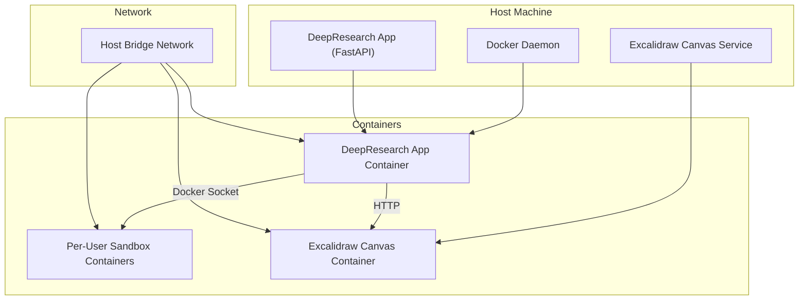
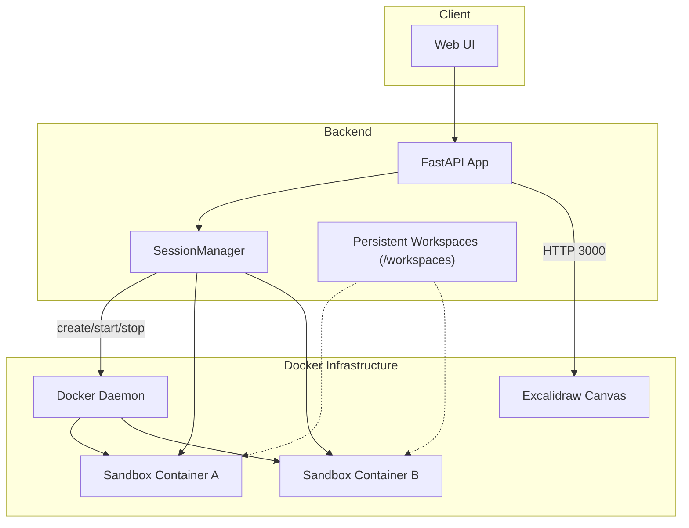
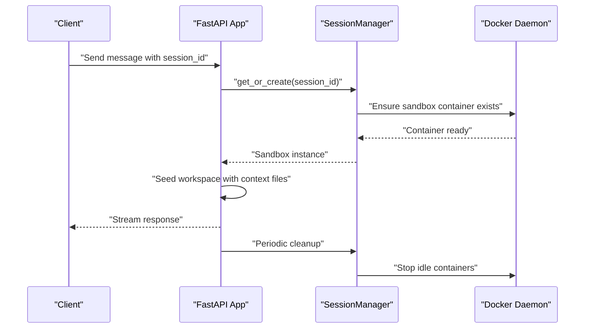
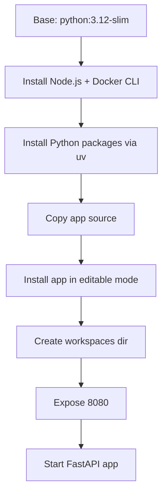
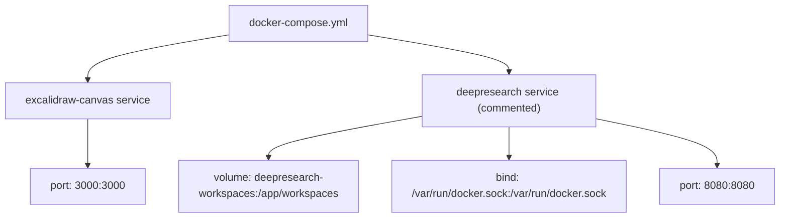
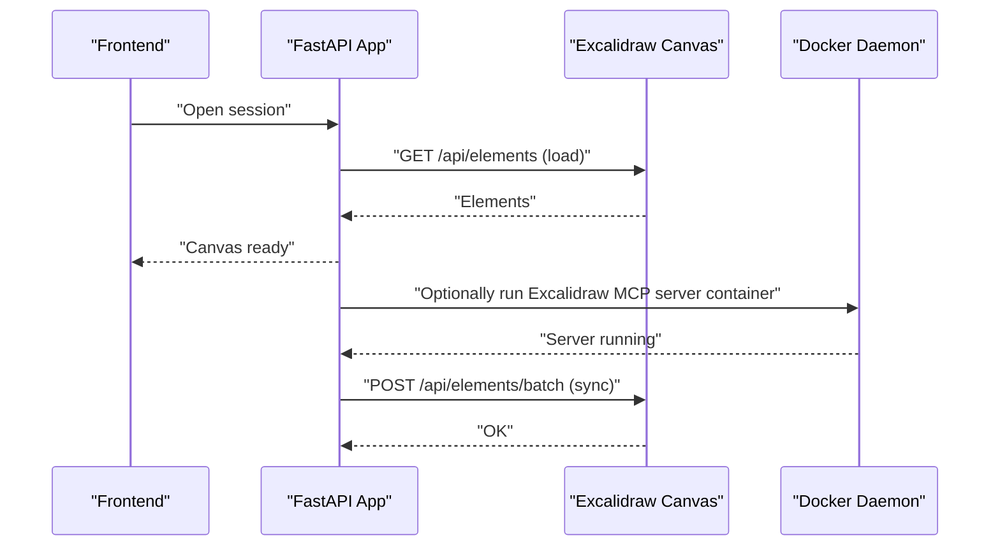
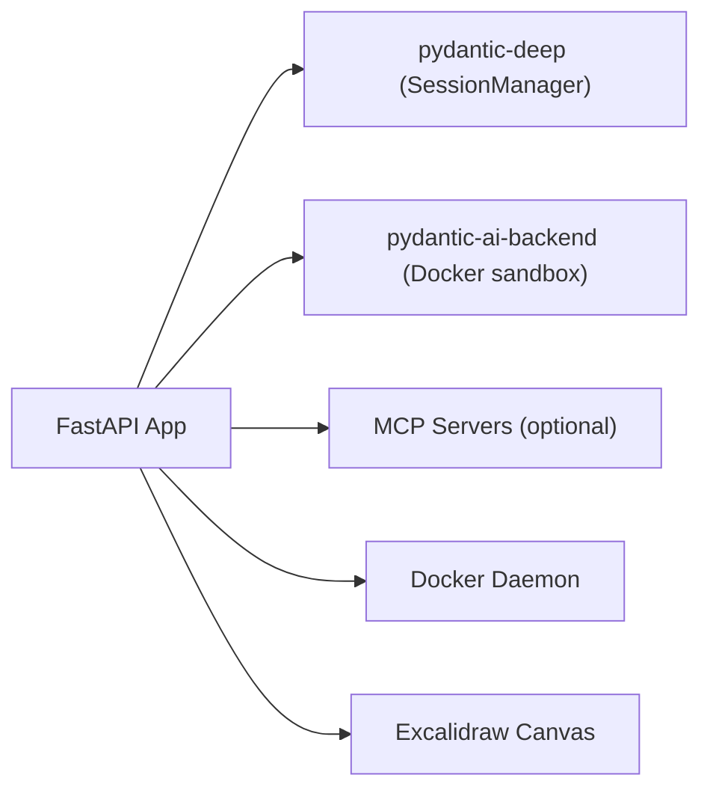

# Docker Sandbox Environment

<cite>
**Referenced Files in This Document**
- [Dockerfile](file://apps/deepresearch/Dockerfile)
- [docker-compose.yml](file://apps/deepresearch/docker-compose.yml)
- [.dockerignore](file://apps/deepresearch/.dockerignore)
- [README.md](file://apps/deepresearch/README.md)
- [config.py](file://apps/deepresearch/src/deepresearch/config.py)
- [app.py](file://apps/deepresearch/src/deepresearch/app.py)
- [docker_sandbox.py](file://examples/docker_sandbox.py)
- [docker-sandbox.md](file://docs/examples/docker-sandbox.md)
- [docker-runtimes.md](file://docs/examples/docker-runtimes.md)
- [full-app.md](file://docs/examples/full-app.md)
</cite>

## Table of Contents
1. [Introduction](#introduction)
2. [Project Structure](#project-structure)
3. [Core Components](#core-components)
4. [Architecture Overview](#architecture-overview)
5. [Detailed Component Analysis](#detailed-component-analysis)
6. [Dependency Analysis](#dependency-analysis)
7. [Performance Considerations](#performance-considerations)
8. [Troubleshooting Guide](#troubleshooting-guide)
9. [Conclusion](#conclusion)
10. [Appendices](#appendices)

## Introduction
This document explains the Docker sandbox environment used by DeepResearch to provide a safe, per-user containerized execution environment. It covers the SessionManager for managing isolated containers, Docker socket access requirements, Dockerfile and docker-compose configuration, container networking for the Excalidraw canvas, security implications, resource limitations, cleanup procedures, and deployment options. It also includes troubleshooting guidance and performance optimization tips.

## Project Structure
The DeepResearch application provides:
- A containerized runtime for production deployments
- A docker-compose setup for the Excalidraw canvas service
- A SessionManager that provisions per-user Docker containers for sandboxed code execution
- Optional MCP servers (including Excalidraw) that may spawn Docker-based processes

**Diagram sources**
- [docker-compose.yml:1-29](file://apps/deepresearch/docker-compose.yml#L1-L29)
- [config.py:107-124](file://apps/deepresearch/src/deepresearch/config.py#L107-L124)
- [app.py:644-648](file://apps/deepresearch/src/deepresearch/app.py#L644-L648)

**Section sources**
- [Dockerfile:1-48](file://apps/deepresearch/Dockerfile#L1-L48)
- [docker-compose.yml:1-29](file://apps/deepresearch/docker-compose.yml#L1-L29)
- [.dockerignore:1-9](file://apps/deepresearch/.dockerignore#L1-L9)
- [README.md:209-224](file://apps/deepresearch/README.md#L209-L224)

## Core Components
- Dockerfile: Builds a production-ready image with Python, Node.js, Docker CLI, and the application installed via uv. Exposes port 8080 and runs the FastAPI app.
- docker-compose.yml: Defines the Excalidraw canvas service and includes commented instructions for running the DeepResearch app in Docker with socket and volume mounts.
- SessionManager: Manages per-user Docker containers for sandboxed execution, persistence via workspace_root, and periodic cleanup.
- MCP Servers: Optional integrations (Excalidraw included) that may spawn Docker-based processes when enabled.

Key runtime and environment configuration:
- Port exposure: 8080 for the FastAPI app
- Excalidraw canvas: default port 3000
- Docker socket access: required for per-user sandbox containers
- Workspace persistence: configurable via workspace_root

**Section sources**
- [Dockerfile:45-47](file://apps/deepresearch/Dockerfile#L45-L47)
- [docker-compose.yml:3-25](file://apps/deepresearch/docker-compose.yml#L3-L25)
- [config.py:36](file://apps/deepresearch/src/deepresearch/config.py#L36)
- [app.py:644-648](file://apps/deepresearch/src/deepresearch/app.py#L644-L648)

## Architecture Overview
The system integrates a FastAPI backend with a SessionManager that provisions per-user Docker containers for safe code execution. The Excalidraw canvas is optional and communicates via HTTP to a separate containerized service. MCP servers may optionally spawn Docker-based processes when enabled.

**Diagram sources**
- [full-app.md:58-105](file://docs/examples/full-app.md#L58-L105)
- [app.py:644-648](file://apps/deepresearch/src/deepresearch/app.py#L644-L648)
- [docker-compose.yml:3-25](file://apps/deepresearch/docker-compose.yml#L3-L25)

## Detailed Component Analysis

### SessionManager and Per-User Sandboxes
- Purpose: Provide isolated Docker containers per user with persistent workspaces.
- Behavior:
  - Creates or retrieves a sandbox for a given user ID.
  - Seeds workspace with context files.
  - Supports automatic cleanup loops and shutdown.
  - Mounts persistent directories under workspace_root for each user.

**Diagram sources**
- [app.py:562-601](file://apps/deepresearch/src/deepresearch/app.py#L562-L601)
- [app.py:644-648](file://apps/deepresearch/src/deepresearch/app.py#L644-L648)
- [docker-runtimes.md:98-121](file://docs/examples/docker-runtimes.md#L98-L121)

**Section sources**
- [app.py:562-601](file://apps/deepresearch/src/deepresearch/app.py#L562-L601)
- [app.py:644-648](file://apps/deepresearch/src/deepresearch/app.py#L644-L648)
- [docker-runtimes.md:94-159](file://docs/examples/docker-runtimes.md#L94-L159)

### Dockerfile Configuration
- Base image: Python 3.12 slim
- System dependencies: Node.js (for MCP servers) and Docker CLI (for SessionManager)
- Application installation:
  - Installs Python packages via uv
  - Copies application source and installs the app in editable mode
  - Creates workspaces directory
- Ports and entrypoint:
  - Exposes 8080
  - Runs the FastAPI app module

**Diagram sources**
- [Dockerfile:1-48](file://apps/deepresearch/Dockerfile#L1-L48)

**Section sources**
- [Dockerfile:3-14](file://apps/deepresearch/Dockerfile#L3-L14)
- [Dockerfile:20-41](file://apps/deepresearch/Dockerfile#L20-L41)
- [Dockerfile:45-47](file://apps/deepresearch/Dockerfile#L45-L47)

### docker-compose Setup for Excalidraw Canvas
- Service definition: Runs the Excalidraw canvas container on port 3000.
- Optional DeepResearch service:
  - Uncommented block shows how to run the app container with:
    - Port mapping 8080:8080
    - Environment file and variables
    - Docker socket bind mount
    - Persistent workspaces volume
  - Depends on the Excalidraw canvas service

**Diagram sources**
- [docker-compose.yml:1-29](file://apps/deepresearch/docker-compose.yml#L1-L29)

**Section sources**
- [docker-compose.yml:2-25](file://apps/deepresearch/docker-compose.yml#L2-L25)
- [README.md:213-221](file://apps/deepresearch/README.md#L213-L221)

### Container Networking and Excalidraw Integration
- Excalidraw canvas URL defaults to localhost:3000.
- The app conditionally starts an Excalidraw MCP server via Docker when enabled and when Docker is available.
- The app saves and restores canvas state per session using HTTP calls to the canvas service.

**Diagram sources**
- [config.py:107-124](file://apps/deepresearch/src/deepresearch/config.py#L107-L124)
- [app.py:497-560](file://apps/deepresearch/src/deepresearch/app.py#L497-L560)

**Section sources**
- [config.py:36](file://apps/deepresearch/src/deepresearch/config.py#L36)
- [config.py:107-124](file://apps/deepresearch/src/deepresearch/config.py#L107-L124)
- [app.py:497-560](file://apps/deepresearch/src/deepresearch/app.py#L497-L560)

### Security Implications of Docker Socket Access
- Privileged access: Mounting /var/run/docker.sock grants the container full control over the Docker daemon.
- Risk mitigation strategies:
  - Limit scope: Run only the minimum required services in the container.
  - Network policies: Restrict container network access where possible.
  - Resource limits: Apply CPU/memory quotas to prevent DoS.
  - Least privilege: Use non-root user inside the container when feasible.
  - Monitoring: Log and alert on Docker API usage.
  - Cleanup: Ensure idle containers are cleaned up regularly.

**Section sources**
- [docker-compose.yml:21-23](file://apps/deepresearch/docker-compose.yml#L21-L23)
- [docker-sandbox.md:268-285](file://docs/examples/docker-sandbox.md#L268-L285)

### Resource Limitations and Cleanup Procedures
- Resource limits:
  - Apply container runtime constraints (CPU, memory) via docker-compose or platform controls.
  - Use smaller base images and prune unused layers.
- Cleanup:
  - Periodic cleanup loop in SessionManager to stop idle containers.
  - Explicit shutdown on application termination.
  - Volume cleanup for persistent workspaces when no longer needed.

**Section sources**
- [docker-runtimes.md:138-149](file://docs/examples/docker-runtimes.md#L138-L149)
- [app.py:688-689](file://apps/deepresearch/src/deepresearch/app.py#L688-L689)

### Deployment Options
- Standalone Docker usage:
  - Build the image and run the container with port mapping and socket/volume mounts as shown in the commented docker-compose block.
- Development setup with local dependencies:
  - Use uv to synchronize dependencies and run the app natively; Excalidraw canvas can be started separately.
- Production deployment considerations:
  - Use the provided Dockerfile for containerized builds.
  - Manage secrets via environment variables and external secret stores.
  - Enable health checks and readiness probes.
  - Scale horizontally behind a load balancer.

**Section sources**
- [README.md:209-224](file://apps/deepresearch/README.md#L209-L224)
- [README.md:42-54](file://apps/deepresearch/README.md#L42-L54)
- [docker-compose.yml:12-25](file://apps/deepresearch/docker-compose.yml#L12-L25)

## Dependency Analysis
The application depends on:
- pydantic-deep for agent framework and SessionManager
- pydantic-ai-backend for Docker sandbox and file operations
- Optional MCP servers for web search and Excalidraw
- Docker daemon for per-user sandbox containers

**Diagram sources**
- [app.py:79-85](file://apps/deepresearch/src/deepresearch/app.py#L79-L85)
- [config.py:58-151](file://apps/deepresearch/src/deepresearch/config.py#L58-L151)

**Section sources**
- [app.py:79-85](file://apps/deepresearch/src/deepresearch/app.py#L79-L85)
- [config.py:58-151](file://apps/deepresearch/src/deepresearch/config.py#L58-L151)

## Performance Considerations
- Image size and build time:
  - Use slim base images and minimize layers.
  - Cache uv package installations.
- Container startup latency:
  - Pre-warm frequently used runtimes.
- I/O throughput:
  - Persist workspaces on high-performance storage.
- Concurrency:
  - Limit concurrent sandbox operations to avoid resource contention.
- Network:
  - Keep MCP servers close to the backend to reduce latency.

[No sources needed since this section provides general guidance]

## Troubleshooting Guide
Common issues and resolutions:
- Docker not available:
  - Verify Docker daemon is running and accessible.
  - Check permissions for accessing /var/run/docker.sock.
- Excalidraw canvas not responding:
  - Confirm the canvas container is running and reachable at the configured URL.
  - Disable Excalidraw if Docker is unavailable.
- Port conflicts:
  - Change exposed ports in docker-compose or environment variables.
- Slow container startup:
  - Use cached images and pre-warm containers.
- Insufficient permissions:
  - Ensure the container has necessary privileges for Docker socket access.

**Section sources**
- [config.py:43-56](file://apps/deepresearch/src/deepresearch/config.py#L43-L56)
- [config.py:125-126](file://apps/deepresearch/src/deepresearch/config.py#L125-L126)
- [docker-sandbox.md:286-299](file://docs/examples/docker-sandbox.md#L286-L299)

## Conclusion
The Docker sandbox environment in DeepResearch provides a secure, scalable foundation for per-user code execution. By leveraging SessionManager, Docker socket access, and optional MCP servers, the system balances safety and flexibility. Proper configuration of the Dockerfile, docker-compose, networking, and cleanup procedures ensures reliable operation across development and production environments.

## Appendices
- Example usage of DockerSandbox and SessionManager is documented in the examples and docs.
- The repository README outlines prerequisites, environment variables, and architecture.

**Section sources**
- [docker_sandbox.py:1-162](file://examples/docker_sandbox.py#L1-L162)
- [docker-sandbox.md:1-350](file://docs/examples/docker-sandbox.md#L1-L350)
- [docker-runtimes.md:1-290](file://docs/examples/docker-runtimes.md#L1-L290)
- [README.md:12-98](file://apps/deepresearch/README.md#L12-L98)