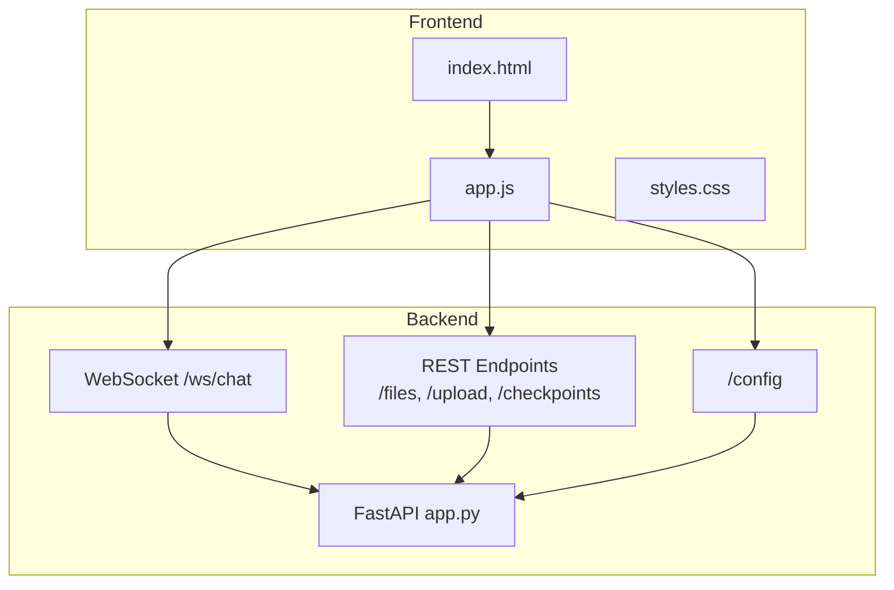
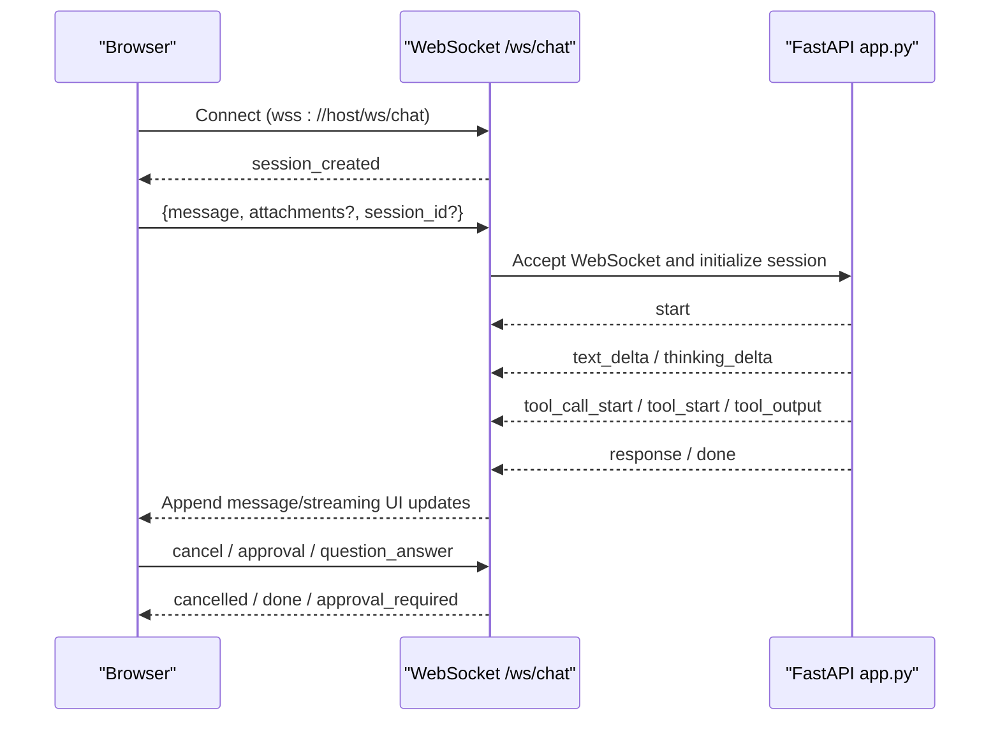
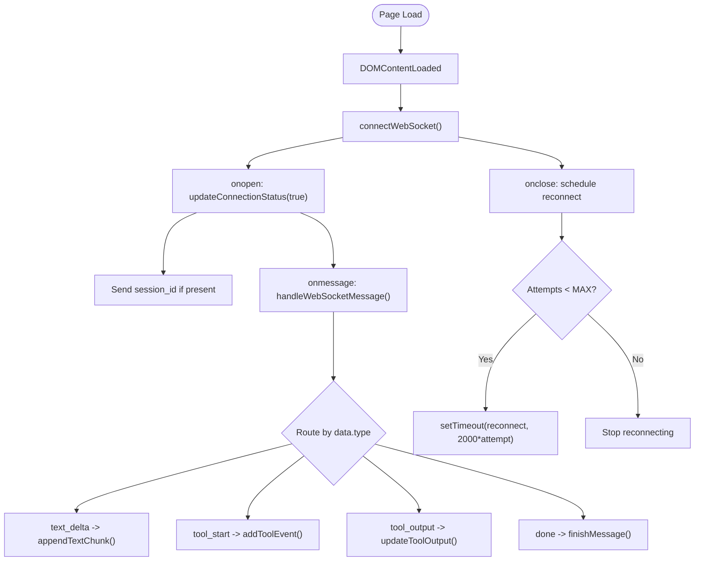
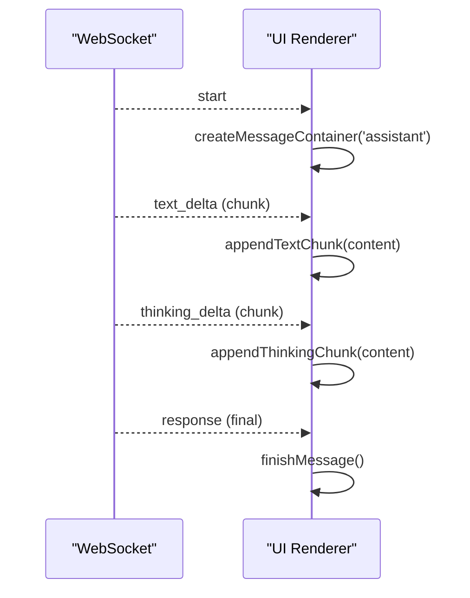
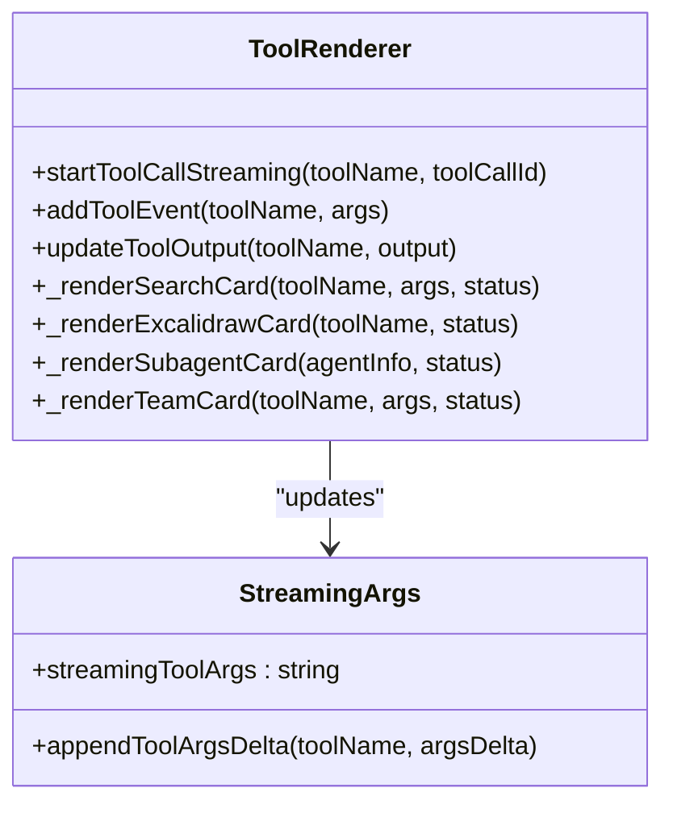
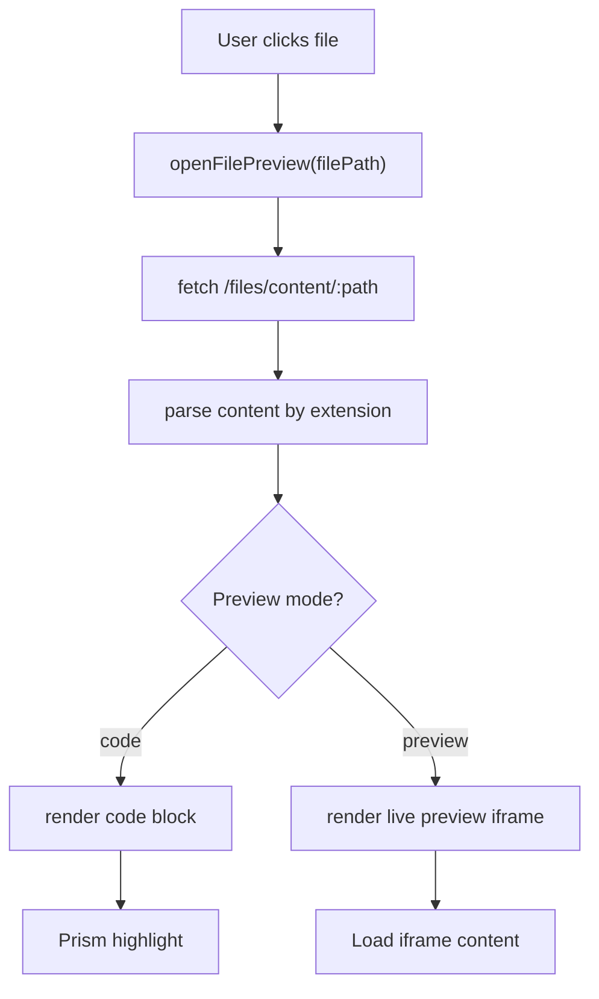
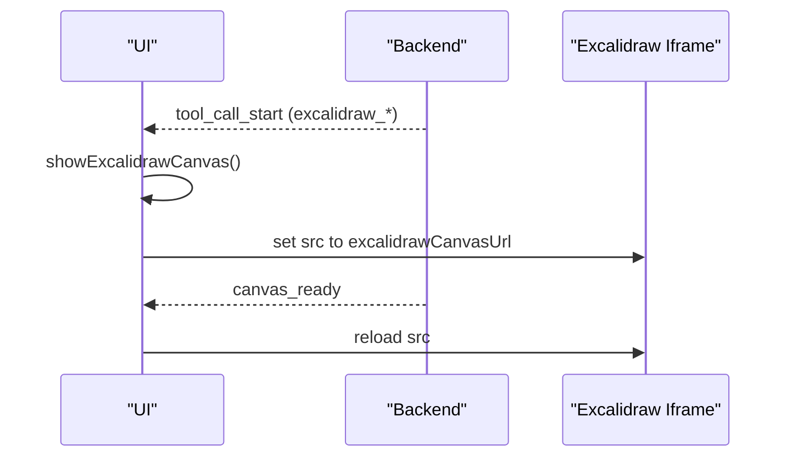
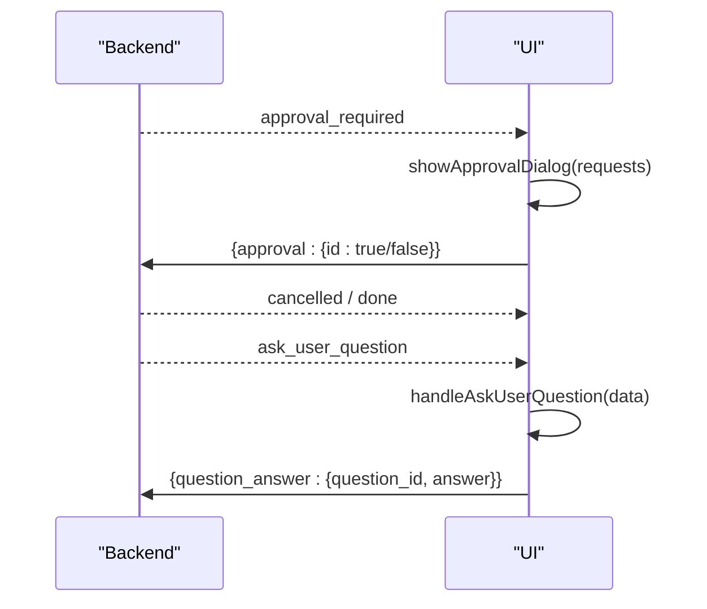
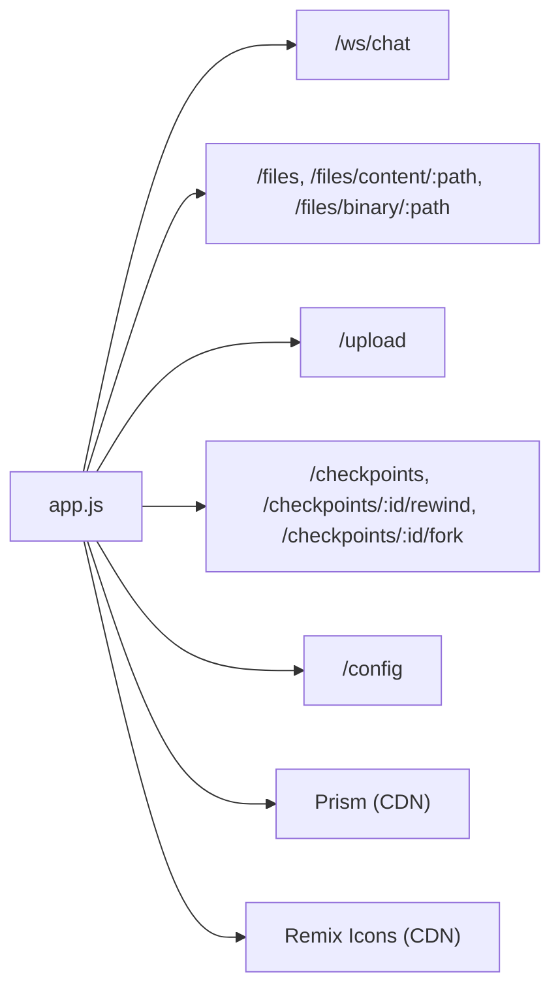

# Frontend User Interface

<cite>
**Referenced Files in This Document**
- [index.html](file://apps/deepresearch/static/index.html)
- [app.js](file://apps/deepresearch/static/app.js)
- [styles.css](file://apps/deepresearch/static/styles.css)
- [app.py](file://apps/deepresearch/src/deepresearch/app.py)
</cite>

## Table of Contents
1. [Introduction](#introduction)
2. [Project Structure](#project-structure)
3. [Core Components](#core-components)
4. [Architecture Overview](#architecture-overview)
5. [Detailed Component Analysis](#detailed-component-analysis)
6. [Dependency Analysis](#dependency-analysis)
7. [Performance Considerations](#performance-considerations)
8. [Troubleshooting Guide](#troubleshooting-guide)
9. [Conclusion](#conclusion)

## Introduction
This document describes the DeepResearch frontend user interface, a single-page application built with vanilla JavaScript, HTML, and CSS. It covers real-time communication via WebSocket, the tool rendering system for agent capabilities, file preview functionality, dark theme implementation, responsive design patterns, and user interaction flows. It also explains the Excalidraw canvas integration, file browser functionality, and real-time update mechanisms, with examples of WebSocket message handling, DOM manipulation patterns, and UI state management.

## Project Structure
The frontend consists of three primary files:
- index.html: Application shell with layout, sidebar tabs, chat panel, file preview overlay, and outline/timeline panels
- app.js: Application logic including WebSocket handling, DOM manipulation, tool rendering, file browsing, and UI state management
- styles.css: Dark theme styling, responsive layout, and component-specific styles

The backend FastAPI application (app.py) exposes:
- WebSocket endpoint for streaming agent responses and tool events
- REST endpoints for file listing, content retrieval, binary downloads, and checkpoint operations
- Configuration retrieval for runtime features and tool integrations

**Diagram sources**
- [index.html:1-176](file://apps/deepresearch/static/index.html#L1-L176)
- [app.js:1-120](file://apps/deepresearch/static/app.js#L1-L120)
- [styles.css:1-80](file://apps/deepresearch/static/styles.css#L1-L80)
- [app.py:719-912](file://apps/deepresearch/src/deepresearch/app.py#L719-L912)

**Section sources**
- [index.html:1-176](file://apps/deepresearch/static/index.html#L1-L176)
- [app.js:1-120](file://apps/deepresearch/static/app.js#L1-L120)
- [styles.css:1-80](file://apps/deepresearch/static/styles.css#L1-L80)
- [app.py:719-912](file://apps/deepresearch/src/deepresearch/app.py#L719-L912)

## Core Components
- WebSocket client: Establishes persistent connection to /ws/chat, handles reconnection, and routes incoming events to handlers
- Message stream renderer: Creates and updates message containers, streams text deltas, and displays tool events
- Tool rendering system: Renders specialized cards for search, subagents, teams, and Excalidraw operations
- File browser: Lists workspace and uploads, builds hierarchical file tree, and supports preview modes
- File preview panel: Supports code, live preview, image, CSV, and PDF previews with copy/download actions
- Excalidraw integration: Inline canvas embedding with live updates and session isolation
- Task progress panel: Tracks background tasks and displays progress with elapsed time
- Timeline panel: Shows checkpoints with rewind/fork actions
- Dark theme and responsive design: CSS variables define theme tokens; layout adapts to viewport and drag-resizable sidebar

**Section sources**
- [app.js:74-105](file://apps/deepresearch/static/app.js#L74-L105)
- [app.js:295-423](file://apps/deepresearch/static/app.js#L295-L423)
- [app.js:1058-1173](file://apps/deepresearch/static/app.js#L1058-L1173)
- [app.js:1931-2066](file://apps/deepresearch/static/app.js#L1931-L2066)
- [app.js:2200-2362](file://apps/deepresearch/static/app.js#L2200-L2362)
- [app.js:978-1052](file://apps/deepresearch/static/app.js#L978-L1052)
- [app.js:2077-2177](file://apps/deepresearch/static/app.js#L2077-L2177)
- [app.js:3121-3177](file://apps/deepresearch/static/app.js#L3121-L3177)
- [styles.css:1-80](file://apps/deepresearch/static/styles.css#L1-L80)

## Architecture Overview
The frontend communicates with the backend through:
- WebSocket streaming for agent responses, tool events, and real-time updates
- REST endpoints for file operations, uploads, and checkpoint management
- Configuration retrieval for runtime features and integrations

**Diagram sources**
- [app.js:74-105](file://apps/deepresearch/static/app.js#L74-L105)
- [app.js:295-423](file://apps/deepresearch/static/app.js#L295-L423)
- [app.py:719-912](file://apps/deepresearch/src/deepresearch/app.py#L719-L912)
- [app.py:1137-1196](file://apps/deepresearch/src/deepresearch/app.py#L1137-L1196)
- [app.py:1214-1369](file://apps/deepresearch/src/deepresearch/app.py#L1214-L1369)

## Detailed Component Analysis

### WebSocket Client Implementation
The WebSocket client manages connection lifecycle, reconnection attempts, and message routing. It initializes on DOMContentLoaded, connects to /ws/chat, and handles session joining and replay scenarios.

Key behaviors:
- Connection management: Attempts up to five reconnects with exponential backoff
- Session handling: Sends session_id on connect; creates new session if missing
- Message routing: Dispatches events to type-specific handlers (text_delta, tool_start, response, etc.)
- Replay support: Loads events via /sessions/:id/events and replays them for fidelity

**Diagram sources**
- [app.js:74-105](file://apps/deepresearch/static/app.js#L74-L105)
- [app.js:295-423](file://apps/deepresearch/static/app.js#L295-L423)
- [app.js:131-163](file://apps/deepresearch/static/app.js#L131-L163)

**Section sources**
- [app.js:74-105](file://apps/deepresearch/static/app.js#L74-L105)
- [app.js:295-423](file://apps/deepresearch/static/app.js#L295-L423)
- [app.js:107-129](file://apps/deepresearch/static/app.js#L107-L129)

### Message Streaming and Rendering
The frontend renders assistant messages with streaming text deltas and optional thinking bubbles. It manages typing indicators, streaming cursors, and completion cleanup.

Highlights:
- Typing indicator suppression upon receiving first content
- Streaming cursor during live generation
- Completion cleanup: removes typing indicators, sets status to done, and adds action buttons

**Diagram sources**
- [app.js:1278-1316](file://apps/deepresearch/static/app.js#L1278-L1316)
- [app.js:1318-1365](file://apps/deepresearch/static/app.js#L1318-L1365)

**Section sources**
- [app.js:1278-1316](file://apps/deepresearch/static/app.js#L1278-L1316)
- [app.js:1318-1365](file://apps/deepresearch/static/app.js#L1318-L1365)

### Tool Rendering System
The tool rendering system transforms backend tool events into rich UI cards:
- Streaming tool args: Accumulates and displays tool arguments as they stream
- Specialized cards: Search, Excalidraw, subagent delegation, team operations
- Collapsible groups: Consecutive tools of the same type are grouped for readability
- Status updates: Transitions from running to done with appropriate badges

**Diagram sources**
- [app.js:501-604](file://apps/deepresearch/static/app.js#L501-L604)
- [app.js:1058-1173](file://apps/deepresearch/static/app.js#L1058-L1173)
- [app.js:1198-1276](file://apps/deepresearch/static/app.js#L1198-L1276)
- [app.js:670-687](file://apps/deepresearch/static/app.js#L670-L687)
- [app.js:964-976](file://apps/deepresearch/static/app.js#L964-L976)
- [app.js:800-820](file://apps/deepresearch/static/app.js#L800-L820)
- [app.js:870-958](file://apps/deepresearch/static/app.js#L870-L958)

**Section sources**
- [app.js:501-604](file://apps/deepresearch/static/app.js#L501-L604)
- [app.js:1058-1173](file://apps/deepresearch/static/app.js#L1058-L1173)
- [app.js:1198-1276](file://apps/deepresearch/static/app.js#L1198-L1276)
- [app.js:670-687](file://apps/deepresearch/static/app.js#L670-L687)
- [app.js:964-976](file://apps/deepresearch/static/app.js#L964-L976)
- [app.js:800-820](file://apps/deepresearch/static/app.js#L800-L820)
- [app.js:870-958](file://apps/deepresearch/static/app.js#L870-L958)

### File Browser and Preview
The file browser lists workspace and uploads, builds a hierarchical tree, and supports previewing various file types. The preview panel supports:
- Code preview with syntax highlighting
- Live preview for HTML/SVG
- Image preview
- CSV table view
- PDF embed

**Diagram sources**
- [app.js:2200-2362](file://apps/deepresearch/static/app.js#L2200-L2362)
- [app.js:2270-2322](file://apps/deepresearch/static/app.js#L2270-L2322)
- [app.js:2324-2362](file://apps/deepresearch/static/app.js#L2324-L2362)

**Section sources**
- [app.js:1931-2066](file://apps/deepresearch/static/app.js#L1931-L2066)
- [app.js:2200-2362](file://apps/deepresearch/static/app.js#L2200-L2362)
- [app.js:2324-2362](file://apps/deepresearch/static/app.js#L2324-L2362)

### Excalidraw Canvas Integration
The Excalidraw integration provides an inline canvas embedded within assistant messages. The frontend:
- Detects Excalidraw tool calls and shows a compact card
- Embeds an iframe pointing to the configured canvas URL
- Reloads the iframe when canvas becomes ready or when switching sessions

**Diagram sources**
- [app.js:978-1052](file://apps/deepresearch/static/app.js#L978-L1052)
- [app.js:1017-1025](file://apps/deepresearch/static/app.js#L1017-L1025)
- [app.py:782-783](file://apps/deepresearch/src/deepresearch/app.py#L782-L783)

**Section sources**
- [app.js:978-1052](file://apps/deepresearch/static/app.js#L978-L1052)
- [app.js:1017-1025](file://apps/deepresearch/static/app.js#L1017-L1025)
- [app.py:782-783](file://apps/deepresearch/src/deepresearch/app.py#L782-L783)

### Real-Time Updates and Human-in-the-Loop
The frontend handles human-in-the-loop approvals and plan-mode question flows:
- Approval dialog: Presents tool calls requiring approval and sends consolidated responses
- Ask-user questions: Renders interactive question cards with recommended options and custom input
- Hook and middleware events: Displays audit and safety gate events inline with tool activity

**Diagram sources**
- [app.js:1429-1484](file://apps/deepresearch/static/app.js#L1429-L1484)
- [app.js:2931-3019](file://apps/deepresearch/static/app.js#L2931-L3019)
- [app.py:1082-1088](file://apps/deepresearch/src/deepresearch/app.py#L1082-L1088)
- [app.py:1103-1130](file://apps/deepresearch/src/deepresearch/app.py#L1103-L1130)

**Section sources**
- [app.js:1429-1484](file://apps/deepresearch/static/app.js#L1429-L1484)
- [app.js:2931-3019](file://apps/deepresearch/static/app.js#L2931-L3019)
- [app.py:1082-1088](file://apps/deepresearch/src/deepresearch/app.py#L1082-L1088)
- [app.py:1103-1130](file://apps/deepresearch/src/deepresearch/app.py#L1103-L1130)

### Dark Theme and Responsive Design
The dark theme is implemented using CSS custom properties for colors, backgrounds, borders, and typography. The layout uses CSS Grid and Flexbox to create a resizable sidebar and main chat area. Media queries and responsive units ensure adaptability across devices.

Key features:
- CSS variables for theme tokens (e.g., --bg-app, --accent-primary)
- Grid-based layout with draggable resizer
- Flexible chat stream with auto-scroll behavior
- Responsive typography and spacing

**Section sources**
- [styles.css:1-80](file://apps/deepresearch/static/styles.css#L1-L80)
- [styles.css:42-46](file://apps/deepresearch/static/styles.css#L42-L46)
- [styles.css:221-232](file://apps/deepresearch/static/styles.css#L221-L232)
- [styles.css:492-512](file://apps/deepresearch/static/styles.css#L492-L512)

### UI State Management Patterns
The frontend maintains state for:
- WebSocket connection and reconnection attempts
- Current message and tool containers
- Streaming text accumulation and tool args
- File preview mode and content
- Task progress and background agent counts
- Timeline checkpoints and selection

DOM manipulation patterns:
- Dynamic element creation and insertion
- Conditional visibility toggles
- Content sanitization via escapeHtml and innerHTML assignment
- Auto-scroll and smart-scroll heuristics

**Section sources**
- [app.js:3-24](file://apps/deepresearch/static/app.js#L3-L24)
- [app.js:284-294](file://apps/deepresearch/static/app.js#L284-L294)
- [app.js:1603-1650](file://apps/deepresearch/static/app.js#L1603-L1650)
- [app.js:2188-2247](file://apps/deepresearch/static/app.js#L2188-L2247)
- [app.js:2077-2177](file://apps/deepresearch/static/app.js#L2077-L2177)

## Dependency Analysis
The frontend depends on:
- WebSocket for real-time agent responses and tool events
- REST endpoints for file operations and session management
- External libraries for syntax highlighting and iconography

**Diagram sources**
- [app.js:171-174](file://apps/deepresearch/static/app.js#L171-L174)
- [app.js:1410-1482](file://apps/deepresearch/static/app.js#L1410-L1482)
- [app.js:1378-1407](file://apps/deepresearch/static/app.js#L1378-L1407)
- [app.js:1493-1516](file://apps/deepresearch/static/app.js#L1493-L1516)
- [app.js:1517-1541](file://apps/deepresearch/static/app.js#L1517-L1541)
- [app.js:1493-1516](file://apps/deepresearch/static/app.js#L1493-L1516)

**Section sources**
- [app.js:171-174](file://apps/deepresearch/static/app.js#L171-L174)
- [app.js:1410-1482](file://apps/deepresearch/static/app.js#L1410-L1482)
- [app.js:1378-1407](file://apps/deepresearch/static/app.js#L1378-L1407)
- [app.js:1493-1516](file://apps/deepresearch/static/app.js#L1493-L1516)
- [app.js:1517-1541](file://apps/deepresearch/static/app.js#L1517-L1541)
- [app.js:1493-1516](file://apps/deepresearch/static/app.js#L1493-L1516)

## Performance Considerations
- Efficient DOM updates: Batched rendering and minimal reflows; auto-scroll only when near bottom
- Streaming optimizations: Incremental text and tool args updates reduce layout thrashing
- Lazy initialization: Config and canvas URL loaded on demand
- Memory hygiene: Cleanup of typing indicators, streaming cursors, and temporary elements on completion
- Image and binary previews: Use embeds and object URLs to avoid large DOM overhead

## Troubleshooting Guide
Common issues and remedies:
- WebSocket disconnections: The client attempts up to five reconnects with increasing delays; verify network connectivity and backend availability
- File preview failures: Ensure session_id is present and file exists; check /files/content/:path response
- Excalidraw iframe not loading: Confirm excalidrawCanvasUrl is configured and canvas_ready was received
- Approval dialogs stuck: Verify approval responses are sent and pendingApprovals cleared
- Timeline empty: Confirm checkpoints endpoint returns data and session_id is valid

**Section sources**
- [app.js:90-98](file://apps/deepresearch/static/app.js#L90-L98)
- [app.js:2231-2246](file://apps/deepresearch/static/app.js#L2231-L2246)
- [app.js:1429-1484](file://apps/deepresearch/static/app.js#L1429-L1484)
- [app.js:3102-3119](file://apps/deepresearch/static/app.js#L3102-L3119)

## Conclusion
The DeepResearch frontend delivers a responsive, real-time collaborative environment with robust tool visualization, file management, and Excalidraw integration. Its vanilla JavaScript architecture ensures portability and maintainability, while the dark theme and thoughtful UI patterns enhance usability. The WebSocket-driven streaming model provides immediate feedback, and the comprehensive tool rendering system makes agent capabilities transparent and actionable.