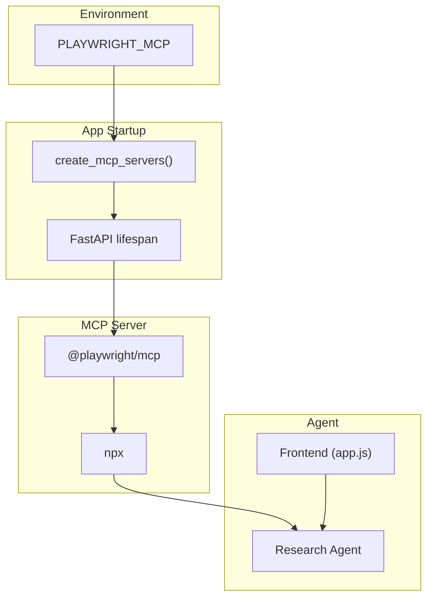
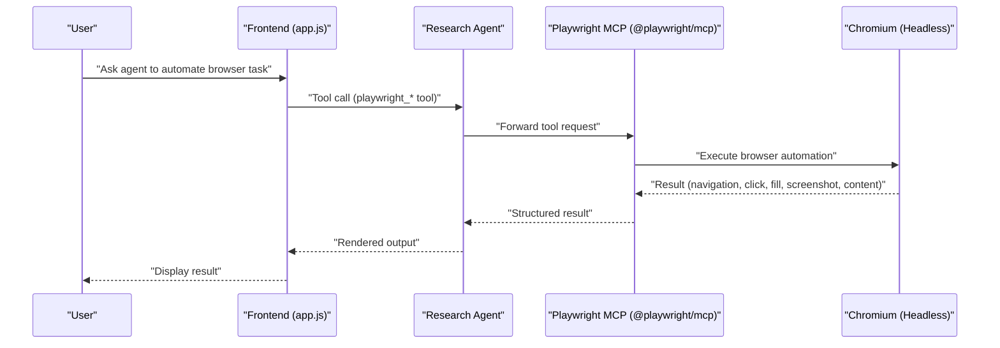
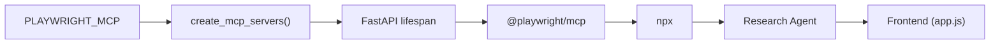

# Browser Automation with Playwright

<cite>
**Referenced Files in This Document**
- [config.py](file://apps/deepresearch/src/deepresearch/config.py)
- [README.md](file://apps/deepresearch/README.md)
- [app.js](file://apps/deepresearch/static/app.js)
- [agent.py](file://apps/deepresearch/src/deepresearch/agent.py)
- [app.py](file://apps/deepresearch/src/deepresearch/app.py)
- [web.py](file://pydantic_deep/toolsets/web.py)
</cite>

## Table of Contents
1. [Introduction](#introduction)
2. [Project Structure](#project-structure)
3. [Core Components](#core-components)
4. [Architecture Overview](#architecture-overview)
5. [Detailed Component Analysis](#detailed-component-analysis)
6. [Dependency Analysis](#dependency-analysis)
7. [Performance Considerations](#performance-considerations)
8. [Troubleshooting Guide](#troubleshooting-guide)
9. [Conclusion](#conclusion)

## Introduction
This document explains how Playwright browser automation is integrated into the research workflow. It covers enabling headless Chromium via the PLAYWRIGHT_MCP environment variable, configuring the MCP server, and leveraging browser automation for JavaScript-heavy pages. It also compares browser automation with simpler URL readers, outlines capabilities such as navigation, form filling, clicking, and content extraction, and provides troubleshooting and performance guidance.

## Project Structure
The Playwright integration is implemented as an optional MCP server that is conditionally enabled by an environment variable. The server is launched via Node’s npx and exposes browser automation tools prefixed with playwright_ to the agent.

**Diagram sources**
- [config.py:58-151](file://apps/deepresearch/src/deepresearch/config.py#L58-L151)
- [app.py:636-686](file://apps/deepresearch/src/deepresearch/app.py#L636-L686)
- [README.md:131-141](file://apps/deepresearch/README.md#L131-L141)

**Section sources**
- [config.py:58-151](file://apps/deepresearch/src/deepresearch/config.py#L58-L151)
- [README.md:131-141](file://apps/deepresearch/README.md#L131-L141)

## Core Components
- Playwright MCP server activation via PLAYWRIGHT_MCP environment variable
- Headless Chromium launch on first run (~150 MB download via npx)
- Tool prefixing for Playwright tools (playwright_)
- Frontend integration to recognize and render Playwright tool calls

Key behaviors:
- When PLAYWRIGHT_MCP is set, the app starts @playwright/mcp with the --headless flag
- The frontend recognizes tools with the playwright_ prefix and renders them appropriately
- The agent’s instructions explicitly list “Browser Automation: Playwright MCP” among available tools

**Section sources**
- [config.py:128-136](file://apps/deepresearch/src/deepresearch/config.py#L128-L136)
- [README.md:131-141](file://apps/deepresearch/README.md#L131-L141)
- [app.js:630-637](file://apps/deepresearch/static/app.js#L630-L637)
- [agent.py:348](file://apps/deepresearch/src/deepresearch/agent.py#L348)

## Architecture Overview
The Playwright integration is layered into the broader agent toolset architecture. The MCP server is created during app startup and attached to the agent, which then exposes Playwright tools to the model. The frontend detects Playwright tool calls and renders them with a distinct provider label and icon.

**Diagram sources**
- [config.py:128-136](file://apps/deepresearch/src/deepresearch/config.py#L128-L136)
- [app.py:636-686](file://apps/deepresearch/src/deepresearch/app.py#L636-L686)
- [agent.py:348](file://apps/deepresearch/src/deepresearch/agent.py#L348)
- [app.js:630-637](file://apps/deepresearch/static/app.js#L630-L637)

## Detailed Component Analysis

### Playwright MCP Server Configuration
- Activation: Set PLAYWRIGHT_MCP to enable the server
- Launch: Starts @playwright/mcp via npx with --headless
- Prefix: Tools exposed under the playwright_ namespace
- First-run behavior: Chromium downloads (~150 MB) on first run via npx

Operational flow:
- Environment variable checked during server creation
- MCP server appended to the list of toolsets
- Agent created with the Playwright toolset included

**Section sources**
- [config.py:128-136](file://apps/deepresearch/src/deepresearch/config.py#L128-L136)
- [README.md:131-141](file://apps/deepresearch/README.md#L131-L141)

### Frontend Tool Recognition and Rendering
- The frontend maintains a list of search providers and recognizes tools by prefix
- Playwright tools are identified by the playwright_ prefix and rendered with a dedicated icon and color
- This allows the UI to present Playwright actions consistently alongside other MCP tools

**Section sources**
- [app.js:630-637](file://apps/deepresearch/static/app.js#L630-L637)

### Agent Instructions and Tool Exposure
- The agent’s main instructions explicitly list “Browser Automation: Playwright MCP (navigate, screenshot, click, fill)”
- This ensures the model understands the capabilities and when to use Playwright tools

**Section sources**
- [agent.py:348](file://apps/deepresearch/src/deepresearch/agent.py#L348)

### Comparison with URL Readers (Jina/Firecrawl)
- URL readers (e.g., Jina) convert arbitrary URLs to readable markdown and are suitable for most static or moderately dynamic pages
- Playwright is beneficial for JavaScript-heavy pages that require:
  - Client-side rendering
  - Interactive elements (clicking buttons, navigating SPA routes)
  - Form submission and input
  - Capturing content produced by scripts after load
- Trade-offs:
  - Complexity: Requires a headless browser and network resources
  - Latency: Higher overhead than simple URL reads
  - Reliability: Sensitive to page structure changes and timeouts

**Section sources**
- [web.py:169-187](file://pydantic_deep/toolsets/web.py#L169-L187)
- [README.md:131-141](file://apps/deepresearch/README.md#L131-L141)

### Browser Automation Capabilities
Capabilities exposed via Playwright MCP include:
- Page navigation
- Click interactions
- Form filling
- Content extraction
- Screenshot capture

These capabilities are surfaced to the agent as playwright_ tools and are presented in the UI with a dedicated provider label.

**Section sources**
- [agent.py:348](file://apps/deepresearch/src/deepresearch/agent.py#L348)
- [app.js:630-637](file://apps/deepresearch/static/app.js#L630-L637)

### Integration with Research Workflow
- Use Playwright for complex web interactions that URL readers cannot handle
- Combine with other MCP servers (Tavily, Brave, Jina, Firecrawl) for a robust research pipeline
- Leverage subagents and teams to coordinate multi-step browser tasks

**Section sources**
- [agent.py:376-429](file://apps/deepresearch/src/deepresearch/agent.py#L376-L429)
- [app.py:636-686](file://apps/deepresearch/src/deepresearch/app.py#L636-L686)

## Dependency Analysis
The Playwright integration depends on:
- Environment variable PLAYWRIGHT_MCP to activate
- Node.js and npx availability for launching @playwright/mcp
- Network connectivity for downloading Chromium on first run
- Optional Docker availability for other MCP servers (not required for Playwright)

**Diagram sources**
- [config.py:128-136](file://apps/deepresearch/src/deepresearch/config.py#L128-L136)
- [app.py:636-686](file://apps/deepresearch/src/deepresearch/app.py#L636-L686)
- [app.js:630-637](file://apps/deepresearch/static/app.js#L630-L637)

**Section sources**
- [config.py:128-136](file://apps/deepresearch/src/deepresearch/config.py#L128-L136)
- [app.py:636-686](file://apps/deepresearch/src/deepresearch/app.py#L636-L686)

## Performance Considerations
- Headless Chromium consumes memory and CPU; batch or reuse browser sessions when possible
- Limit the number of concurrent Playwright tasks to avoid resource contention
- Prefer targeted selectors and minimal DOM traversal to reduce execution time
- Cache repeated navigations and avoid redundant screenshots
- Use timeouts judiciously—too short risks premature failure, too long risks resource starvation

[No sources needed since this section provides general guidance]

## Troubleshooting Guide
Common issues and resolutions:
- Playwright server not starting
  - Ensure Node.js and npx are installed and available in PATH
  - Confirm PLAYWRIGHT_MCP is set to a truthy value
  - Check logs for npx/@playwright/mcp startup errors
- First-run Chromium download
  - Expect a one-time download (~150 MB) on first run; ensure network connectivity
- Timeouts or flaky interactions
  - Increase tool call timeouts
  - Retry with different selectors or wait strategies
- Mixed tool failures
  - Fall back to other MCP servers (Tavily, Brave, Jina, Firecrawl) when Playwright fails
- UI rendering
  - Verify the frontend recognizes playwright_ tools by prefix; otherwise, the UI may not render Playwright actions distinctly

Operational safeguards:
- The app attempts to recover from MCP server startup failures by removing problematic servers and retrying
- The agent’s instructions emphasize resilience: if a tool fails, try a different tool, rephrase the query, or fall back to knowledge-based responses

**Section sources**
- [app.py:604-628](file://apps/deepresearch/src/deepresearch/app.py#L604-L628)
- [agent.py:159-177](file://apps/deepresearch/src/deepresearch/agent.py#L159-L177)
- [README.md:131-141](file://apps/deepresearch/README.md#L131-L141)

## Conclusion
Playwright MCP enables robust browser automation for JavaScript-heavy pages, complementing simpler URL readers and other MCP servers. By setting PLAYWRIGHT_MCP, launching @playwright/mcp with --headless, and leveraging the playwright_ toolset, the agent can navigate, click, fill forms, extract content, and capture screenshots. Use Playwright for complex interactions, combine it with other tools for reliability, and apply the troubleshooting and performance tips to maintain smooth operation.