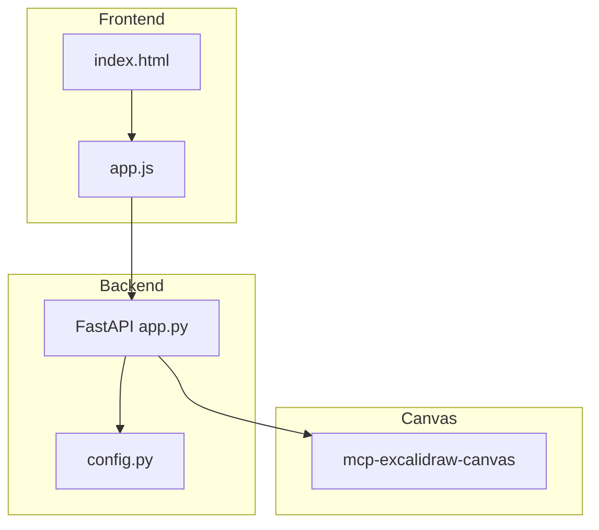
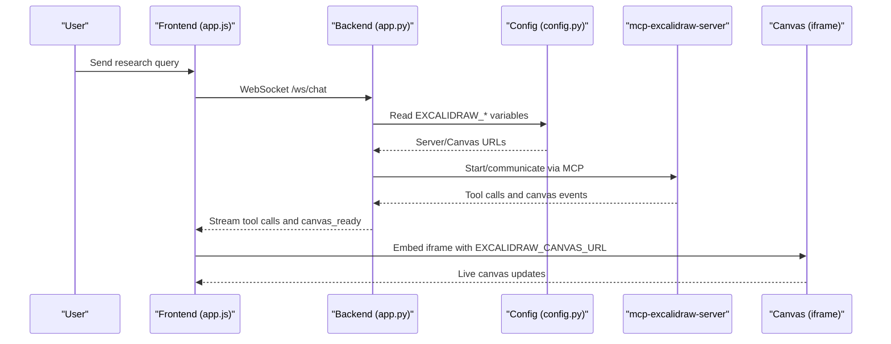
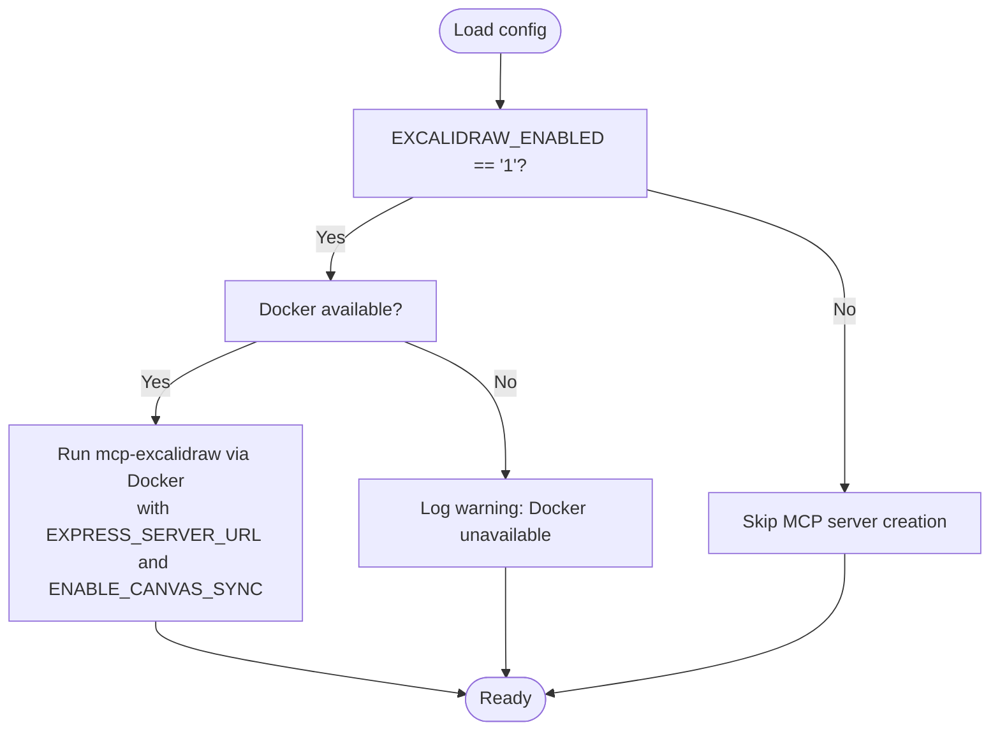
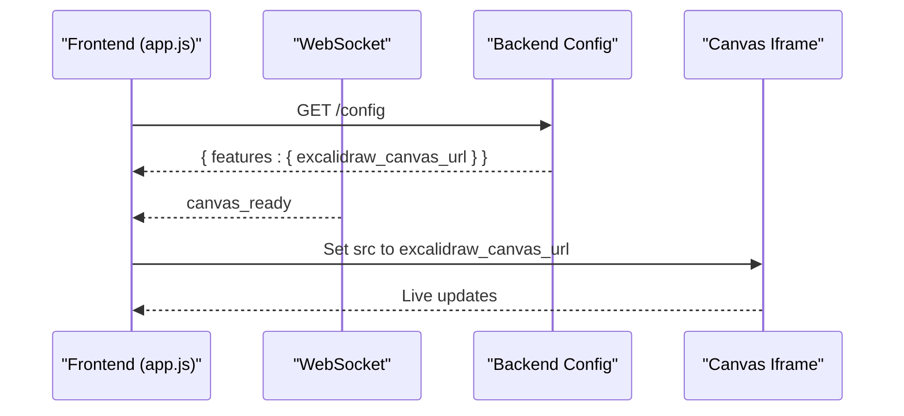
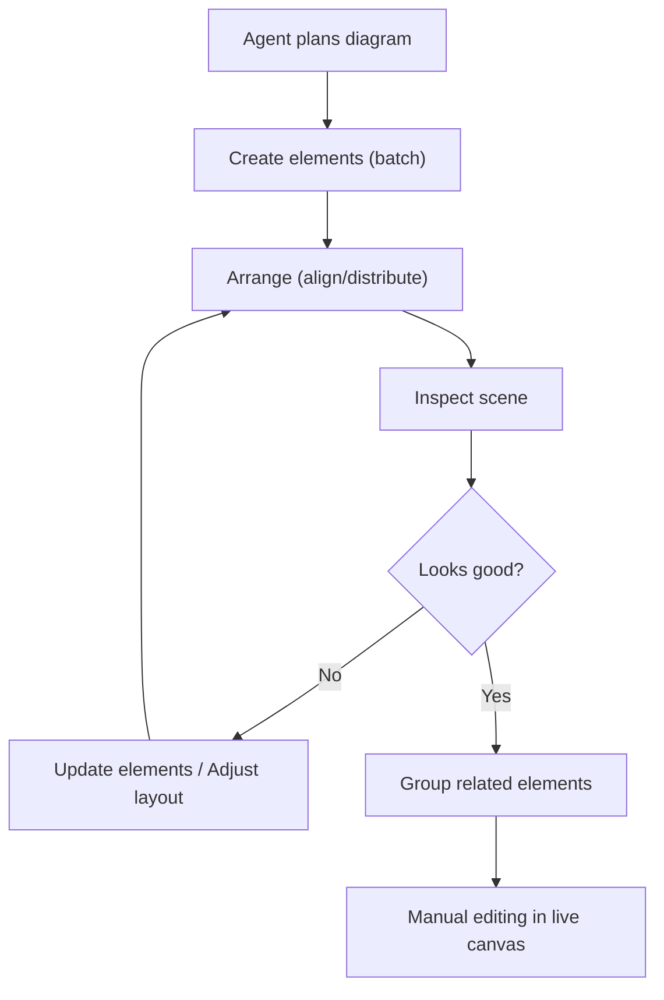
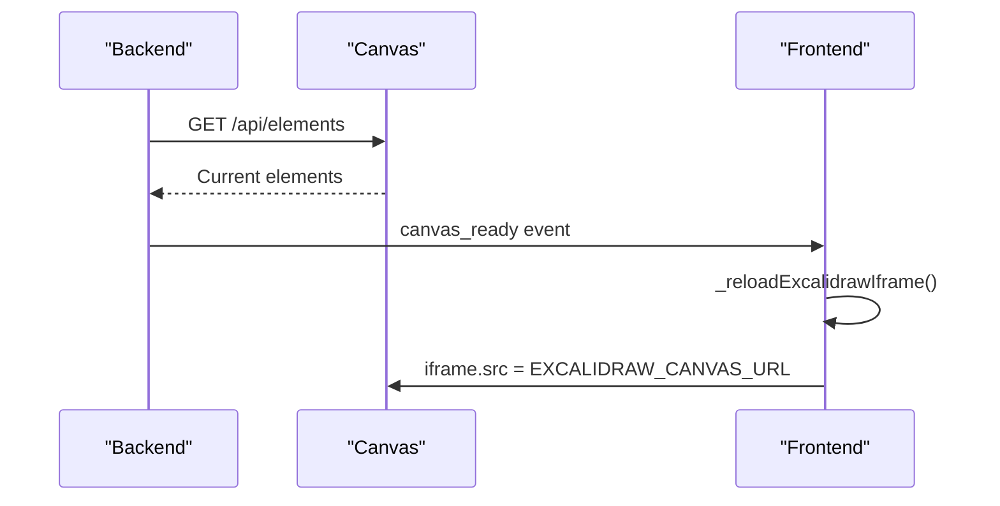
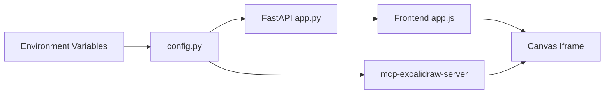

# Diagram Generation with Excalidraw

<cite>
**Referenced Files in This Document**
- [README.md](file://apps/deepresearch/README.md)
- [docker-compose.yml](file://apps/deepresearch/docker-compose.yml)
- [config.py](file://apps/deepresearch/src/deepresearch/config.py)
- [app.py](file://apps/deepresearch/src/deepresearch/app.py)
- [index.html](file://apps/deepresearch/static/index.html)
- [app.js](file://apps/deepresearch/static/app.js)
- [SKILL.md](file://apps/deepresearch/skills/diagram-design/SKILL.md)
</cite>

## Table of Contents
1. [Introduction](#introduction)
2. [Project Structure](#project-structure)
3. [Core Components](#core-components)
4. [Architecture Overview](#architecture-overview)
5. [Detailed Component Analysis](#detailed-component-analysis)
6. [Dependency Analysis](#dependency-analysis)
7. [Performance Considerations](#performance-considerations)
8. [Troubleshooting Guide](#troubleshooting-guide)
9. [Conclusion](#conclusion)

## Introduction
This document explains how Excalidraw diagram generation integrates with the DeepResearch application. It covers setup via Docker and npm, real-time canvas synchronization, configuration of server and canvas URLs, the end-to-end diagram creation workflow from agent instructions to live visuals, integration patterns with research findings, troubleshooting, performance tips, customization options, and disabling the feature.

## Project Structure
The Excalidraw integration spans three layers:
- Configuration and startup: environment variables and MCP server management
- Backend API and WebSocket: exposing configuration and managing canvas operations
- Frontend UI: embedding the live canvas and rendering Excalidraw tool calls

**Diagram sources**
- [app.py:89-96](file://apps/deepresearch/src/deepresearch/app.py#L89-L96)
- [config.py:106-127](file://apps/deepresearch/src/deepresearch/config.py#L106-L127)
- [docker-compose.yml:3-6](file://apps/deepresearch/docker-compose.yml#L3-L6)

**Section sources**
- [README.md:142-157](file://apps/deepresearch/README.md#L142-L157)
- [docker-compose.yml:1-29](file://apps/deepresearch/docker-compose.yml#L1-L29)

## Core Components
- Environment configuration for Excalidraw:
  - EXCALIDRAW_ENABLED toggles the feature on/off
  - EXCALIDRAW_SERVER_URL sets the MCP server URL for synchronization
  - EXCALIDRAW_CANVAS_URL sets the iframe URL for the live canvas UI
- MCP server management:
  - Automatically starts the mcp-excalidraw-server via Docker or npm
  - Integrates with the agent toolset pipeline
- Frontend canvas integration:
  - Loads canvas URL from backend configuration
  - Renders Excalidraw tool cards and embeds the canvas iframe
  - Handles canvas_ready events to refresh the iframe

Key configuration and environment variables are documented in the project README and loaded in the backend configuration module.

**Section sources**
- [README.md:84-96](file://apps/deepresearch/README.md#L84-L96)
- [config.py:35-36](file://apps/deepresearch/src/deepresearch/config.py#L35-L36)
- [config.py:106-127](file://apps/deepresearch/src/deepresearch/config.py#L106-L127)
- [app.py:89-96](file://apps/deepresearch/src/deepresearch/app.py#L89-L96)

## Architecture Overview
The Excalidraw workflow connects the agent, backend, and canvas:

**Diagram sources**
- [app.py:502-532](file://apps/deepresearch/src/deepresearch/app.py#L502-L532)
- [config.py:106-127](file://apps/deepresearch/src/deepresearch/config.py#L106-L127)
- [app.js:61-72](file://apps/deepresearch/static/app.js#L61-L72)
- [app.js:977-1015](file://apps/deepresearch/static/app.js#L977-L1015)

## Detailed Component Analysis

### Backend Configuration and MCP Server Management
- Reads EXCALIDRAW_CANVAS_URL and EXCALIDRAW_SERVER_URL from environment
- Conditionally creates the mcp-excalidraw-server toolset:
  - Uses Docker when available and EXCALIDRAW_ENABLED is truthy
  - Falls back to warning when Docker is unavailable
- Exposes configuration to the frontend via a config endpoint

**Diagram sources**
- [config.py:106-127](file://apps/deepresearch/src/deepresearch/config.py#L106-L127)

**Section sources**
- [config.py:35-36](file://apps/deepresearch/src/deepresearch/config.py#L35-L36)
- [config.py:106-127](file://apps/deepresearch/src/deepresearch/config.py#L106-L127)
- [app.py:1696-1697](file://apps/deepresearch/src/deepresearch/app.py#L1696-L1697)

### Frontend Canvas Integration
- On startup, fetches configuration to obtain EXCALIDRAW_CANVAS_URL
- Detects Excalidraw tool calls and renders compact tool cards
- Embeds an iframe pointing to the canvas URL and manages visibility and reloads
- Responds to canvas_ready events to refresh the iframe

**Diagram sources**
- [app.js:61-72](file://apps/deepresearch/static/app.js#L61-L72)
- [app.js:306-310](file://apps/deepresearch/static/app.js#L306-L310)
- [app.js:977-1015](file://apps/deepresearch/static/app.js#L977-L1015)

**Section sources**
- [app.js:61-72](file://apps/deepresearch/static/app.js#L61-L72)
- [app.js:514-526](file://apps/deepresearch/static/app.js#L514-L526)
- [app.js:977-1015](file://apps/deepresearch/static/app.js#L977-L1015)

### Diagram Creation Workflow
- Agent generates Excalidraw tool calls (e.g., batch_create_elements, update_element)
- Frontend renders compact tool cards and shows the live canvas
- Canvas reflects updates in real time via the MCP server
- Users can inspect, align, distribute, group, and adjust elements

**Diagram sources**
- [SKILL.md:18-27](file://apps/deepresearch/skills/diagram-design/SKILL.md#L18-L27)

**Section sources**
- [SKILL.md:18-27](file://apps/deepresearch/skills/diagram-design/SKILL.md#L18-L27)

### Real-time Canvas Synchronization
- The backend exposes endpoints to query and manage canvas elements
- Frontend listens for canvas_ready and reloads the iframe to ensure synchronization
- The canvas URL is configurable via EXCALIDRAW_CANVAS_URL

**Diagram sources**
- [app.py:502-506](file://apps/deepresearch/src/deepresearch/app.py#L502-L506)
- [app.py:523-527](file://apps/deepresearch/src/deepresearch/app.py#L523-L527)
- [app.py:532-536](file://apps/deepresearch/src/deepresearch/app.py#L532-L536)
- [app.js:1017-1025](file://apps/deepresearch/static/app.js#L1017-L1025)

**Section sources**
- [app.py:502-536](file://apps/deepresearch/src/deepresearch/app.py#L502-L536)
- [app.js:1017-1025](file://apps/deepresearch/static/app.js#L1017-L1025)

### Integration Patterns with Research Findings
- Use batch_create_elements for efficiency when adding multiple elements
- Use describe_scene to verify layout before finalizing
- Group related elements to maintain clarity and enable bulk adjustments
- Prefer manual editing in the live canvas for iterative refinement

**Section sources**
- [SKILL.md:106-113](file://apps/deepresearch/skills/diagram-design/SKILL.md#L106-L113)

## Dependency Analysis
- Backend depends on environment variables for Excalidraw configuration
- MCP server management depends on Docker availability when enabled
- Frontend depends on backend-provided canvas URL and WebSocket events
- Canvas service is external but controlled via docker-compose

**Diagram sources**
- [config.py:106-127](file://apps/deepresearch/src/deepresearch/config.py#L106-L127)
- [app.py:89-96](file://apps/deepresearch/src/deepresearch/app.py#L89-L96)
- [app.js:61-72](file://apps/deepresearch/static/app.js#L61-L72)

**Section sources**
- [config.py:106-127](file://apps/deepresearch/src/deepresearch/config.py#L106-L127)
- [docker-compose.yml:3-6](file://apps/deepresearch/docker-compose.yml#L3-L6)

## Performance Considerations
- Prefer batch operations (batch_create_elements) to reduce API round trips
- Use describe_scene to validate layout early and avoid repeated updates
- Group elements to simplify alignment and distribution operations
- For large diagrams, consider incremental updates and snapshot/restore patterns where supported

[No sources needed since this section provides general guidance]

## Troubleshooting Guide
- Canvas not loading:
  - Verify EXCALIDRAW_CANVAS_URL points to a reachable canvas service
  - Confirm the canvas service is running (Docker or npm)
  - Check for canvas_ready events and iframe reload behavior
- MCP server not starting:
  - Ensure Docker is available when EXCALIDRAW_ENABLED is set
  - Review logs for warnings about Docker unavailability
- Manual editing not reflected:
  - Confirm the canvas URL is correct and the iframe is visible
  - Trigger a reload if the canvas appears stale

**Section sources**
- [README.md:142-157](file://apps/deepresearch/README.md#L142-L157)
- [config.py:125-127](file://apps/deepresearch/src/deepresearch/config.py#L125-L127)
- [app.js:1017-1025](file://apps/deepresearch/static/app.js#L1017-L1025)

## Conclusion
The Excalidraw integration in DeepResearch provides a seamless, real-time diagramming experience. By configuring environment variables, leveraging Docker or npm for the canvas service, and using the MCP server for synchronization, agents can generate and refine diagrams alongside research workflows. The frontend’s live canvas embedding and tool rendering streamline collaboration between automated insights and manual iteration.