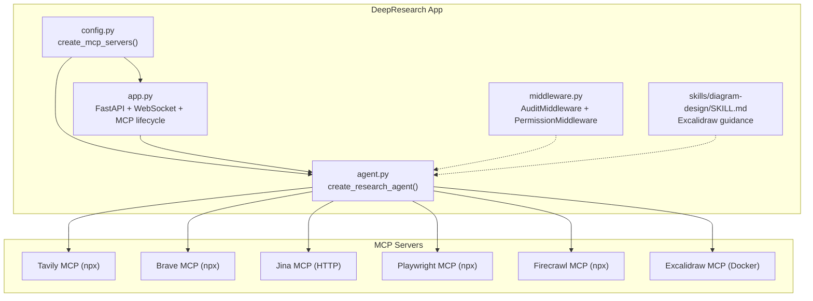
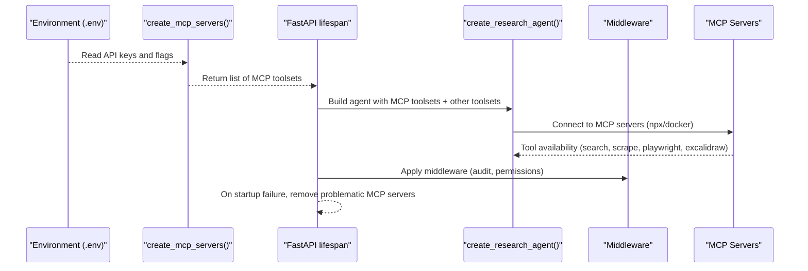
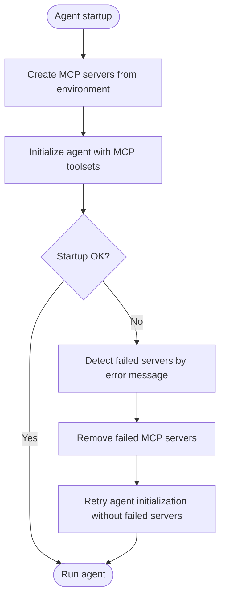
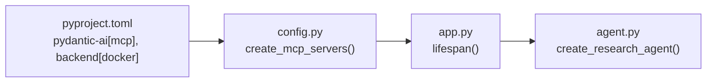

# MCP Server Integrations

<cite>
**Referenced Files in This Document**
- [README.md](file://apps/deepresearch/README.md)
- [.env.example](file://apps/deepresearch/.env.example)
- [config.py](file://apps/deepresearch/src/deepresearch/config.py)
- [agent.py](file://apps/deepresearch/src/deepresearch/agent.py)
- [app.py](file://apps/deepresearch/src/deepresearch/app.py)
- [middleware.py](file://apps/deepresearch/src/deepresearch/middleware.py)
- [Dockerfile](file://apps/deepresearch/Dockerfile)
- [docker-compose.yml](file://apps/deepresearch/docker-compose.yml)
- [pyproject.toml](file://apps/deepresearch/pyproject.toml)
- [SKILL.md](file://apps/deepresearch/skills/diagram-design/SKILL.md)
</cite>

## Table of Contents
1. [Introduction](#introduction)
2. [Project Structure](#project-structure)
3. [Core Components](#core-components)
4. [Architecture Overview](#architecture-overview)
5. [Detailed Component Analysis](#detailed-component-analysis)
6. [Dependency Analysis](#dependency-analysis)
7. [Performance Considerations](#performance-considerations)
8. [Troubleshooting Guide](#troubleshooting-guide)
9. [Conclusion](#conclusion)

## Introduction
This document explains how DeepResearch integrates optional MCP (Model Context Protocol) servers to enhance agent capabilities. It covers configuration, environment variables, automatic startup via npx, Docker containerization, local development setup, integration patterns with the agent system, error handling and fallback strategies, and practical setup and troubleshooting guidance for each MCP server category: web search providers (Tavily, Brave, Jina), web scraping (Firecrawl), browser automation (Playwright), and diagram generation (Excalidraw).

## Project Structure
DeepResearch organizes MCP-related configuration and runtime logic in a focused set of modules:
- Configuration and environment-driven server creation
- Agent composition with MCP toolsets
- Application lifecycle with graceful fallback on MCP startup failures
- Middleware for auditing and permissions
- Docker and docker-compose for containerized deployment and Excalidraw canvas

**Diagram sources**
- [config.py:58-151](file://apps/deepresearch/src/deepresearch/config.py#L58-L151)
- [agent.py:376-429](file://apps/deepresearch/src/deepresearch/agent.py#L376-L429)
- [app.py:636-690](file://apps/deepresearch/src/deepresearch/app.py#L636-L690)
- [middleware.py:33-122](file://apps/deepresearch/src/deepresearch/middleware.py#L33-L122)
- [SKILL.md:1-113](file://apps/deepresearch/skills/diagram-design/SKILL.md#L1-L113)

**Section sources**
- [README.md:100-157](file://apps/deepresearch/README.md#L100-L157)
- [config.py:58-151](file://apps/deepresearch/src/deepresearch/config.py#L58-L151)
- [agent.py:376-429](file://apps/deepresearch/src/deepresearch/agent.py#L376-L429)
- [app.py:636-690](file://apps/deepresearch/src/deepresearch/app.py#L636-L690)

## Core Components
- MCP server creation: Environment-driven selection of optional MCP servers and their startup parameters.
- Agent composition: The research agent is built with MCP toolsets plus filesystem, execute, subagents, teams, skills, and hooks.
- Application lifecycle: The app initializes MCP servers, attempts to start the agent, and gracefully falls back by removing problematic servers if startup fails.
- Middleware: Audit logging and permission checks for safe operation.
- Docker and Excalidraw: Containerized deployment and optional Excalidraw canvas synchronization.

**Section sources**
- [config.py:58-151](file://apps/deepresearch/src/deepresearch/config.py#L58-L151)
- [agent.py:376-429](file://apps/deepresearch/src/deepresearch/agent.py#L376-L429)
- [app.py:636-690](file://apps/deepresearch/src/deepresearch/app.py#L636-L690)
- [middleware.py:33-122](file://apps/deepresearch/src/deepresearch/middleware.py#L33-L122)

## Architecture Overview
The MCP integration follows a layered approach:
- Configuration layer reads environment variables and constructs MCP toolsets.
- Agent layer composes the research agent with MCP toolsets and other capabilities.
- Application layer manages lifecycle, startup, and fallback on MCP failures.
- Frontend communicates via WebSocket and can optionally integrate with Excalidraw canvas.

**Diagram sources**
- [config.py:58-151](file://apps/deepresearch/src/deepresearch/config.py#L58-L151)
- [app.py:636-690](file://apps/deepresearch/src/deepresearch/app.py#L636-L690)
- [agent.py:376-429](file://apps/deepresearch/src/deepresearch/agent.py#L376-L429)
- [middleware.py:33-122](file://apps/deepresearch/src/deepresearch/middleware.py#L33-L122)

## Detailed Component Analysis

### Web Search Providers (Tavily, Brave, Jina)
- Tavily MCP: Starts via npx with an API key. Provides AI-optimized search and extraction tools.
- Brave Search MCP: Starts via npx with an API key. Offers web search capabilities.
- Jina URL Reader MCP: Starts via HTTP with an Authorization header. Converts any URL to clean markdown.

Configuration and environment variables:
- TAVILY_API_KEY: Enables Tavily MCP.
- BRAVE_API_KEY: Enables Brave MCP.
- JINA_API_KEY: Enables Jina MCP.

Automatic startup:
- Servers are created conditionally when their respective API keys are present. They start automatically via npx or HTTP when the agent context manager initializes.

Integration with agent:
- MCP toolsets are included in the agent’s toolsets, exposing search and URL reading tools to the agent.

Fallback behavior:
- If startup fails, the application identifies the problematic MCP servers and retries without them, ensuring the agent remains functional.

**Section sources**
- [config.py:67-104](file://apps/deepresearch/src/deepresearch/config.py#L67-L104)
- [agent.py:347-352](file://apps/deepresearch/src/deepresearch/agent.py#L347-L352)
- [app.py:604-628](file://apps/deepresearch/src/deepresearch/app.py#L604-L628)
- [.env.example:15-26](file://apps/deepresearch/.env.example#L15-L26)

### Web Scraping (Firecrawl)
- Firecrawl MCP: Starts via npx with an API key. Supports advanced web scraping and crawling.

Configuration and environment variables:
- FIRECRAWL_API_KEY: Enables Firecrawl MCP.

Automatic startup:
- Conditional creation when the API key is present, started via npx.

Integration with agent:
- Exposed as MCP tools alongside search providers.

Fallback behavior:
- Same startup failure detection and removal strategy applies.

**Section sources**
- [config.py:138-149](file://apps/deepresearch/src/deepresearch/config.py#L138-L149)
- [agent.py:347](file://apps/deepresearch/src/deepresearch/agent.py#L347)
- [app.py:604-628](file://apps/deepresearch/src/deepresearch/app.py#L604-L628)
- [.env.example:25-26](file://apps/deepresearch/.env.example#L25-L26)

### Browser Automation (Playwright)
- Playwright MCP: Starts via npx without an API key. Enables navigation, screenshots, clicks, and form filling for JavaScript-heavy pages.

Configuration and environment variables:
- PLAYWRIGHT_MCP: Set to 1 to enable Playwright MCP.

Automatic startup:
- Conditional creation when the flag is present, started via npx with headless mode.

Integration with agent:
- Exposed as MCP tools for browser automation.

Fallback behavior:
- Same startup failure detection and removal strategy applies.

**Section sources**
- [config.py:128-137](file://apps/deepresearch/src/deepresearch/config.py#L128-L137)
- [agent.py:348](file://apps/deepresearch/src/deepresearch/agent.py#L348)
- [app.py:604-628](file://apps/deepresearch/src/deepresearch/app.py#L604-L628)
- [.env.example:28-30](file://apps/deepresearch/.env.example#L28-L30)

### Diagram Generation (Excalidraw)
- Excalidraw MCP: Starts via Docker using the official canvas image. Requires a running canvas server and Docker availability. Provides tools for creating and arranging diagram elements, aligning, distributing, describing scenes, and grouping.

Configuration and environment variables:
- EXCALIDRAW_ENABLED: Set to 0 to disable Excalidraw (default is enabled).
- EXCALIDRAW_SERVER_URL: URL for MCP server synchronization (default host.docker.internal).
- EXCALIDRAW_CANVAS_URL: URL for the UI iframe (default localhost:3000).

Automatic startup:
- Conditional creation when enabled and Docker is available. Starts a Docker container running the Excalidraw MCP server with environment variables for server URL and canvas sync.

Integration with agent:
- Exposed as MCP tools for diagram creation and layout.

Fallback behavior:
- If Docker is unavailable or startup fails, the server is skipped with a warning, and the agent continues without Excalidraw.

**Section sources**
- [config.py:106-127](file://apps/deepresearch/src/deepresearch/config.py#L106-L127)
- [agent.py:351](file://apps/deepresearch/src/deepresearch/agent.py#L351)
- [app.py:604-628](file://apps/deepresearch/src/deepresearch/app.py#L604-L628)
- [.env.example:32-40](file://apps/deepresearch/.env.example#L32-L40)

### Agent Integration Patterns
- Toolset composition: MCP servers are appended to the agent’s toolsets alongside filesystem, execute, subagents, teams, skills, and hooks.
- Instructions and skills: The agent’s instructions enumerate available tools, including web search and Excalidraw diagram tools.
- Subagent guidance: Subagents are instructed to fall back to knowledge-based responses when all search tools fail.

**Section sources**
- [agent.py:376-429](file://apps/deepresearch/src/deepresearch/agent.py#L376-L429)
- [agent.py:147-177](file://apps/deepresearch/src/deepresearch/agent.py#L147-L177)
- [agent.py:320-337](file://apps/deepresearch/src/deepresearch/agent.py#L320-L337)

### Error Handling and Fallback Mechanisms
- Startup failure detection: The application catches initialization exceptions and identifies which MCP servers likely caused the failure by inspecting error messages and server prefixes.
- Selective removal: Removes only the problematic MCP servers and retries agent initialization.
- Graceful degradation: The agent continues operating without MCP servers if necessary.

**Diagram sources**
- [app.py:636-690](file://apps/deepresearch/src/deepresearch/app.py#L636-L690)
- [app.py:604-628](file://apps/deepresearch/src/deepresearch/app.py#L604-L628)

**Section sources**
- [app.py:604-628](file://apps/deepresearch/src/deepresearch/app.py#L604-L628)
- [app.py:636-690](file://apps/deepresearch/src/deepresearch/app.py#L636-L690)

### Local Development and Deployment
- Local setup:
  - Install prerequisites: Python 3.12+, uv, Node.js 20+ (for npx MCP servers), Docker (for sandbox and Excalidraw canvas).
  - Install dependencies and configure environment variables.
  - Start Excalidraw canvas via Docker Compose or Docker run.
  - Run the application with uv.

- Docker containerization:
  - The Dockerfile installs Node.js and Docker CLI, builds from PyPI, and exposes port 8080.
  - docker-compose.yml defines the Excalidraw canvas service and includes commented instructions for running the app in Docker.

- Environment variables:
  - Comprehensive examples and descriptions are provided in .env.example.

**Section sources**
- [README.md:12-62](file://apps/deepresearch/README.md#L12-L62)
- [README.md:100-157](file://apps/deepresearch/README.md#L100-L157)
- [Dockerfile:1-48](file://apps/deepresearch/Dockerfile#L1-L48)
- [docker-compose.yml:1-29](file://apps/deepresearch/docker-compose.yml#L1-L29)
- [.env.example:1-41](file://apps/deepresearch/.env.example#L1-L41)

### Excalidraw Integration Details
- Canvas server: The Excalidraw canvas runs on port 3000 and is synchronized with the agent via MCP.
- Per-session isolation: The application saves and loads canvas elements per session and switches canvases when switching sessions.
- Frontend configuration: The frontend retrieves the canvas URL from the backend configuration and embeds the canvas in a side panel.

**Section sources**
- [app.py:497-560](file://apps/deepresearch/src/deepresearch/app.py#L497-L560)
- [app.py:60-70](file://apps/deepresearch/src/deepresearch/app.py#L60-L70)
- [README.md:142-156](file://apps/deepresearch/README.md#L142-L156)
- [SKILL.md:18-27](file://apps/deepresearch/skills/diagram-design/SKILL.md#L18-L27)

## Dependency Analysis
- MCP server dependencies are managed via pydantic-ai’s MCP abstractions and are started via npx or Docker depending on the server type.
- The agent depends on the MCP toolsets being available, but the application ensures graceful fallback if any server fails to start.
- Docker availability is checked before attempting to start the Excalidraw MCP server.

**Diagram sources**
- [pyproject.toml:8-14](file://apps/deepresearch/pyproject.toml#L8-L14)
- [config.py:58-151](file://apps/deepresearch/src/deepresearch/config.py#L58-L151)
- [app.py:636-690](file://apps/deepresearch/src/deepresearch/app.py#L636-L690)
- [agent.py:376-429](file://apps/deepresearch/src/deepresearch/agent.py#L376-L429)

**Section sources**
- [pyproject.toml:8-14](file://apps/deepresearch/pyproject.toml#L8-L14)
- [config.py:58-151](file://apps/deepresearch/src/deepresearch/config.py#L58-L151)
- [app.py:636-690](file://apps/deepresearch/src/deepresearch/app.py#L636-L690)
- [agent.py:376-429](file://apps/deepresearch/src/deepresearch/agent.py#L376-L429)

## Performance Considerations
- Use Tavily for high-quality research results when available.
- Prefer batch operations for Excalidraw element creation to reduce overhead.
- Limit concurrent MCP requests to avoid rate limits from external providers.
- Monitor Docker availability to prevent repeated startup failures for Excalidraw.
- Enable only necessary MCP servers to minimize startup time and resource usage.

[No sources needed since this section provides general guidance]

## Troubleshooting Guide
Common issues and resolutions:
- MCP startup failures:
  - The application detects the cause and retries without the problematic servers. Check logs for error messages indicating which MCP server failed.
- Excalidraw not available:
  - Ensure Docker is installed and running. Confirm the canvas server is reachable at the configured URL. Disable Excalidraw if Docker is unavailable.
- API key errors:
  - Verify API keys are set correctly in the environment. Confirm the respective MCP server is enabled by setting the appropriate environment variable.
- Playwright not working:
  - Ensure the PLAYWRIGHT_MCP flag is set to 1. First run will download Chromium automatically via npx.
- Rate limits or timeouts:
  - Reduce concurrent usage or adjust retry settings for MCP servers.

**Section sources**
- [app.py:604-628](file://apps/deepresearch/src/deepresearch/app.py#L604-L628)
- [config.py:106-127](file://apps/deepresearch/src/deepresearch/config.py#L106-L127)
- [config.py:128-137](file://apps/deepresearch/src/deepresearch/config.py#L128-L137)
- [.env.example:15-40](file://apps/deepresearch/.env.example#L15-L40)

## Conclusion
DeepResearch provides a flexible, environment-driven MCP integration that enhances agent capabilities without requiring all services. By leveraging npx for lightweight servers, Docker for robust ones like Excalidraw, and comprehensive fallback strategies, the system remains resilient and easy to configure. Proper environment variable management, containerization, and adherence to best practices ensure reliable operation across diverse deployment scenarios.