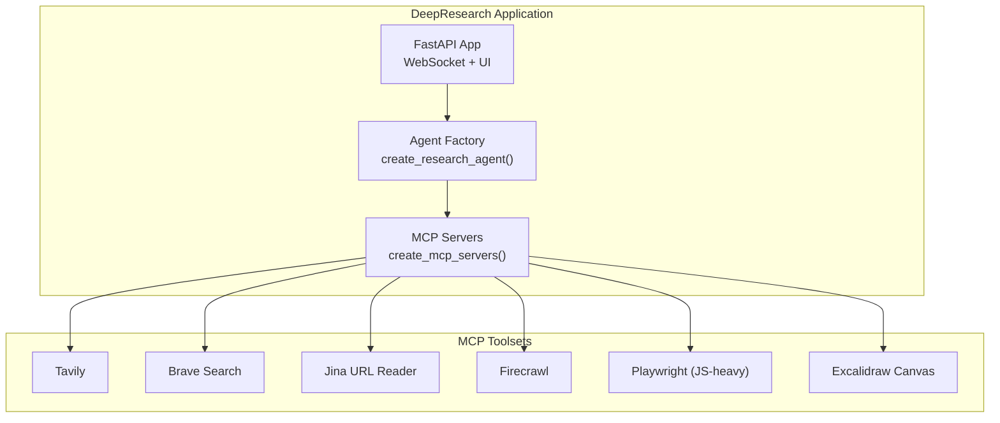
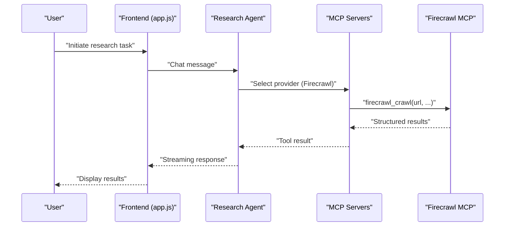
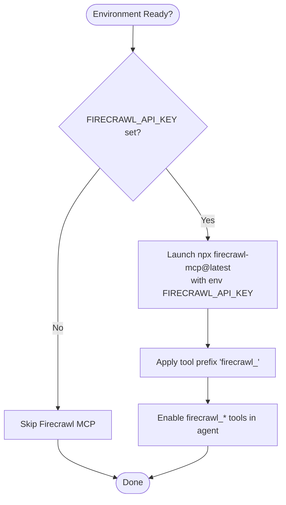
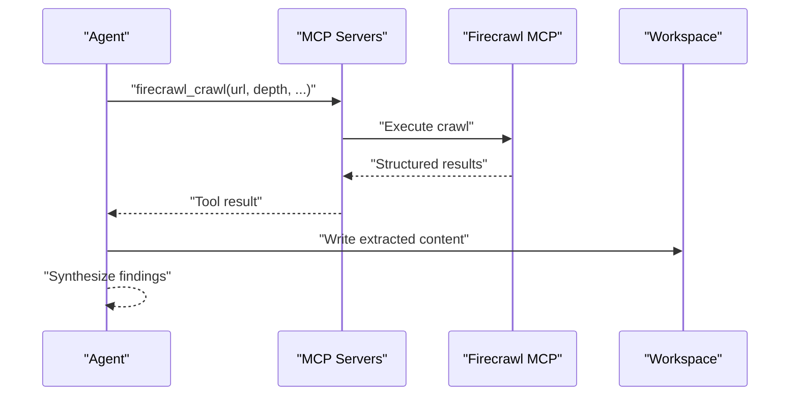
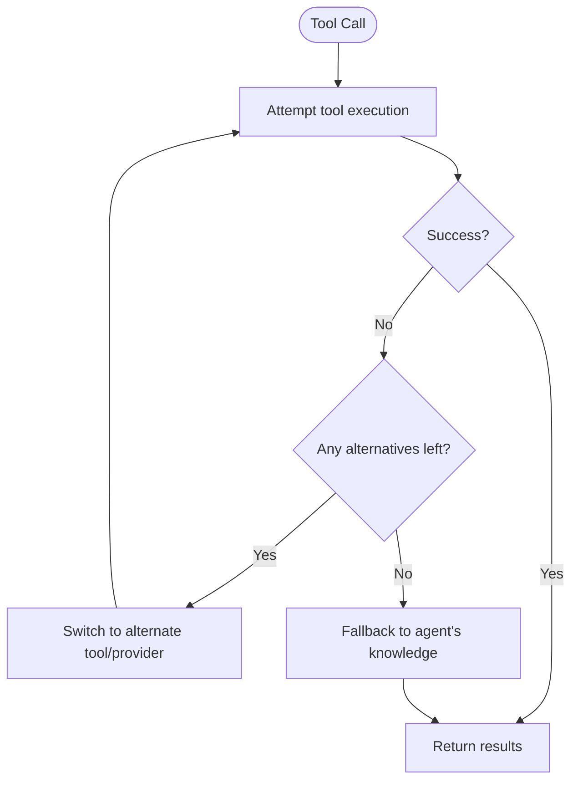
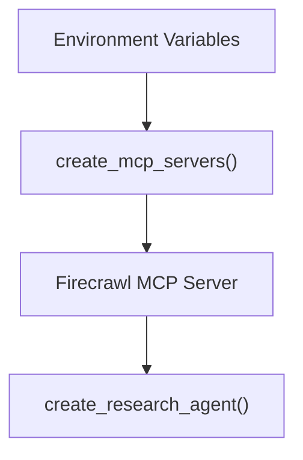

# Web Scraping with Firecrawl

<cite>
**Referenced Files in This Document**
- [README.md](file://apps/deepresearch/README.md)
- [config.py](file://apps/deepresearch/src/deepresearch/config.py)
- [agent.py](file://apps/deepresearch/src/deepresearch/agent.py)
- [prompts.py](file://apps/deepresearch/src/deepresearch/prompts.py)
- [web.py](file://pydantic_deep/toolsets/web.py)
- [test_web_toolset.py](file://tests/test_web_toolset.py)
- [app.js](file://apps/deepresearch/static/app.js)
</cite>

## Table of Contents
1. [Introduction](#introduction)
2. [Project Structure](#project-structure)
3. [Core Components](#core-components)
4. [Architecture Overview](#architecture-overview)
5. [Detailed Component Analysis](#detailed-component-analysis)
6. [Dependency Analysis](#dependency-analysis)
7. [Performance Considerations](#performance-considerations)
8. [Troubleshooting Guide](#troubleshooting-guide)
9. [Conclusion](#conclusion)
10. [Appendices](#appendices)

## Introduction
This document explains how Firecrawl is integrated into the research agent stack to enable advanced web scraping and crawling. It covers the configuration and environment setup, the difference between URL-based scraping and crawl-based extraction, the scraping workflow from initiation to result processing, error handling strategies, and practical examples for configuration and integration. It also provides guidance on performance optimization, rate limiting, and ethical scraping considerations.

## Project Structure
The Firecrawl integration is part of the DeepResearch application, which orchestrates an autonomous research agent. MCP (Model Context Protocol) servers are dynamically created based on environment variables. When the Firecrawl API key is present, a Firecrawl MCP server is launched and exposed to the agent with a consistent tool prefix.

**Diagram sources**
- [config.py:58-151](file://apps/deepresearch/src/deepresearch/config.py#L58-L151)
- [agent.py:376-430](file://apps/deepresearch/src/deepresearch/agent.py#L376-L430)

**Section sources**
- [README.md:84-129](file://apps/deepresearch/README.md#L84-L129)
- [config.py:58-151](file://apps/deepresearch/src/deepresearch/config.py#L58-L151)
- [agent.py:376-430](file://apps/deepresearch/src/deepresearch/agent.py#L376-L430)

## Core Components
- MCP Server Creation: The application conditionally creates MCP servers for Tavily, Brave Search, Jina, Firecrawl, Playwright, and Excalidraw based on environment variables. Firecrawl is enabled when the FIRECRAWL_API_KEY environment variable is present.
- Tool Prefixing: MCP tools are prefixed consistently (e.g., firecrawl_firecrawl_*), enabling the UI and routing logic to recognize and categorize Firecrawl tools alongside other providers.
- Agent Integration: The research agent is constructed with all enabled MCP servers, allowing it to use Firecrawl tools alongside other web search and scraping capabilities.

Practical configuration highlights:
- Environment variable: FIRECRAWL_API_KEY
- Tool prefix: firecrawl_
- Launch mechanism: npx firecrawl-mcp@latest

**Section sources**
- [config.py:138-149](file://apps/deepresearch/src/deepresearch/config.py#L138-L149)
- [README.md:122-129](file://apps/deepresearch/README.md#L122-L129)
- [app.js:635](file://apps/deepresearch/static/app.js#L635)

## Architecture Overview
The agent’s web capabilities are provided via MCP servers. Firecrawl is integrated as an MCP server that exposes scraping and crawling tools under the firecrawl_ prefix. The agent’s instructions and subagent workflows leverage these tools to perform URL-based scraping and crawl-based extraction.

**Diagram sources**
- [config.py:138-149](file://apps/deepresearch/src/deepresearch/config.py#L138-L149)
- [agent.py:340-373](file://apps/deepresearch/src/deepresearch/agent.py#L340-L373)
- [app.js:635](file://apps/deepresearch/static/app.js#L635)

**Section sources**
- [config.py:138-149](file://apps/deepresearch/src/deepresearch/config.py#L138-L149)
- [agent.py:340-373](file://apps/deepresearch/src/deepresearch/agent.py#L340-L373)
- [app.js:635](file://apps/deepresearch/static/app.js#L635)

## Detailed Component Analysis

### Firecrawl Configuration and Tool Prefixing
- Environment-driven activation: When FIRECRAWL_API_KEY is set, the application launches an MCP server for Firecrawl using npx and passes the API key via environment variables.
- Tool prefix: All Firecrawl tools are prefixed with firecrawl_, enabling consistent identification in the UI and routing logic.
- Retry behavior: The MCP server is configured with a small number of retries to improve resilience against transient failures.

**Diagram sources**
- [config.py:138-149](file://apps/deepresearch/src/deepresearch/config.py#L138-L149)

**Section sources**
- [config.py:138-149](file://apps/deepresearch/src/deepresearch/config.py#L138-L149)
- [app.js:635](file://apps/deepresearch/static/app.js#L635)

### URL-Based Scraping vs. Crawl-Based Extraction
- URL-based scraping: Fetches a single URL and returns cleaned content suitable for reading and processing. This is analogous to the fetch_url tool in the web toolset, but here it leverages Firecrawl’s capabilities behind the scenes.
- Crawl-based extraction: Crawls a site up to a configurable depth and extracts structured content across multiple pages. This enables comprehensive discovery and extraction of related content from a domain.

Note: The exact parameters for crawl depth and URL pattern matching are provided by the Firecrawl MCP server and are invoked via the firecrawl_crawl tool when selected by the agent.

**Section sources**
- [README.md:122-129](file://apps/deepresearch/README.md#L122-L129)
- [agent.py:340-373](file://apps/deepresearch/src/deepresearch/agent.py#L340-L373)

### Scraping Workflow: From Initiation to Result Processing
- Initiation: The agent receives a user request and decides whether to use Firecrawl for URL-based scraping or crawl-based extraction.
- Tool Selection: The agent selects the appropriate Firecrawl tool (e.g., firecrawl_crawl) based on the task.
- Execution: The MCP server executes the tool call and returns structured results.
- Processing: The agent processes the results, integrates them into the research plan, and continues synthesis.

**Diagram sources**
- [config.py:138-149](file://apps/deepresearch/src/deepresearch/config.py#L138-L149)
- [agent.py:340-373](file://apps/deepresearch/src/deepresearch/agent.py#L340-L373)

**Section sources**
- [agent.py:340-373](file://apps/deepresearch/src/deepresearch/agent.py#L340-L373)

### Error Handling for Blocked Sites and Dynamic Content
- Blocked sites: The agent’s subagent instructions emphasize resilience—when tools fail (including search or MCP failures), try alternative tools, rephrase queries, or fall back to knowledge-based responses.
- Dynamic content: For JavaScript-heavy pages, the Playwright MCP server can be enabled to render pages before extraction. This complements Firecrawl’s capabilities for complex rendering scenarios.

**Diagram sources**
- [agent.py:147-177](file://apps/deepresearch/src/deepresearch/agent.py#L147-L177)

**Section sources**
- [agent.py:147-177](file://apps/deepresearch/src/deepresearch/agent.py#L147-L177)

### Practical Examples: Configuration and Integration
- API key registration and configuration:
  - Obtain a Firecrawl API key and set FIRECRAWL_API_KEY in your environment.
  - The application will automatically launch the Firecrawl MCP server and expose firecrawl_* tools.
- UI recognition:
  - The frontend recognizes tools with the firecrawl_ prefix and displays them accordingly.
- Integration with the research agent:
  - The agent’s instructions and subagent workflows can select Firecrawl tools for URL-based scraping or crawl-based extraction depending on the research task.

**Section sources**
- [README.md:122-129](file://apps/deepresearch/README.md#L122-L129)
- [config.py:138-149](file://apps/deepresearch/src/deepresearch/config.py#L138-L149)
- [app.js:635](file://apps/deepresearch/static/app.js#L635)

## Dependency Analysis
The Firecrawl integration depends on environment variables and MCP server configuration. The agent composes multiple MCP servers, including Firecrawl, and exposes them to the agent runtime.

**Diagram sources**
- [config.py:58-151](file://apps/deepresearch/src/deepresearch/config.py#L58-L151)
- [agent.py:376-430](file://apps/deepresearch/src/deepresearch/agent.py#L376-L430)

**Section sources**
- [config.py:58-151](file://apps/deepresearch/src/deepresearch/config.py#L58-L151)
- [agent.py:376-430](file://apps/deepresearch/src/deepresearch/agent.py#L376-L430)

## Performance Considerations
- Rate limiting: Respect provider rate limits and implement backoff strategies when invoking Firecrawl tools.
- Retries: The MCP server is configured with a small number of retries to mitigate transient failures.
- Output size: When extracting content, consider truncation and chunking strategies to manage large outputs efficiently.
- Parallelism: Use subagents to distribute scraping tasks and reduce total latency for multi-page crawls.

[No sources needed since this section provides general guidance]

## Troubleshooting Guide
- Firecrawl not appearing:
  - Ensure FIRECRAWL_API_KEY is set in the environment.
  - Confirm the application logs show the MCP server being launched.
- Tool not recognized:
  - Verify the tool name uses the firecrawl_ prefix.
  - Check the UI tool detection logic for prefix-based matching.
- Errors during scraping:
  - The agent’s subagent instructions specify trying alternative tools, rephrasing queries, or falling back to knowledge-based responses when tools fail.

**Section sources**
- [config.py:138-149](file://apps/deepresearch/src/deepresearch/config.py#L138-L149)
- [app.js:635](file://apps/deepresearch/static/app.js#L635)
- [agent.py:147-177](file://apps/deepresearch/src/deepresearch/agent.py#L147-L177)

## Conclusion
Firecrawl is seamlessly integrated into the research agent via MCP, enabling both URL-based scraping and crawl-based extraction. With environment-driven activation, consistent tool prefixing, and resilient error handling, the agent can reliably gather structured web content for comprehensive research workflows. Proper configuration, attention to rate limits, and ethical scraping practices ensure sustainable and effective use of Firecrawl within the system.

[No sources needed since this section summarizes without analyzing specific files]

## Appendices

### API Key Registration and Configuration
- Register for a Firecrawl API key and set FIRECRAWL_API_KEY in your environment.
- The application will automatically launch the Firecrawl MCP server and expose firecrawl_* tools.

**Section sources**
- [README.md:122-129](file://apps/deepresearch/README.md#L122-L129)
- [config.py:138-149](file://apps/deepresearch/src/deepresearch/config.py#L138-L149)

### UI Tool Recognition
- The frontend detects tools with the firecrawl_ prefix and displays them with appropriate labeling and icons.

**Section sources**
- [app.js:635](file://apps/deepresearch/static/app.js#L635)

### Agent Instructions and Subagent Behavior
- The agent’s instructions and subagent workflows guide the selection and use of Firecrawl tools for URL-based scraping and crawl-based extraction.

**Section sources**
- [agent.py:340-373](file://apps/deepresearch/src/deepresearch/agent.py#L340-L373)
- [prompts.py:320-320](file://apps/deepresearch/src/deepresearch/prompts.py#L320-L320)