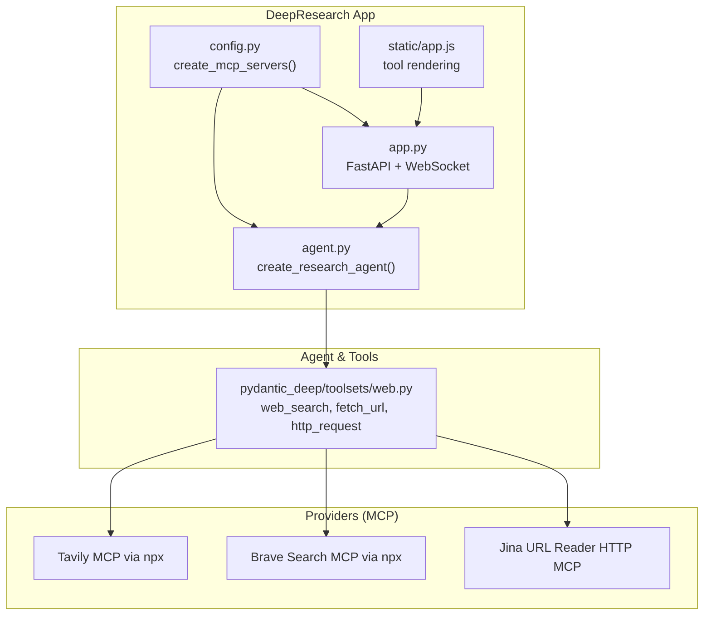
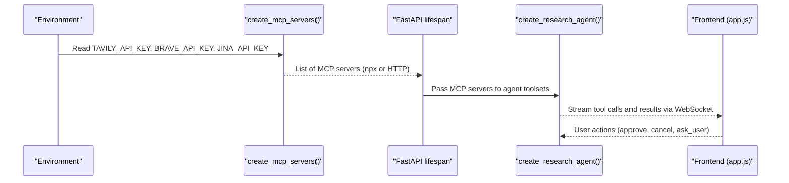
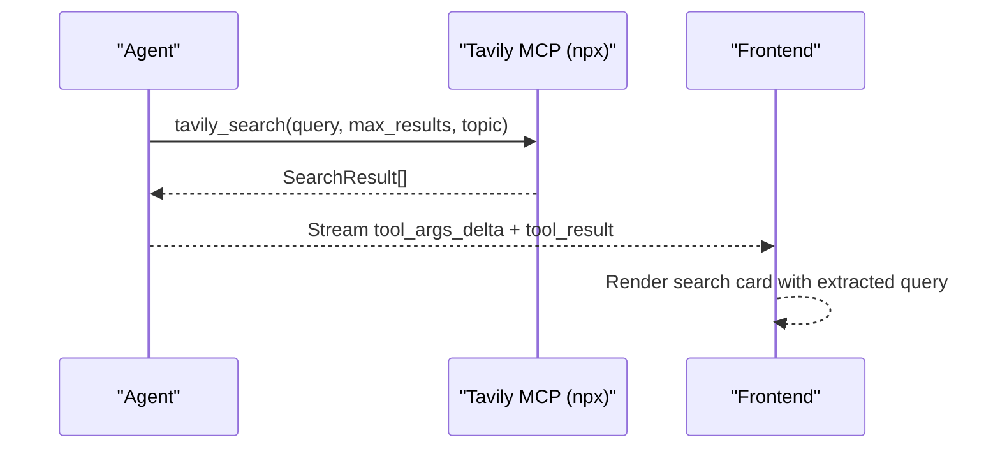
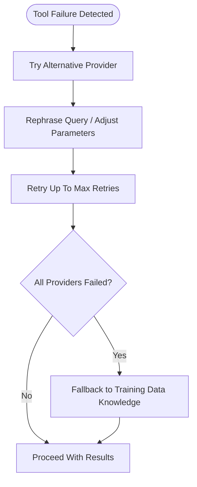
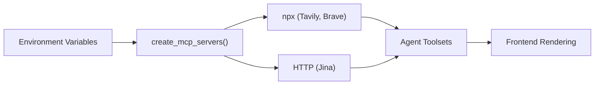

# Web Search Providers

<cite>
**Referenced Files in This Document**
- [config.py](file://apps/deepresearch/src/deepresearch/config.py)
- [agent.py](file://apps/deepresearch/src/deepresearch/agent.py)
- [app.py](file://apps/deepresearch/src/deepresearch/app.py)
- [web.py](file://pydantic_deep/toolsets/web.py)
- [README.md](file://apps/deepresearch/README.md)
- [app.js](file://apps/deepresearch/static/app.js)
- [events.jsonl](file://apps/deepresearch/workspaces/aece0dae-a97c-42fe-9d18-ec04835c1107/events.jsonl)
</cite>

## Table of Contents
1. [Introduction](#introduction)
2. [Project Structure](#project-structure)
3. [Core Components](#core-components)
4. [Architecture Overview](#architecture-overview)
5. [Detailed Component Analysis](#detailed-component-analysis)
6. [Dependency Analysis](#dependency-analysis)
7. [Performance Considerations](#performance-considerations)
8. [Troubleshooting Guide](#troubleshooting-guide)
9. [Conclusion](#conclusion)

## Introduction
This document explains how DeepResearch integrates web search providers through the pydantic-ai MCP (Model Context Protocol) infrastructure. It covers the three primary providers:
- Tavily (recommended for research quality)
- Brave Search
- Jina URL reader

It details API key setup, automatic npx startup, configuration requirements, search result processing, query optimization strategies, fallback mechanisms, and integration with the agent’s research workflow. Practical examples and performance considerations are included.

## Project Structure
The web search provider integration spans several modules:
- MCP server creation and lifecycle management
- Agent configuration and instruction sets
- Frontend tool rendering and event logging
- Built-in web toolset for URL fetching and HTTP requests

**Diagram sources**
- [config.py:58-151](file://apps/deepresearch/src/deepresearch/config.py#L58-L151)
- [agent.py:376-429](file://apps/deepresearch/src/deepresearch/agent.py#L376-L429)
- [app.py:636-690](file://apps/deepresearch/src/deepresearch/app.py#L636-L690)
- [web.py:214-407](file://pydantic_deep/toolsets/web.py#L214-L407)

**Section sources**
- [config.py:58-151](file://apps/deepresearch/src/deepresearch/config.py#L58-L151)
- [agent.py:376-429](file://apps/deepresearch/src/deepresearch/agent.py#L376-L429)
- [app.py:636-690](file://apps/deepresearch/src/deepresearch/app.py#L636-L690)
- [web.py:214-407](file://pydantic_deep/toolsets/web.py#L214-L407)

## Core Components
- MCP server factory: Creates Tavily, Brave, and Jina servers when their respective API keys are present. Servers are started automatically and shut down with the agent lifecycle.
- Agent factory: Builds the research agent with MCP servers integrated as toolsets, plus subagents, skills, and middleware.
- Web toolset: Provides web_search, fetch_url, and http_request tools with robust error handling and user-agent defaults.
- Frontend integration: Renders tool calls and extracts search queries for display.

Key behaviors:
- Automatic npx startup: Tavily and Brave are launched via npx; Jina uses an HTTP MCP endpoint.
- Fallback strategy: The agent’s subagent instructions explicitly instruct trying alternate tools on failure.
- Result processing: Results are returned as structured data and streamed to the UI.

**Section sources**
- [config.py:58-151](file://apps/deepresearch/src/deepresearch/config.py#L58-L151)
- [agent.py:147-177](file://apps/deepresearch/src/deepresearch/agent.py#L147-L177)
- [web.py:214-407](file://pydantic_deep/toolsets/web.py#L214-L407)
- [app.js:649-675](file://apps/deepresearch/static/app.js#L649-L675)

## Architecture Overview
The system initializes MCP servers based on environment variables, injects them into the agent, and exposes them to the UI via WebSocket streaming. The agent’s instructions guide fallback behavior when providers fail.

**Diagram sources**
- [config.py:58-151](file://apps/deepresearch/src/deepresearch/config.py#L58-L151)
- [app.py:636-690](file://apps/deepresearch/src/deepresearch/app.py#L636-L690)
- [agent.py:376-429](file://apps/deepresearch/src/deepresearch/agent.py#L376-L429)
- [app.js:649-675](file://apps/deepresearch/static/app.js#L649-L675)

## Detailed Component Analysis

### Tavily (Recommended for Research Quality)
- Setup: Provide TAVILY_API_KEY. The server runs via npx tavily-mcp@latest with retries.
- Behavior: Search results include title, URL, content excerpt, and relevance score. The agent’s subagent instructions emphasize trying alternate tools if Tavily fails.
- Frontend: Tool calls stream arguments and results; the UI renders search cards and extracts the query for display.

**Diagram sources**
- [config.py:67-78](file://apps/deepresearch/src/deepresearch/config.py#L67-L78)
- [agent.py:161-168](file://apps/deepresearch/src/deepresearch/agent.py#L161-L168)
- [app.js:649-675](file://apps/deepresearch/static/app.js#L649-L675)
- [events.jsonl:2494-2514](file://apps/deepresearch/workspaces/aece0dae-a97c-42fe-9d18-ec04835c1107/events.jsonl#L2494-L2514)

**Section sources**
- [config.py:67-78](file://apps/deepresearch/src/deepresearch/config.py#L67-L78)
- [agent.py:161-168](file://apps/deepresearch/src/deepresearch/agent.py#L161-L168)
- [app.js:649-675](file://apps/deepresearch/static/app.js#L649-L675)
- [events.jsonl:2494-2514](file://apps/deepresearch/workspaces/aece0dae-a97c-42fe-9d18-ec04835c1107/events.jsonl#L2494-L2514)

### Brave Search
- Setup: Provide BRAVE_API_KEY. The server runs via npx @anthropic-ai/brave-search-mcp@latest with retries.
- Behavior: Provides web search results similar to Tavily. The agent’s fallback instructions encourage trying Brave if Tavily fails.
- Frontend: The UI maps tool names to provider-specific labels and icons.

**Section sources**
- [config.py:80-91](file://apps/deepresearch/src/deepresearch/config.py#L80-L91)
- [agent.py:161-168](file://apps/deepresearch/src/deepresearch/agent.py#L161-L168)
- [app.js:649-675](file://apps/deepresearch/static/app.js#L649-L675)

### Jina URL Reader
- Setup: Provide JINA_API_KEY. Uses an HTTP MCP endpoint with Authorization header.
- Behavior: Converts any URL into readable markdown. Useful when you have a specific URL and want clean content extraction.
- Frontend: The UI recognizes Jina’s tool names and displays appropriate labels.

**Section sources**
- [config.py:93-104](file://apps/deepresearch/src/deepresearch/config.py#L93-L104)
- [app.js:649-675](file://apps/deepresearch/static/app.js#L649-L675)

### Automatic npx Startup and Configuration
- Environment variables:
  - TAVILY_API_KEY (recommended)
  - BRAVE_API_KEY
  - JINA_API_KEY
  - PLAYWRIGHT_MCP (enable browser automation)
  - FIRECRAWL_API_KEY (advanced scraping)
  - EXCALIDRAW_ENABLED, EXCALIDRAW_SERVER_URL, EXCALIDRAW_CANVAS_URL (diagrams)
- The MCP server factory checks for keys and conditionally adds servers. Servers are started automatically when the agent context manager enters and stopped when it exits.

**Section sources**
- [config.py:58-151](file://apps/deepresearch/src/deepresearch/config.py#L58-L151)
- [README.md:84-129](file://apps/deepresearch/README.md#L84-L129)

### Search Result Processing and Query Optimization
- Result structure: Each search result includes title, URL, content excerpt, and score. The web toolset returns JSON for downstream synthesis.
- Query optimization:
  - Be specific and detailed in queries.
  - Limit max_results (tool enforces ≤10).
  - Choose topic appropriately (“general”, “news”, “finance”).
- Frontend extraction: The UI extracts the query from tool arguments for display and labeling.

**Section sources**
- [web.py:34-41](file://pydantic_deep/toolsets/web.py#L34-L41)
- [web.py:256-287](file://pydantic_deep/toolsets/web.py#L256-L287)
- [app.js:663-668](file://apps/deepresearch/static/app.js#L663-L668)

### Fallback Mechanisms
- Agent-level fallback: If a tool fails (search API error, timeout, connection refused, max retries exceeded), the subagent instructions direct switching to alternate tools (e.g., Tavily → Jina or Brave) and rephrasing queries.
- App-level resilience: The FastAPI lifespan catches MCP startup failures and retries without the problematic servers.

**Diagram sources**
- [agent.py:159-172](file://apps/deepresearch/src/deepresearch/agent.py#L159-L172)
- [app.py:674-685](file://apps/deepresearch/src/deepresearch/app.py#L674-L685)

**Section sources**
- [agent.py:159-172](file://apps/deepresearch/src/deepresearch/agent.py#L159-L172)
- [app.py:674-685](file://apps/deepresearch/src/deepresearch/app.py#L674-L685)

### Integration with Agent Research Workflow
- The agent’s instructions emphasize:
  - Using web_search for current information and verification.
  - Using fetch_url for specific URLs and http_request for API calls.
  - Employing subagents for complex research with fallback strategies.
- The toolset enforces safe defaults (no exceptions thrown; errors returned as messages) and includes user-agent customization.

**Section sources**
- [web.py:143-207](file://pydantic_deep/toolsets/web.py#L143-L207)
- [agent.py:340-373](file://apps/deepresearch/src/deepresearch/agent.py#L340-L373)

## Dependency Analysis
- Environment-driven dependencies: MCP servers depend on presence of API keys.
- Runtime dependencies: Node.js for npx-based servers; Docker for Excalidraw; requests/markdownify for URL fetching.
- Frontend dependencies: WebSocket streaming and JSONL event logs for tool call visibility.

**Diagram sources**
- [config.py:58-151](file://apps/deepresearch/src/deepresearch/config.py#L58-L151)
- [app.js:649-675](file://apps/deepresearch/static/app.js#L649-L675)

**Section sources**
- [config.py:58-151](file://apps/deepresearch/src/deepresearch/config.py#L58-L151)
- [app.js:649-675](file://apps/deepresearch/static/app.js#L649-L675)

## Performance Considerations
- Rate limiting: Respect provider quotas. The toolset enforces max_results ≤10 and uses retries with bounded attempts.
- Timeout handling: fetch_url and http_request include timeouts; adjust as needed.
- Content truncation: fetch_url truncates long pages to ~50k characters to keep processing efficient.
- Browser automation: Enable Playwright only when needed; it downloads Chromium on first run.

[No sources needed since this section provides general guidance]

## Troubleshooting Guide
- Missing API keys: Ensure TAVILY_API_KEY, BRAVE_API_KEY, or JINA_API_KEY are set. The MCP factory will skip servers without keys.
- MCP startup failures: The app logs and retries without failing servers. Inspect logs for Docker-related issues if Excalidraw is enabled.
- Frontend rendering: Tool arguments and results are logged to JSONL; use these to diagnose provider-specific issues.
- Fallback behavior: If one provider fails, rely on the agent’s subagent instructions to switch providers and rephrase queries.

**Section sources**
- [config.py:58-151](file://apps/deepresearch/src/deepresearch/config.py#L58-L151)
- [app.py:674-685](file://apps/deepresearch/src/deepresearch/app.py#L674-L685)
- [events.jsonl:2494-2514](file://apps/deepresearch/workspaces/aece0dae-a97c-42fe-9d18-ec04835c1107/events.jsonl#L2494-L2514)

## Conclusion
DeepResearch integrates Tavily, Brave Search, and Jina via MCP for robust, configurable web search. The system supports automatic npx startup, graceful fallback, and clear UI feedback. By setting API keys and leveraging the agent’s instructions, users can construct reliable research workflows with multiple providers and strong error handling.