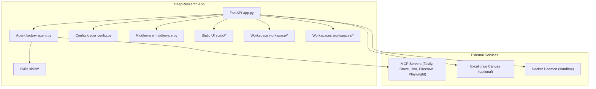
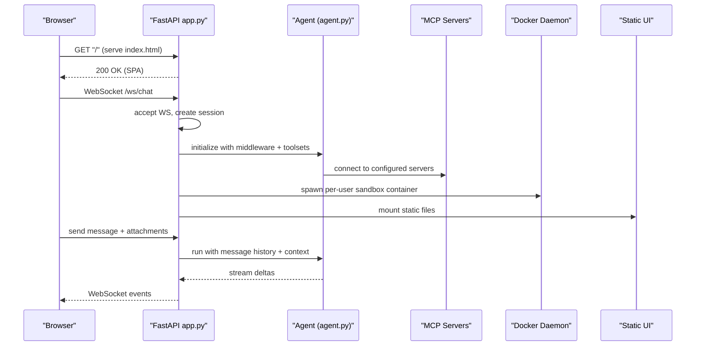
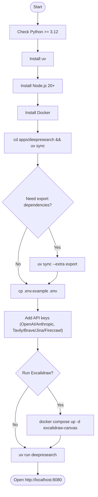
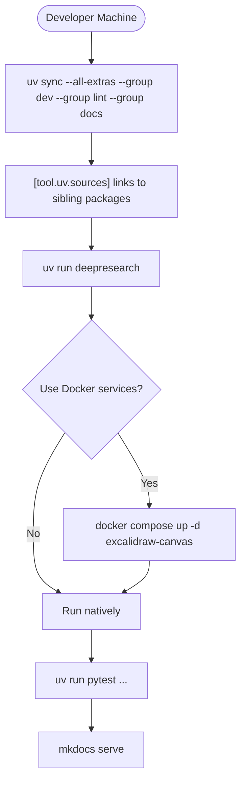
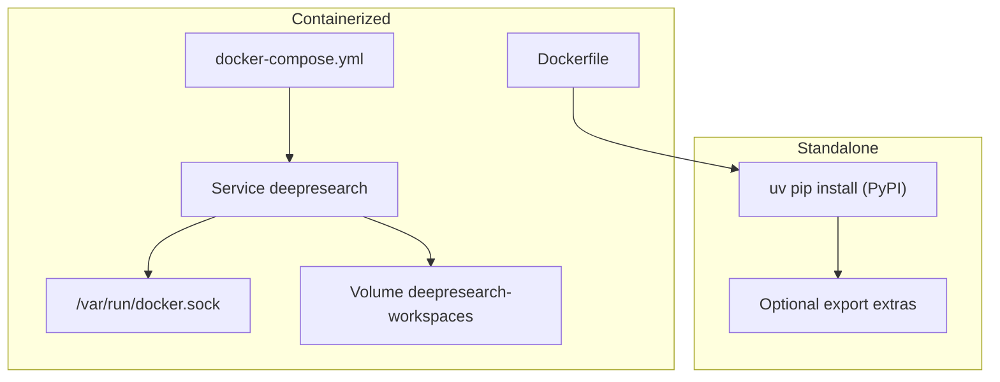
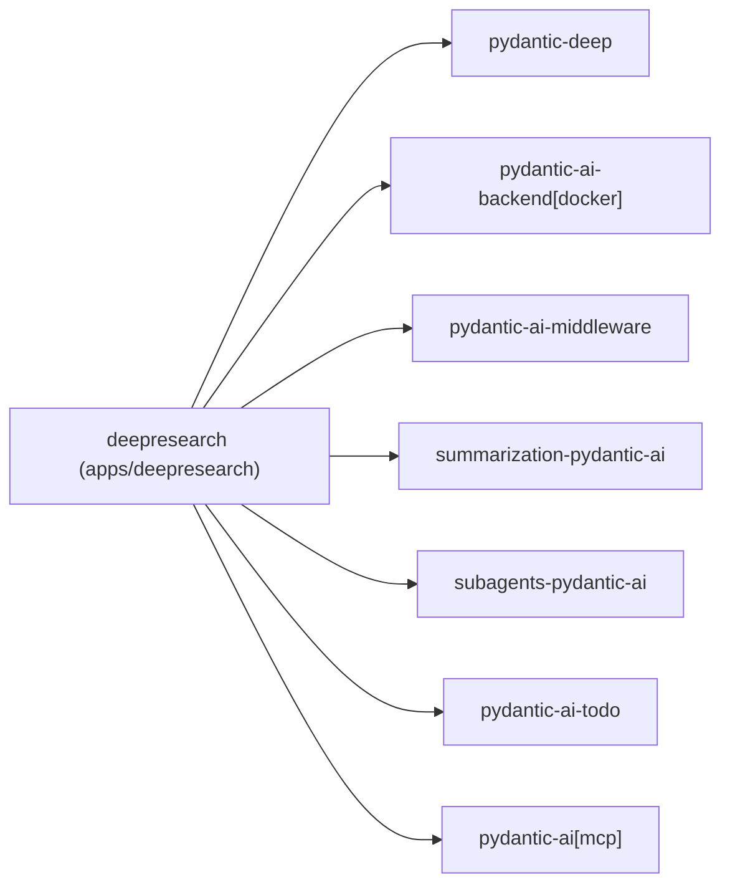

# Setup and Deployment

<cite>
**Referenced Files in This Document**
- [README.md](file://README.md)
- [apps/deepresearch/README.md](file://apps/deepresearch/README.md)
- [apps/deepresearch/pyproject.toml](file://apps/deepresearch/pyproject.toml)
- [apps/deepresearch/docker-compose.yml](file://apps/deepresearch/docker-compose.yml)
- [apps/deepresearch/Dockerfile](file://apps/deepresearch/Dockerfile)
- [apps/deepresearch/.env.example](file://apps/deepresearch/.env.example)
- [apps/deepresearch/src/deepresearch/config.py](file://apps/deepresearch/src/deepresearch/config.py)
- [apps/deepresearch/src/deepresearch/app.py](file://apps/deepresearch/src/deepresearch/app.py)
- [apps/deepresearch/src/deepresearch/agent.py](file://apps/deepresearch/src/deepresearch/agent.py)
- [apps/deepresearch/src/deepresearch/middleware.py](file://apps/deepresearch/src/deepresearch/middleware.py)
- [pyproject.toml](file://pyproject.toml)
- [Makefile](file://Makefile)
- [CONTRIBUTING.md](file://CONTRIBUTING.md)
</cite>

## Table of Contents
1. [Introduction](#introduction)
2. [Project Structure](#project-structure)
3. [Core Components](#core-components)
4. [Architecture Overview](#architecture-overview)
5. [Detailed Component Analysis](#detailed-component-analysis)
6. [Dependency Analysis](#dependency-analysis)
7. [Performance Considerations](#performance-considerations)
8. [Troubleshooting Guide](#troubleshooting-guide)
9. [Conclusion](#conclusion)
10. [Appendices](#appendices)

## Introduction
This document provides a complete guide to setting up and deploying DeepResearch, including prerequisites, installation with uv, environment configuration, development workflow, production deployment options, and scaling considerations. It consolidates the official guidance from the repository’s top-level and DeepResearch app documentation, focusing on practical steps and troubleshooting.

## Project Structure
DeepResearch is a FastAPI application packaged as a Python project with uv-managed dependencies. It integrates with MCP servers for web search and browser automation, uses Docker for sandboxed code execution, and optionally integrates with an Excalidraw canvas for live diagrams.

**Diagram sources**
- [apps/deepresearch/src/deepresearch/app.py:636-692](file://apps/deepresearch/src/deepresearch/app.py#L636-L692)
- [apps/deepresearch/src/deepresearch/agent.py:376-430](file://apps/deepresearch/src/deepresearch/agent.py#L376-L430)
- [apps/deepresearch/src/deepresearch/config.py:58-151](file://apps/deepresearch/src/deepresearch/config.py#L58-L151)
- [apps/deepresearch/docker-compose.yml:1-29](file://apps/deepresearch/docker-compose.yml#L1-L29)

**Section sources**
- [apps/deepresearch/README.md:158-183](file://apps/deepresearch/README.md#L158-L183)
- [apps/deepresearch/pyproject.toml:1-37](file://apps/deepresearch/pyproject.toml#L1-L37)

## Core Components
- Application server: FastAPI with WebSocket streaming and CORS support.
- Agent factory: Creates a research-focused agent with planning, subagents, skills, and middleware.
- MCP server integration: Dynamically starts optional MCP servers based on environment variables.
- Middleware: Audit logging and permission gating for file operations.
- Sandbox: Per-user Docker containers for safe code execution.
- Optional UI: Static SPA served alongside the API.

Key runtime behaviors:
- Environment variables drive model selection, MCP server availability, and Excalidraw integration.
- Docker availability determines whether Excalidraw MCP server can be launched automatically.
- Session persistence and event logging enable continuity across reloads.

**Section sources**
- [apps/deepresearch/src/deepresearch/app.py:35-36](file://apps/deepresearch/src/deepresearch/app.py#L35-L36)
- [apps/deepresearch/src/deepresearch/config.py:30-151](file://apps/deepresearch/src/deepresearch/config.py#L30-L151)
- [apps/deepresearch/src/deepresearch/agent.py:376-430](file://apps/deepresearch/src/deepresearch/agent.py#L376-L430)
- [apps/deepresearch/src/deepresearch/middleware.py:33-122](file://apps/deepresearch/src/deepresearch/middleware.py#L33-L122)

## Architecture Overview
The DeepResearch app initializes agent toolsets and middleware at startup, connects to MCP servers, and manages per-user sessions with Docker-backed sandboxes. Optional services (Excalidraw canvas and MCP servers) are controlled by environment variables.

**Diagram sources**
- [apps/deepresearch/src/deepresearch/app.py:692-720](file://apps/deepresearch/src/deepresearch/app.py#L692-L720)
- [apps/deepresearch/src/deepresearch/agent.py:376-430](file://apps/deepresearch/src/deepresearch/agent.py#L376-L430)
- [apps/deepresearch/src/deepresearch/config.py:58-151](file://apps/deepresearch/src/deepresearch/config.py#L58-L151)

## Detailed Component Analysis

### Prerequisites and Installation
- Python 3.12+ is required by the DeepResearch app.
- uv is the package manager used for dependency synchronization and extras.
- Node.js 20+ is required for running MCP servers via npx.
- Docker is required for sandboxed code execution and optional Excalidraw canvas.
- API keys for at least one search provider are recommended for web research.

Installation steps:
- Change to the DeepResearch app directory and synchronize dependencies.
- Optionally enable export dependencies for report generation.
- Copy and edit the environment file to add API keys.

**Diagram sources**
- [apps/deepresearch/README.md:12-62](file://apps/deepresearch/README.md#L12-L62)
- [apps/deepresearch/pyproject.toml:17-18](file://apps/deepresearch/pyproject.toml#L17-L18)
- [apps/deepresearch/.env.example:1-41](file://apps/deepresearch/.env.example#L1-L41)

**Section sources**
- [apps/deepresearch/README.md:12-62](file://apps/deepresearch/README.md#L12-L62)
- [apps/deepresearch/pyproject.toml:17-18](file://apps/deepresearch/pyproject.toml#L17-L18)
- [apps/deepresearch/.env.example:1-41](file://apps/deepresearch/.env.example#L1-L41)

### Environment Configuration
Environment variables control model selection, MCP servers, Excalidraw, and optional browser automation. At minimum, configure an OpenAI or Anthropic API key and choose a model.

Recommended variables:
- MODEL_NAME: LLM model identifier.
- TAVILY_API_KEY, BRAVE_API_KEY, JINA_API_KEY, FIRECRAWL_API_KEY: Web search providers.
- PLAYWRIGHT_MCP: Enable headless browser automation.
- EXCALIDRAW_ENABLED, EXCALIDRAW_SERVER_URL, EXCALIDRAW_CANVAS_URL: Excalidraw integration.

**Section sources**
- [apps/deepresearch/.env.example:4-41](file://apps/deepresearch/.env.example#L4-L41)
- [apps/deepresearch/src/deepresearch/config.py:30-151](file://apps/deepresearch/src/deepresearch/config.py#L30-L151)
- [apps/deepresearch/README.md:84-98](file://apps/deepresearch/README.md#L84-L98)

### Development Setup
Editable dependencies allow local development against the pydantic-deep ecosystem. The DeepResearch app links to sibling packages via uv sources.

Local development workflow:
- Install all extras and dev/lint/docs groups.
- Use uv run to launch the app.
- For Docker-based Excalidraw, run the canvas service via docker-compose.
- For production-like runs, build and run the Docker image.

**Diagram sources**
- [Makefile:11-26](file://Makefile#L11-L26)
- [apps/deepresearch/pyproject.toml:20-26](file://apps/deepresearch/pyproject.toml#L20-L26)
- [apps/deepresearch/docker-compose.yml:1-29](file://apps/deepresearch/docker-compose.yml#L1-L29)

**Section sources**
- [Makefile:11-26](file://Makefile#L11-L26)
- [apps/deepresearch/pyproject.toml:20-26](file://apps/deepresearch/pyproject.toml#L20-L26)
- [apps/deepresearch/docker-compose.yml:1-29](file://apps/deepresearch/docker-compose.yml#L1-L29)

### Production Deployment Options
Two primary approaches are supported:

- Containerized deployment with Docker:
  - Build the image and run the service with Docker socket access for sandboxing.
  - Mount workspaces volume and expose port 8080.
  - Provide environment variables via env_file or environment entries.

- Standalone deployment:
  - Install from PyPI with export extras for report generation.
  - Ensure Node.js and Docker are available for MCP servers and sandboxing.

**Diagram sources**
- [apps/deepresearch/docker-compose.yml:8-25](file://apps/deepresearch/docker-compose.yml#L8-L25)
- [apps/deepresearch/Dockerfile:1-48](file://apps/deepresearch/Dockerfile#L1-L48)
- [apps/deepresearch/pyproject.toml:17-18](file://apps/deepresearch/pyproject.toml#L17-L18)

**Section sources**
- [apps/deepresearch/docker-compose.yml:8-25](file://apps/deepresearch/docker-compose.yml#L8-L25)
- [apps/deepresearch/Dockerfile:20-41](file://apps/deepresearch/Dockerfile#L20-L41)
- [apps/deepresearch/pyproject.toml:17-18](file://apps/deepresearch/pyproject.toml#L17-L18)

### Scaling Considerations
- Horizontal scaling: Run multiple instances behind a load balancer; ensure shared storage for workspaces if needed.
- Resource allocation: Increase CPU/RAM for concurrent sessions and subagent workloads.
- MCP server reliability: The app retries without failing MCP servers on startup; monitor logs for transient failures.
- Sandbox isolation: Ensure Docker daemon is healthy and reachable from the app host.

**Section sources**
- [apps/deepresearch/src/deepresearch/app.py:674-685](file://apps/deepresearch/src/deepresearch/app.py#L674-L685)
- [apps/deepresearch/src/deepresearch/config.py:43-55](file://apps/deepresearch/src/deepresearch/config.py#L43-L55)

## Dependency Analysis
DeepResearch depends on the pydantic-deep ecosystem and optional extras for export functionality. The app uses uv sources during development to link sibling packages.

**Diagram sources**
- [apps/deepresearch/pyproject.toml:6-14](file://apps/deepresearch/pyproject.toml#L6-L14)
- [apps/deepresearch/pyproject.toml:20-26](file://apps/deepresearch/pyproject.toml#L20-L26)

**Section sources**
- [apps/deepresearch/pyproject.toml:6-14](file://apps/deepresearch/pyproject.toml#L6-L14)
- [apps/deepresearch/pyproject.toml:20-26](file://apps/deepresearch/pyproject.toml#L20-L26)

## Performance Considerations
- Context management: The agent uses summarization and context processors to maintain long conversations efficiently.
- Streaming: WebSocket streaming reduces perceived latency for long-running tasks.
- MCP server retries: Automatic fallback improves resilience when MCP servers are temporarily unavailable.
- Sandbox overhead: Docker-based execution adds latency; consider resource limits and cleanup intervals.

[No sources needed since this section provides general guidance]

## Troubleshooting Guide
Common issues and resolutions:
- Docker not available:
  - Symptom: Excalidraw enabled but skipped in logs.
  - Resolution: Ensure Docker is installed and running; confirm connectivity via docker info.
- MCP server failures:
  - Symptom: Startup exception mentioning docker or stdio.
  - Resolution: The app retries without failing servers; disable problematic MCP servers via environment variables.
- Missing API keys:
  - Symptom: Limited web search capabilities.
  - Resolution: Add at least one of TAVILY_API_KEY, BRAVE_API_KEY, or JINA_API_KEY.
- Port conflicts:
  - Symptom: Cannot start the app on port 8080.
  - Resolution: Change the exposed port in docker-compose or run the app on a different port.
- Export dependencies:
  - Symptom: Report export fails.
  - Resolution: Install export extras via uv sync --extra export.

**Section sources**
- [apps/deepresearch/src/deepresearch/config.py:43-55](file://apps/deepresearch/src/deepresearch/config.py#L43-L55)
- [apps/deepresearch/src/deepresearch/app.py:604-629](file://apps/deepresearch/src/deepresearch/app.py#L604-L629)
- [apps/deepresearch/README.md:84-98](file://apps/deepresearch/README.md#L84-L98)
- [apps/deepresearch/pyproject.toml:17-18](file://apps/deepresearch/pyproject.toml#L17-L18)

## Conclusion
DeepResearch provides a robust, production-ready research agent with web search, subagents, diagrams, and sandboxed execution. By following the prerequisites, installing with uv, configuring environment variables, and leveraging Docker for services and sandboxing, you can deploy reliably across development and production environments. Monitor MCP server health, Docker availability, and resource utilization to scale effectively.

[No sources needed since this section summarizes without analyzing specific files]

## Appendices

### Step-by-Step Setup Checklist
- Install Python 3.12+, uv, Node.js 20+, and Docker.
- Clone the repository and navigate to apps/deepresearch.
- Run uv sync; optionally uv sync --extra export.
- Copy .env.example to .env and add API keys.
- Start Excalidraw canvas via docker compose if desired.
- Launch the app with uv run deepresearch and open http://localhost:8080.

**Section sources**
- [apps/deepresearch/README.md:20-62](file://apps/deepresearch/README.md#L20-L62)
- [apps/deepresearch/.env.example:1-41](file://apps/deepresearch/.env.example#L1-L41)

### Development and Testing Commands
- Install all dev dependencies: make install
- Run tests: make test
- Lint and typecheck: make lint, make typecheck
- Build docs: make docs-serve

**Section sources**
- [Makefile:11-26](file://Makefile#L11-L26)
- [CONTRIBUTING.md:13-18](file://CONTRIBUTING.md#L13-L18)