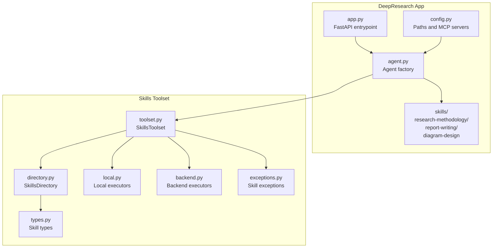
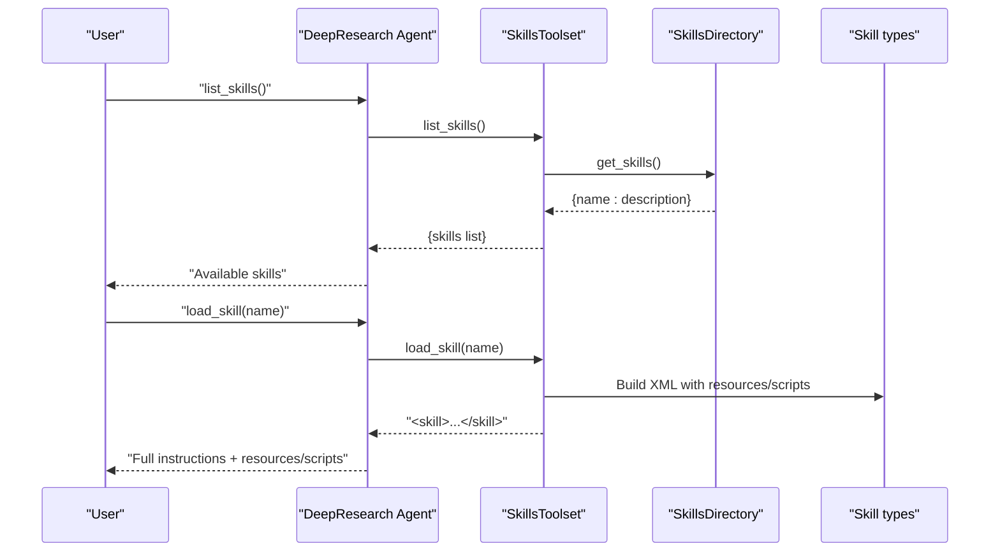
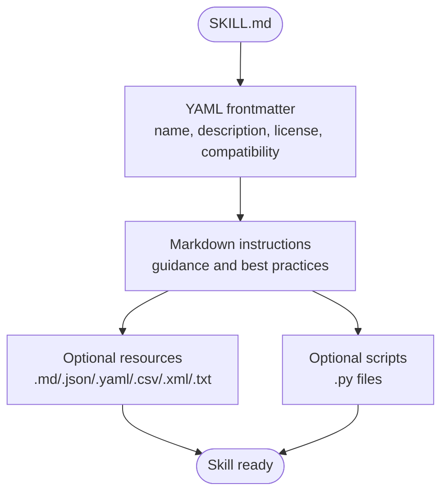
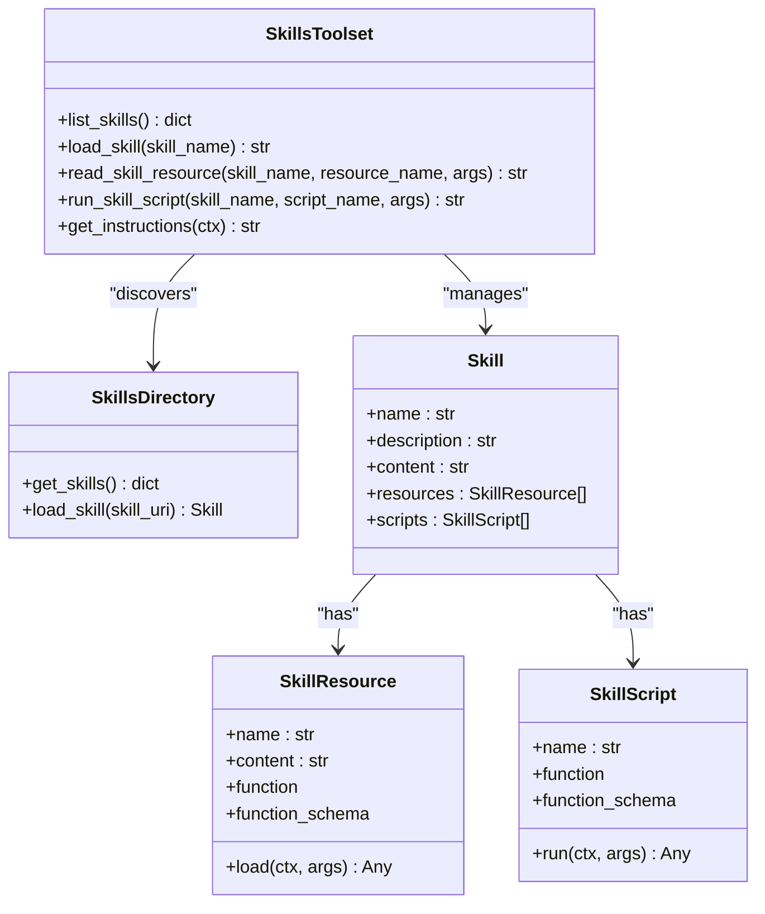
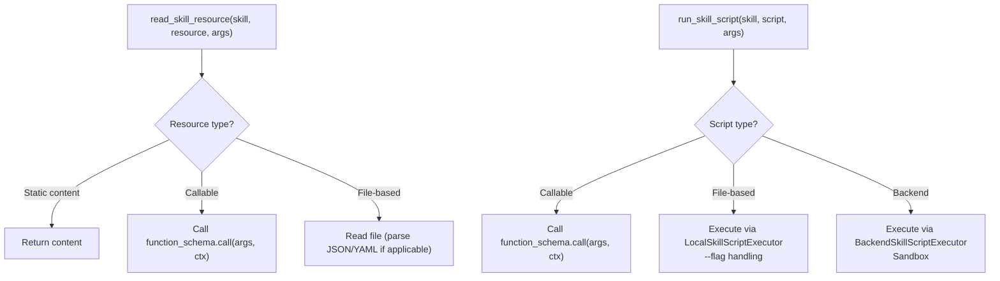
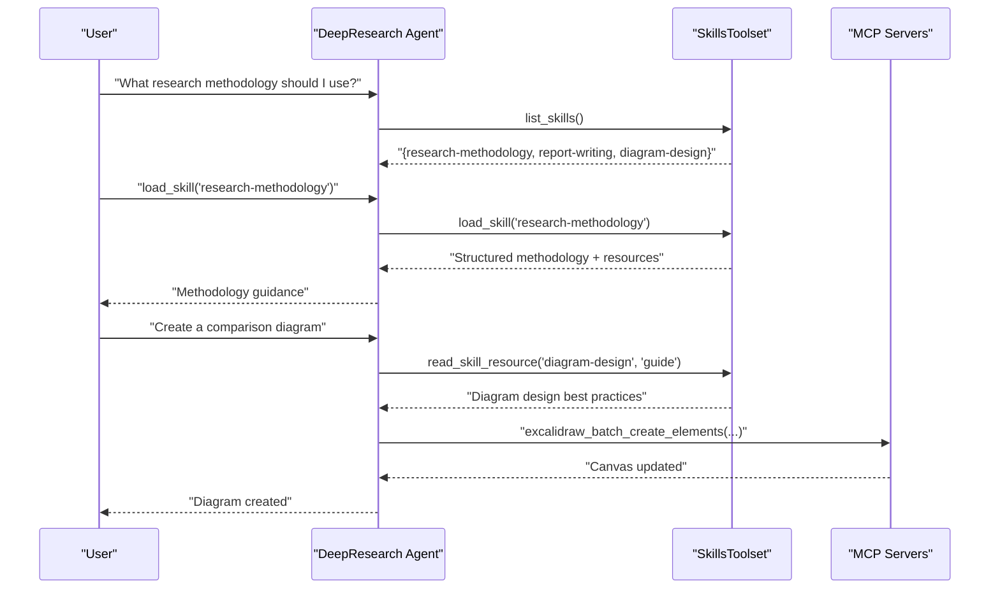
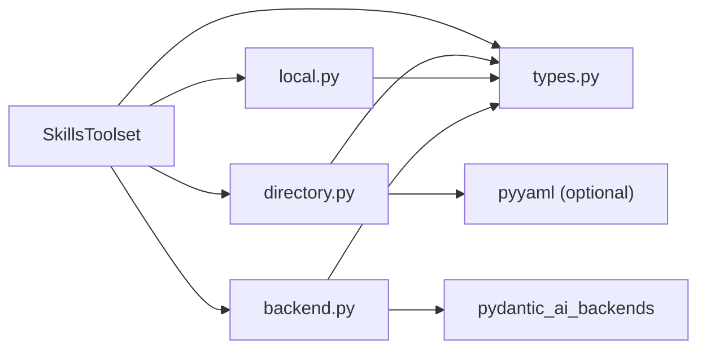

# Skills Framework

<cite>
**Referenced Files in This Document**
- [SKILL.md](file://apps/deepresearch/skills/research-methodology/SKILL.md)
- [SKILL.md](file://apps/deepresearch/skills/report-writing/SKILL.md)
- [SKILL.md](file://apps/deepresearch/skills/diagram-design/SKILL.md)
- [toolset.py](file://pydantic_deep/toolsets/skills/toolset.py)
- [directory.py](file://pydantic_deep/toolsets/skills/directory.py)
- [backend.py](file://pydantic_deep/toolsets/skills/backend.py)
- [local.py](file://pydantic_deep/toolsets/skills/local.py)
- [types.py](file://pydantic_deep/toolsets/skills/types.py)
- [exceptions.py](file://pydantic_deep/toolsets/skills/exceptions.py)
- [agent.py](file://apps/deepresearch/src/deepresearch/agent.py)
- [config.py](file://apps/deepresearch/src/deepresearch/config.py)
- [app.py](file://apps/deepresearch/src/deepresearch/app.py)
- [skills_usage.py](file://examples/skills_usage.py)
- [test_skills.py](file://tests/test_skills.py)
</cite>

## Table of Contents
1. [Introduction](#introduction)
2. [Project Structure](#project-structure)
3. [Core Components](#core-components)
4. [Architecture Overview](#architecture-overview)
5. [Detailed Component Analysis](#detailed-component-analysis)
6. [Dependency Analysis](#dependency-analysis)
7. [Performance Considerations](#performance-considerations)
8. [Troubleshooting Guide](#troubleshooting-guide)
9. [Conclusion](#conclusion)
10. [Appendices](#appendices)

## Introduction
This document explains the DeepResearch skills framework and how it extends agent capabilities through modular, discoverable skills. It covers the SKILL.md format, skill resource management, and how skills integrate with the agent’s toolset system. It also documents the three bundled skills—research-methodology, report-writing, and diagram-design—and provides guidance on skill loading, parameter passing, customization, and extending the framework with new skills.

## Project Structure
The skills framework lives in the DeepResearch application and is composed of:
- A skills directory with three bundled skills under apps/deepresearch/skills
- A skills toolset implementation under pydantic_deep/toolsets/skills
- Agent integration in the DeepResearch app under apps/deepresearch/src/deepresearch

**Diagram sources**
- [app.py:636-690](file://apps/deepresearch/src/deepresearch/app.py#L636-L690)
- [config.py:16-37](file://apps/deepresearch/src/deepresearch/config.py#L16-L37)
- [agent.py:376-430](file://apps/deepresearch/src/deepresearch/agent.py#L376-L430)
- [toolset.py:112-149](file://pydantic_deep/toolsets/skills/toolset.py#L112-L149)
- [directory.py:444-512](file://pydantic_deep/toolsets/skills/directory.py#L444-L512)
- [local.py:35-86](file://pydantic_deep/toolsets/skills/local.py#L35-L86)
- [backend.py:46-107](file://pydantic_deep/toolsets/skills/backend.py#L46-L107)
- [types.py:75-177](file://pydantic_deep/toolsets/skills/types.py#L75-L177)
- [exceptions.py:20-42](file://pydantic_deep/toolsets/skills/exceptions.py#L20-L42)

**Section sources**
- [app.py:636-690](file://apps/deepresearch/src/deepresearch/app.py#L636-L690)
- [config.py:16-37](file://apps/deepresearch/src/deepresearch/config.py#L16-L37)
- [agent.py:376-430](file://apps/deepresearch/src/deepresearch/agent.py#L376-L430)

## Core Components
- SkillsToolset: Integrates skills discovery and management into the agent’s toolset. It exposes tools to list skills, load full instructions, read resources, and run scripts.
- SkillsDirectory: Discovers skills from a filesystem directory, parses SKILL.md, and builds Skill objects with resources and scripts.
- BackendSkillsDirectory: Parallel implementation for backend filesystems, enabling discovery and execution in remote environments.
- LocalSkillScriptExecutor and BackendSkillScriptExecutor: Execute file-based scripts locally or via backend sandbox.
- Skill types: Skill, SkillResource, SkillScript, SkillWrapper encapsulate skill metadata, resources, and executable scripts.
- Exceptions: Centralized error types for skill-related failures.

Key capabilities:
- Progressive disclosure: Agents discover available skills, then load detailed instructions on demand.
- Resource and script management: Skills can bundle static resources (markdown, JSON, YAML, CSV, XML, TXT) and executable scripts (Python).
- Parameter passing: Scripts and callable resources receive typed parameters inferred from function signatures.

**Section sources**
- [toolset.py:112-149](file://pydantic_deep/toolsets/skills/toolset.py#L112-L149)
- [directory.py:444-512](file://pydantic_deep/toolsets/skills/directory.py#L444-L512)
- [backend.py:397-565](file://pydantic_deep/toolsets/skills/backend.py#L397-L565)
- [local.py:88-182](file://pydantic_deep/toolsets/skills/local.py#L88-L182)
- [types.py:75-177](file://pydantic_deep/toolsets/skills/types.py#L75-L177)
- [exceptions.py:20-42](file://pydantic_deep/toolsets/skills/exceptions.py#L20-L42)

## Architecture Overview
The skills system is layered:
- Discovery layer: Finds SKILL.md files and constructs Skill objects with resources and scripts.
- Toolset layer: Exposes list_skills, load_skill, read_skill_resource, run_skill_script to the agent.
- Execution layer: Runs scripts via local or backend executors; loads resources from disk or backend.
- Agent integration: The DeepResearch agent includes skills in its configuration and exposes them to the user.

**Diagram sources**
- [toolset.py:336-484](file://pydantic_deep/toolsets/skills/toolset.py#L336-L484)
- [directory.py:490-512](file://pydantic_deep/toolsets/skills/directory.py#L490-L512)
- [types.py:180-234](file://pydantic_deep/toolsets/skills/types.py#L180-L234)

**Section sources**
- [toolset.py:336-484](file://pydantic_deep/toolsets/skills/toolset.py#L336-L484)
- [directory.py:490-512](file://pydantic_deep/toolsets/skills/directory.py#L490-L512)
- [agent.py:399-430](file://apps/deepresearch/src/deepresearch/agent.py#L399-L430)

## Detailed Component Analysis

### SKILL.md Format and Bundled Skills
Each skill is a directory containing a SKILL.md file with YAML frontmatter and Markdown instructions. The frontmatter defines metadata such as name, description, and optional fields like license and compatibility. The instructions section contains the skill’s guidance.

Three bundled skills:
- research-methodology: Structured investigation approaches, source evaluation, note-taking, and pitfalls.
- report-writing: Report structure, writing style, citation practices, and formatting tips.
- diagram-design: When to create diagrams, Excalidraw workflow, color palette, layout patterns, element guidelines, and diagram types.

**Diagram sources**
- [directory.py:184-218](file://pydantic_deep/toolsets/skills/directory.py#L184-L218)
- [directory.py:220-263](file://pydantic_deep/toolsets/skills/directory.py#L220-L263)

**Section sources**
- [SKILL.md:1-70](file://apps/deepresearch/skills/research-methodology/SKILL.md#L1-L70)
- [SKILL.md:1-64](file://apps/deepresearch/skills/report-writing/SKILL.md#L1-L64)
- [SKILL.md:1-113](file://apps/deepresearch/skills/diagram-design/SKILL.md#L1-L113)

### SkillsToolset: Tools and Integration
SkillsToolset provides:
- list_skills: Enumerates available skills with names and descriptions.
- load_skill: Returns a structured XML-like representation of the skill, including resources and scripts.
- read_skill_resource: Loads a specific resource (static or callable).
- run_skill_script: Executes a script (file-based or callable) with typed parameters.

Integration with the agent:
- The agent is created with include_skills=True and skill_directories configured to the skills path.
- The agent’s instructions include guidance to use skills for domain-specific tasks.

**Diagram sources**
- [toolset.py:112-149](file://pydantic_deep/toolsets/skills/toolset.py#L112-L149)
- [directory.py:444-512](file://pydantic_deep/toolsets/skills/directory.py#L444-L512)
- [types.py:75-177](file://pydantic_deep/toolsets/skills/types.py#L75-L177)

**Section sources**
- [toolset.py:336-484](file://pydantic_deep/toolsets/skills/toolset.py#L336-L484)
- [agent.py:399-430](file://apps/deepresearch/src/deepresearch/agent.py#L399-L430)

### Resource and Script Management
- File-based resources: Loaded from disk; JSON/YAML parsed automatically; others returned as UTF-8 text.
- Callable resources: Invoked via function_schema with typed parameters.
- File-based scripts: Executed via subprocess with CLI-style parameter passing (booleans, lists, strings).
- Backend scripts: Executed via backend sandbox with similar parameter semantics.

**Diagram sources**
- [types.py:104-125](file://pydantic_deep/toolsets/skills/types.py#L104-L125)
- [types.py:158-177](file://pydantic_deep/toolsets/skills/types.py#L158-L177)
- [local.py:112-182](file://pydantic_deep/toolsets/skills/local.py#L112-L182)
- [backend.py:133-190](file://pydantic_deep/toolsets/skills/backend.py#L133-L190)

**Section sources**
- [local.py:35-86](file://pydantic_deep/toolsets/skills/local.py#L35-L86)
- [local.py:112-182](file://pydantic_deep/toolsets/skills/local.py#L112-L182)
- [backend.py:109-190](file://pydantic_deep/toolsets/skills/backend.py#L109-L190)
- [types.py:75-177](file://pydantic_deep/toolsets/skills/types.py#L75-L177)

### Agent Integration and Usage
- The DeepResearch agent includes skills by setting include_skills=True and configuring skill_directories to the skills path.
- The agent’s instructions guide users to use list_skills and load_skill for domain-specific tasks.
- The agent exposes tools for memory, web search, file operations, code execution, diagrams, subagents, teams, TODOs, checkpoints, and skills.

**Diagram sources**
- [agent.py:376-430](file://apps/deepresearch/src/deepresearch/agent.py#L376-L430)
- [config.py:20-25](file://apps/deepresearch/src/deepresearch/config.py#L20-L25)
- [toolset.py:336-484](file://pydantic_deep/toolsets/skills/toolset.py#L336-L484)

**Section sources**
- [agent.py:376-430](file://apps/deepresearch/src/deepresearch/agent.py#L376-L430)
- [config.py:20-25](file://apps/deepresearch/src/deepresearch/config.py#L20-L25)

### Three Bundled Skills

#### Research Methodology
Purpose: Systematic investigation with structured search, source evaluation, note-taking, and pitfalls awareness.

Key aspects:
- Phases: Broad discovery, focused deep-dive, verification.
- Reliability hierarchy: Academic papers, official documentation, reputable news, expert blogs, community forums.
- Note-taking structure: Sub-topic, key findings, contradictions, gaps, confidence levels.
- Pitfalls: Avoid single-source reliance, outdated citations, lack of citations, confusion between correlation and causation.

Usage example:
- Load the skill to guide a research plan and evaluate sources during investigation.

**Section sources**
- [SKILL.md:1-70](file://apps/deepresearch/skills/research-methodology/SKILL.md#L1-L70)

#### Report Writing
Purpose: Producing well-structured, cited research reports.

Key aspects:
- Structure: Title, executive summary, body sections, conclusions, references.
- Writing style: Clarity, objectivity, hedging language, distinguishing facts from interpretation.
- Citation practices: Inline citations, multiple citations for strong claims, no unattributed information.
- Formatting tips: Headers, bullet lists, tables, blockquotes, bolding.

Usage example:
- Load the skill to draft and refine a research report with proper structure and citations.

**Section sources**
- [SKILL.md:1-64](file://apps/deepresearch/skills/report-writing/SKILL.md#L1-L64)

#### Diagram Design
Purpose: Creating research diagrams with Excalidraw MCP tools.

Key aspects:
- When to create diagrams: Comparisons, processes, systems, timelines, hierarchies, data flows.
- Excalidraw workflow: Plan, create/arrange, inspect, adjust, group.
- Color palette: Consistent semantic colors for concepts, support, limitations, warnings, neutral, highlights.
- Layout patterns: Top-to-bottom, left-to-right, radial, grid.
- Element guidelines: Text sizing, shapes (rectangles, diamonds, ellipses, rounded rectangles), arrows, spacing.
- Diagram types: Comparison, architecture, timeline.
- Tips: Always describe scene, batch-create elements, avoid create_from_mermaid.

Usage example:
- Load the skill to design diagrams for research findings and collaborate via the live Excalidraw canvas.

**Section sources**
- [SKILL.md:1-113](file://apps/deepresearch/skills/diagram-design/SKILL.md#L1-L113)

## Dependency Analysis
The skills system depends on:
- pydantic_ai toolsets for tool registration and function schemas.
- pydantic_ai_backends for backend-aware discovery and execution.
- YAML parsing for SKILL.md frontmatter (optional).
- anyio for async subprocess execution.

**Diagram sources**
- [toolset.py:23-37](file://pydantic_deep/toolsets/skills/toolset.py#L23-L37)
- [directory.py:30-36](file://pydantic_deep/toolsets/skills/directory.py#L30-L36)
- [local.py:21-25](file://pydantic_deep/toolsets/skills/local.py#L21-L25)
- [backend.py:21-30](file://pydantic_deep/toolsets/skills/backend.py#L21-L30)

**Section sources**
- [toolset.py:23-37](file://pydantic_deep/toolsets/skills/toolset.py#L23-L37)
- [directory.py:30-36](file://pydantic_deep/toolsets/skills/directory.py#L30-L36)
- [local.py:21-25](file://pydantic_deep/toolsets/skills/local.py#L21-L25)
- [backend.py:21-30](file://pydantic_deep/toolsets/skills/backend.py#L21-L30)

## Performance Considerations
- Discovery depth: SkillsDirectory limits depth to prevent scanning very large trees; tune max_depth as needed.
- Resource parsing: JSON/YAML parsing adds overhead; keep resource files reasonably sized.
- Script execution: LocalSkillScriptExecutor uses timeouts; configure appropriately for long-running scripts.
- Backend execution: BackendSkillScriptExecutor relies on sandbox availability and network latency.

[No sources needed since this section provides general guidance]

## Troubleshooting Guide
Common issues and resolutions:
- Skill not found: Ensure skill name matches exactly; use list_skills to verify availability.
- Resource not found: Confirm resource name exists in the skill’s resource list; names are case-sensitive.
- Script execution errors: Check script exit codes, stderr output, and timeouts; verify parameters passed.
- YAML parsing errors: Ensure YAML frontmatter is valid; fallback to raw text if needed.
- Backend resource/script errors: Verify backend connectivity and permissions; confirm script URIs.

**Section sources**
- [exceptions.py:20-42](file://pydantic_deep/toolsets/skills/exceptions.py#L20-L42)
- [test_skills.py:42-57](file://tests/test_skills.py#L42-L57)

## Conclusion
The DeepResearch skills framework provides a robust, modular way to extend agent capabilities. Through SKILL.md, skills deliver structured guidance, reusable resources, and executable scripts. The SkillsToolset integrates seamlessly with the agent, enabling progressive disclosure and safe execution in local or backend environments. The three bundled skills—research-methodology, report-writing, and diagram-design—demonstrate practical applications for research tasks, while the framework supports customization and extension for new domains.

[No sources needed since this section summarizes without analyzing specific files]

## Appendices

### How to Extend the Framework with New Skills
- Create a new directory under the skills path with a SKILL.md file containing YAML frontmatter and instructions.
- Add optional resources (markdown, JSON, YAML, CSV, XML, TXT) and scripts (Python) in the same directory.
- Configure the agent to include the skills directory and enable skills in the agent configuration.
- Optionally, use the skills toolset APIs to programmatically register skills and attach resources/scripts.

**Section sources**
- [directory.py:444-512](file://pydantic_deep/toolsets/skills/directory.py#L444-L512)
- [toolset.py:151-236](file://pydantic_deep/toolsets/skills/toolset.py#L151-L236)
- [agent.py:399-430](file://apps/deepresearch/src/deepresearch/agent.py#L399-L430)

### Examples of Skill Usage
- Listing skills and loading methodology: see [skills_usage.py:43-53](file://examples/skills_usage.py#L43-L53) and [skills_usage.py:74-80](file://examples/skills_usage.py#L74-L80).
- Loading report-writing guidance: see [skills_usage.py:87-93](file://examples/skills_usage.py#L87-L93).
- Demonstrating discovery and loading: see [skills_usage.py:103-136](file://examples/skills_usage.py#L103-L136).

**Section sources**
- [skills_usage.py:43-93](file://examples/skills_usage.py#L43-L93)
- [skills_usage.py:103-136](file://examples/skills_usage.py#L103-L136)