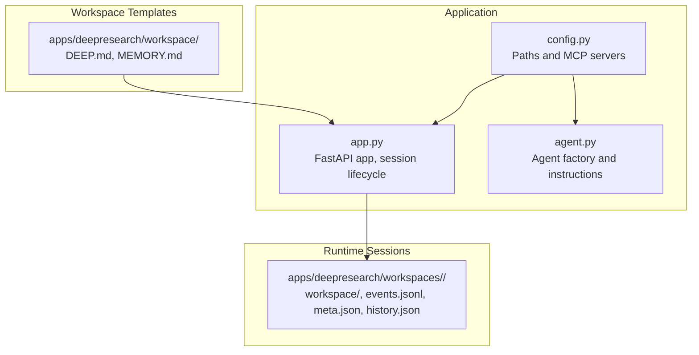
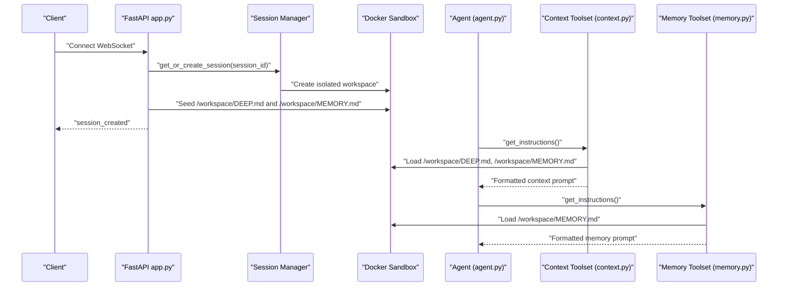
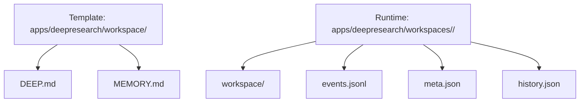
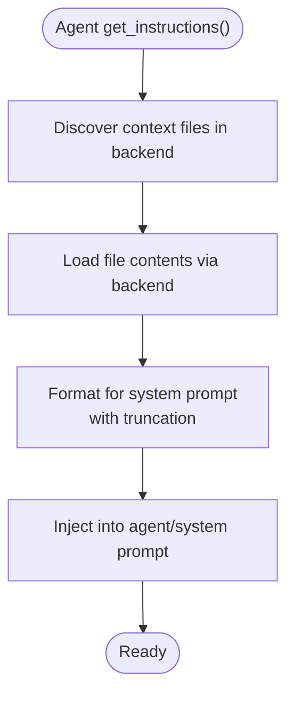
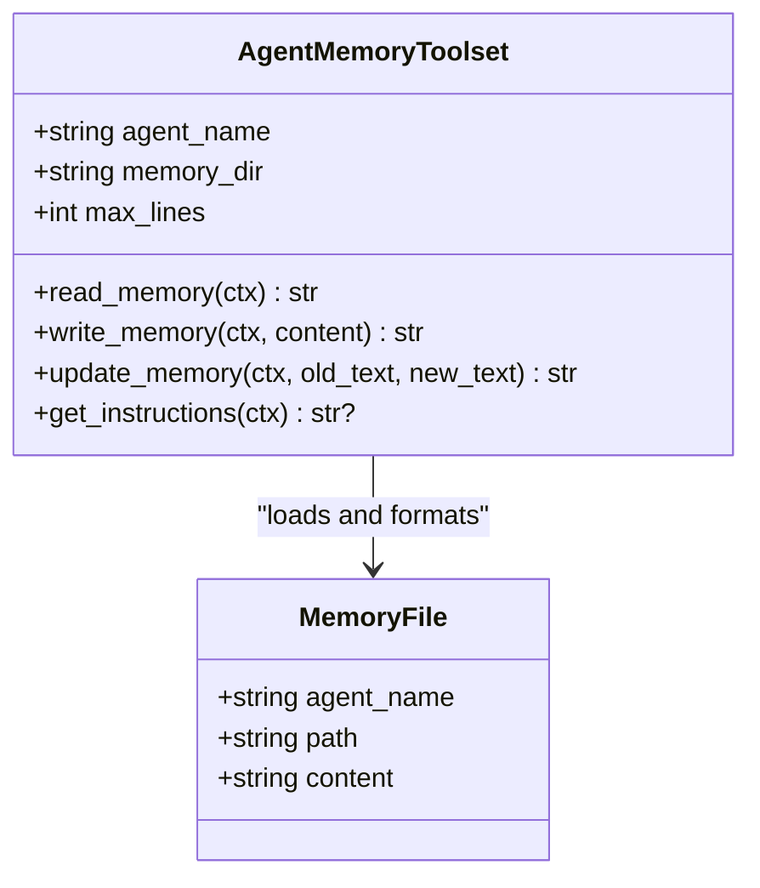
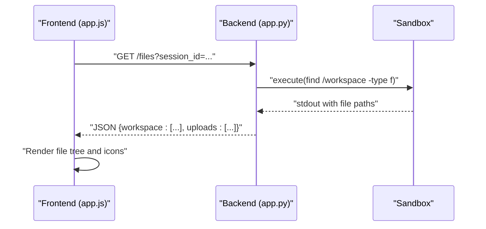
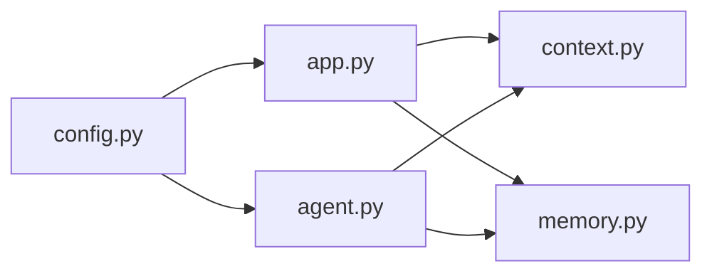

# Workspace and File Management

<cite>
**Referenced Files in This Document**
- [DEEP.md](file://apps/deepresearch/workspace/DEEP.md)
- [MEMORY.md](file://apps/deepresearch/workspace/MEMORY.md)
- [app.py](file://apps/deepresearch/src/deepresearch/app.py)
- [config.py](file://apps/deepresearch/src/deepresearch/config.py)
- [agent.py](file://apps/deepresearch/src/deepresearch/agent.py)
- [context.py](file://pydantic_deep/toolsets/context.py)
- [memory.py](file://pydantic_deep/toolsets/memory.py)
- [DEEP.md (example)](file://examples/full_app/workspace/DEEP.md)
- [DEEP.md (example session)](file://examples/full_app/workspaces/45119bd9-7b56-47e4-850e-d0771f5242de/workspace/DEEP.md)
- [app.js (frontend)](file://apps/deepresearch/static/app.js)
- [app.py (example backend)](file://examples/full_app/app.py)
</cite>

## Table of Contents
1. [Introduction](#introduction)
2. [Project Structure](#project-structure)
3. [Core Components](#core-components)
4. [Architecture Overview](#architecture-overview)
5. [Detailed Component Analysis](#detailed-component-analysis)
6. [Dependency Analysis](#dependency-analysis)
7. [Performance Considerations](#performance-considerations)
8. [Troubleshooting Guide](#troubleshooting-guide)
9. [Conclusion](#conclusion)

## Introduction
This document explains workspace and file management in DeepResearch. It covers:
- The workspace directory structure and how context files are injected into the agent
- Persistent memory management across sessions
- The DEEP.md context file that provides research background and instructions to every session
- The MEMORY.md file for agent memory persistence
- File operations available through the console toolset (reading, writing, editing, globbing, searching)
- Practical examples for initializing workspaces, customizing context files, and applying file operation patterns for research workflows

## Project Structure
DeepResearch organizes workspace content per session under a dedicated workspaces directory. Each session has its own isolated workspace and optional persistent memory.

**Diagram sources**
- [config.py:20-24](file://apps/deepresearch/src/deepresearch/config.py#L20-L24)
- [app.py:122-125](file://apps/deepresearch/src/deepresearch/app.py#L122-L125)
- [app.py:562-601](file://apps/deepresearch/src/deepresearch/app.py#L562-L601)

**Section sources**
- [config.py:20-24](file://apps/deepresearch/src/deepresearch/config.py#L20-L24)
- [app.py:122-125](file://apps/deepresearch/src/deepresearch/app.py#L122-L125)
- [app.py:562-601](file://apps/deepresearch/src/deepresearch/app.py#L562-L601)

## Core Components
- Workspace templates: The application seeds each session with two context files located under the app’s workspace template directory.
- Session workspace: Each session maintains its own workspace directory under the workspaces root, plus auxiliary files for events, metadata, and history.
- Context injection: The agent is configured to include specific context files from the session workspace into its system prompt.
- Persistent memory: A dedicated MEMORY.md file persists across sessions and is injected into the agent’s system prompt.

**Section sources**
- [DEEP.md:1-12](file://apps/deepresearch/workspace/DEEP.md#L1-L12)
- [MEMORY.md:1-4](file://apps/deepresearch/workspace/MEMORY.md#L1-L4)
- [app.py:562-601](file://apps/deepresearch/src/deepresearch/app.py#L562-L601)
- [agent.py:423](file://apps/deepresearch/src/deepresearch/agent.py#L423)
- [memory.py:130-231](file://pydantic_deep/toolsets/memory.py#L130-L231)

## Architecture Overview
The workspace and file management pipeline integrates configuration, session creation, context injection, and persistent memory.

**Diagram sources**
- [app.py:562-601](file://apps/deepresearch/src/deepresearch/app.py#L562-L601)
- [agent.py:423](file://apps/deepresearch/src/deepresearch/agent.py#L423)
- [context.py:150-208](file://pydantic_deep/toolsets/context.py#L150-L208)
- [memory.py:130-231](file://pydantic_deep/toolsets/memory.py#L130-L231)

## Detailed Component Analysis

### Workspace Directory Structure
- Template directory: apps/deepresearch/workspace/
  - DEEP.md: Research workflow and conventions
  - MEMORY.md: Placeholder for persistent memory
- Runtime directory: apps/deepresearch/workspaces/<session-id>/
  - workspace/: Per-session writable workspace
  - events.jsonl: Streaming event log for the session
  - meta.json: Session metadata (title, timestamps, message count)
  - history.json: Serialized message history for continuity

**Diagram sources**
- [DEEP.md:1-12](file://apps/deepresearch/workspace/DEEP.md#L1-L12)
- [MEMORY.md:1-4](file://apps/deepresearch/workspace/MEMORY.md#L1-L4)
- [app.py:271-341](file://apps/deepresearch/src/deepresearch/app.py#L271-L341)

**Section sources**
- [DEEP.md:1-12](file://apps/deepresearch/workspace/DEEP.md#L1-L12)
- [MEMORY.md:1-4](file://apps/deepresearch/workspace/MEMORY.md#L1-L4)
- [app.py:271-341](file://apps/deepresearch/src/deepresearch/app.py#L271-L341)

### Context File Injection System
- The agent is configured to include specific context files from the session workspace into its system prompt.
- The context toolset loads and formats the files, truncating content to fit token budgets.
- Subagents can optionally receive a filtered subset of context files.

**Diagram sources**
- [agent.py:423](file://apps/deepresearch/src/deepresearch/agent.py#L423)
- [context.py:150-208](file://pydantic_deep/toolsets/context.py#L150-L208)

**Section sources**
- [agent.py:423](file://apps/deepresearch/src/deepresearch/agent.py#L423)
- [context.py:150-208](file://pydantic_deep/toolsets/context.py#L150-L208)

### Persistent Memory Management
- Each agent has a dedicated MEMORY.md file stored in the backend under a memory directory.
- The memory toolset provides:
  - read_memory: Retrieve full memory content
  - write_memory: Append new content to memory
  - update_memory: Exact find-and-replace in memory
- Memory is injected into the system prompt with a configurable line limit.

**Diagram sources**
- [memory.py:130-231](file://pydantic_deep/toolsets/memory.py#L130-L231)

**Section sources**
- [memory.py:130-231](file://pydantic_deep/toolsets/memory.py#L130-L231)

### File Operations Console Toolset
The agent exposes a comprehensive set of file operations through its toolset:
- read_file(path): Read a file
- write_file(path, content): Create or overwrite a file
- edit_file(path, old_string, new_string): Replace occurrences in a file
- glob(pattern): Find files matching a pattern
- grep(pattern, paths): Search file contents with regex
- ls(): List directory contents
- execute(command): Run shell commands in a sandboxed environment

These capabilities are documented in the agent’s quick reference skill and integrated into the agent’s instructions.

**Section sources**
- [agent.py:271-338](file://apps/deepresearch/src/deepresearch/agent.py#L271-L338)
- [agent.py:340-373](file://apps/deepresearch/src/deepresearch/agent.py#L340-L373)

### Frontend File Listing and Preview
The frontend provides a file explorer that:
- Lists uploads and workspace files for the current session
- Builds a hierarchical file tree for workspace contents
- Supports preview and navigation of files

**Diagram sources**
- [app.js:1931-1975](file://apps/deepresearch/static/app.js#L1931-L1975)
- [app.py:1410-1429](file://apps/deepresearch/src/deepresearch/app.py#L1410-L1429)

**Section sources**
- [app.js:1931-1975](file://apps/deepresearch/static/app.js#L1931-L1975)
- [app.py:1410-1429](file://apps/deepresearch/src/deepresearch/app.py#L1410-L1429)

## Dependency Analysis
- Configuration defines workspace roots and MCP servers.
- Application creates sessions, seeds context files, and persists events/history.
- Agent configuration includes context files and memory toolset.
- Toolsets (context, memory) integrate with the backend to read/write files.

**Diagram sources**
- [config.py:20-24](file://apps/deepresearch/src/deepresearch/config.py#L20-L24)
- [app.py:562-601](file://apps/deepresearch/src/deepresearch/app.py#L562-L601)
- [agent.py:423](file://apps/deepresearch/src/deepresearch/agent.py#L423)

**Section sources**
- [config.py:20-24](file://apps/deepresearch/src/deepresearch/config.py#L20-L24)
- [app.py:562-601](file://apps/deepresearch/src/deepresearch/app.py#L562-L601)
- [agent.py:423](file://apps/deepresearch/src/deepresearch/agent.py#L423)

## Performance Considerations
- Context and memory content is truncated to fit token budgets; avoid extremely large context files.
- File listings use find with stderr redirection to minimize noise; prefer glob/grep for targeted searches.
- Use read_file with offset/limit for large files to reduce payload sizes.
- Persist history and events incrementally; keep events.jsonl and meta.json small to improve responsiveness.

## Troubleshooting Guide
- Missing context files: If /workspace/DEEP.md or /workspace/MEMORY.md are absent, the agent will not inject them. Ensure the template files exist and are seeded during session creation.
- Memory not injected: Confirm the agent includes the memory toolset and that MEMORY.md exists in the session workspace.
- File listing issues: The backend uses find via execute; ensure the sandbox supports this command and that permissions allow traversal.
- Frontend file tree errors: The frontend builds a tree from flat paths; verify that the backend returns valid absolute paths.

**Section sources**
- [app.py:562-601](file://apps/deepresearch/src/deepresearch/app.py#L562-L601)
- [context.py:150-208](file://pydantic_deep/toolsets/context.py#L150-L208)
- [memory.py:130-231](file://pydantic_deep/toolsets/memory.py#L130-L231)
- [app.py:1410-1429](file://apps/deepresearch/src/deepresearch/app.py#L1410-L1429)
- [app.js:1931-1975](file://apps/deepresearch/static/app.js#L1931-L1975)

## Conclusion
DeepResearch provides a robust workspace and file management system:
- Templates seed each session with DEEP.md and MEMORY.md
- Context and memory are injected into the agent’s system prompt
- A rich console toolset enables reading, writing, editing, globbing, and searching within the workspace
- Sessions persist events, metadata, and history for continuity

By customizing DEEP.md and leveraging MEMORY.md, researchers can tailor the agent’s behavior and maintain persistent knowledge across conversations. The frontend and backend cooperate to expose a practical file explorer and reliable file operations.