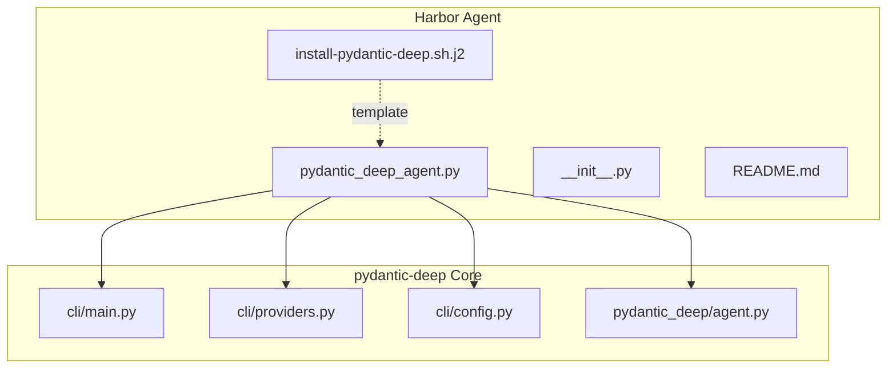
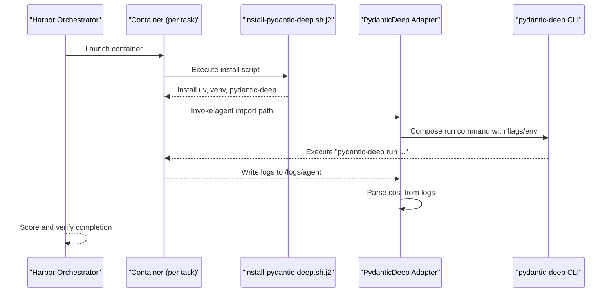
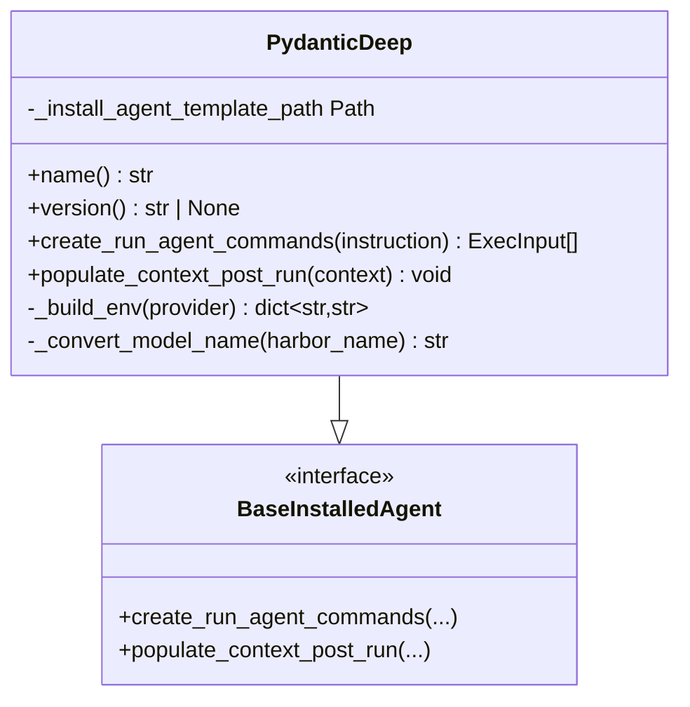
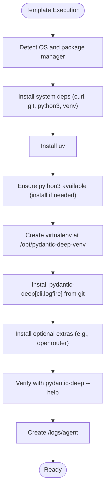
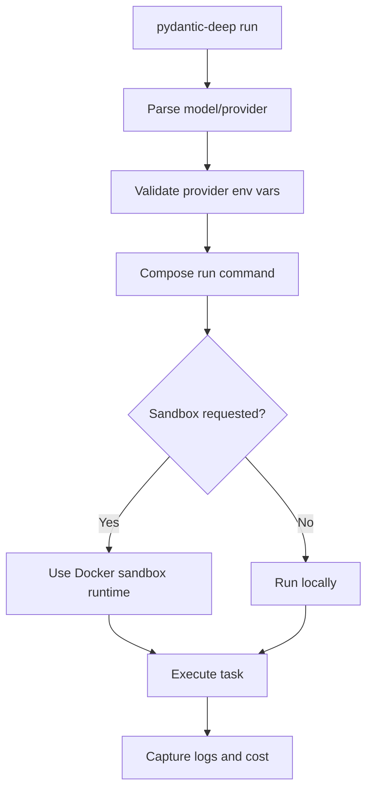
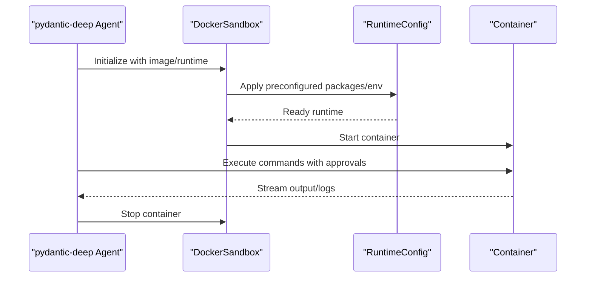
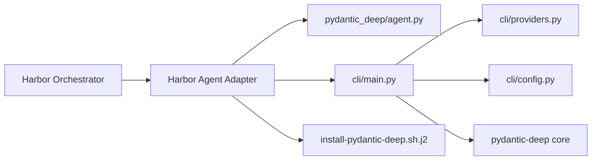

# Harbor Agent

<cite>
**Referenced Files in This Document**
- [apps/harbor_agent/README.md](file://apps/harbor_agent/README.md)
- [apps/harbor_agent/pydantic_deep_agent.py](file://apps/harbor_agent/pydantic_deep_agent.py)
- [apps/harbor_agent/install-pydantic-deep.sh.j2](file://apps/harbor_agent/install-pydantic-deep.sh.j2)
- [apps/harbor_agent/__init__.py](file://apps/harbor_agent/__init__.py)
- [cli/main.py](file://cli/main.py)
- [cli/providers.py](file://cli/providers.py)
- [cli/config.py](file://cli/config.py)
- [pydantic_deep/agent.py](file://pydantic_deep/agent.py)
- [examples/docker_sandbox.py](file://examples/docker_sandbox.py)
- [pyproject.toml](file://pyproject.toml)
- [README.md](file://README.md)
</cite>

## Table of Contents
1. [Introduction](#introduction)
2. [Project Structure](#project-structure)
3. [Core Components](#core-components)
4. [Architecture Overview](#architecture-overview)
5. [Detailed Component Analysis](#detailed-component-analysis)
6. [Dependency Analysis](#dependency-analysis)
7. [Performance Considerations](#performance-considerations)
8. [Troubleshooting Guide](#troubleshooting-guide)
9. [Conclusion](#conclusion)
10. [Appendices](#appendices)

## Introduction
Harbor Agent is a container-based AI agent deployment adapter that enables pydantic-deep to run inside Harbor-managed Docker containers for secure, per-task sandboxing. It bridges the pydantic-deep CLI with Harbor’s container orchestration and verification pipeline, supporting benchmarking and evaluation on datasets such as Terminal-Bench 2.0. The adapter provisions a fresh container per task, installs a Python environment and pydantic-deep, executes the requested instruction, and surfaces metrics like cost for scoring.

## Project Structure
Harbor Agent lives under apps/harbor_agent and consists of:
- A Harbor-compatible agent adapter that implements BaseInstalledAgent
- A Jinja2 template for installing pydantic-deep and its dependencies inside a container
- A small package initializer and README with quick-start and architecture notes

**Diagram sources**
- [apps/harbor_agent/pydantic_deep_agent.py](file://apps/harbor_agent/pydantic_deep_agent.py)
- [apps/harbor_agent/install-pydantic-deep.sh.j2](file://apps/harbor_agent/install-pydantic-deep.sh.j2)
- [apps/harbor_agent/__init__.py](file://apps/harbor_agent/__init__.py)
- [apps/harbor_agent/README.md](file://apps/harbor_agent/README.md)
- [cli/main.py](file://cli/main.py)
- [cli/providers.py](file://cli/providers.py)
- [cli/config.py](file://cli/config.py)
- [pydantic_deep/agent.py](file://pydantic_deep/agent.py)

**Section sources**
- [apps/harbor_agent/README.md](file://apps/harbor_agent/README.md)
- [apps/harbor_agent/__init__.py](file://apps/harbor_agent/__init__.py)

## Core Components
- Harbor Agent Adapter: Implements BaseInstalledAgent to define how pydantic-deep is invoked inside Harbor containers, including environment propagation and model name conversion.
- Installation Template: A Jinja2 script that bootstraps a container with system dependencies, uv, a virtual environment, and pydantic-deep with optional extras.
- CLI Integration: The pydantic-deep CLI provides model selection, provider configuration, and sandboxing; the adapter composes the run command and captures cost metrics.

Key responsibilities:
- Convert Harbor model identifiers to pydantic-ai format
- Build environment variables for providers
- Compose the pydantic-deep run command with flags
- Parse cost from logs for leaderboard scoring

**Section sources**
- [apps/harbor_agent/pydantic_deep_agent.py](file://apps/harbor_agent/pydantic_deep_agent.py)
- [apps/harbor_agent/install-pydantic-deep.sh.j2](file://apps/harbor_agent/install-pydantic-deep.sh.j2)
- [cli/providers.py](file://cli/providers.py)
- [cli/main.py](file://cli/main.py)

## Architecture Overview
Harbor orchestrates per-task containers, invoking the agent adapter which:
1. Installs pydantic-deep in a containerized environment
2. Executes pydantic-deep run with the instruction and selected model
3. Captures logs and parses cost for scoring

**Diagram sources**
- [apps/harbor_agent/pydantic_deep_agent.py](file://apps/harbor_agent/pydantic_deep_agent.py)
- [apps/harbor_agent/install-pydantic-deep.sh.j2](file://apps/harbor_agent/install-pydantic-deep.sh.j2)
- [cli/main.py](file://cli/main.py)

## Detailed Component Analysis

### Harbor Agent Adapter
The adapter extends BaseInstalledAgent and encapsulates:
- Model name conversion from Harbor’s “provider/name” to pydantic-ai “provider:name”
- Environment variable collection for provider APIs
- Command composition for pydantic-deep run with optional flags (logfire, lean)
- Post-run cost extraction from logs

**Diagram sources**
- [apps/harbor_agent/pydantic_deep_agent.py](file://apps/harbor_agent/pydantic_deep_agent.py)

**Section sources**
- [apps/harbor_agent/pydantic_deep_agent.py](file://apps/harbor_agent/pydantic_deep_agent.py)

### Installation Template (Jinja2)
The template performs:
- OS detection and system dependency installation
- Installing uv and ensuring a compatible Python interpreter
- Creating a virtual environment and installing pydantic-deep from git with extras
- Verifying installation and preparing log directories

**Diagram sources**
- [apps/harbor_agent/install-pydantic-deep.sh.j2](file://apps/harbor_agent/install-pydantic-deep.sh.j2)

**Section sources**
- [apps/harbor_agent/install-pydantic-deep.sh.j2](file://apps/harbor_agent/install-pydantic-deep.sh.j2)

### CLI Integration and Provider Configuration
The pydantic-deep CLI supports:
- Model selection and provider configuration
- Sandbox execution flags
- Provider registry and environment validation
- Configuration precedence (CLI > config file > defaults)

**Diagram sources**
- [cli/main.py](file://cli/main.py)
- [cli/providers.py](file://cli/providers.py)
- [cli/config.py](file://cli/config.py)

**Section sources**
- [cli/main.py](file://cli/main.py)
- [cli/providers.py](file://cli/providers.py)
- [cli/config.py](file://cli/config.py)

### Sandbox Orchestration and Security Hardening
While the Harbor Agent adapter focuses on container provisioning and pydantic-deep invocation, the broader pydantic-deep ecosystem supports Docker sandboxing for safe execution. The examples demonstrate:
- Isolated DockerSandbox with configurable images and runtimes
- Interrupt-on-execute patterns for human-in-the-loop controls
- Custom runtime configurations for specialized environments

**Diagram sources**
- [examples/docker_sandbox.py](file://examples/docker_sandbox.py)
- [pydantic_deep/agent.py](file://pydantic_deep/agent.py)

**Section sources**
- [examples/docker_sandbox.py](file://examples/docker_sandbox.py)
- [pydantic_deep/agent.py](file://pydantic_deep/agent.py)

## Dependency Analysis
Harbor Agent depends on:
- pydantic-ai ecosystem for agent orchestration and toolsets
- pydantic-deep CLI for task execution and provider integration
- Docker runtime for container isolation (via Harbor orchestration)

**Diagram sources**
- [apps/harbor_agent/pydantic_deep_agent.py](file://apps/harbor_agent/pydantic_deep_agent.py)
- [apps/harbor_agent/install-pydantic-deep.sh.j2](file://apps/harbor_agent/install-pydantic-deep.sh.j2)
- [cli/main.py](file://cli/main.py)
- [cli/providers.py](file://cli/providers.py)
- [cli/config.py](file://cli/config.py)
- [pydantic_deep/agent.py](file://pydantic_deep/agent.py)

**Section sources**
- [pyproject.toml](file://pyproject.toml)
- [README.md](file://README.md)

## Performance Considerations
- Container startup overhead: Reuse images and minimize template steps where feasible
- Python environment: Pin uv and Python versions to reduce cold starts
- Model settings: Tune temperature and reasoning effort to balance accuracy and latency
- Cost tracking: Enable cost tracking to avoid expensive runs during evaluation
- Logs and I/O: Prefer streaming output and minimal file writes to reduce container overhead

## Troubleshooting Guide
Common issues and resolutions:
- Provider environment variables missing: Ensure required keys are exported; use the provider registry to validate
- Docker not available: Confirm Docker is installed and running; Harbor requires Docker for container orchestration
- Model format mismatch: Use “provider/name” or “provider:name”; the adapter converts accordingly
- Installation failures in containers: Verify network access and git availability; the template installs from git
- Cost parsing errors: Ensure logs are written to the expected path and contain the cost indicator

**Section sources**
- [apps/harbor_agent/pydantic_deep_agent.py](file://apps/harbor_agent/pydantic_deep_agent.py)
- [apps/harbor_agent/install-pydantic-deep.sh.j2](file://apps/harbor_agent/install-pydantic-deep.sh.j2)
- [cli/providers.py](file://cli/providers.py)

## Conclusion
Harbor Agent provides a robust, containerized pathway to deploy pydantic-deep for benchmarking and evaluation. By leveraging Harbor’s per-task containers, a standardized installation template, and pydantic-deep’s provider and CLI integrations, it achieves secure, reproducible, and scalable agent execution suitable for enterprise and CI/CD contexts.

## Appendices

### Installation and Deployment Patterns
- Quick start: Export API keys, run Harbor with the agent import path, and optionally limit tasks or enable parallelism
- Provider mapping: Harbor flags map to pydantic-ai model strings; consult the supported providers list
- Sandbox execution: Use the CLI’s sandbox option for isolated command execution when needed outside Harbor

**Section sources**
- [apps/harbor_agent/README.md](file://apps/harbor_agent/README.md)
- [cli/main.py](file://cli/main.py)

### Monitoring and Observability
- Enable Logfire tracing via CLI flags or environment variables for end-to-end observability
- Use cost tracking to monitor spending and enforce budgets
- Capture and parse cost from logs for leaderboard submissions

**Section sources**
- [cli/main.py](file://cli/main.py)
- [apps/harbor_agent/pydantic_deep_agent.py](file://apps/harbor_agent/pydantic_deep_agent.py)