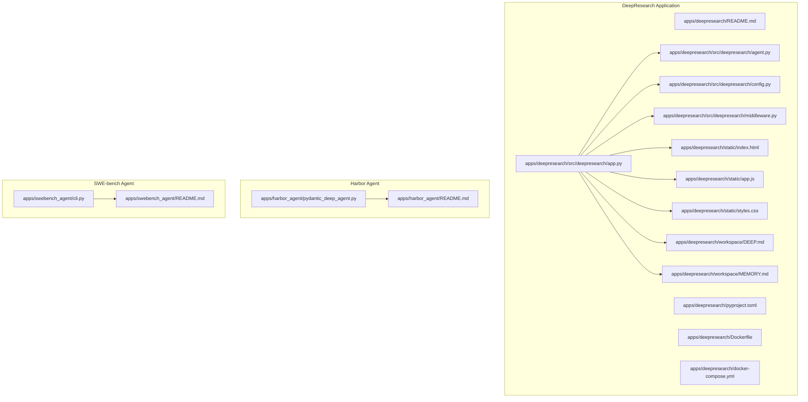
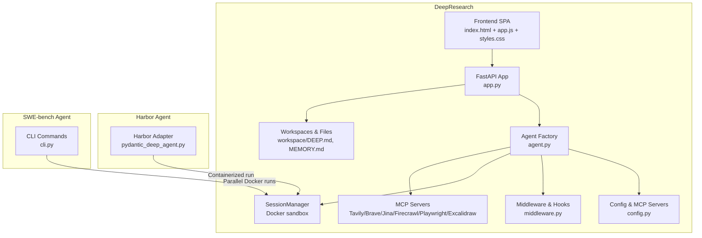
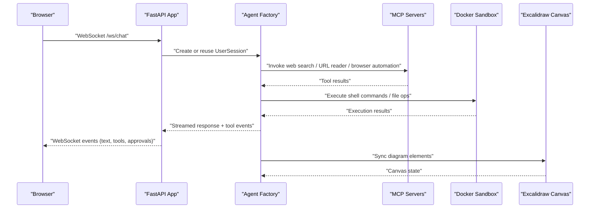
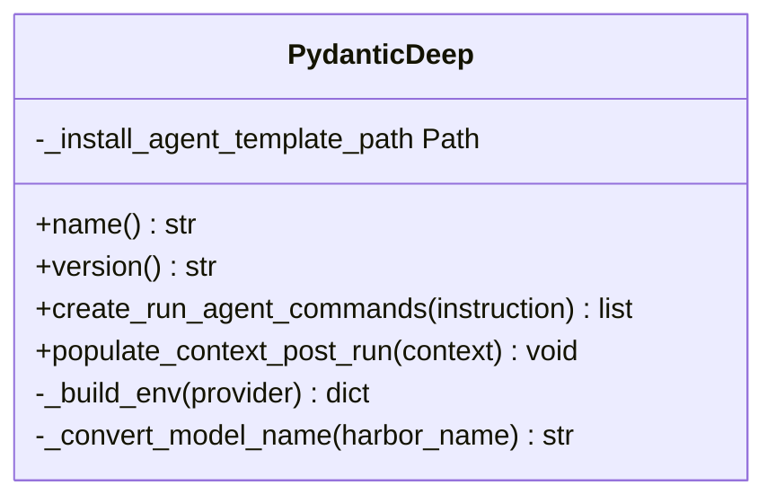
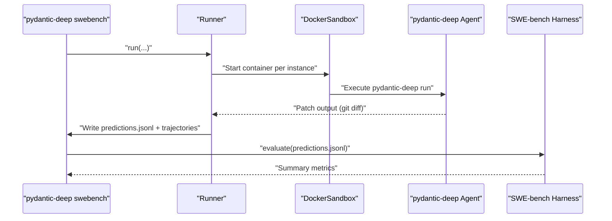
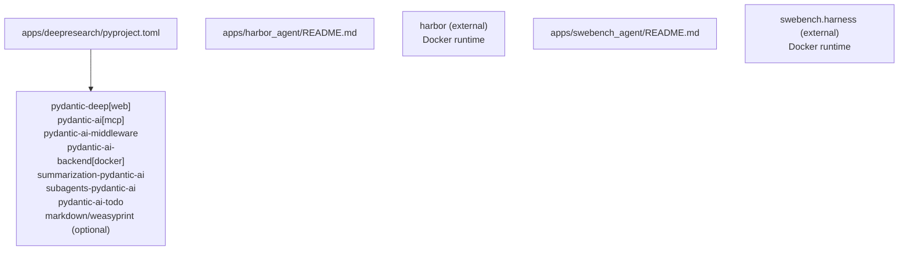

# Reference Applications

<cite>
**Referenced Files in This Document**
- [apps/deepresearch/README.md](file://apps/deepresearch/README.md)
- [apps/deepresearch/pyproject.toml](file://apps/deepresearch/pyproject.toml)
- [apps/deepresearch/Dockerfile](file://apps/deepresearch/Dockerfile)
- [apps/deepresearch/docker-compose.yml](file://apps/deepresearch/docker-compose.yml)
- [apps/deepresearch/src/deepresearch/app.py](file://apps/deepresearch/src/deepresearch/app.py)
- [apps/deepresearch/src/deepresearch/agent.py](file://apps/deepresearch/src/deepresearch/agent.py)
- [apps/deepresearch/src/deepresearch/config.py](file://apps/deepresearch/src/deepresearch/config.py)
- [apps/deepresearch/src/deepresearch/middleware.py](file://apps/deepresearch/src/deepresearch/middleware.py)
- [apps/deepresearch/static/index.html](file://apps/deepresearch/static/index.html)
- [apps/deepresearch/static/app.js](file://apps/deepresearch/static/app.js)
- [apps/deepresearch/static/styles.css](file://apps/deepresearch/static/styles.css)
- [apps/deepresearch/workspace/DEEP.md](file://apps/deepresearch/workspace/DEEP.md)
- [apps/deepresearch/workspace/MEMORY.md](file://apps/deepresearch/workspace/MEMORY.md)
- [apps/harbor_agent/README.md](file://apps/harbor_agent/README.md)
- [apps/harbor_agent/pydantic_deep_agent.py](file://apps/harbor_agent/pydantic_deep_agent.py)
- [apps/swebench_agent/README.md](file://apps/swebench_agent/README.md)
- [apps/swebench_agent/cli.py](file://apps/swebench_agent/cli.py)
</cite>

## Table of Contents
1. [Introduction](#introduction)
2. [Project Structure](#project-structure)
3. [Core Components](#core-components)
4. [Architecture Overview](#architecture-overview)
5. [Detailed Component Analysis](#detailed-component-analysis)
6. [Dependency Analysis](#dependency-analysis)
7. [Performance Considerations](#performance-considerations)
8. [Troubleshooting Guide](#troubleshooting-guide)
9. [Conclusion](#conclusion)
10. [Appendices](#appendices)

## Introduction
This document presents three complete reference applications built with Pydantic Deep Agents:
- DeepResearch: a web-based autonomous research agent with a GUI, web search, diagram generation, and sandboxed execution.
- Harbor Agent: a container-based adapter for running pydantic-deep on Terminal-Bench via Harbor.
- SWE-bench Agent: a CLI-based evaluator for SWE-bench, enabling reproducible benchmarking and evaluation.

Each application demonstrates robust patterns for agent orchestration, tool integration, middleware, and deployment, with practical guidance for setup, configuration, deployment, and customization.

## Project Structure
The repository organizes each application under apps/<application_name>, with shared libraries and examples elsewhere. The DeepResearch application includes a FastAPI backend, a modern single-page frontend, and a Docker-based sandbox runtime. Harbor Agent integrates with Harbor’s containerized evaluation framework. SWE-bench Agent provides CLI commands for dataset orchestration and evaluation.

**Diagram sources**
- [apps/deepresearch/src/deepresearch/app.py:636-692](file://apps/deepresearch/src/deepresearch/app.py#L636-L692)
- [apps/deepresearch/src/deepresearch/agent.py:376-430](file://apps/deepresearch/src/deepresearch/agent.py#L376-L430)
- [apps/deepresearch/src/deepresearch/config.py:58-152](file://apps/deepresearch/src/deepresearch/config.py#L58-L152)
- [apps/deepresearch/src/deepresearch/middleware.py:33-122](file://apps/deepresearch/src/deepresearch/middleware.py#L33-L122)
- [apps/deepresearch/static/index.html:1-176](file://apps/deepresearch/static/index.html#L1-L176)
- [apps/deepresearch/static/app.js:1-120](file://apps/deepresearch/static/app.js#L1-L120)
- [apps/deepresearch/static/styles.css:1-120](file://apps/deepresearch/static/styles.css#L1-L120)
- [apps/deepresearch/workspace/DEEP.md:1-12](file://apps/deepresearch/workspace/DEEP.md#L1-L12)
- [apps/deepresearch/workspace/MEMORY.md:1-4](file://apps/deepresearch/workspace/MEMORY.md#L1-L4)
- [apps/harbor_agent/pydantic_deep_agent.py:33-184](file://apps/harbor_agent/pydantic_deep_agent.py#L33-L184)
- [apps/swebench_agent/cli.py:23-271](file://apps/swebench_agent/cli.py#L23-L271)

**Section sources**
- [apps/deepresearch/README.md:158-183](file://apps/deepresearch/README.md#L158-L183)
- [apps/deepresearch/pyproject.toml:1-37](file://apps/deepresearch/pyproject.toml#L1-L37)
- [apps/deepresearch/Dockerfile:1-48](file://apps/deepresearch/Dockerfile#L1-L48)
- [apps/deepresearch/docker-compose.yml:1-29](file://apps/deepresearch/docker-compose.yml#L1-L29)

## Core Components
- DeepResearch FastAPI server and WebSocket streaming chat pipeline, with per-user session isolation and sandboxed execution.
- Agent factory with hooks, middleware, skills, subagents, teams, and checkpointing.
- MCP server integrations for web search, URL reading, browser automation, and Excalidraw diagrams.
- Frontend SPA with real-time streaming, file preview, task progress, and Excalidraw canvas integration.
- Harbor Agent adapter implementing BaseInstalledAgent for containerized evaluation on Terminal-Bench.
- SWE-bench CLI orchestrating dataset loading, parallel execution, Docker sandboxing, and evaluation harness.

**Section sources**
- [apps/deepresearch/src/deepresearch/app.py:636-692](file://apps/deepresearch/src/deepresearch/app.py#L636-L692)
- [apps/deepresearch/src/deepresearch/agent.py:376-430](file://apps/deepresearch/src/deepresearch/agent.py#L376-L430)
- [apps/deepresearch/src/deepresearch/config.py:58-152](file://apps/deepresearch/src/deepresearch/config.py#L58-L152)
- [apps/deepresearch/static/app.js:295-423](file://apps/deepresearch/static/app.js#L295-L423)
- [apps/harbor_agent/pydantic_deep_agent.py:33-184](file://apps/harbor_agent/pydantic_deep_agent.py#L33-L184)
- [apps/swebench_agent/cli.py:23-143](file://apps/swebench_agent/cli.py#L23-L143)

## Architecture Overview
The applications leverage a layered architecture:
- Backend services (FastAPI) expose REST and WebSocket endpoints.
- Agent orchestration integrates with pydantic-deep and pydantic-ai toolsets.
- MCP servers provide modular tool integrations (web search, browser automation, diagrams).
- Sandbox runtime (Docker) isolates file operations and code execution.
- Frontend SPA consumes WebSocket streams and renders rich UI experiences.

**Diagram sources**
- [apps/deepresearch/src/deepresearch/app.py:636-692](file://apps/deepresearch/src/deepresearch/app.py#L636-L692)
- [apps/deepresearch/src/deepresearch/agent.py:376-430](file://apps/deepresearch/src/deepresearch/agent.py#L376-L430)
- [apps/deepresearch/src/deepresearch/config.py:58-152](file://apps/deepresearch/src/deepresearch/config.py#L58-L152)
- [apps/deepresearch/src/deepresearch/middleware.py:33-122](file://apps/deepresearch/src/deepresearch/middleware.py#L33-L122)
- [apps/deepresearch/workspace/DEEP.md:1-12](file://apps/deepresearch/workspace/DEEP.md#L1-L12)
- [apps/deepresearch/workspace/MEMORY.md:1-4](file://apps/deepresearch/workspace/MEMORY.md#L1-L4)
- [apps/harbor_agent/pydantic_deep_agent.py:33-184](file://apps/harbor_agent/pydantic_deep_agent.py#L33-L184)
- [apps/swebench_agent/cli.py:23-143](file://apps/swebench_agent/cli.py#L23-L143)

## Detailed Component Analysis

### DeepResearch Web Application
DeepResearch provides a full-featured research agent with:
- Web search via MCP servers (Tavily, Brave, Jina, Firecrawl).
- Browser automation with Playwright MCP.
- File operations and code execution in Docker sandboxes.
- Subagents, teams, skills, plan mode, checkpoints, and Excalidraw diagrams.
- Real-time WebSocket streaming and a modern dark-themed UI.

Key implementation highlights:
- FastAPI lifecycle initializes agent, MCP servers, and SessionManager.
- WebSocket endpoint streams model responses, tool calls, and UI events.
- Frontend renders streaming text, tool cards, file previews, and Excalidraw canvas.
- Middleware and hooks enforce permissions and audit tool usage.
- Sessions persist history, todos, and canvas state per user.

**Diagram sources**
- [apps/deepresearch/src/deepresearch/app.py:719-800](file://apps/deepresearch/src/deepresearch/app.py#L719-L800)
- [apps/deepresearch/src/deepresearch/agent.py:376-430](file://apps/deepresearch/src/deepresearch/agent.py#L376-L430)
- [apps/deepresearch/src/deepresearch/config.py:58-152](file://apps/deepresearch/src/deepresearch/config.py#L58-L152)
- [apps/deepresearch/src/deepresearch/middleware.py:33-122](file://apps/deepresearch/src/deepresearch/middleware.py#L33-L122)

**Section sources**
- [apps/deepresearch/README.md:12-83](file://apps/deepresearch/README.md#L12-L83)
- [apps/deepresearch/src/deepresearch/app.py:636-692](file://apps/deepresearch/src/deepresearch/app.py#L636-L692)
- [apps/deepresearch/src/deepresearch/app.py:719-800](file://apps/deepresearch/src/deepresearch/app.py#L719-L800)
- [apps/deepresearch/src/deepresearch/agent.py:376-430](file://apps/deepresearch/src/deepresearch/agent.py#L376-L430)
- [apps/deepresearch/src/deepresearch/config.py:58-152](file://apps/deepresearch/src/deepresearch/config.py#L58-L152)
- [apps/deepresearch/src/deepresearch/middleware.py:33-122](file://apps/deepresearch/src/deepresearch/middleware.py#L33-L122)
- [apps/deepresearch/static/index.html:1-176](file://apps/deepresearch/static/index.html#L1-L176)
- [apps/deepresearch/static/app.js:1-120](file://apps/deepresearch/static/app.js#L1-L120)
- [apps/deepresearch/static/styles.css:1-120](file://apps/deepresearch/static/styles.css#L1-L120)
- [apps/deepresearch/workspace/DEEP.md:1-12](file://apps/deepresearch/workspace/DEEP.md#L1-L12)
- [apps/deepresearch/workspace/MEMORY.md:1-4](file://apps/deepresearch/workspace/MEMORY.md#L1-L4)

### Harbor Agent for Terminal-Bench
Harbor Agent adapts pydantic-deep CLI for containerized evaluation on Terminal-Bench via Harbor:
- Implements BaseInstalledAgent to run pydantic-deep inside Harbor-managed containers.
- Installs pydantic-deep with uv and executes pydantic-deep run with configured model and environment.
- Supports multiple providers and collects cost metrics from agent logs.

**Diagram sources**
- [apps/harbor_agent/pydantic_deep_agent.py:33-184](file://apps/harbor_agent/pydantic_deep_agent.py#L33-L184)

**Section sources**
- [apps/harbor_agent/README.md:1-104](file://apps/harbor_agent/README.md#L1-L104)
- [apps/harbor_agent/pydantic_deep_agent.py:33-184](file://apps/harbor_agent/pydantic_deep_agent.py#L33-L184)

### SWE-bench Agent for Benchmarking
SWE-bench Agent provides CLI commands to:
- Load datasets (HuggingFace), run instances in Docker sandboxes, and collect predictions.
- Evaluate predictions against the SWE-bench harness with configurable parallelism and timeouts.
- Auto-configure reasoning modes per provider.

**Diagram sources**
- [apps/swebench_agent/cli.py:23-143](file://apps/swebench_agent/cli.py#L23-L143)
- [apps/swebench_agent/cli.py:210-271](file://apps/swebench_agent/cli.py#L210-L271)

**Section sources**
- [apps/swebench_agent/README.md:1-130](file://apps/swebench_agent/README.md#L1-L130)
- [apps/swebench_agent/cli.py:23-143](file://apps/swebench_agent/cli.py#L23-L143)
- [apps/swebench_agent/cli.py:210-271](file://apps/swebench_agent/cli.py#L210-L271)

## Dependency Analysis
DeepResearch declares optional dependencies for export and editable development links to related packages. Harbor Agent relies on Harbor’s installed agent interface and Docker runtime. SWE-bench Agent integrates with the SWE-bench harness for evaluation.

**Diagram sources**
- [apps/deepresearch/pyproject.toml:6-29](file://apps/deepresearch/pyproject.toml#L6-L29)
- [apps/harbor_agent/README.md:5-14](file://apps/harbor_agent/README.md#L5-L14)
- [apps/swebench_agent/README.md:3-6](file://apps/swebench_agent/README.md#L3-L6)

**Section sources**
- [apps/deepresearch/pyproject.toml:6-29](file://apps/deepresearch/pyproject.toml#L6-L29)
- [apps/harbor_agent/README.md:5-14](file://apps/harbor_agent/README.md#L5-L14)
- [apps/swebench_agent/README.md:3-6](file://apps/swebench_agent/README.md#L3-L6)

## Performance Considerations
- WebSocket streaming minimizes latency for UI updates and tool call visibility.
- MCP server selection is dynamic based on environment variables; disabling problematic servers improves resilience.
- Docker-based sandboxing ensures isolation and resource control for file operations and code execution.
- Frontend rendering optimizes long lists and collapses repetitive tool calls to reduce DOM overhead.
- SWE-bench Agent supports parallel execution with worker limits and timeouts to balance throughput and resource usage.

[No sources needed since this section provides general guidance]

## Troubleshooting Guide
Common issues and resolutions:
- MCP server startup failures: The application detects failing servers and retries without them, logging the failed prefixes to aid diagnosis.
- Docker availability: Excalidraw MCP server requires Docker; if unavailable, the server is skipped with a warning.
- PermissionMiddleware blocks sensitive paths: Prevents access to protected system locations and private files.
- Frontend connectivity: WebSocket reconnection attempts with exponential backoff; verify network and CORS settings.
- SWE-bench evaluation: Ensure the SWE-bench harness is installed and reachable; adjust cache levels and timeouts as needed.

**Section sources**
- [apps/deepresearch/src/deepresearch/app.py:604-630](file://apps/deepresearch/src/deepresearch/app.py#L604-L630)
- [apps/deepresearch/src/deepresearch/config.py:43-56](file://apps/deepresearch/src/deepresearch/config.py#L43-L56)
- [apps/deepresearch/src/deepresearch/middleware.py:77-122](file://apps/deepresearch/src/deepresearch/middleware.py#L77-L122)
- [apps/deepresearch/static/app.js:74-105](file://apps/deepresearch/static/app.js#L74-L105)
- [apps/swebench_agent/cli.py:248-271](file://apps/swebench_agent/cli.py#L248-L271)

## Conclusion
These reference applications showcase how to build production-ready agent systems with Pydantic Deep Agents:
- DeepResearch demonstrates a modern web UI, robust tool integrations, sandboxed execution, and collaborative features.
- Harbor Agent enables scalable, containerized evaluation on standardized benchmarks.
- SWE-bench Agent automates reproducible benchmarking with Docker isolation and evaluation harness integration.

They provide a strong foundation for customization, extension, and deployment across diverse use cases.

[No sources needed since this section summarizes without analyzing specific files]

## Appendices

### Setup and Configuration Guides
- DeepResearch
  - Prerequisites: Python 3.12+, uv, Node.js 20+, Docker, API keys for search providers.
  - Quick start: Install dependencies, configure environment variables, start Excalidraw canvas, run the application.
  - Optional export support: Enable markdown and WeasyPrint extras.
  - Environment variables: MODEL_NAME, TAVILY_API_KEY, BRAVE_API_KEY, JINA_API_KEY, FIRECRAWL_API_KEY, PLAYWRIGHT_MCP, EXCALIDRAW_ENABLED, EXCALIDRAW_SERVER_URL, EXCALIDRAW_CANVAS_URL.
  - MCP servers: Tavily, Brave, Jina, Firecrawl, Playwright, Excalidraw (optional).
  - Docker and docker-compose: Excalidraw canvas service and optional application service.
- Harbor Agent
  - Install Harbor, ensure Docker is running, set API keys, run pydantic-deep on Terminal-Bench with parallel execution.
- SWE-bench Agent
  - Install dependencies, run instances with Docker sandbox, evaluate results with the SWE-bench harness.

**Section sources**
- [apps/deepresearch/README.md:12-98](file://apps/deepresearch/README.md#L12-L98)
- [apps/deepresearch/README.md:100-157](file://apps/deepresearch/README.md#L100-L157)
- [apps/deepresearch/Dockerfile:1-48](file://apps/deepresearch/Dockerfile#L1-L48)
- [apps/deepresearch/docker-compose.yml:1-29](file://apps/deepresearch/docker-compose.yml#L1-L29)
- [apps/harbor_agent/README.md:5-53](file://apps/harbor_agent/README.md#L5-L53)
- [apps/swebench_agent/README.md:7-31](file://apps/swebench_agent/README.md#L7-L31)

### Deployment Strategies
- DeepResearch
  - Local development: uv sync, native run, optional Excalidraw via docker-compose.
  - Containerized deployment: Build image with PyPI dependencies, expose port 8080, mount Docker socket for sandbox.
  - docker-compose: Run Excalidraw canvas and optionally the application service.
- Harbor Agent
  - Run pydantic-deep on Terminal-Bench via Harbor with model selection and parallel workers.
- SWE-bench Agent
  - Run instances with Docker images, manage timeouts and parallelism, evaluate with the harness.

**Section sources**
- [apps/deepresearch/README.md:209-224](file://apps/deepresearch/README.md#L209-L224)
- [apps/deepresearch/Dockerfile:20-48](file://apps/deepresearch/Dockerfile#L20-L48)
- [apps/deepresearch/docker-compose.yml:8-25](file://apps/deepresearch/docker-compose.yml#L8-L25)
- [apps/harbor_agent/README.md:16-53](file://apps/harbor_agent/README.md#L16-L53)
- [apps/swebench_agent/README.md:7-31](file://apps/swebench_agent/README.md#L7-L31)

### Customization Guidelines
- Extend agent capabilities by adding skills, subagents, and toolsets.
- Integrate additional MCP servers by adding environment variables and updating configuration.
- Customize frontend UI by modifying templates and styles.
- Adapt Harbor Agent for other benchmarks by adjusting the installed agent interface and container scripts.
- Tune SWE-bench Agent parameters (workers, timeouts, reasoning) for different environments.

**Section sources**
- [apps/deepresearch/src/deepresearch/agent.py:271-338](file://apps/deepresearch/src/deepresearch/agent.py#L271-L338)
- [apps/deepresearch/src/deepresearch/config.py:58-152](file://apps/deepresearch/src/deepresearch/config.py#L58-L152)
- [apps/deepresearch/static/index.html:1-176](file://apps/deepresearch/static/index.html#L1-L176)
- [apps/deepresearch/static/styles.css:1-120](file://apps/deepresearch/static/styles.css#L1-L120)
- [apps/harbor_agent/pydantic_deep_agent.py:33-184](file://apps/harbor_agent/pydantic_deep_agent.py#L33-L184)
- [apps/swebench_agent/cli.py:23-143](file://apps/swebench_agent/cli.py#L23-L143)