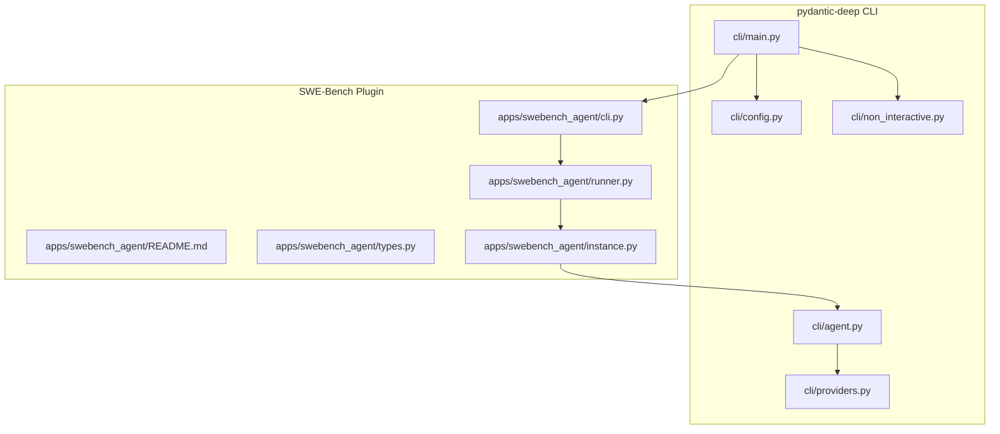
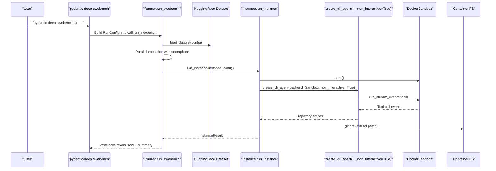
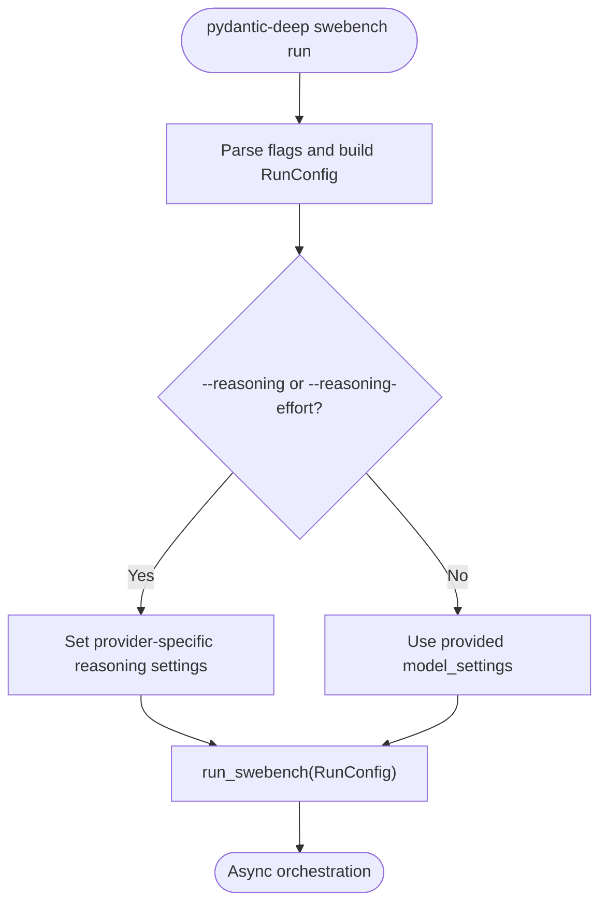
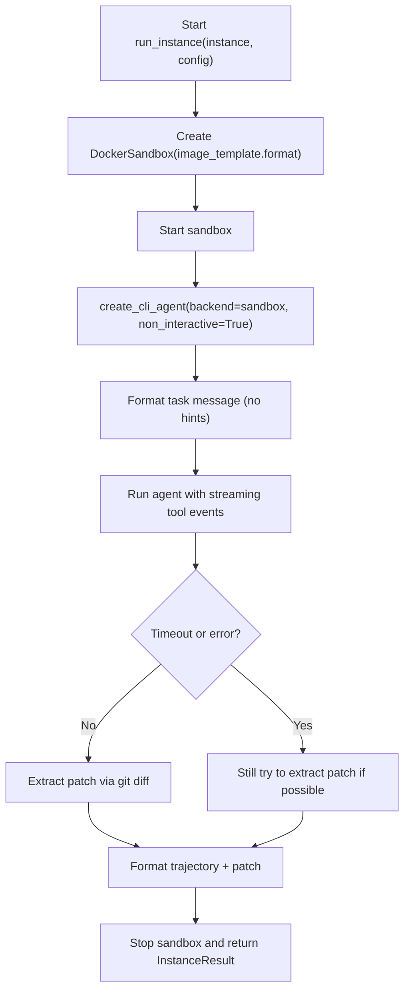
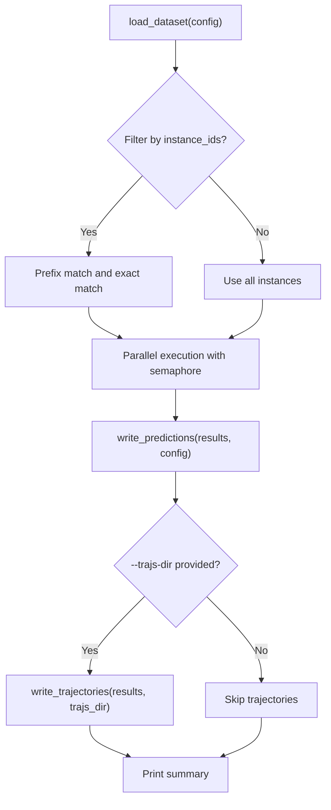
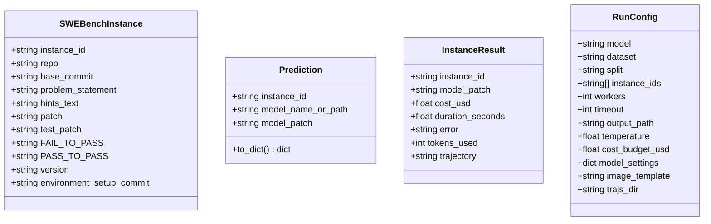
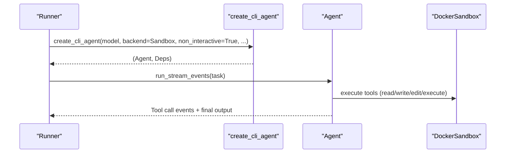
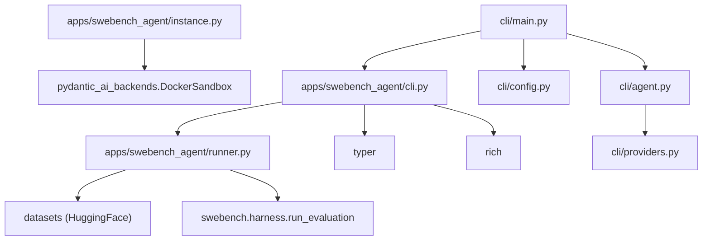

# SWE-Bench Agent

<cite>
**Referenced Files in This Document**
- [README.md](file://README.md)
- [pyproject.toml](file://pyproject.toml)
- [cli/main.py](file://cli/main.py)
- [cli/config.py](file://cli/config.py)
- [cli/agent.py](file://cli/agent.py)
- [cli/non_interactive.py](file://cli/non_interactive.py)
- [cli/providers.py](file://cli/providers.py)
- [apps/swebench_agent/README.md](file://apps/swebench_agent/README.md)
- [apps/swebench_agent/cli.py](file://apps/swebench_agent/cli.py)
- [apps/swebench_agent/instance.py](file://apps/swebench_agent/instance.py)
- [apps/swebench_agent/runner.py](file://apps/swebench_agent/runner.py)
- [apps/swebench_agent/types.py](file://apps/swebench_agent/types.py)
</cite>

## Table of Contents
1. [Introduction](#introduction)
2. [Project Structure](#project-structure)
3. [Core Components](#core-components)
4. [Architecture Overview](#architecture-overview)
5. [Detailed Component Analysis](#detailed-component-analysis)
6. [Dependency Analysis](#dependency-analysis)
7. [Performance Considerations](#performance-considerations)
8. [Troubleshooting Guide](#troubleshooting-guide)
9. [Conclusion](#conclusion)
10. [Appendices](#appendices)

## Introduction
The SWE-Bench Agent is an evaluation framework integrated into the pydantic-deep CLI that automates solving real-world GitHub issues from popular Python repositories using an AI agent. It evaluates models on the SWE-bench Verified dataset by running a standardized agent inside Docker sandboxes, extracting generated patches, and producing structured predictions and trajectory logs for downstream evaluation.

Key goals:
- Provide a repeatable, reproducible benchmarking pipeline for code-fixing tasks.
- Support parallel execution, timeouts, and resource controls.
- Produce machine-readable predictions and human-readable trajectories for analysis.
- Integrate seamlessly with the broader pydantic-deep CLI and agent ecosystem.

## Project Structure
The SWE-Bench Agent is implemented as a CLI plugin under the pydantic-deep application. The core modules are organized as follows:
- CLI entry and routing: The main CLI registers the SWE-bench subcommands.
- SWE-bench plugin: Provides run, list, and evaluate commands, orchestration, and data models.
- Agent integration: Uses the same agent factory as the non-interactive CLI mode, configured for sandboxed environments.

**Diagram sources**
- [cli/main.py:494-496](file://cli/main.py#L494-L496)
- [apps/swebench_agent/cli.py:23-271](file://apps/swebench_agent/cli.py#L23-L271)
- [apps/swebench_agent/runner.py:183-286](file://apps/swebench_agent/runner.py#L183-L286)
- [apps/swebench_agent/instance.py:191-325](file://apps/swebench_agent/instance.py#L191-L325)
- [cli/agent.py:51-299](file://cli/agent.py#L51-L299)
- [cli/providers.py:25-152](file://cli/providers.py#L25-L152)
- [cli/config.py:96-110](file://cli/config.py#L96-L110)
- [cli/non_interactive.py:86-310](file://cli/non_interactive.py#L86-L310)

**Section sources**
- [README.md:252-288](file://README.md#L252-L288)
- [pyproject.toml:76-77](file://pyproject.toml#L76-L77)
- [apps/swebench_agent/README.md:1-130](file://apps/swebench_agent/README.md#L1-L130)

## Core Components
- CLI plugin: Adds the “swebench” subcommands to the pydantic-deep CLI.
- Runner: Loads the dataset, orchestrates parallel execution, writes predictions, and prints summaries.
- Instance executor: Runs the agent in a Docker sandbox, captures tool call traces, extracts patches, and formats trajectories.
- Data models: Defines typed structures for dataset rows, predictions, instance results, and run configuration.
- Agent factory: Reuses the same non-interactive agent configuration used by the CLI’s benchmark mode.

**Section sources**
- [apps/swebench_agent/cli.py:23-271](file://apps/swebench_agent/cli.py#L23-L271)
- [apps/swebench_agent/runner.py:14-286](file://apps/swebench_agent/runner.py#L14-L286)
- [apps/swebench_agent/instance.py:191-325](file://apps/swebench_agent/instance.py#L191-L325)
- [apps/swebench_agent/types.py:9-77](file://apps/swebench_agent/types.py#L9-L77)
- [cli/agent.py:51-299](file://cli/agent.py#L51-L299)

## Architecture Overview
The SWE-Bench Agent follows a straightforward pipeline:
- CLI parses flags and constructs a RunConfig.
- Runner loads the dataset and filters by instance IDs if provided.
- Runner executes instances in parallel with a bounded semaphore.
- For each instance, a Docker sandbox is started, the agent is created with non-interactive settings, and the agent runs against the formatted task message.
- The agent’s tool call stream is captured to produce a trajectory; a git diff extracts the patch.
- Results are written to JSONL and optionally to per-instance markdown files.

**Diagram sources**
- [apps/swebench_agent/cli.py:23-142](file://apps/swebench_agent/cli.py#L23-L142)
- [apps/swebench_agent/runner.py:183-286](file://apps/swebench_agent/runner.py#L183-L286)
- [apps/swebench_agent/runner.py:14-62](file://apps/swebench_agent/runner.py#L14-L62)
- [apps/swebench_agent/instance.py:191-325](file://apps/swebench_agent/instance.py#L191-L325)
- [cli/agent.py:51-299](file://cli/agent.py#L51-L299)

## Detailed Component Analysis

### CLI Interface
The SWE-bench CLI adds three commands:
- run: Executes the evaluation pipeline with configurable model, dataset, workers, timeout, and output.
- list: Lists available instances from the dataset, optionally filtered by repository.
- evaluate: Invokes the SWE-bench harness to compute metrics from predictions.

Key behaviors:
- run builds a RunConfig, auto-configures reasoning settings based on model provider, and starts the async runner.
- list loads the dataset and prints a grouped summary and optionally a truncated instance table.
- evaluate shells out to the SWE-bench harness with worker and timeout controls.

**Diagram sources**
- [apps/swebench_agent/cli.py:23-142](file://apps/swebench_agent/cli.py#L23-L142)

**Section sources**
- [apps/swebench_agent/cli.py:23-271](file://apps/swebench_agent/cli.py#L23-L271)
- [apps/swebench_agent/README.md:70-103](file://apps/swebench_agent/README.md#L70-L103)

### Instance Execution
Each instance runs inside a Docker sandbox:
- A sandbox is created from a template image and started with a working directory set to the container’s testbed.
- The agent is created with non-interactive mode and sandbox backend, disabling local context and enabling skills auto-discovery.
- The agent runs against a formatted task message; tool call events are streamed to capture a trajectory.
- After completion, a git diff is executed to extract the patch; the trajectory and patch are combined into a markdown document.
- Costs and durations are tracked; errors are handled gracefully with best-effort patch extraction.

**Diagram sources**
- [apps/swebench_agent/instance.py:191-325](file://apps/swebench_agent/instance.py#L191-L325)

**Section sources**
- [apps/swebench_agent/instance.py:191-325](file://apps/swebench_agent/instance.py#L191-L325)

### Runner Orchestration
The runner coordinates dataset loading, filtering, parallel execution, and result writing:
- load_dataset reads the HuggingFace dataset and converts rows to SWEBenchInstance objects, preserving metadata for reference.
- Filters instances by exact IDs or prefix matches.
- Executes instances with a bounded semaphore to control concurrency.
- Writes predictions to JSONL and optionally writes per-instance trajectory markdown files.
- Prints a summary table and per-instance details when appropriate.

**Diagram sources**
- [apps/swebench_agent/runner.py:14-62](file://apps/swebench_agent/runner.py#L14-L62)
- [apps/swebench_agent/runner.py:183-286](file://apps/swebench_agent/runner.py#L183-L286)

**Section sources**
- [apps/swebench_agent/runner.py:14-286](file://apps/swebench_agent/runner.py#L14-L286)

### Data Models and Types
The plugin defines typed data structures for consistent serialization and evaluation:
- SWEBenchInstance mirrors dataset columns and includes metadata for reference.
- Prediction is the JSONL output format expected by the SWE-bench harness.
- InstanceResult captures per-run outcomes, including patch, cost, duration, error, and trajectory.
- RunConfig encapsulates all runtime configuration including model, dataset, workers, timeout, and output paths.

**Diagram sources**
- [apps/swebench_agent/types.py:9-77](file://apps/swebench_agent/types.py#L9-L77)

**Section sources**
- [apps/swebench_agent/types.py:9-77](file://apps/swebench_agent/types.py#L9-L77)

### Agent Integration and Non-Interactive Mode
The SWE-Bench Agent reuses the same agent factory used by the CLI’s non-interactive benchmark mode:
- The agent is created with a sandbox backend, non-interactive mode, and disabled memory/plan/subagents features to reduce overhead.
- Local context is disabled because the container’s root does not reflect the host filesystem.
- Skills are auto-discovered from bundled skills, improving performance on benchmarks.
- Model settings include temperature and provider-specific reasoning toggles.

**Diagram sources**
- [cli/agent.py:51-299](file://cli/agent.py#L51-L299)
- [apps/swebench_agent/instance.py:232-241](file://apps/swebench_agent/instance.py#L232-L241)

**Section sources**
- [cli/agent.py:51-299](file://cli/agent.py#L51-L299)
- [apps/swebench_agent/instance.py:227-241](file://apps/swebench_agent/instance.py#L227-L241)

## Dependency Analysis
External dependencies and integrations:
- Datasets: HuggingFace datasets library for loading SWE-bench instances.
- SWE-bench harness: The evaluate command shells out to the SWE-bench harness for scoring.
- Docker backend: pydantic-ai-backends Docker sandbox for isolated execution.
- Provider libraries: Optional extras for various model providers; provider registry validates environment variables and suggests installs.
- CLI dependencies: Typer and Rich for CLI UX.

**Diagram sources**
- [apps/swebench_agent/cli.py:23-271](file://apps/swebench_agent/cli.py#L23-L271)
- [apps/swebench_agent/runner.py:14-286](file://apps/swebench_agent/runner.py#L14-L286)
- [apps/swebench_agent/instance.py:191-325](file://apps/swebench_agent/instance.py#L191-L325)
- [cli/main.py:494-496](file://cli/main.py#L494-L496)
- [cli/providers.py:25-152](file://cli/providers.py#L25-L152)
- [pyproject.toml:36-68](file://pyproject.toml#L36-L68)

**Section sources**
- [pyproject.toml:36-68](file://pyproject.toml#L36-L68)
- [apps/swebench_agent/README.md:69-103](file://apps/swebench_agent/README.md#L69-L103)

## Performance Considerations
- Concurrency: Use the workers flag to control parallelism; higher values increase throughput but require more CPU and memory.
- Timeouts: Configure per-instance timeout to prevent long-running agents from blocking the queue; adjust based on model latency and repository complexity.
- Cost control: Supply a cost budget to enforce spending limits during evaluation.
- Image selection: Choose between official and Epoch AI images; the latter are smaller and may reduce cold-start overhead.
- Output size: Trajectory files can grow large; consider disabling trajectory writes for large-scale runs.

[No sources needed since this section provides general guidance]

## Troubleshooting Guide
Common issues and resolutions:
- Provider configuration: Use the providers list/check commands to verify environment variables and required extras.
- Docker availability: Ensure Docker support is installed; otherwise, install the sandbox extra.
- Instance not found: Use the list command to discover available instances and filter by repository.
- Evaluation failures: The evaluate command shells out to the SWE-bench harness; check the harness logs and ensure the predictions file is valid JSONL.

**Section sources**
- [cli/providers.py:178-233](file://cli/providers.py#L178-L233)
- [apps/swebench_agent/cli.py:145-208](file://apps/swebench_agent/cli.py#L145-L208)
- [apps/swebench_agent/cli.py:210-270](file://apps/swebench_agent/cli.py#L210-L270)

## Conclusion
The SWE-Bench Agent integrates tightly with the pydantic-deep CLI to deliver a robust, reproducible evaluation pipeline for automated code fixing. By leveraging a standardized agent configuration, Docker sandboxing, and structured output formats, it enables researchers and practitioners to compare models, analyze trajectories, and assess performance across real-world GitHub issues. With configurable timeouts, parallelism, and cost controls, it is suitable for research, development, and production-quality assessments.

[No sources needed since this section summarizes without analyzing specific files]

## Appendices

### CLI Reference
- swebench run
  - Flags: model, dataset, split, instance, workers, timeout, output, temperature, cost-budget, verbose, image, trajs-dir, reasoning, reasoning-effort, model-settings
  - Behavior: Builds RunConfig, auto-configures reasoning, and runs the evaluation pipeline.
- swebench list
  - Flags: dataset, split, repo
  - Behavior: Loads dataset and prints a grouped summary and optionally a truncated instance table.
- swebench evaluate
  - Arguments: predictions
  - Flags: run-id, dataset, split, workers, timeout, cache-level
  - Behavior: Shells out to the SWE-bench harness to compute metrics.

**Section sources**
- [apps/swebench_agent/README.md:70-103](file://apps/swebench_agent/README.md#L70-L103)
- [apps/swebench_agent/cli.py:23-271](file://apps/swebench_agent/cli.py#L23-L271)

### Example Workflows
- Single instance evaluation:
  - Install dependencies with the swebench and sandbox extras.
  - Run a single instance with a specified model, reasoning mode, and timeout.
- Batch evaluation:
  - Select multiple instances or use the Verified dataset with a high worker count.
  - Save predictions to JSONL and trajectories to a directory for later inspection.
- Post-evaluation:
  - Use the evaluate command to compute metrics and summarize results.

**Section sources**
- [apps/swebench_agent/README.md:7-31](file://apps/swebench_agent/README.md#L7-L31)

### Extending the Agent
- Custom benchmarks:
  - Provide a dataset compatible with the loader and filter by instance IDs.
  - Adjust model settings and reasoning effort per provider.
- CI integration:
  - Use the evaluate command to compute metrics after running predictions.
  - Store artifacts (predictions and trajectories) for auditing and regression analysis.

**Section sources**
- [apps/swebench_agent/runner.py:14-62](file://apps/swebench_agent/runner.py#L14-L62)
- [apps/swebench_agent/cli.py:210-270](file://apps/swebench_agent/cli.py#L210-L270)