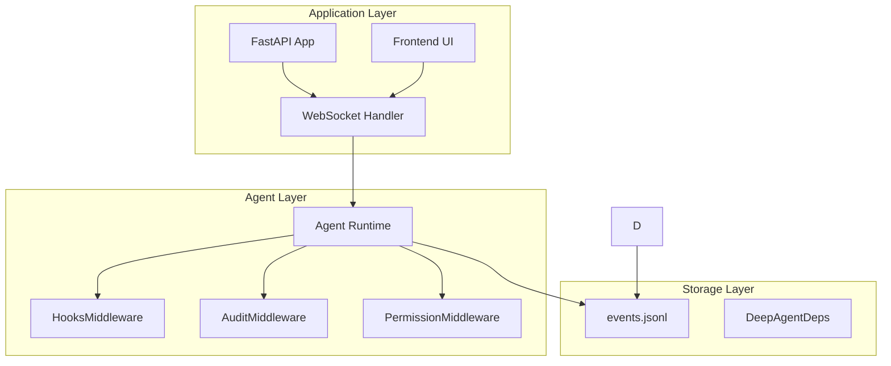
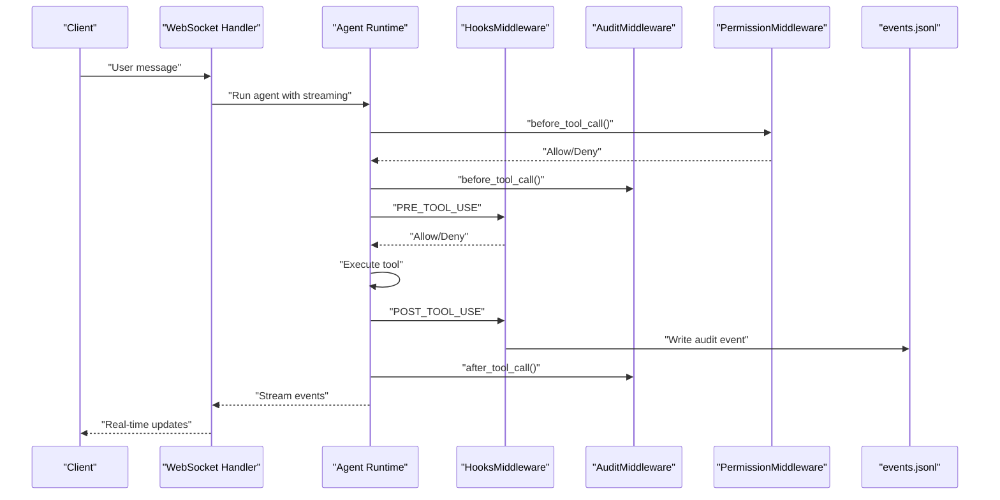
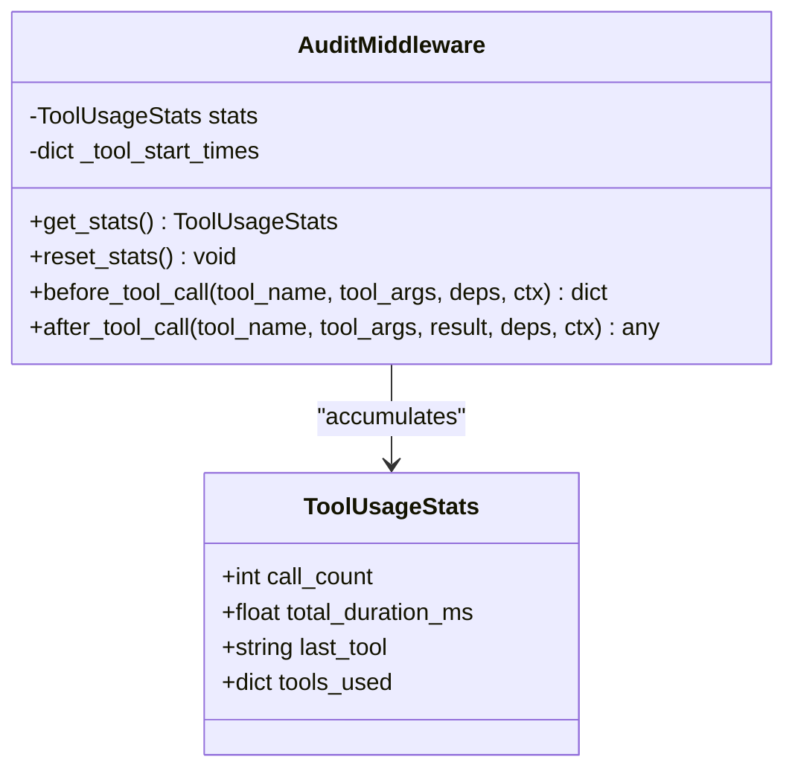
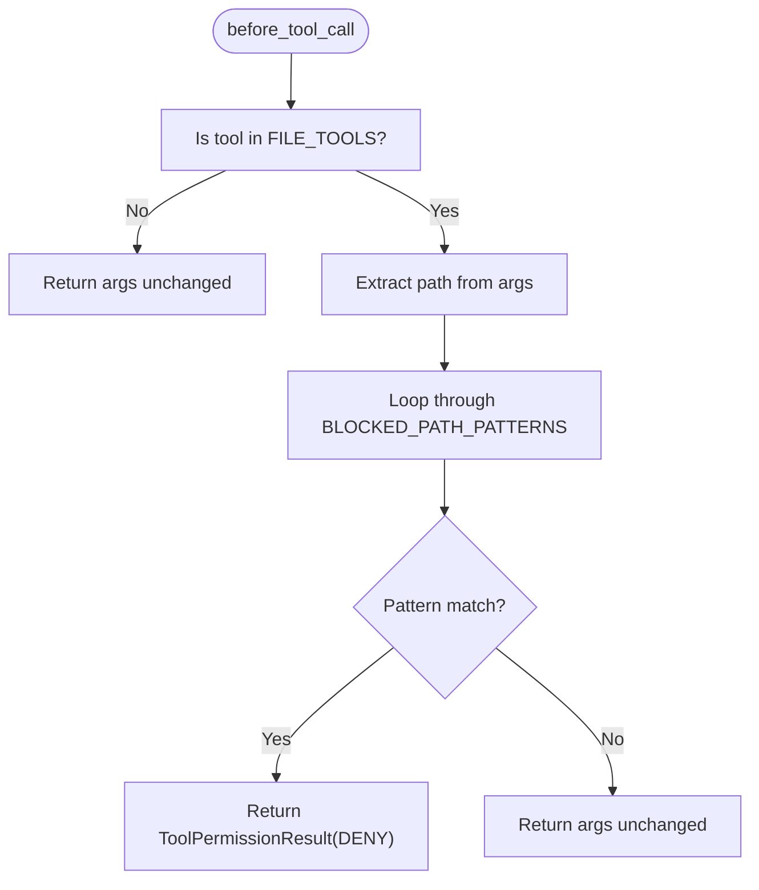
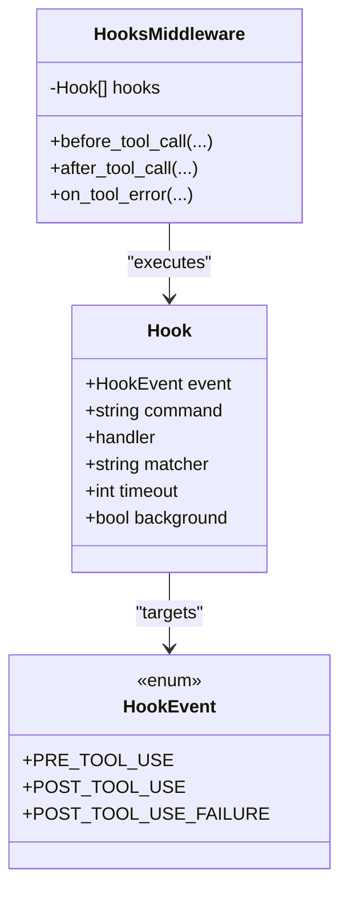
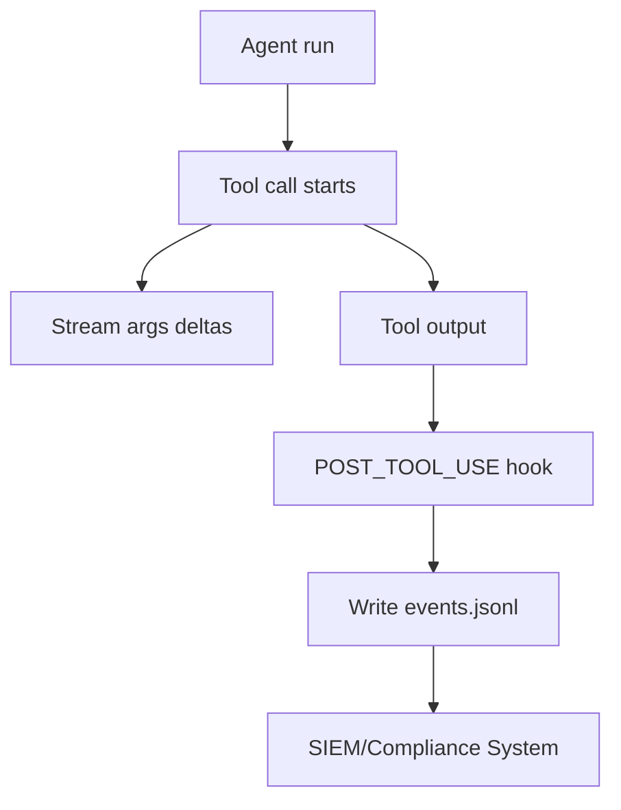
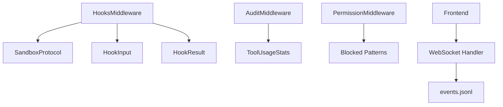

# Audit Logging and Compliance

<cite>
**Referenced Files in This Document**
- [audit_middleware.py](file://examples/full_app/audit_middleware.py)
- [hooks.py](file://pydantic_deep/middleware/hooks.py)
- [app.py](file://examples/full_app/app.py)
- [deps.py](file://pydantic_deep/deps.py)
- [types.py](file://pydantic_deep/types.py)
- [README.md](file://examples/full_app/README.md)
- [app.js](file://apps/deepresearch/static/app.js)
- [events.jsonl](file://apps/deepresearch/workspaces/a8a89093-f462-4963-badc-5e2844e8f52c/events.jsonl)
</cite>

## Table of Contents
1. [Introduction](#introduction)
2. [Project Structure](#project-structure)
3. [Core Components](#core-components)
4. [Architecture Overview](#architecture-overview)
5. [Detailed Component Analysis](#detailed-component-analysis)
6. [Dependency Analysis](#dependency-analysis)
7. [Performance Considerations](#performance-considerations)
8. [Troubleshooting Guide](#troubleshooting-guide)
9. [Conclusion](#conclusion)
10. [Appendices](#appendices)

## Introduction
This document explains how to implement comprehensive Audit Logging and Compliance features for security, regulatory, and operational purposes. It covers activity tracking, compliance data collection, compliance reporting, and integration with external audit systems. The repository provides concrete implementations of middleware-based auditing, lifecycle hooks for security gating, and streaming event logs suitable for audit trails. The guidance includes best practices for secure log management, data privacy considerations, compliance framework alignment, and automated compliance monitoring workflows.

## Project Structure
The audit and compliance features are implemented across three primary areas:
- Middleware-based auditing and permission enforcement
- Lifecycle hooks for pre/post tool execution and error handling
- Streaming event logs and frontend visualization for compliance dashboards

**Diagram sources**
- [app.py:776-800](file://examples/full_app/app.py#L776-L800)
- [hooks.py:243-373](file://pydantic_deep/middleware/hooks.py#L243-L373)
- [audit_middleware.py:34-140](file://examples/full_app/audit_middleware.py#L34-L140)
- [deps.py:18-50](file://pydantic_deep/deps.py#L18-L50)

**Section sources**
- [app.py:776-800](file://examples/full_app/app.py#L776-L800)
- [hooks.py:243-373](file://pydantic_deep/middleware/hooks.py#L243-L373)
- [audit_middleware.py:34-140](file://examples/full_app/audit_middleware.py#L34-L140)
- [deps.py:18-50](file://pydantic_deep/deps.py#L18-L50)

## Core Components
- AuditMiddleware: Tracks tool usage statistics (call count, duration, breakdown) and exposes them to the frontend for real-time visibility.
- PermissionMiddleware: Blocks access to sensitive paths and file operations that violate policy.
- HooksMiddleware: Executes pre/post tool lifecycle hooks with support for background audit logging and safety gating.
- Streaming Events: JSON Lines logs of tool calls, arguments, and outputs suitable for audit trails and compliance reporting.
- Frontend Timeline: Visualizes tool usage and compliance events for operators and auditors.

**Section sources**
- [audit_middleware.py:34-140](file://examples/full_app/audit_middleware.py#L34-L140)
- [hooks.py:243-373](file://pydantic_deep/middleware/hooks.py#L243-L373)
- [app.py:313-371](file://examples/full_app/app.py#L313-L371)
- [app.js:3111-3151](file://apps/deepresearch/static/app.js#L3111-L3151)

## Architecture Overview
The audit and compliance pipeline integrates middleware, hooks, and event streaming to produce a verifiable audit trail. The WebSocket handler streams events to the frontend, while hooks and middleware enforce security policies and record actions.

**Diagram sources**
- [app.py:776-800](file://examples/full_app/app.py#L776-L800)
- [hooks.py:259-331](file://pydantic_deep/middleware/hooks.py#L259-L331)
- [audit_middleware.py:54-83](file://examples/full_app/audit_middleware.py#L54-L83)
- [events.jsonl:62-74](file://apps/deepresearch/workspaces/a8a89093-f462-4963-badc-5e2844e8f52c/events.jsonl#L62-L74)

## Detailed Component Analysis

### AuditMiddleware
Purpose:
- Track tool usage statistics globally for the agent session.
- Expose stats to the frontend for real-time compliance monitoring.

Key behaviors:
- Records start time per tool call.
- Computes duration and accumulates totals.
- Maintains counts and breakdowns by tool name.
- Resets stats on demand (e.g., session reset).

**Diagram sources**
- [audit_middleware.py:24-83](file://examples/full_app/audit_middleware.py#L24-L83)

**Section sources**
- [audit_middleware.py:34-83](file://examples/full_app/audit_middleware.py#L34-L83)

### PermissionMiddleware
Purpose:
- Enforce path-based access control for file operations.
- Block sensitive paths and unsafe patterns.

Key behaviors:
- Matches file-related tools (read, write, edit, glob, grep).
- Scans tool arguments for blocked patterns (e.g., system paths, SSH keys).
- Returns denial with a reason when a match is detected.

**Diagram sources**
- [audit_middleware.py:104-139](file://examples/full_app/audit_middleware.py#L104-L139)

**Section sources**
- [audit_middleware.py:86-139](file://examples/full_app/audit_middleware.py#L86-L139)

### HooksMiddleware (Lifecycle Hooks)
Purpose:
- Execute pre/post tool lifecycle hooks with support for background audit logging and safety gating.

Key behaviors:
- PRE_TOOL_USE: Can deny tool execution; supports argument modification.
- POST_TOOL_USE: Can modify results; supports background execution.
- POST_TOOL_USE_FAILURE: Handles errors and can emit audit events.
- Supports both command hooks (via sandbox) and Python handler hooks.

**Diagram sources**
- [hooks.py:48-116](file://pydantic_deep/middleware/hooks.py#L48-L116)
- [hooks.py:243-373](file://pydantic_deep/middleware/hooks.py#L243-L373)

**Section sources**
- [hooks.py:243-373](file://pydantic_deep/middleware/hooks.py#L243-L373)
- [app.py:313-371](file://examples/full_app/app.py#L313-L371)

### Streaming Events and Compliance Reporting
Purpose:
- Provide a durable, searchable audit trail in JSON Lines format.
- Enable compliance reporting and external system integration.

Key behaviors:
- Events include tool name, argument deltas, timestamps, and streaming content.
- Suitable for SIEM ingestion, log aggregation, and compliance dashboards.
- Frontend timeline renders tool usage and compliance events.

**Diagram sources**
- [events.jsonl:62-74](file://apps/deepresearch/workspaces/a8a89093-f462-4963-badc-5e2844e8f52c/events.jsonl#L62-L74)
- [app.js:3111-3151](file://apps/deepresearch/static/app.js#L3111-L3151)

**Section sources**
- [events.jsonl:62-74](file://apps/deepresearch/workspaces/a8a89093-f462-4963-badc-5e2844e8f52c/events.jsonl#L62-L74)
- [app.js:3111-3151](file://apps/deepresearch/static/app.js#L3111-L3151)

### Compliance Data Collection and Retention
- Use events.jsonl as the canonical audit trail for compliance reporting.
- Implement retention policies aligned with regulatory requirements (e.g., 7 years for SOX, 5 years for PCI).
- Archive and compress historical events; maintain immutable copies for legal holds.

[No sources needed since this section provides general guidance]

### Integrating with External Audit Systems
- Stream events.jsonl to SIEM/log aggregation platforms (Splunk, ELK, QRadar).
- Export compliance reports from aggregated logs for internal/external audits.
- Use hook handlers to emit structured audit events with risk scoring and categorization.

[No sources needed since this section provides general guidance]

## Dependency Analysis
The audit and compliance features depend on:
- Agent middleware integration for tool lifecycle interception.
- Sandbox protocol for command hooks execution.
- Frontend WebSocket streaming for real-time compliance dashboards.

**Diagram sources**
- [hooks.py:226-233](file://pydantic_deep/middleware/hooks.py#L226-L233)
- [hooks.py:130-144](file://pydantic_deep/middleware/hooks.py#L130-L144)
- [audit_middleware.py:24-52](file://examples/full_app/audit_middleware.py#L24-L52)
- [app.py:776-800](file://examples/full_app/app.py#L776-L800)

**Section sources**
- [hooks.py:226-233](file://pydantic_deep/middleware/hooks.py#L226-L233)
- [audit_middleware.py:24-52](file://examples/full_app/audit_middleware.py#L24-L52)
- [app.py:776-800](file://examples/full_app/app.py#L776-L800)

## Performance Considerations
- Background hooks avoid blocking tool execution; ensure timeouts are configured appropriately.
- Prefer streaming JSON Lines over in-memory buffers for large-scale deployments.
- Use sliding window processors to manage conversation length and reduce storage overhead.
- Offload compliance reporting to scheduled jobs to minimize runtime impact.

[No sources needed since this section provides general guidance]

## Troubleshooting Guide
Common issues and resolutions:
- Hook execution failures: Inspect hook handler logs and ensure proper JSON parsing for command hooks.
- Permission denials: Verify blocked patterns and adjust for legitimate use cases.
- Audit stats not updating: Confirm middleware registration and session reset procedures.
- Frontend not showing compliance events: Check WebSocket connectivity and event stream format.

**Section sources**
- [hooks.py:214-224](file://pydantic_deep/middleware/hooks.py#L214-L224)
- [audit_middleware.py:49-52](file://examples/full_app/audit_middleware.py#L49-L52)
- [app.py:776-800](file://examples/full_app/app.py#L776-L800)

## Conclusion
The repository provides a robust foundation for Audit Logging and Compliance through middleware-based auditing, lifecycle hooks, and streaming event logs. By combining these components with secure log management, retention policies, and external system integration, organizations can achieve comprehensive audit trails for security, regulatory, and operational purposes.

[No sources needed since this section summarizes without analyzing specific files]

## Appendices

### Best Practices for Secure Log Management
- Minimize sensitive data in logs; redact PII and secrets.
- Use immutable storage and cryptographic hashing for integrity.
- Implement access controls and audit log rotation.
- Encrypt logs at rest and in transit.

[No sources needed since this section provides general guidance]

### Data Privacy Considerations
- Align logging with privacy frameworks (GDPR, CCPA).
- Provide user consent and opt-out mechanisms where applicable.
- Anonymize or pseudonymize personal data in audit trails.

[No sources needed since this section provides general guidance]

### Compliance Framework Alignment
- SOC 2: Use middleware and hooks to demonstrate segregation of duties and access controls.
- ISO 27001: Implement logging policies and continuous monitoring.
- HIPAA: Enforce strict access controls and encryption for protected health information.
- PCI DSS: Maintain audit trails for cardholder data and network access.

[No sources needed since this section provides general guidance]

### Automated Compliance Monitoring Workflows
- Define alert thresholds for unusual tool usage patterns.
- Integrate with SIEM for real-time anomaly detection.
- Schedule periodic compliance reports for management review.

[No sources needed since this section provides general guidance]