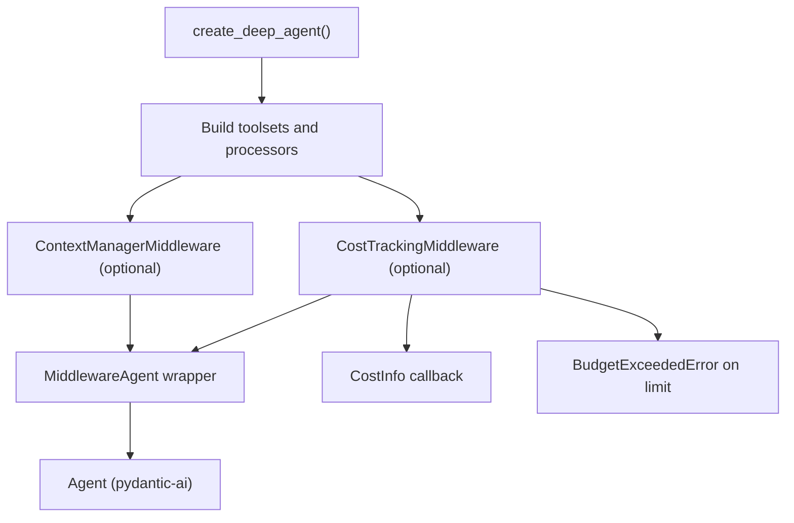
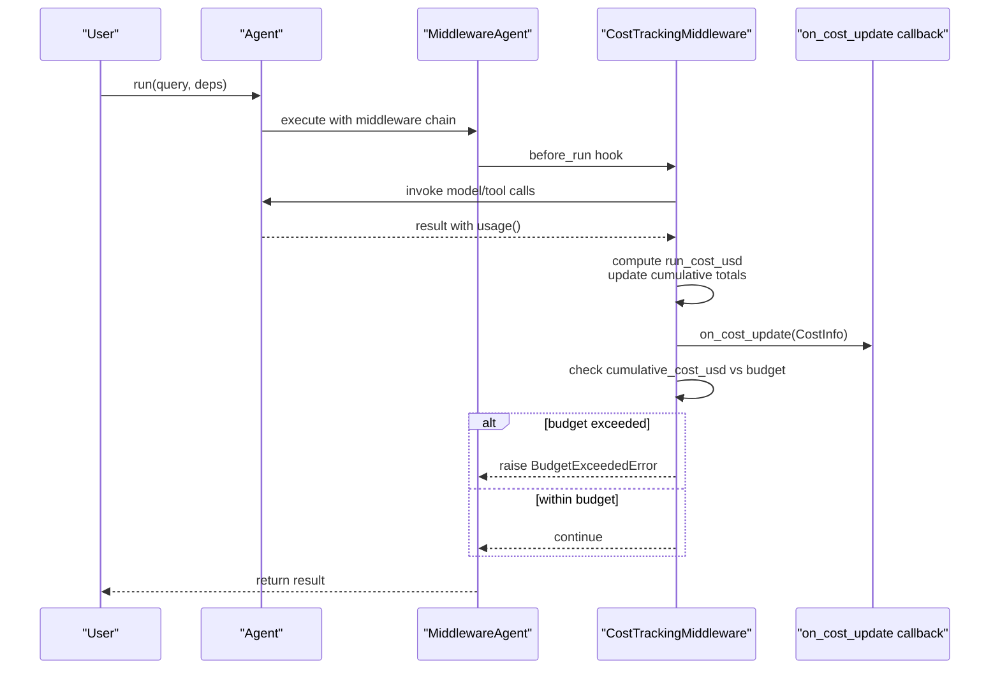
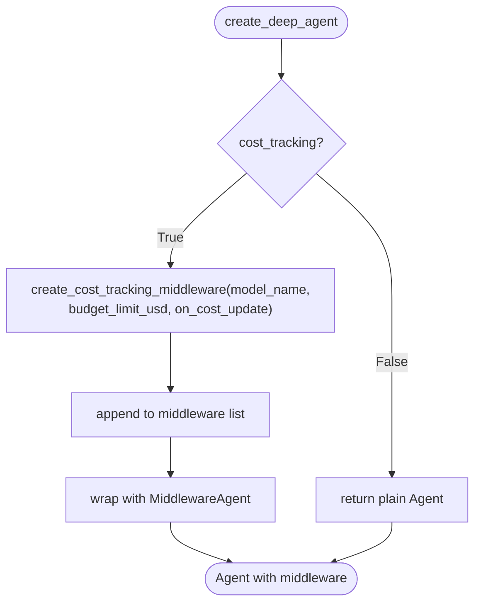
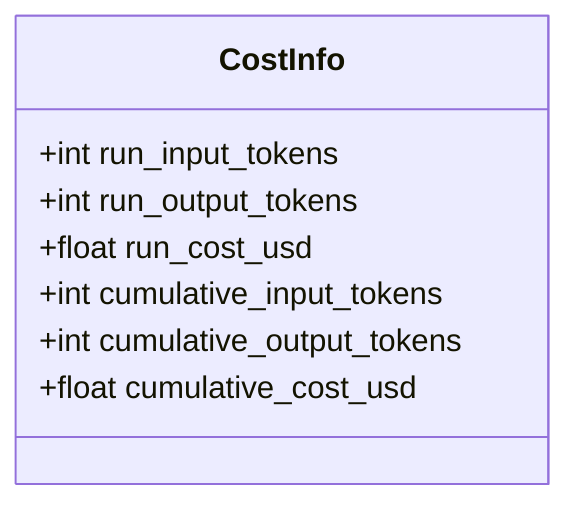
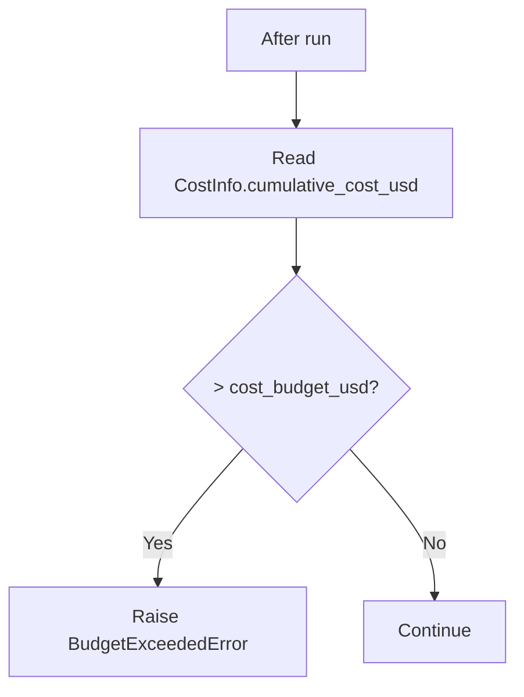
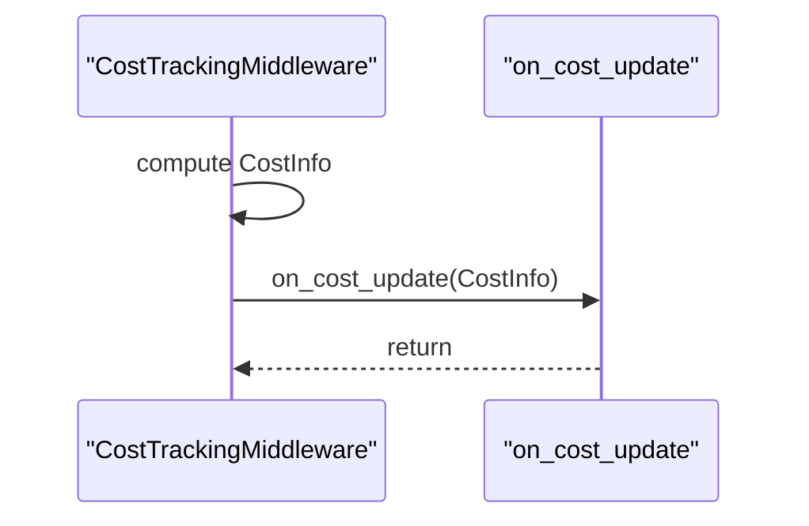
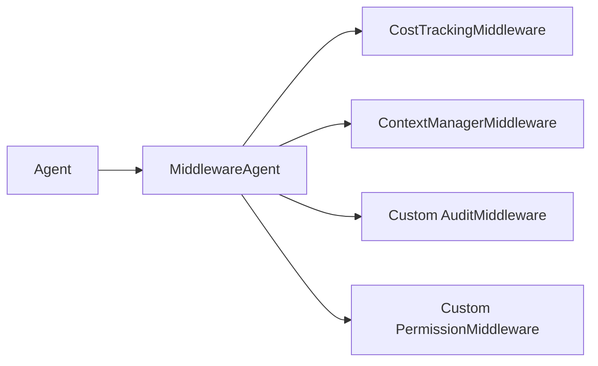
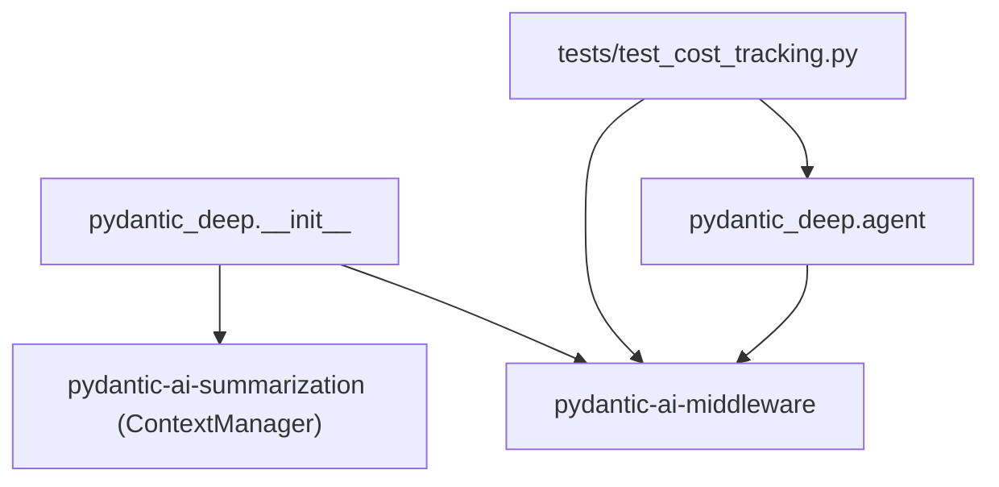

# Cost Tracking and Budgeting

<cite>
**Referenced Files in This Document**
- [cost-tracking.md](file://docs/advanced/cost-tracking.md)
- [test_cost_tracking.py](file://tests/test_cost_tracking.py)
- [__init__.py](file://pydantic_deep/__init__.py)
- [agent.py](file://pydantic_deep/agent.py)
- [middleware.py](file://apps/deepresearch/src/deepresearch/middleware.py)
- [audit_middleware.py](file://examples/full_app/audit_middleware.py)
- [deps.py](file://pydantic_deep/deps.py)
- [types.py](file://pydantic_deep/types.py)
</cite>

## Table of Contents
1. [Introduction](#introduction)
2. [Project Structure](#project-structure)
3. [Core Components](#core-components)
4. [Architecture Overview](#architecture-overview)
5. [Detailed Component Analysis](#detailed-component-analysis)
6. [Dependency Analysis](#dependency-analysis)
7. [Performance Considerations](#performance-considerations)
8. [Troubleshooting Guide](#troubleshooting-guide)
9. [Conclusion](#conclusion)
10. [Appendices](#appendices)

## Introduction
This document explains the Cost Tracking and Budgeting features in pydantic-deep. It covers how token usage and USD costs are tracked automatically, how budgets are configured and enforced, and how to integrate cost-aware behavior into agents. It also documents the middleware pipeline, budget enforcement mechanics, alerting via callbacks, and best practices for production deployments.

## Project Structure
The cost tracking system is implemented as part of the agent factory and middleware stack:
- The agent factory integrates CostTrackingMiddleware when enabled.
- Cost tracking relies on pydantic-ai-middleware and pricing data from genai-prices.
- Budget enforcement occurs when cumulative cost exceeds a configured USD limit.
- Real-time cost updates are exposed via a callback with CostInfo metrics.

**Diagram sources**
- [agent.py:797-935](file://pydantic_deep/agent.py#L797-L935)
- [__init__.py:71-94](file://pydantic_deep/__init__.py#L71-L94)

**Section sources**
- [agent.py:797-935](file://pydantic_deep/agent.py#L797-L935)
- [__init__.py:71-94](file://pydantic_deep/__init__.py#L71-L94)

## Core Components
- CostTrackingMiddleware: Tracks per-run and cumulative token usage and USD costs, invokes a callback with CostInfo, and enforces budget limits.
- CostInfo: Provides run-level and cumulative metrics (input/output tokens, run cost, cumulative totals).
- BudgetExceededError: Raised when cumulative cost exceeds the configured budget.
- MiddlewareAgent: Wraps the agent with middleware chain when cost tracking or other middleware is enabled.
- create_deep_agent parameters: cost_tracking, cost_budget_usd, on_cost_update.

Key behaviors:
- Cost tracking is enabled by default and requires the middleware extras.
- When cost_tracking is True, CostTrackingMiddleware is created and added to the middleware chain.
- If model is provided as a string, it is passed to the middleware for model-specific pricing.
- Budget enforcement compares cumulative_cost_usd against cost_budget_usd and raises BudgetExceededError on overflow.

**Section sources**
- [cost-tracking.md:1-85](file://docs/advanced/cost-tracking.md#L1-L85)
- [agent.py:797-807](file://pydantic_deep/agent.py#L797-L807)
- [agent.py:914-931](file://pydantic_deep/agent.py#L914-L931)
- [test_cost_tracking.py:29-132](file://tests/test_cost_tracking.py#L29-L132)

## Architecture Overview
The cost tracking pipeline integrates with the agent lifecycle:

**Diagram sources**
- [agent.py:797-807](file://pydantic_deep/agent.py#L797-L807)
- [agent.py:914-931](file://pydantic_deep/agent.py#L914-L931)
- [cost-tracking.md:72-78](file://docs/advanced/cost-tracking.md#L72-L78)

## Detailed Component Analysis

### CostTrackingMiddleware Integration
- Enabled by default via cost_tracking parameter in create_deep_agent.
- When cost_tracking is True, CostTrackingMiddleware is created with model_name (if model is a string), budget_limit_usd, and on_cost_update callback.
- The middleware is appended to the middleware list and wrapped by MiddlewareAgent.

**Diagram sources**
- [agent.py:797-807](file://pydantic_deep/agent.py#L797-L807)
- [agent.py:914-931](file://pydantic_deep/agent.py#L914-L931)

**Section sources**
- [agent.py:797-807](file://pydantic_deep/agent.py#L797-L807)
- [agent.py:914-931](file://pydantic_deep/agent.py#L914-L931)
- [test_cost_tracking.py:32-48](file://tests/test_cost_tracking.py#L32-L48)

### Cost Calculation and Metrics
- CostTrackingMiddleware reads result.usage() to obtain run input/output token counts.
- Costs are computed using model-specific pricing from genai-prices.
- CostInfo exposes:
  - run_input_tokens, run_output_tokens, run_cost_usd
  - cumulative_input_tokens, cumulative_output_tokens, cumulative_cost_usd

**Diagram sources**
- [cost-tracking.md:59-70](file://docs/advanced/cost-tracking.md#L59-L70)

**Section sources**
- [cost-tracking.md:59-70](file://docs/advanced/cost-tracking.md#L59-L70)

### Budget Enforcement Mechanism
- Budget is configured via cost_budget_usd.
- After each run, cumulative_cost_usd is compared to budget.
- If exceeded, subsequent runs raise BudgetExceededError.

**Diagram sources**
- [cost-tracking.md:72-78](file://docs/advanced/cost-tracking.md#L72-L78)

**Section sources**
- [cost-tracking.md:23-31](file://docs/advanced/cost-tracking.md#L23-L31)
- [cost-tracking.md:72-78](file://docs/advanced/cost-tracking.md#L72-L78)

### Cost Update Callback
- on_cost_update receives CostInfo after each run.
- Use it to log, alert, or trigger downstream actions.
- Tests confirm the callback is wired to the middleware and defaults to None.

**Diagram sources**
- [cost-tracking.md:33-49](file://docs/advanced/cost-tracking.md#L33-L49)
- [test_cost_tracking.py:58-73](file://tests/test_cost_tracking.py#L58-L73)

**Section sources**
- [cost-tracking.md:33-49](file://docs/advanced/cost-tracking.md#L33-L49)
- [test_cost_tracking.py:58-73](file://tests/test_cost_tracking.py#L58-L73)

### Middleware Integration Examples
- Cost tracking can coexist with other middleware (e.g., ContextManagerMiddleware, custom AuditMiddleware, PermissionMiddleware).
- When middleware list is provided or cost tracking is enabled, the agent is wrapped in MiddlewareAgent.

**Diagram sources**
- [agent.py:914-931](file://pydantic_deep/agent.py#L914-L931)
- [middleware.py:33-122](file://apps/deepresearch/src/deepresearch/middleware.py#L33-L122)
- [audit_middleware.py:34-140](file://examples/full_app/audit_middleware.py#L34-L140)

**Section sources**
- [agent.py:914-931](file://pydantic_deep/agent.py#L914-L931)
- [middleware.py:33-122](file://apps/deepresearch/src/deepresearch/middleware.py#L33-L122)
- [audit_middleware.py:34-140](file://examples/full_app/audit_middleware.py#L34-L140)

### Cost-Aware Agent Behavior
- Use cost_tracking to enable automatic tracking.
- Use cost_budget_usd to cap spending.
- Use on_cost_update to implement alerts or dashboards.
- Combine with ContextManagerMiddleware for token-aware context management.

Best practices:
- Always install the middleware extras to enable cost tracking.
- Set a conservative budget for initial deployments.
- Log CostInfo in on_cost_update to feed dashboards.
- Consider model_name propagation for accurate pricing when using string models.

**Section sources**
- [cost-tracking.md:11-21](file://docs/advanced/cost-tracking.md#L11-L21)
- [cost-tracking.md:23-31](file://docs/advanced/cost-tracking.md#L23-L31)
- [cost-tracking.md:33-49](file://docs/advanced/cost-tracking.md#L33-L49)
- [agent.py:364-374](file://pydantic_deep/agent.py#L364-L374)

## Dependency Analysis
- pydantic_deep exports CostTrackingMiddleware, CostInfo, CostCallback, BudgetExceededError, and create_cost_tracking_middleware from pydantic-ai-middleware.
- create_deep_agent conditionally creates and wraps CostTrackingMiddleware.
- Tests verify wiring of budget and callback to the middleware.

**Diagram sources**
- [__init__.py:71-94](file://pydantic_deep/__init__.py#L71-L94)
- [agent.py:797-807](file://pydantic_deep/agent.py#L797-L807)
- [test_cost_tracking.py:29-132](file://tests/test_cost_tracking.py#L29-L132)

**Section sources**
- [__init__.py:71-94](file://pydantic_deep/__init__.py#L71-L94)
- [test_cost_tracking.py:29-132](file://tests/test_cost_tracking.py#L29-L132)

## Performance Considerations
- Cost tracking adds minimal overhead by reading usage after runs.
- Using string model names enables precise pricing; non-string models default to None for model_name.
- Cumulative tracking scales with run count; consider periodic resets or archival for long-running agents.

[No sources needed since this section provides general guidance]

## Troubleshooting Guide
Common issues and resolutions:
- BudgetExceededError raised after a run indicates cumulative cost exceeded cost_budget_usd. Lower the budget or reduce model usage.
- on_cost_update not firing: ensure cost_tracking=True and the callback is passed correctly.
- No cost tracking visible: confirm middleware extras are installed and cost_tracking=True.

**Section sources**
- [cost-tracking.md:72-78](file://docs/advanced/cost-tracking.md#L72-L78)
- [test_cost_tracking.py:58-73](file://tests/test_cost_tracking.py#L58-L73)

## Conclusion
pydantic-deep’s cost tracking is enabled by default and integrates seamlessly with the middleware system. It provides accurate per-run and cumulative cost metrics, supports budget enforcement, and offers a callback for real-time monitoring. Combined with context management and custom middleware, it enables robust cost-aware agent behavior suitable for production environments.

[No sources needed since this section summarizes without analyzing specific files]

## Appendices

### API and Configuration Reference
- cost_tracking: bool, default True
- cost_budget_usd: float | None, default None (unlimited)
- on_cost_update: callable | None, default None

**Section sources**
- [cost-tracking.md:51-58](file://docs/advanced/cost-tracking.md#L51-L58)
- [agent.py:364-374](file://pydantic_deep/agent.py#L364-L374)

### CostInfo Fields Reference
- run_input_tokens, run_output_tokens, run_cost_usd
- cumulative_input_tokens, cumulative_output_tokens, cumulative_cost_usd

**Section sources**
- [cost-tracking.md:59-70](file://docs/advanced/cost-tracking.md#L59-L70)