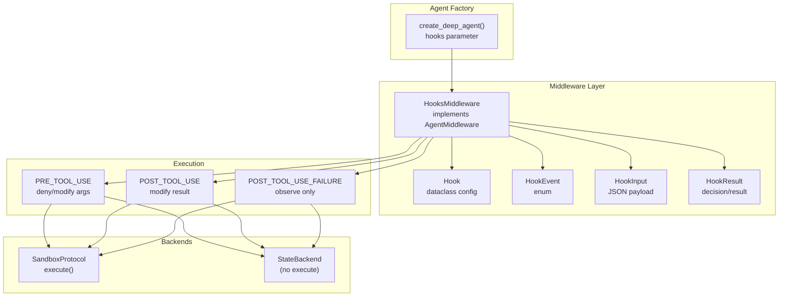
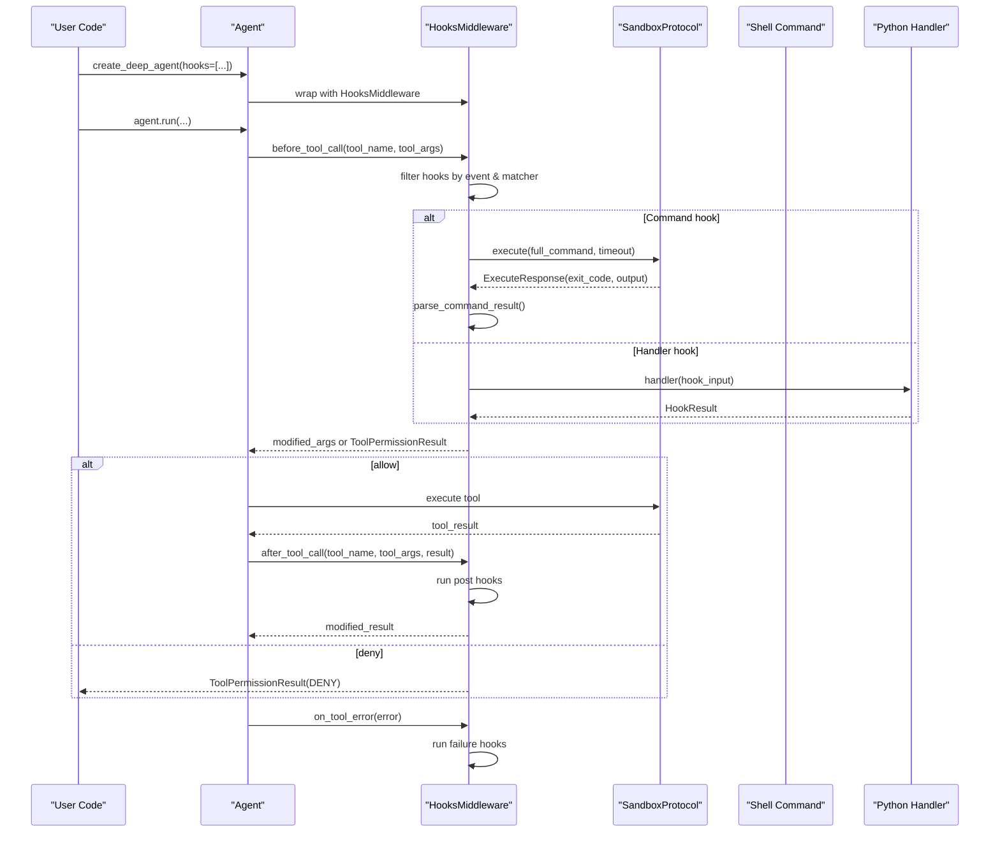
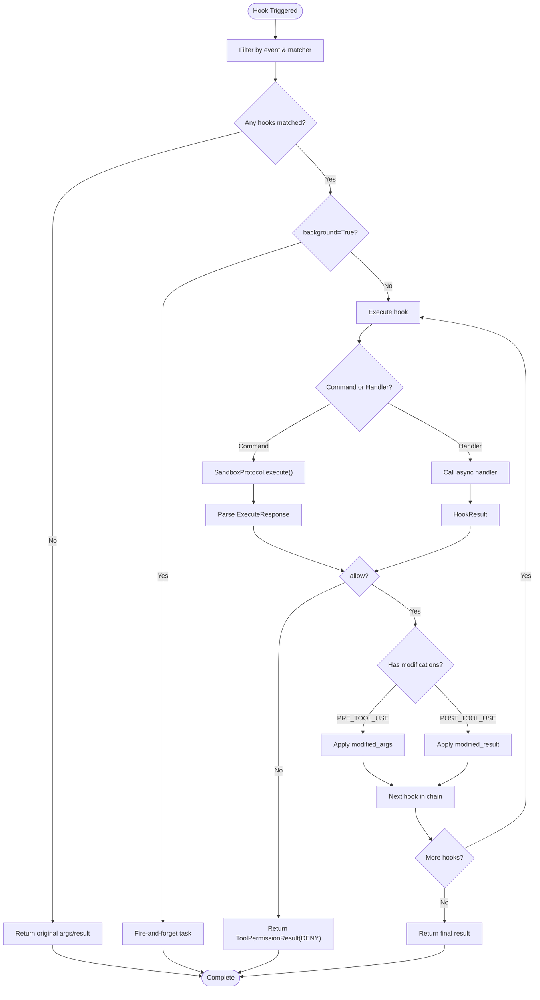
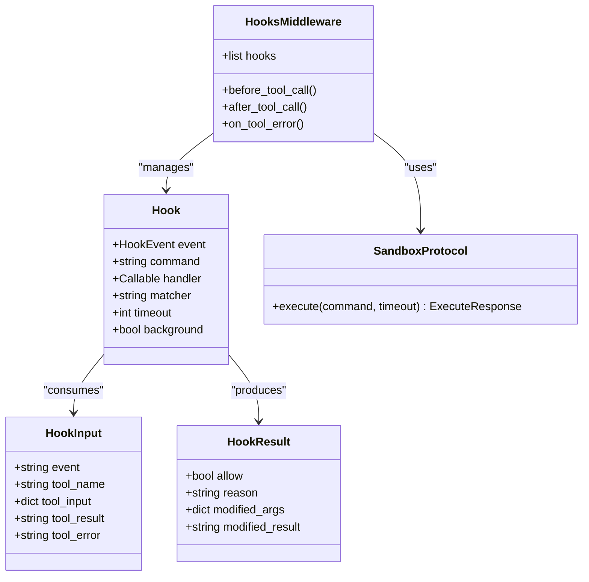
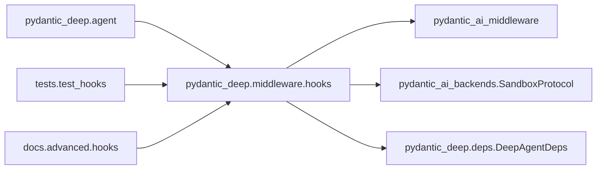

# Hooks System

<cite>
**Referenced Files in This Document**
- [hooks.py](file://pydantic_deep/middleware/hooks.py)
- [test_hooks.py](file://tests/test_hooks.py)
- [hooks.md](file://docs/advanced/hooks.md)
- [agent.py](file://pydantic_deep/agent.py)
- [audit_middleware.py](file://examples/full_app/audit_middleware.py)
</cite>

## Table of Contents
1. [Introduction](#introduction)
2. [Project Structure](#project-structure)
3. [Core Components](#core-components)
4. [Architecture Overview](#architecture-overview)
5. [Detailed Component Analysis](#detailed-component-analysis)
6. [Dependency Analysis](#dependency-analysis)
7. [Performance Considerations](#performance-considerations)
8. [Troubleshooting Guide](#troubleshooting-guide)
9. [Conclusion](#conclusion)
10. [Appendices](#appendices)

## Introduction
The Hooks System provides a Claude Code-style lifecycle hook mechanism for enforcing security controls and monitoring tool execution. It supports three hook events:
- PRE_TOOL_USE: before tool execution, allowing deny decisions and argument modification
- POST_TOOL_USE: after successful tool execution, allowing result modification
- POST_TOOL_USE_FAILURE: after a failed tool execution, for observation-only

Hooks can be implemented as:
- Command hooks: shell commands executed via a sandbox backend with exit code-based decisions
- Python handler hooks: async Python functions receiving structured input and returning structured results

The system follows strict conventions for exit codes (0=allow, 2=deny), JSON-based hook result parsing, and supports regex-based tool matching, timeouts, and background execution.

## Project Structure
The Hooks System is implemented in a dedicated middleware module and integrated into the agent factory. Key locations:
- Implementation: pydantic_deep/middleware/hooks.py
- Documentation: docs/advanced/hooks.md
- Integration: pydantic_deep/agent.py
- Tests: tests/test_hooks.py
- Example middleware (for comparison): examples/full_app/audit_middleware.py



**Diagram sources**
- [agent.py:893-935](file://pydantic_deep/agent.py#L893-L935)
- [hooks.py:243-362](file://pydantic_deep/middleware/hooks.py#L243-L362)

**Section sources**
- [hooks.py:1-373](file://pydantic_deep/middleware/hooks.py#L1-L373)
- [agent.py:893-935](file://pydantic_deep/agent.py#L893-L935)

## Core Components
The Hooks System consists of five primary components:

### HookEvent Enum
Defines the three lifecycle events:
- PRE_TOOL_USE: before tool execution
- POST_TOOL_USE: after successful tool execution
- POST_TOOL_USE_FAILURE: after failed tool execution

### Hook Dataclass
Configuration container with the following fields:
- event: HookEvent (required)
- command: Shell command string (mutually exclusive with handler)
- handler: Async Python function (mutually exclusive with command)
- matcher: Regex pattern for tool_name matching (None matches all)
- timeout: Command execution timeout in seconds (default: 30)
- background: Fire-and-forget execution flag (default: False)

### HookInput Dataclass
Structured input passed to hooks:
- event: String event name
- tool_name: Tool identifier
- tool_input: Tool arguments dictionary
- tool_result: Tool output string (POST events only)
- tool_error: Error message string (failure event only)

### HookResult Dataclass
Structured result from hooks:
- allow: Boolean decision (default: True)
- reason: Denial reason string
- modified_args: Modified tool arguments dictionary
- modified_result: Modified tool output string

### HooksMiddleware Class
Implements AgentMiddleware lifecycle hooks:
- before_tool_call: Runs PRE_TOOL_USE hooks (first deny wins, arg modifications)
- after_tool_call: Runs POST_TOOL_USE hooks (sequential result modifications)
- on_tool_error: Runs POST_TOOL_USE_FAILURE hooks (observation only)

**Section sources**
- [hooks.py:48-107](file://pydantic_deep/middleware/hooks.py#L48-L107)
- [hooks.py:56-83](file://pydantic_deep/middleware/hooks.py#L56-L83)
- [hooks.py:243-362](file://pydantic_deep/middleware/hooks.py#L243-L362)

## Architecture Overview
The Hooks System integrates seamlessly with the agent middleware pipeline. When hooks are provided to create_deep_agent(), the factory wraps the agent with HooksMiddleware, which intercepts tool lifecycle events and executes configured hooks accordingly.



**Diagram sources**
- [agent.py:893-935](file://pydantic_deep/agent.py#L893-L935)
- [hooks.py:259-361](file://pydantic_deep/middleware/hooks.py#L259-L361)

## Detailed Component Analysis

### Hook Execution Flow
The system processes hooks in a deterministic order with specific semantics:



**Diagram sources**
- [hooks.py:259-361](file://pydantic_deep/middleware/hooks.py#L259-L361)

### Command Hook Architecture
Command hooks execute shell commands via SandboxProtocol.execute() with the following protocol:
- HookInput is serialized to JSON and piped to the command via stdin
- Exit code 0 indicates allow (optional JSON modifications)
- Exit code 2 indicates deny (stdout becomes reason)
- Other exit codes are treated as allow



**Diagram sources**
- [hooks.py:85-107](file://pydantic_deep/middleware/hooks.py#L85-L107)
- [hooks.py:56-83](file://pydantic_deep/middleware/hooks.py#L56-L83)
- [hooks.py:243-254](file://pydantic_deep/middleware/hooks.py#L243-L254)

### Python Handler Hook Pattern
Python handlers receive HookInput and return HookResult:
- Async function signature: (HookInput) -> Awaitable[HookResult]
- Can deny, modify arguments, or modify results
- No sandbox backend requirement

### Hook Chaining and Modification Semantics
- PRE_TOOL_USE: First deny wins; argument modifications chain
- POST_TOOL_USE: All matching hooks execute; result modifications chain
- POST_TOOL_USE_FAILURE: All matching hooks execute (observation only)

**Section sources**
- [hooks.py:259-361](file://pydantic_deep/middleware/hooks.py#L259-L361)
- [test_hooks.py:513-751](file://tests/test_hooks.py#L513-L751)

## Dependency Analysis
The Hooks System has minimal external dependencies and integrates cleanly with the agent middleware ecosystem:



**Diagram sources**
- [hooks.py:34-39](file://pydantic_deep/middleware/hooks.py#L34-L39)
- [agent.py:893-935](file://pydantic_deep/agent.py#L893-L935)

Key dependency relationships:
- HooksMiddleware extends AgentMiddleware for lifecycle integration
- SandboxProtocol provides command execution capability
- DeepAgentDeps supplies backend context for command hooks
- Tests validate all integration points

**Section sources**
- [hooks.py:236-240](file://pydantic_deep/middleware/hooks.py#L236-L240)
- [agent.py:893-935](file://pydantic_deep/agent.py#L893-L935)

## Performance Considerations
- Timeout management: Command hooks respect timeout settings; consider backend overhead
- Background execution: Use background=True for non-critical hooks to avoid blocking
- Regex matching: Matcher patterns are compiled once per hook; keep patterns efficient
- JSON serialization: HookInput serialization occurs per hook execution
- Concurrency: Background hooks run concurrently without blocking tool execution
- Memory usage: Large tool outputs may trigger eviction processors before hook execution

## Troubleshooting Guide

### Common Hook Failures and Solutions

#### Command Hook Backend Issues
- Symptom: RuntimeError about missing execute() method
- Cause: Using StateBackend instead of SandboxProtocol backend
- Solution: Configure LocalBackend or DockerSandbox for command hooks

#### Hook Validation Errors
- Symptom: ValueError about missing command or handler
- Cause: Hook definition missing required field
- Solution: Provide either command or handler (not both)

#### Regex Matching Problems
- Symptom: Hooks not triggering on expected tools
- Cause: Incorrect regex pattern or tool name mismatch
- Solution: Verify tool_name and matcher pattern

#### Exit Code Misinterpretation
- Symptom: Unexpected allow/deny decisions
- Cause: Non-standard exit codes
- Solution: Follow Claude Code conventions (0=allow, 2=deny)

### Debugging Techniques
1. Enable logging in hooks middleware
2. Test command hooks independently with printf-based stdin simulation
3. Validate HookInput structure before processing
4. Monitor background hook exceptions separately
5. Use simple matcher patterns during development

**Section sources**
- [hooks.py:202-211](file://pydantic_deep/middleware/hooks.py#L202-L211)
- [test_hooks.py:456-468](file://tests/test_hooks.py#L456-L468)

## Conclusion
The Hooks System provides a robust, extensible framework for security controls and tool execution monitoring. Its Claude Code-style conventions ensure compatibility with established patterns while offering flexible implementation options through both shell commands and Python handlers. The system's integration with the agent middleware pipeline enables seamless enforcement of policies without disrupting core agent functionality.

## Appendices

### Practical Implementation Examples

#### Security Gate Hook (Python Handler)
```python
async def security_gate(hook_input: HookInput) -> HookResult:
    # Block dangerous commands
    if "rm -rf" in str(hook_input.tool_input):
        return HookResult(allow=False, reason="Dangerous command blocked")
    return HookResult(allow=True)
```

#### Audit Logger Hook (Command Hook)
```bash
#!/bin/bash
# Receives HookInput JSON on stdin
INPUT=$(cat)
TOOL_NAME=$(echo "$INPUT" | jq -r '.tool_name')
echo "[AUDIT] $TOOL_NAME invoked" >> /var/log/agent-audit.log
```

#### Result Sanitization Hook (Python Handler)
```python
async def sanitize_output(hook_input: HookInput) -> HookResult:
    result = hook_input.tool_result or ""
    # Remove sensitive data
    sanitized = result.replace("SECRET_KEY=abc123", "SECRET_KEY=***")
    return HookResult(modified_result=sanitized)
```

### Best Practices
- Keep regex patterns simple and well-tested
- Use background hooks for non-critical operations
- Implement proper error handling in handlers
- Validate inputs rigorously in security-focused hooks
- Document hook purposes and reasoning clearly
- Test hooks with representative tool inputs
- Monitor hook performance impact on agent latency

### Security Hook Best Practices
- Validate tool arguments comprehensively
- Sanitize outputs to prevent information leakage
- Implement least-privilege execution for command hooks
- Log all hook decisions for audit trails
- Regularly review and update security policies
- Consider rate limiting for expensive operations
- Use timeouts to prevent resource exhaustion