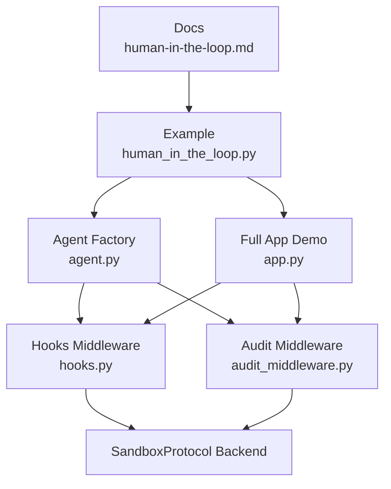
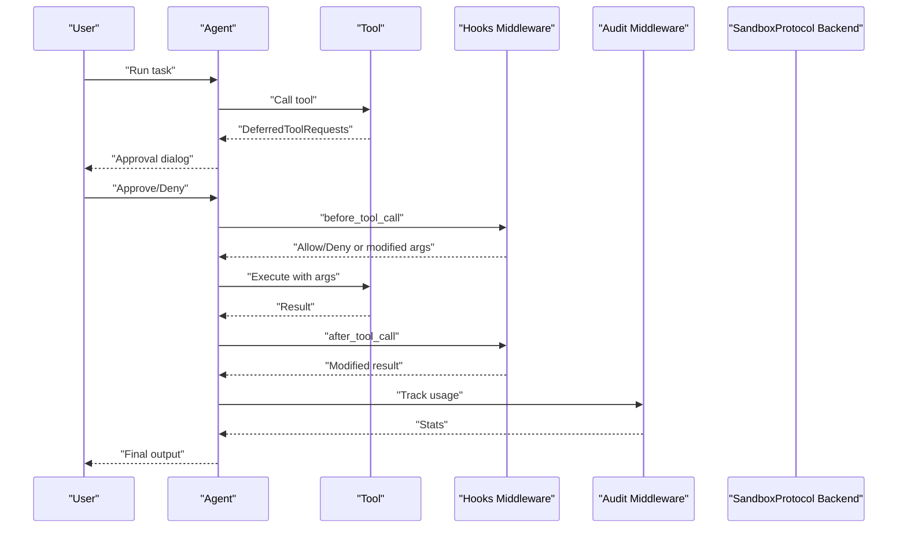
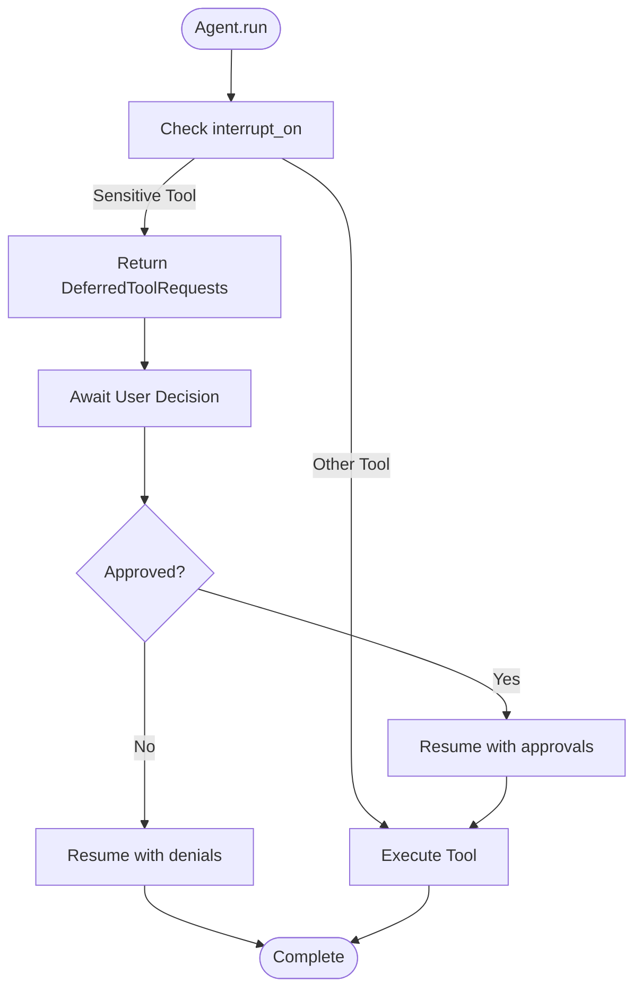
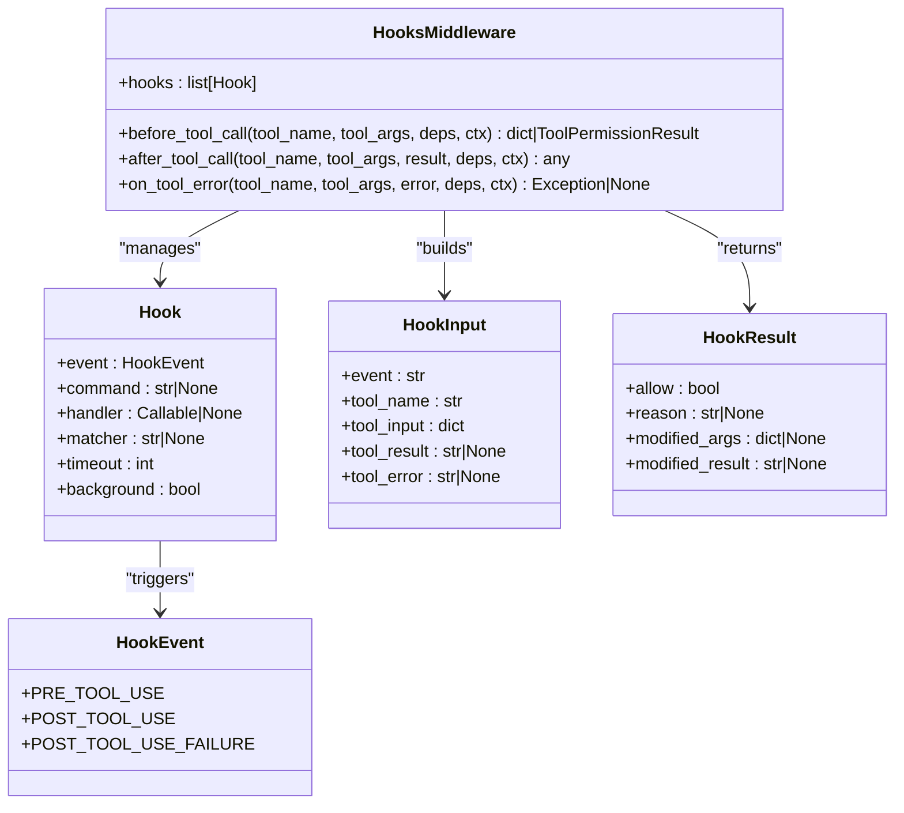
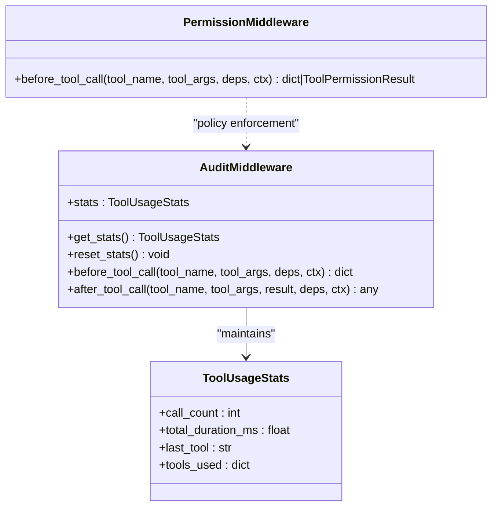
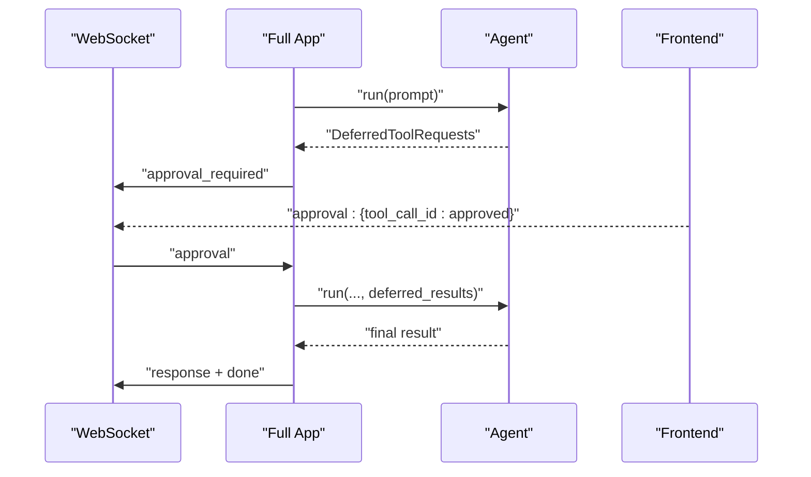
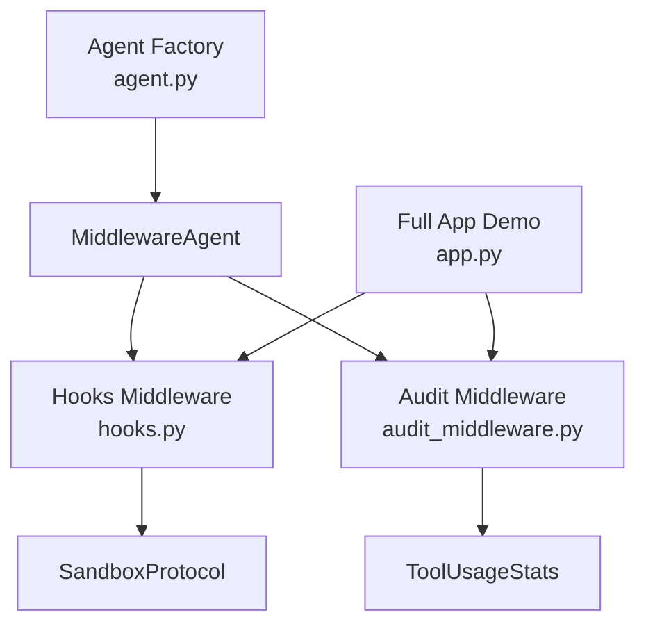

# Human-in-the-Loop Workflows

<cite>
**Referenced Files in This Document**
- [human-in-the-loop.md](file://docs/advanced/human-in-the-loop.md)
- [human_in_the_loop.py](file://examples/human_in_the_loop.py)
- [hooks.py](file://pydantic_deep/middleware/hooks.py)
- [audit_middleware.py](file://examples/full_app/audit_middleware.py)
- [app.py](file://examples/full_app/app.py)
- [types.py](file://pydantic_deep/types.py)
- [deps.py](file://pydantic_deep/deps.py)
- [agent.py](file://pydantic_deep/agent.py)
</cite>

## Table of Contents
1. [Introduction](#introduction)
2. [Project Structure](#project-structure)
3. [Core Components](#core-components)
4. [Architecture Overview](#architecture-overview)
5. [Detailed Component Analysis](#detailed-component-analysis)
6. [Dependency Analysis](#dependency-analysis)
7. [Performance Considerations](#performance-considerations)
8. [Troubleshooting Guide](#troubleshooting-guide)
9. [Conclusion](#conclusion)
10. [Appendices](#appendices)

## Introduction
This document explains how to implement Human-in-the-Loop (HITL) workflows for critical operations in pydantic-deep. It covers approval processes, manual intervention points, and collaborative agent patterns. You will learn how to:
- Require human approval for sensitive tool executions
- Integrate with external approval systems and notification mechanisms
- Generate audit trails for compliance
- Implement approval hooks and manage feedback loops
- Balance autonomy with human control and manage approval latency

## Project Structure
The HITL implementation spans documentation, examples, middleware, and integration points:
- Documentation and examples demonstrate approval configuration and flows
- Middleware provides lifecycle hooks for pre/post tool execution and failure handling
- Integration examples show web and streaming workflows with approval dialogs
- Audit middleware demonstrates permission gating and usage tracking

**Diagram sources**
- [human-in-the-loop.md:1-246](file://docs/advanced/human-in-the-loop.md#L1-L246)
- [human_in_the_loop.py:1-100](file://examples/human_in_the_loop.py#L1-L100)
- [agent.py:196-200](file://pydantic_deep/agent.py#L196-L200)
- [hooks.py:243-373](file://pydantic_deep/middleware/hooks.py#L243-L373)
- [audit_middleware.py:34-140](file://examples/full_app/audit_middleware.py#L34-L140)
- [app.py:1083-1137](file://examples/full_app/app.py#L1083-L1137)

**Section sources**
- [human-in-the-loop.md:1-246](file://docs/advanced/human-in-the-loop.md#L1-L246)
- [human_in_the_loop.py:1-100](file://examples/human_in_the_loop.py#L1-L100)
- [agent.py:196-200](file://pydantic_deep/agent.py#L196-L200)

## Core Components
- Approval configuration via interrupt_on to require human approval for sensitive tools
- Deferred tool requests and approvals to pause execution until human decisions are received
- Hooks middleware for pre/post tool lifecycle events with allow/deny and result modification
- Audit middleware for permission gating and usage statistics
- Web and streaming integrations for asynchronous approvals and real-time feedback

**Section sources**
- [human-in-the-loop.md:5-26](file://docs/advanced/human-in-the-loop.md#L5-L26)
- [hooks.py:243-373](file://pydantic_deep/middleware/hooks.py#L243-L373)
- [audit_middleware.py:34-140](file://examples/full_app/audit_middleware.py#L34-L140)
- [app.py:1083-1137](file://examples/full_app/app.py#L1083-L1137)

## Architecture Overview
The HITL architecture combines agent configuration, middleware, and integration points:

**Diagram sources**
- [human_in-the-loop.md:17-26](file://docs/advanced/human-in-the-loop.md#L17-L26)
- [hooks.py:259-331](file://pydantic_deep/middleware/hooks.py#L259-L331)
- [audit_middleware.py:34-84](file://examples/full_app/audit_middleware.py#L34-L84)
- [app.py:1083-1137](file://examples/full_app/app.py#L1083-L1137)

## Detailed Component Analysis

### Approval Configuration and Deferred Execution
- Configure interrupt_on to require human approval for sensitive tools (execute, write_file, edit_file).
- When a tool requires approval, the agent returns DeferredToolRequests instead of executing immediately.
- The caller resumes execution by passing approvals or denials.

**Diagram sources**
- [human-in-the-loop.md:17-26](file://docs/advanced/human-in-the-loop.md#L17-L26)
- [human_in_the_loop.py:58-82](file://examples/human_in_the_loop.py#L58-L82)

**Section sources**
- [human-in-the-loop.md:5-26](file://docs/advanced/human-in-the-loop.md#L5-L26)
- [human_in_the_loop.py:35-96](file://examples/human_in_the_loop.py#L35-L96)

### Hooks Middleware for Lifecycle Events
- HooksMiddleware integrates with pre/post tool lifecycle events.
- Supports command hooks (via SandboxProtocol.execute) and Python handler hooks.
- Exit code conventions: 0 allow, 2 deny; optional JSON output for modifications.

**Diagram sources**
- [hooks.py:243-373](file://pydantic_deep/middleware/hooks.py#L243-L373)

**Section sources**
- [hooks.py:48-116](file://pydantic_deep/middleware/hooks.py#L48-L116)
- [hooks.py:173-224](file://pydantic_deep/middleware/hooks.py#L173-L224)
- [hooks.py:259-331](file://pydantic_deep/middleware/hooks.py#L259-L331)

### Audit and Permission Middleware
- AuditMiddleware tracks tool usage statistics and durations.
- PermissionMiddleware blocks access to sensitive paths using regex patterns.
- Both integrate with the middleware system to enforce policies and provide observability.

**Diagram sources**
- [audit_middleware.py:34-140](file://examples/full_app/audit_middleware.py#L34-L140)

**Section sources**
- [audit_middleware.py:24-84](file://examples/full_app/audit_middleware.py#L24-L84)
- [audit_middleware.py:104-140](file://examples/full_app/audit_middleware.py#L104-L140)

### Web and Streaming Integration for Approvals
- The full app demo streams tool calls and arguments, handles approval dialogs, and resumes execution after user decisions.
- WebSocket events coordinate approval requests and responses.

**Diagram sources**
- [app.py:1083-1137](file://examples/full_app/app.py#L1083-L1137)
- [app.py:1139-1171](file://examples/full_app/app.py#L1139-L1171)

**Section sources**
- [app.py:1083-1171](file://examples/full_app/app.py#L1083-L1171)

### Collaborative Agent Patterns and Subagents
- Subagents can be configured and integrated with middleware for shared oversight.
- The agent factory supports subagents and middleware composition.

**Section sources**
- [agent.py:479-482](file://pydantic_deep/agent.py#L479-L482)
- [deps.py:174-196](file://pydantic_deep/deps.py#L174-L196)

## Dependency Analysis
- Agent factory composes middleware and toolsets; interrupt_on enables approval gating.
- Hooks middleware depends on SandboxProtocol for command hooks.
- Audit middleware depends on pydantic-ai-middleware for lifecycle interception.
- Full app demo integrates both middleware types with WebSocket streaming.

**Diagram sources**
- [agent.py:196-200](file://pydantic_deep/agent.py#L196-L200)
- [hooks.py:243-373](file://pydantic_deep/middleware/hooks.py#L243-L373)
- [audit_middleware.py:34-140](file://examples/full_app/audit_middleware.py#L34-L140)
- [app.py:1083-1137](file://examples/full_app/app.py#L1083-L1137)

**Section sources**
- [agent.py:196-200](file://pydantic_deep/agent.py#L196-L200)
- [hooks.py:243-373](file://pydantic_deep/middleware/hooks.py#L243-L373)
- [audit_middleware.py:34-140](file://examples/full_app/audit_middleware.py#L34-L140)
- [app.py:1083-1137](file://examples/full_app/app.py#L1083-L1137)

## Performance Considerations
- Approval latency: Implement timeouts to prevent indefinite blocking; deny on timeout to maintain responsiveness.
- Background hooks: Use background hooks to avoid blocking tool execution while performing checks.
- Streaming: Use streaming to keep users engaged and reduce perceived latency during long operations.
- Audit overhead: Keep audit middleware lightweight; avoid expensive computations in hot paths.

[No sources needed since this section provides general guidance]

## Troubleshooting Guide
Common issues and resolutions:
- Command hooks require a sandbox backend; ensure the backend implements SandboxProtocol.
- PermissionMiddleware may block legitimate operations; adjust blocked patterns carefully.
- DeferredToolRequests not handled: Ensure the caller resumes execution with approvals or denials.
- Audit stats not updating: Verify middleware registration and event hooks.

**Section sources**
- [hooks.py:202-211](file://pydantic_deep/middleware/hooks.py#L202-L211)
- [audit_middleware.py:111-139](file://examples/full_app/audit_middleware.py#L111-L139)
- [human_in_the_loop.py:77-82](file://examples/human_in_the_loop.py#L77-L82)

## Conclusion
pydantic-deep provides robust primitives for Human-in-the-Loop workflows:
- Configure approvals for sensitive tools
- Use hooks for policy enforcement and result modification
- Enforce permissions and track usage with middleware
- Integrate approvals in web and streaming contexts
- Maintain audit trails and compliance through middleware and logging

Adopt best practices to balance autonomy with human control, manage approval latency, and ensure regulatory compliance.

[No sources needed since this section summarizes without analyzing specific files]

## Appendices

### Best Practices Checklist
- Require approval for destructive operations (execute, write_file, edit_file)
- Provide clear context in approval dialogs
- Log all approvals and denials
- Set timeouts for approvals
- Use background hooks for non-blocking checks
- Monitor tool usage and durations
- Block sensitive paths proactively

**Section sources**
- [human-in-the-loop.md:194-240](file://docs/advanced/human-in-the-loop.md#L194-L240)
- [audit_middleware.py:24-84](file://examples/full_app/audit_middleware.py#L24-L84)