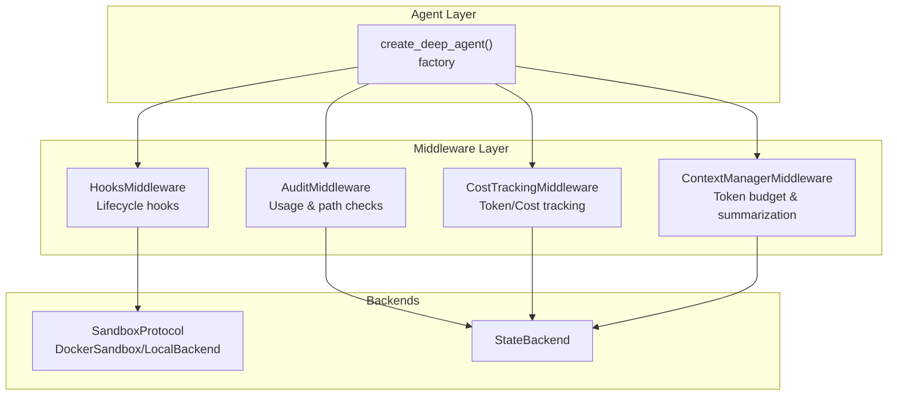
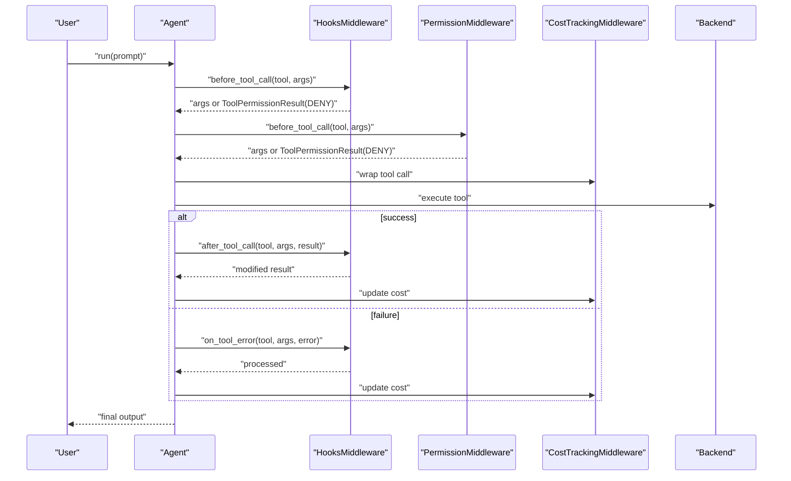
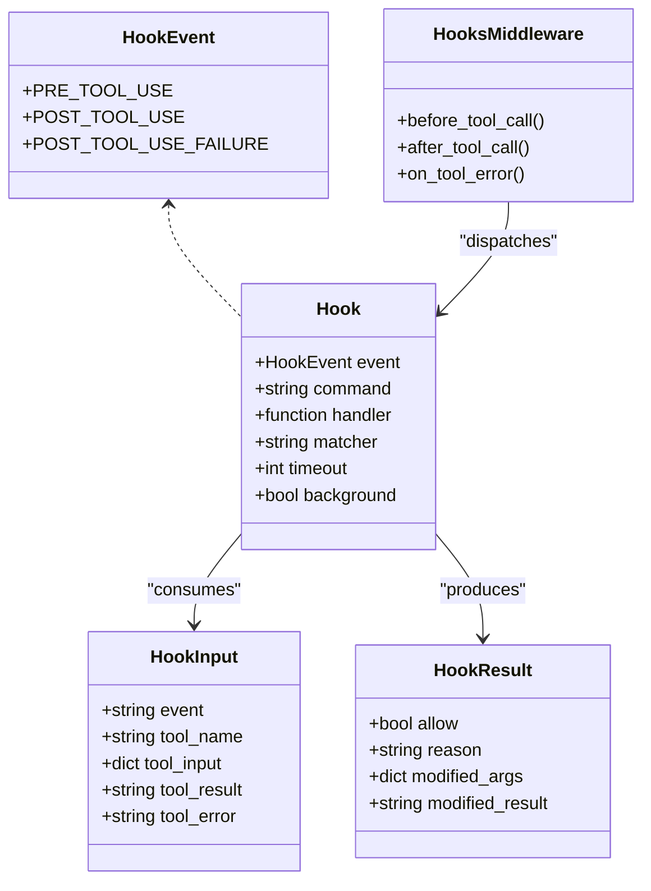
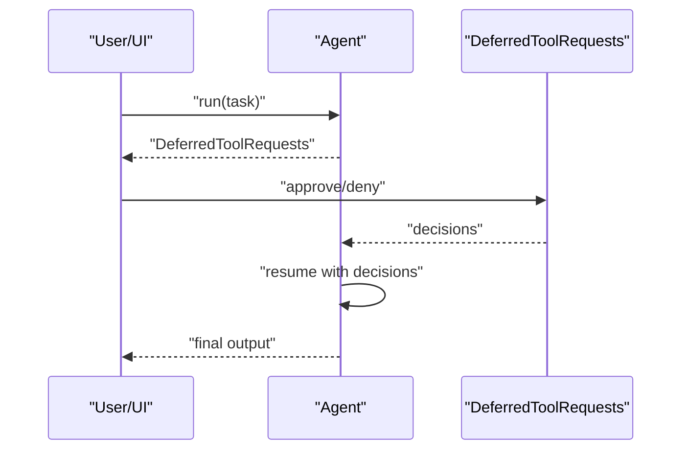
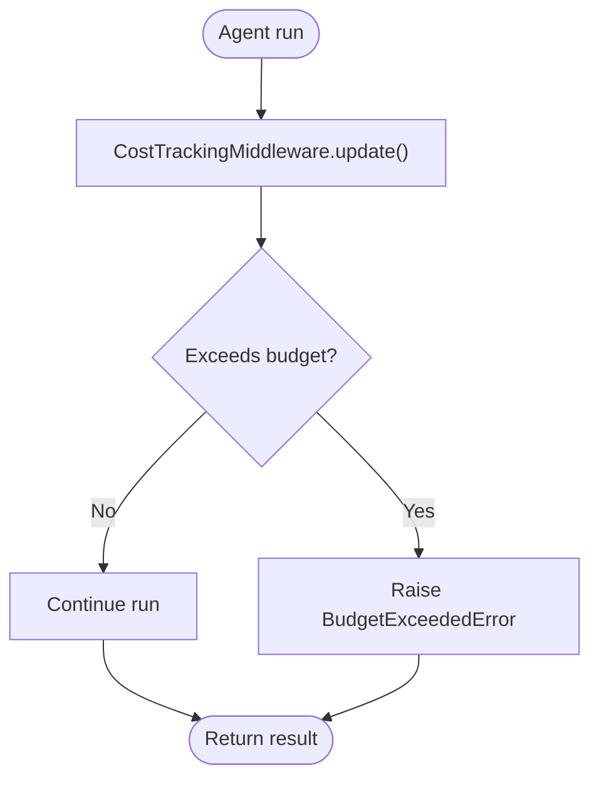
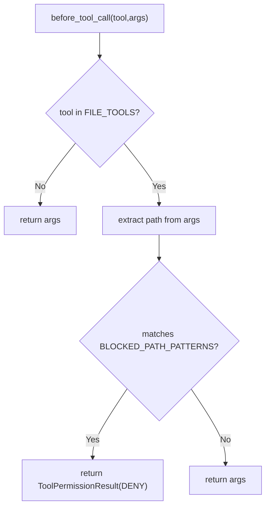
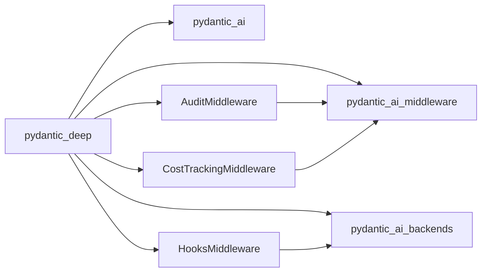

# Security and Compliance

<cite>
**Referenced Files in This Document**
- [hooks.py](file://pydantic_deep/middleware/hooks.py)
- [audit_middleware.py](file://examples/full_app/audit_middleware.py)
- [test_hooks.py](file://tests/test_hooks.py)
- [test_cost_tracking.py](file://tests/test_cost_tracking.py)
- [hooks.md](file://docs/advanced/hooks.md)
- [human-in-the-loop.md](file://docs/advanced/human-in-the-loop.md)
- [cost-tracking.md](file://docs/advanced/cost-tracking.md)
- [agent.py](file://pydantic_deep/agent.py)
- [__init__.py](file://pydantic_deep/__init__.py)
- [human_in_the_loop.py](file://examples/human_in_the_loop.py)
</cite>

## Table of Contents
1. [Introduction](#introduction)
2. [Project Structure](#project-structure)
3. [Core Components](#core-components)
4. [Architecture Overview](#architecture-overview)
5. [Detailed Component Analysis](#detailed-component-analysis)
6. [Dependency Analysis](#dependency-analysis)
7. [Performance Considerations](#performance-considerations)
8. [Troubleshooting Guide](#troubleshooting-guide)
9. [Conclusion](#conclusion)
10. [Appendices](#appendices)

## Introduction
This document explains the Security and Compliance features of the system, focusing on the hooks system, permission management, and safety mechanisms. It covers lifecycle hooks architecture for security controls, human-in-the-loop approval workflows, cost tracking and budget enforcement, audit logging, and permission handling. It also provides guidance on configuring security policies, implementing custom hooks, managing sensitive operations, and establishing compliance-ready deployments.

## Project Structure
Security and compliance capabilities are implemented across:
- Lifecycle hooks middleware for pre/post tool execution and failure handling
- Human-in-the-loop approval gating for sensitive tools
- Cost tracking and budget enforcement
- Audit middleware for usage tracking and path-based permission checks
- Agent factory integration that wires middleware and safety features

**Diagram sources**
- [agent.py:196-820](file://pydantic_deep/agent.py#L196-L820)
- [hooks.py:243-373](file://pydantic_deep/middleware/hooks.py#L243-L373)
- [audit_middleware.py:34-140](file://examples/full_app/audit_middleware.py#L34-L140)
- [__init__.py:71-103](file://pydantic_deep/__init__.py#L71-L103)

**Section sources**
- [agent.py:196-820](file://pydantic_deep/agent.py#L196-L820)
- [hooks.py:243-373](file://pydantic_deep/middleware/hooks.py#L243-L373)
- [audit_middleware.py:34-140](file://examples/full_app/audit_middleware.py#L34-L140)
- [__init__.py:71-103](file://pydantic_deep/__init__.py#L71-L103)

## Core Components
- Lifecycle hooks system
  - Hook lifecycle events: PRE_TOOL_USE, POST_TOOL_USE, POST_TOOL_USE_FAILURE
  - Command hooks via SandboxProtocol.execute() with exit code semantics
  - Python handler hooks for inline logic
  - Matchers, timeouts, background execution, and argument/result modification
- Human-in-the-loop approvals
  - interrupt_on configuration to require approvals for sensitive tools
  - DeferredToolRequests and ToolApproved/ToolDenied decisions
- Cost tracking and budget enforcement
  - CostTrackingMiddleware for per-run and cumulative token/cost metrics
  - Budget limits and BudgetExceededError
- Audit and permission middleware
  - AuditMiddleware for tool usage statistics
  - PermissionMiddleware for path-based restrictions

**Section sources**
- [hooks.py:48-373](file://pydantic_deep/middleware/hooks.py#L48-L373)
- [hooks.md:1-174](file://docs/advanced/hooks.md#L1-L174)
- [audit_middleware.py:34-140](file://examples/full_app/audit_middleware.py#L34-L140)
- [human-in-the-loop.md:1-246](file://docs/advanced/human-in-the-loop.md#L1-L246)
- [cost-tracking.md:1-85](file://docs/advanced/cost-tracking.md#L1-L85)
- [test_cost_tracking.py:29-132](file://tests/test_cost_tracking.py#L29-L132)

## Architecture Overview
The agent factory composes middleware and toolsets. Security and compliance features are layered as middleware:
- HooksMiddleware intercepts tool lifecycle events and enforces policies
- AuditMiddleware tracks usage and enforces path-based permissions
- CostTrackingMiddleware monitors token usage and enforces budgets
- ContextManagerMiddleware manages token budgets and summarization

**Diagram sources**
- [agent.py:797-820](file://pydantic_deep/agent.py#L797-L820)
- [hooks.py:256-362](file://pydantic_deep/middleware/hooks.py#L256-L362)
- [audit_middleware.py:111-139](file://examples/full_app/audit_middleware.py#L111-L139)
- [test_cost_tracking.py:29-74](file://tests/test_cost_tracking.py#L29-L74)

## Detailed Component Analysis

### Lifecycle Hooks System
The hooks system provides a Claude Code-style lifecycle hook mechanism:
- Events: PRE_TOOL_USE (deny/modify args), POST_TOOL_USE (modify result), POST_TOOL_USE_FAILURE (observe)
- Execution modes: command hooks (via SandboxProtocol.execute) and Python handler hooks
- Exit code semantics: 0 allow, 2 deny; optional JSON output for modifications
- Matchers: regex matching on tool names
- Background hooks: fire-and-forget tasks
- Ordering: PRE_TOOL_USE first-deny-wins; POST events chain modifications

**Diagram sources**
- [hooks.py:48-373](file://pydantic_deep/middleware/hooks.py#L48-L373)

**Section sources**
- [hooks.py:48-373](file://pydantic_deep/middleware/hooks.py#L48-L373)
- [hooks.md:1-174](file://docs/advanced/hooks.md#L1-L174)
- [test_hooks.py:78-121](file://tests/test_hooks.py#L78-L121)

#### Implementation Notes
- Command hooks require a SandboxProtocol backend; otherwise a runtime error is raised
- PRE_TOOL_USE hooks run in order; first deny wins
- POST hooks can chain result modifications
- Background hooks run fire-and-forget and suppress errors

**Section sources**
- [hooks.py:202-224](file://pydantic_deep/middleware/hooks.py#L202-L224)
- [test_hooks.py:456-468](file://tests/test_hooks.py#L456-L468)

### Human-in-the-Loop Approvals
Sensitive tools can require human approval:
- interrupt_on configuration enables approvals for specific tools
- DeferredToolRequests are returned when approvals are required
- Approvals are applied via ToolApproved/ToolDenied decisions
- Examples demonstrate CLI and web integration patterns

**Diagram sources**
- [human-in-the-loop.md:17-96](file://docs/advanced/human-in-the-loop.md#L17-L96)
- [human_in_the_loop.py:35-91](file://examples/human_in_the_loop.py#L35-L91)

**Section sources**
- [human-in-the-loop.md:1-246](file://docs/advanced/human-in-the-loop.md#L1-L246)
- [human_in_the_loop.py:1-100](file://examples/human_in_the_loop.py#L1-L100)

### Cost Tracking and Budget Enforcement
Cost tracking is enabled by default and integrates via CostTrackingMiddleware:
- Tracks per-run and cumulative input/output tokens and USD costs
- Supports budget limits; exceeding raises BudgetExceededError
- Optional on_cost_update callback for real-time monitoring
- Integrates with create_deep_agent parameters

**Diagram sources**
- [cost-tracking.md:23-49](file://docs/advanced/cost-tracking.md#L23-L49)
- [test_cost_tracking.py:29-74](file://tests/test_cost_tracking.py#L29-L74)

**Section sources**
- [cost-tracking.md:1-85](file://docs/advanced/cost-tracking.md#L1-L85)
- [test_cost_tracking.py:29-132](file://tests/test_cost_tracking.py#L29-L132)
- [agent.py:797-820](file://pydantic_deep/agent.py#L797-L820)

### Audit and Permission Middleware
AuditMiddleware:
- Tracks tool call counts, durations, and per-tool usage
- Provides reset and retrieval APIs for stats

PermissionMiddleware:
- Blocks access to sensitive paths using regex patterns
- Inspects file-related tools’ arguments for blocked patterns
- Returns ToolPermissionResult(DENY) on matches

**Diagram sources**
- [audit_middleware.py:111-139](file://examples/full_app/audit_middleware.py#L111-L139)

**Section sources**
- [audit_middleware.py:34-140](file://examples/full_app/audit_middleware.py#L34-L140)

## Dependency Analysis
Security and compliance features depend on:
- pydantic-ai-middleware for middleware abstractions and CostTrackingMiddleware
- pydantic-ai-backends for SandboxProtocol and backends
- Agent factory wiring middleware and toolsets

**Diagram sources**
- [__init__.py:49-103](file://pydantic_deep/__init__.py#L49-L103)
- [agent.py:797-820](file://pydantic_deep/agent.py#L797-L820)

**Section sources**
- [__init__.py:49-103](file://pydantic_deep/__init__.py#L49-L103)
- [agent.py:797-820](file://pydantic_deep/agent.py#L797-L820)

## Performance Considerations
- Hooks execution
  - Command hooks incur process overhead; prefer Python handler hooks for low-latency logic
  - Use background hooks for non-critical post-processing
  - Limit matcher scope to reduce unnecessary hook evaluations
- Cost tracking
  - on_cost_update callbacks should be lightweight to avoid slowing runs
  - Budget checks occur after each run; batch operations may increase cumulative cost
- Audit middleware
  - Stats accumulation is in-memory; reset periodically in long-running sessions

[No sources needed since this section provides general guidance]

## Troubleshooting Guide
Common issues and resolutions:
- Command hooks fail with SandboxProtocol error
  - Ensure backend implements SandboxProtocol (e.g., DockerSandbox or LocalBackend)
  - Verify hooks are configured only when a sandbox backend is present
- PRE_TOOL_USE deny not taking effect
  - Confirm deny occurs early in the hook chain; first deny wins
  - Check matcher regex and tool name casing
- POST hooks not modifying results
  - Ensure HookResult.modified_result is set and matcher matches the tool
  - Verify hook ordering and chaining behavior
- BudgetExceededError during runs
  - Review cost tracking logs and adjust cost_budget_usd
  - Consider disabling cost_tracking for ephemeral runs
- PermissionMiddleware false positives
  - Review BLOCKED_PATH_PATTERNS and FILE_TOOLS mappings
  - Validate path extraction logic for specific tools

**Section sources**
- [hooks.py:202-224](file://pydantic_deep/middleware/hooks.py#L202-L224)
- [test_hooks.py:560-577](file://tests/test_hooks.py#L560-L577)
- [audit_middleware.py:111-139](file://examples/full_app/audit_middleware.py#L111-L139)
- [test_cost_tracking.py:29-74](file://tests/test_cost_tracking.py#L29-L74)

## Conclusion
The system provides a robust, extensible foundation for security and compliance:
- Lifecycle hooks enable policy enforcement at tool boundaries
- Human-in-the-loop approvals protect sensitive operations
- Cost tracking and budget enforcement control spending
- Audit and permission middleware provide observability and access control
Integrating these components through the agent factory ensures consistent behavior across deployments.

[No sources needed since this section summarizes without analyzing specific files]

## Appendices

### Best Practices for Production Deployments
- Security hardening
  - Always require approvals for execute and file-write/edit tools
  - Use command hooks for external security scanners; prefer Python handlers for internal checks
  - Restrict hook matchers to specific tools and namespaces
- Compliance considerations
  - Log all approvals and hook denials for audit trails
  - Enforce budget caps and alert thresholds
  - Regularly review BLOCKED_PATH_PATTERNS and audit stats
- Regulatory alignment
  - Maintain immutable audit logs and enforce least-privilege tool access
  - Document hook policies and approval workflows

[No sources needed since this section provides general guidance]

### Security Patterns and Threat Mitigation Strategies
- Principle of least privilege
  - Disable execute unless sandbox backends are available
  - Limit path access via PermissionMiddleware
- Defense in depth
  - Combine hooks, approvals, and cost tracking
  - Use background hooks for analytics without impacting latency
- Observability and incident response
  - Monitor on_cost_update and audit stats
  - Track hook denials and approval outcomes

[No sources needed since this section provides general guidance]