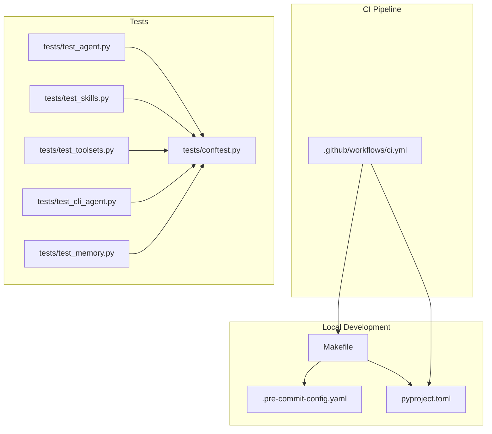
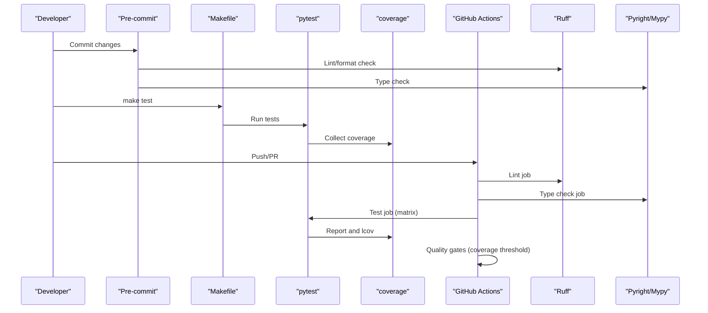
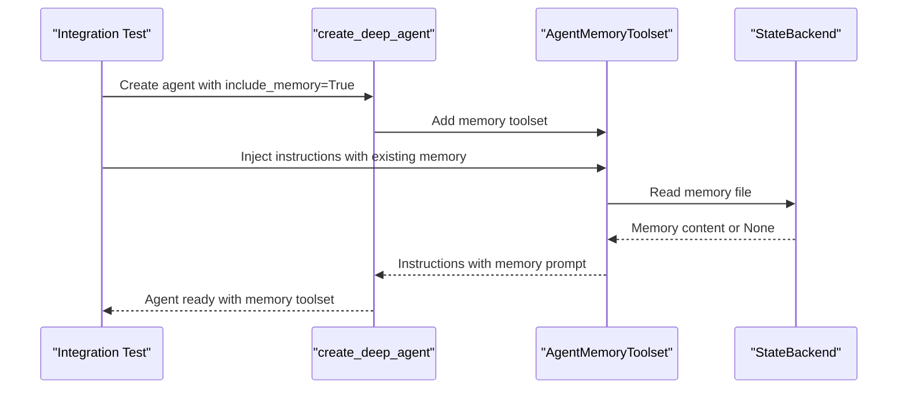
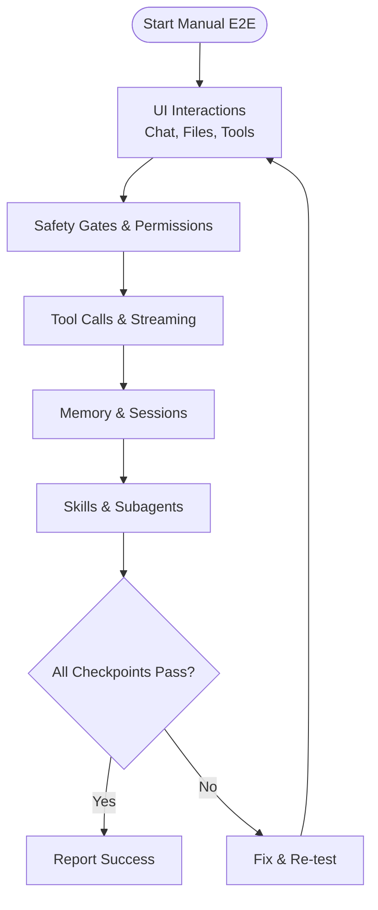
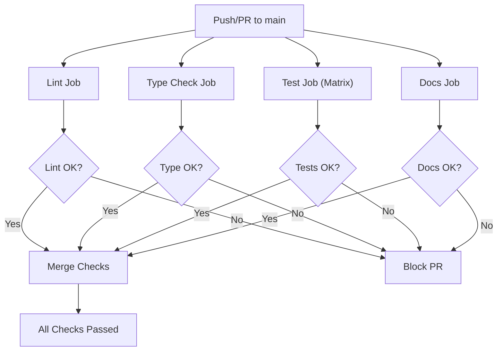
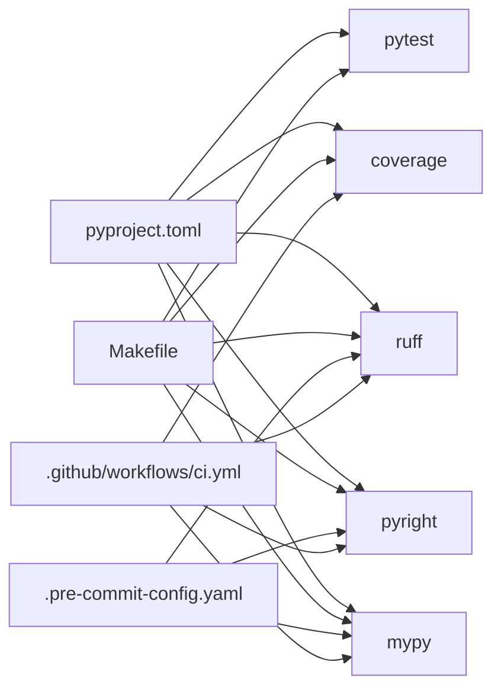

# Testing and Quality Assurance

<cite>
**Referenced Files in This Document**
- [ci.yml](file://.github/workflows/ci.yml)
- [pyproject.toml](file://pyproject.toml)
- [.pre-commit-config.yaml](file://.pre-commit-config.yaml)
- [Makefile](file://Makefile)
- [conftest.py](file://tests/conftest.py)
- [test_agent.py](file://tests/test_agent.py)
- [test_skills.py](file://tests/test_skills.py)
- [test_toolsets.py](file://tests/test_toolsets.py)
- [test_cli_agent.py](file://tests/test_cli_agent.py)
- [test_memory.py](file://tests/test_memory.py)
- [TESTING.md](file://examples/full_app/TESTING.md)
- [CONTRIBUTING.md](file://CONTRIBUTING.md)
</cite>

## Table of Contents
1. [Introduction](#introduction)
2. [Project Structure](#project-structure)
3. [Core Components](#core-components)
4. [Architecture Overview](#architecture-overview)
5. [Detailed Component Analysis](#detailed-component-analysis)
6. [Dependency Analysis](#dependency-analysis)
7. [Performance Considerations](#performance-considerations)
8. [Troubleshooting Guide](#troubleshooting-guide)
9. [Conclusion](#conclusion)
10. [Appendices](#appendices)

## Introduction
This document defines the comprehensive testing and quality assurance strategy for the project. It covers testing strategy, quality standards, validation processes, continuous integration, automated workflows, and quality gates. It also provides guidelines for writing effective tests, mocking strategies, test data management, code quality standards, type checking, linting, static analysis, test-driven development, performance testing, and regression testing.

## Project Structure
The testing and QA ecosystem is organized around:
- Unit tests under the tests/ directory, grouped by functional areas (agents, skills, toolsets, CLI, memory, etc.).
- Continuous integration via GitHub Actions workflows.
- Local developer workflows using Makefile targets and pre-commit hooks.
- Configuration for linting, formatting, type checking, and coverage enforcement.

**Diagram sources**
- [ci.yml:1-116](file://.github/workflows/ci.yml#L1-L116)
- [pyproject.toml:142-211](file://pyproject.toml#L142-L211)
- [.pre-commit-config.yaml:1-49](file://.pre-commit-config.yaml#L1-L49)
- [Makefile:1-95](file://Makefile#L1-L95)
- [conftest.py:1-44](file://tests/conftest.py#L1-L44)
- [test_agent.py:1-453](file://tests/test_agent.py#L1-L453)
- [test_skills.py:1-724](file://tests/test_skills.py#L1-L724)
- [test_toolsets.py:1-68](file://tests/test_toolsets.py#L1-L68)
- [test_cli_agent.py:1-208](file://tests/test_cli_agent.py#L1-L208)
- [test_memory.py:1-587](file://tests/test_memory.py#L1-L587)

**Section sources**
- [ci.yml:1-116](file://.github/workflows/ci.yml#L1-L116)
- [pyproject.toml:142-211](file://pyproject.toml#L142-L211)
- [.pre-commit-config.yaml:1-49](file://.pre-commit-config.yaml#L1-L49)
- [Makefile:1-95](file://Makefile#L1-L95)
- [conftest.py:1-44](file://tests/conftest.py#L1-L44)

## Core Components
- Testing framework: pytest with asyncio support and fixtures.
- Mocking: global autouse fixture to mock subagents to avoid API dependencies.
- Coverage: coverage with lcov export and thresholds.
- Static analysis: Pyright and MyPy configured for strictness and exclusions.
- Linting and formatting: Ruff for linting, formatting, and complexity checks.
- Pre-commit: automated checks on commit.
- CI: matrix builds across Python versions, lint/typecheck/test jobs, and documentation build.

Key configuration highlights:
- Test discovery and asyncio defaults in pytest configuration.
- Coverage thresholds and exclusion rules.
- Pyright type checking mode and exclusions.
- MyPy strict mode with overrides for tests.
- Ruff rules and complexity limits.

**Section sources**
- [pyproject.toml:142-211](file://pyproject.toml#L142-L211)
- [ci.yml:14-116](file://.github/workflows/ci.yml#L14-L116)
- [Makefile:52-81](file://Makefile#L52-L81)
- [conftest.py:13-18](file://tests/conftest.py#L13-L18)

## Architecture Overview
The QA architecture integrates local and CI workflows with quality gates enforced by configuration.

**Diagram sources**
- [.pre-commit-config.yaml:26-49](file://.pre-commit-config.yaml#L26-L49)
- [Makefile:52-81](file://Makefile#L52-L81)
- [ci.yml:14-116](file://.github/workflows/ci.yml#L14-L116)
- [pyproject.toml:142-211](file://pyproject.toml#L142-L211)

## Detailed Component Analysis

### Unit Testing Patterns
- Fixture-driven setup: Shared fixtures for backends, dependencies, and temporary directories reduce duplication and ensure isolation.
- Parameterized tests: Used across test suites to validate multiple inputs efficiently.
- Async tests: Marked with asyncio mode and decorators to test asynchronous functions.
- Assertions: Prefer explicit assertions with meaningful messages and focus on behavior rather than implementation details.

Examples of patterns:
- Global autouse fixture to mock subagent dependencies for all tests.
- StateBackend and DeepAgentDeps fixtures for agent-related tests.
- Temporary directories for filesystem-related tests.

**Section sources**
- [conftest.py:13-44](file://tests/conftest.py#L13-L44)
- [test_agent.py:1-453](file://tests/test_agent.py#L1-L453)
- [test_skills.py:1-724](file://tests/test_skills.py#L1-L724)
- [test_toolsets.py:1-68](file://tests/test_toolsets.py#L1-L68)
- [test_cli_agent.py:1-208](file://tests/test_cli_agent.py#L1-L208)
- [test_memory.py:1-587](file://tests/test_memory.py#L1-L587)

### Integration Testing Approaches
- Toolset integration: Verifies toolsets expose expected tools and system prompts integrate with agent instructions.
- Memory integration: Validates memory toolset behavior across agent creation, subagents, and persistence.
- CLI agent integration: Ensures CLI agent creation, hooks, and instructions are correctly assembled.

**Diagram sources**
- [test_memory.py:366-404](file://tests/test_memory.py#L366-L404)
- [test_toolsets.py:10-49](file://tests/test_toolsets.py#L10-L49)

**Section sources**
- [test_memory.py:189-361](file://tests/test_memory.py#L189-L361)
- [test_toolsets.py:10-68](file://tests/test_toolsets.py#L10-L68)

### End-to-End Testing Methodologies
- Full app demo checklist: A comprehensive manual testing checklist validates UI, tool calls, safety gates, permissions, and workflows.
- Coverage: The project enforces 100% coverage for contributions, ensuring end-to-end scenarios are covered by unit/integration tests.

**Diagram sources**
- [TESTING.md:1-436](file://examples/full_app/TESTING.md#L1-L436)

**Section sources**
- [TESTING.md:1-436](file://examples/full_app/TESTING.md#L1-L436)
- [CONTRIBUTING.md:24-28](file://CONTRIBUTING.md#L24-L28)

### Test Coverage Requirements
- Coverage threshold: Fail-under set to 100% for the pydantic_deep package.
- Exclusions: Lines for type stubs, overloads, abstract methods, and specific pragmas are excluded from coverage.
- Reporting: Coverage reports and HTML output are generated; lcov export is used for CI.

**Section sources**
- [pyproject.toml:147-176](file://pyproject.toml#L147-L176)

### Continuous Integration Pipeline
- Jobs:
  - Lint: Matrix for Python versions, runs ruff format and lint checks.
  - Type Check: Pyright and MyPy on a selected Python version.
  - Test: Matrix across Python versions, runs pytest with coverage, and uploads lcov to Coveralls for a specific version.
  - Docs: Builds documentation with MkDocs.
- Quality gates: All jobs must pass before the combined job succeeds.

**Diagram sources**
- [ci.yml:14-116](file://.github/workflows/ci.yml#L14-L116)

**Section sources**
- [ci.yml:1-116](file://.github/workflows/ci.yml#L1-L116)

### Automated Testing Workflows
- Local automation: Makefile targets for formatting, linting, type checking, testing, and documentation building.
- Pre-commit: Hooks enforce formatting, linting, type checking, and spell checking prior to committing.

**Section sources**
- [Makefile:27-81](file://Makefile#L27-L81)
- [.pre-commit-config.yaml:1-49](file://.pre-commit-config.yaml#L1-L49)

### Quality Gates
- Contribution requirements:
  - 100% test coverage.
  - Pyright pass.
  - MyPy pass.
  - Ruff pass.
- CI gates: All jobs must succeed; coverage thresholds enforced in CI.

**Section sources**
- [CONTRIBUTING.md:22-28](file://CONTRIBUTING.md#L22-L28)
- [ci.yml:14-116](file://.github/workflows/ci.yml#L14-L116)
- [pyproject.toml:147-176](file://pyproject.toml#L147-L176)

### Guidelines for Writing Effective Tests
- Test organization:
  - Group related tests in classes with descriptive names.
  - Use fixtures for shared setup and teardown.
  - Prefer parametrize for multiple inputs.
- Assertions:
  - Assert specific outcomes, not just truthiness.
  - Include meaningful messages and focus on behavior.
- Async:
  - Use appropriate asyncio markers and fixtures.
- Mocking:
  - Use patch and MagicMock to isolate external dependencies.
  - Centralize mocks in conftest for broad applicability.

**Section sources**
- [conftest.py:13-18](file://tests/conftest.py#L13-L18)
- [test_agent.py:22-89](file://tests/test_agent.py#L22-L89)
- [test_skills.py:42-58](file://tests/test_skills.py#L42-L58)

### Mocking Strategies
- Global autouse fixture mocks subagent Agent to avoid API dependencies.
- Local mocks for filesystem and third-party libraries (e.g., chardet) to simulate edge cases.
- Async mocks for callable resources/scripts.

**Section sources**
- [conftest.py:13-18](file://tests/conftest.py#L13-L18)
- [test_agent.py:255-267](file://tests/test_agent.py#L255-L267)
- [test_skills.py:621-651](file://tests/test_skills.py#L621-L651)

### Test Data Management
- Temporary directories: Used for isolated filesystem operations.
- StateBackend: Provides in-memory persistence for tests without external storage.
- TestModel: Uses a test-only model to avoid external API calls.

**Section sources**
- [conftest.py:34-44](file://tests/conftest.py#L34-L44)
- [test_agent.py:18-19](file://tests/test_agent.py#L18-L19)

### Code Quality Standards
- Linting and formatting: Ruff configured with select rules, complexity limits, and per-file ignores.
- Type checking:
  - Pyright: Basic type checking mode with targeted exclusions.
  - MyPy: Strict mode with overrides for tests.
- Spell checking: Codespell integrated in pre-commit and CI.

**Section sources**
- [pyproject.toml:111-140](file://pyproject.toml#L111-L140)
- [pyproject.toml:177-207](file://pyproject.toml#L177-L207)
- [pyproject.toml:208-211](file://pyproject.toml#L208-L211)
- [.pre-commit-config.yaml:19-25](file://.pre-commit-config.yaml#L19-L25)

### Static Analysis Practices
- Dual static analysis: Both Pyright and MyPy are used locally and in CI.
- Exclusions: Exclude tests and specific directories from type checking to reduce noise.
- Complexity: McCabe complexity capped to maintain readability.

**Section sources**
- [Makefile:42-51](file://Makefile#L42-L51)
- [pyproject.toml:177-194](file://pyproject.toml#L177-L194)
- [pyproject.toml:195-207](file://pyproject.toml#L195-L207)
- [pyproject.toml:135-137](file://pyproject.toml#L135-L137)

### Test-Driven Development
- Follow the established patterns: write tests before implementing features, use fixtures for setup, and validate behavior comprehensively.
- Adhere to coverage requirements and quality gates to ensure TDD adherence.

[No sources needed since this section provides general guidance]

### Performance Testing
- Current scope: No dedicated performance tests are present in the repository.
- Recommendation: Introduce benchmarks for critical paths using pytest-benchmark or similar tools, focusing on agent runtime, tool execution, and memory usage.

[No sources needed since this section provides general guidance]

### Regression Testing Strategies
- Comprehensive test suites: Agent, skills, toolsets, CLI, and memory tests collectively act as regression safeguards.
- Full app demo checklist: Manual regression validation for UI and end-to-end workflows.
- Coverage requirement: 100% coverage ensures minimal risk of regressions.

**Section sources**
- [TESTING.md:1-436](file://examples/full_app/TESTING.md#L1-L436)
- [CONTRIBUTING.md:24-28](file://CONTRIBUTING.md#L24-L28)

## Dependency Analysis
The testing and QA stack depends on:
- pytest and plugins for async and fixtures.
- coverage for metrics and lcov export.
- Ruff for linting and formatting.
- Pyright and MyPy for static analysis.
- GitHub Actions for CI orchestration.
- Pre-commit for local enforcement.

**Diagram sources**
- [pyproject.toml:86-108](file://pyproject.toml#L86-L108)
- [Makefile:27-81](file://Makefile#L27-L81)
- [.pre-commit-config.yaml:1-49](file://.pre-commit-config.yaml#L1-L49)
- [ci.yml:14-116](file://.github/workflows/ci.yml#L14-L116)

**Section sources**
- [pyproject.toml:86-108](file://pyproject.toml#L86-L108)
- [Makefile:27-81](file://Makefile#L27-L81)
- [.pre-commit-config.yaml:1-49](file://.pre-commit-config.yaml#L1-L49)
- [ci.yml:14-116](file://.github/workflows/ci.yml#L14-L116)

## Performance Considerations
- Keep tests focused and fast; avoid unnecessary I/O where possible.
- Use fixtures and caching judiciously to minimize repeated setup costs.
- Prefer parametrize over loops to reduce test runtime.
- Monitor coverage impact of new tests to maintain 100% coverage without bloating test suites.

[No sources needed since this section provides general guidance]

## Troubleshooting Guide
Common issues and resolutions:
- Coverage failures:
  - Ensure all code paths are exercised; use parametrize and edge-case tests.
  - Verify coverage excludes are intentional and not masking gaps.
- Type checker errors:
  - Align types with Pyright/Mypy expectations; avoid disabling type checking globally.
  - Use proper type annotations and adhere to strict mode.
- Lint/format errors:
  - Run local formatting and linting; address rule violations promptly.
- CI failures:
  - Confirm all jobs pass locally; check matrix Python versions and environment differences.

**Section sources**
- [pyproject.toml:147-176](file://pyproject.toml#L147-L176)
- [pyproject.toml:177-207](file://pyproject.toml#L177-L207)
- [pyproject.toml:111-140](file://pyproject.toml#L111-L140)
- [ci.yml:14-116](file://.github/workflows/ci.yml#L14-L116)

## Conclusion
The project employs a robust testing and QA strategy combining unit, integration, and manual end-to-end validation with strong quality gates enforced by CI and local tooling. The combination of 100% coverage, dual static analysis, linting/formatting, and comprehensive test suites ensures high reliability and maintainability.

## Appendices
- Quick commands for developers:
  - make install, make test, make lint, make typecheck, make docs-serve.

**Section sources**
- [CONTRIBUTING.md:29-40](file://CONTRIBUTING.md#L29-L40)
- [Makefile:80-95](file://Makefile#L80-L95)