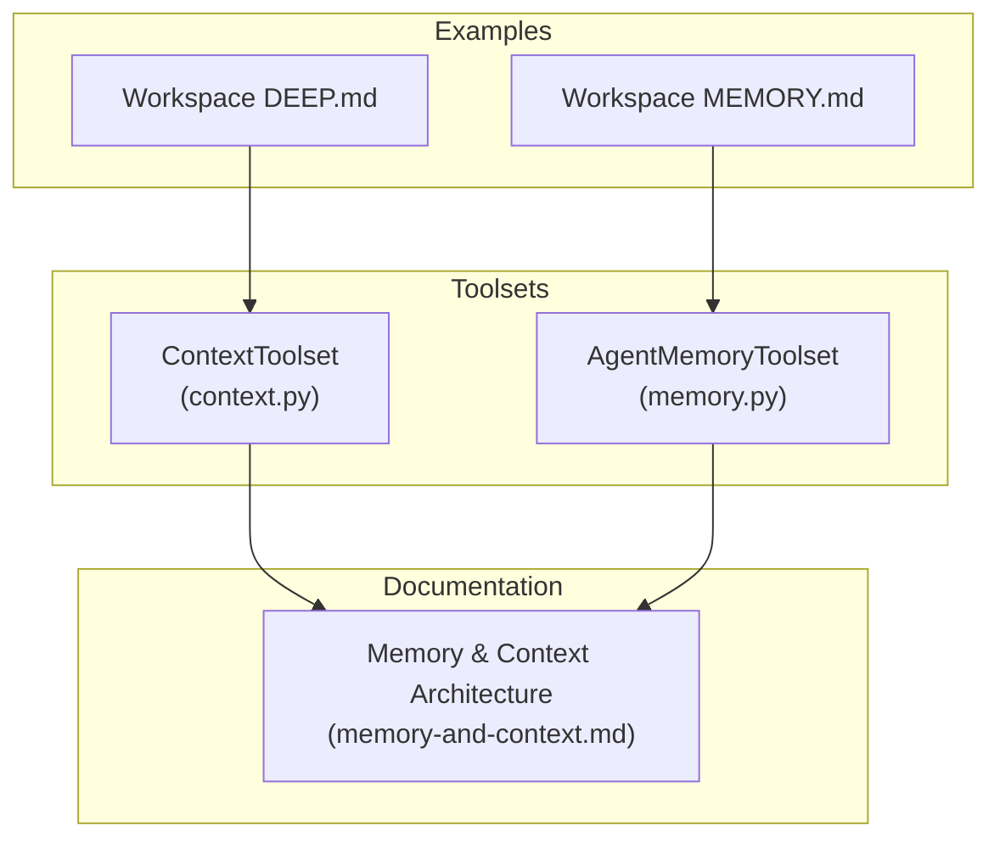
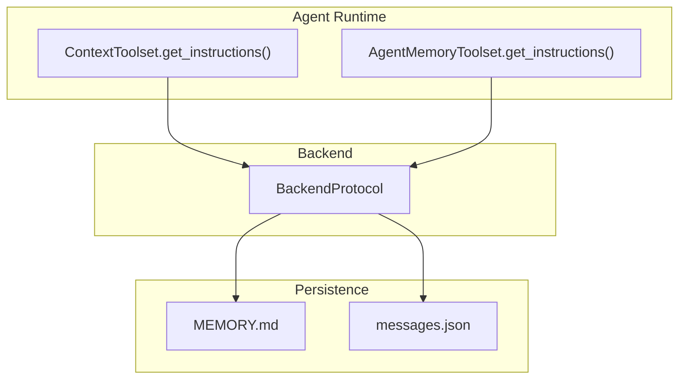
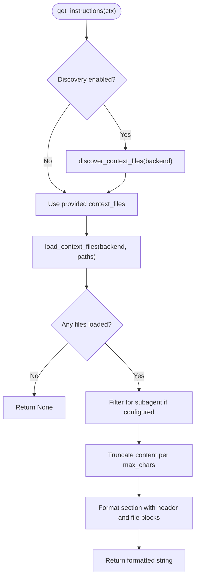
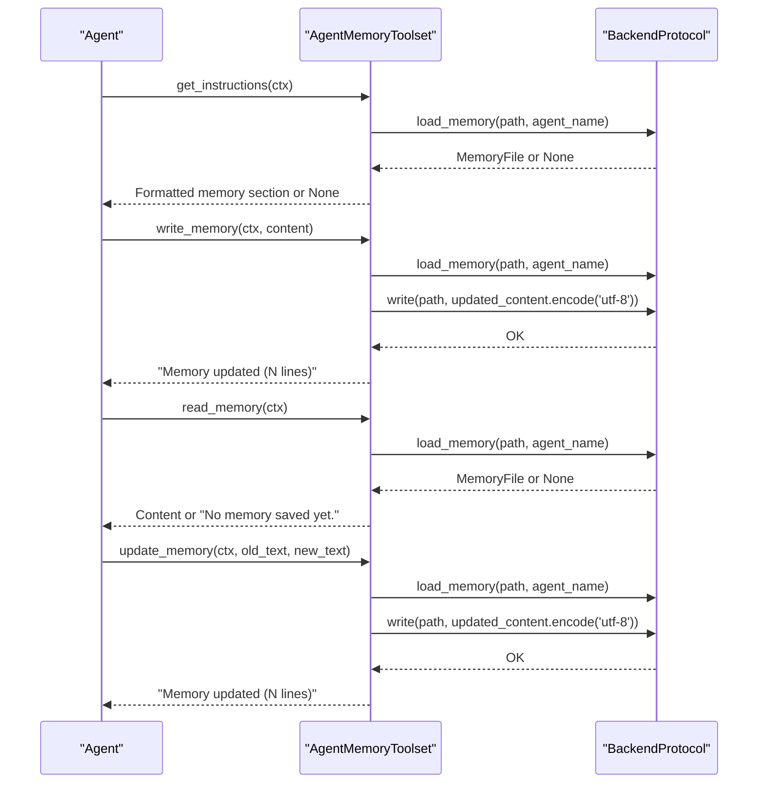
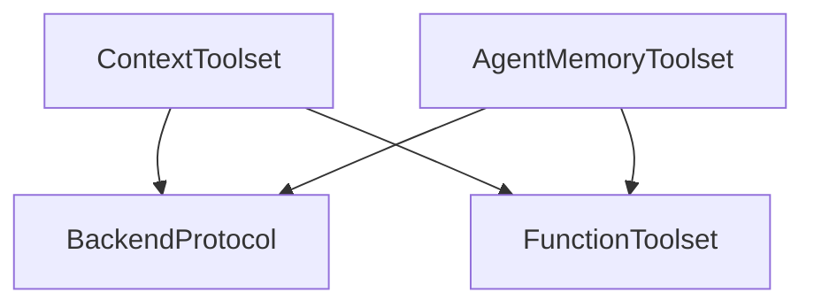

# Context and Memory Management

<cite>
**Referenced Files in This Document**
- [context.py](file://pydantic_deep/toolsets/context.py)
- [memory.py](file://pydantic_deep/toolsets/memory.py)
- [memory-and-context.md](file://docs/architecture/memory-and-context.md)
- [test_context.py](file://tests/test_context.py)
- [test_memory.py](file://tests/test_memory.py)
- [DEEP.md](file://apps/deepresearch/workspace/DEEP.md)
- [MEMORY.md](file://apps/deepresearch/workspace/MEMORY.md)
- [__init__.py](file://pydantic_deep/toolsets/__init__.py)
</cite>

## Table of Contents
1. [Introduction](#introduction)
2. [Project Structure](#project-structure)
3. [Core Components](#core-components)
4. [Architecture Overview](#architecture-overview)
5. [Detailed Component Analysis](#detailed-component-analysis)
6. [Dependency Analysis](#dependency-analysis)
7. [Performance Considerations](#performance-considerations)
8. [Troubleshooting Guide](#troubleshooting-guide)
9. [Conclusion](#conclusion)
10. [Appendices](#appendices)

## Introduction
This document explains the Context and Memory Management toolsets that enable persistent storage and intelligent context injection for agents. It covers:
- Context toolset: automatic discovery and injection of project context files into the system prompt
- Memory toolset: persistent agent memory and conversation history management
- Workspace management patterns and integration with other toolsets
- Memory architecture, persistence strategies, and performance optimizations
- Practical examples and best practices for effective agent memory

## Project Structure
The relevant implementation lives in the toolsets package, with supporting documentation and examples in the repository:
- Context toolset: [context.py](file://pydantic_deep/toolsets/context.py)
- Memory toolset: [memory.py](file://pydantic_deep/toolsets/memory.py)
- Architecture overview: [memory-and-context.md](file://docs/architecture/memory-and-context.md)
- Example workspace context and memory files: [DEEP.md](file://apps/deepresearch/workspace/DEEP.md), [MEMORY.md](file://apps/deepresearch/workspace/MEMORY.md)
- Toolset exports: [__init__.py](file://pydantic_deep/toolsets/__init__.py)

**Diagram sources**
- [context.py:150-208](file://pydantic_deep/toolsets/context.py#L150-L208)
- [memory.py:130-231](file://pydantic_deep/toolsets/memory.py#L130-L231)
- [memory-and-context.md:1-429](file://docs/architecture/memory-and-context.md#L1-L429)
- [DEEP.md:1-12](file://apps/deepresearch/workspace/DEEP.md#L1-L12)
- [MEMORY.md:1-4](file://apps/deepresearch/workspace/MEMORY.md#L1-L4)

**Section sources**
- [context.py:1-208](file://pydantic_deep/toolsets/context.py#L1-L208)
- [memory.py:1-231](file://pydantic_deep/toolsets/memory.py#L1-L231)
- [memory-and-context.md:1-429](file://docs/architecture/memory-and-context.md#L1-L429)
- [DEEP.md:1-12](file://apps/deepresearch/workspace/DEEP.md#L1-L12)
- [MEMORY.md:1-4](file://apps/deepresearch/workspace/MEMORY.md#L1-L4)
- [__init__.py:1-25](file://pydantic_deep/toolsets/__init__.py#L1-L25)

## Core Components
- ContextToolset: Loads and injects project context files into the system prompt. Supports explicit file lists, auto-discovery, subagent filtering, and safe truncation.
- AgentMemoryToolset: Manages persistent agent memory via MEMORY.md files, with tools to read, append, and update memory, plus system prompt injection of recent memory.

Key behaviors:
- ContextToolset
  - Discovers files by default filename list or accepts explicit paths
  - Applies subagent allowlist filtering when configured
  - Truncates content to protect token budgets
  - Injects formatted context into the system prompt
- AgentMemoryToolset
  - Stores memory under a configurable directory and per-agent path
  - Injects a capped number of lines into the system prompt
  - Provides read/write/update tools with UTF-8 handling and line counting feedback

**Section sources**
- [context.py:47-208](file://pydantic_deep/toolsets/context.py#L47-L208)
- [memory.py:69-231](file://pydantic_deep/toolsets/memory.py#L69-L231)

## Architecture Overview
The Context and Memory toolsets integrate with the broader agent architecture:
- ContextToolset participates in system prompt construction via get_instructions()
- AgentMemoryToolset participates in system prompt construction and exposes memory tools
- Together with middleware and processors, they form a cohesive pipeline for context management and persistence

**Diagram sources**
- [context.py:181-208](file://pydantic_deep/toolsets/context.py#L181-L208)
- [memory.py:217-231](file://pydantic_deep/toolsets/memory.py#L217-L231)
- [memory-and-context.md:12-58](file://docs/architecture/memory-and-context.md#L12-L58)

**Section sources**
- [memory-and-context.md:12-58](file://docs/architecture/memory-and-context.md#L12-L58)
- [context.py:150-208](file://pydantic_deep/toolsets/context.py#L150-L208)
- [memory.py:130-231](file://pydantic_deep/toolsets/memory.py#L130-L231)

## Detailed Component Analysis

### ContextToolset
Responsibilities:
- Discover context files (default AGENT.md) or load explicitly provided paths
- Filter files for subagents using an allowlist
- Truncate content to protect token budgets
- Format a system prompt section and return it via get_instructions()

Processing logic:
- Discovery scans a root path for configured filenames and collects readable paths
- Loading decodes bytes to UTF-8 with replacement for invalid sequences
- Formatting applies truncation preserving head and tail portions and adds a section header
- get_instructions orchestrates discovery/loading/formatting and returns None if nothing to inject

**Diagram sources**
- [context.py:73-148](file://pydantic_deep/toolsets/context.py#L73-L148)
- [context.py:181-208](file://pydantic_deep/toolsets/context.py#L181-L208)

Practical usage patterns:
- Automatic discovery in root: configure the toolset with discovery enabled to pick up AGENT.md
- Explicit paths: supply a list of absolute paths for deterministic control
- Subagent isolation: rely on allowlist filtering so subagents only see permitted files
- Size management: tune max_chars to fit within token budgets

Integration examples:
- Combine with other toolsets in an agent configuration
- Use in both main and subagents with appropriate flags

**Section sources**
- [context.py:47-208](file://pydantic_deep/toolsets/context.py#L47-L208)
- [test_context.py:48-124](file://tests/test_context.py#L48-L124)
- [test_context.py:293-335](file://tests/test_context.py#L293-L335)

### AgentMemoryToolset
Responsibilities:
- Persist agent memory in MEMORY.md under a per-agent path
- Inject a capped number of lines into the system prompt
- Provide tools to read, append, and update memory safely

Processing logic:
- Path computation builds a consistent backend path per agent
- Loading decodes UTF-8 with replacement and returns None if missing
- Formatting truncates long memory to preserve recent context
- Tools:
  - read_memory: returns full content or a “no memory” message
  - write_memory: appends content with proper separation and reports total line count
  - update_memory: exact-text find-and-replace with feedback and total line count

**Diagram sources**
- [memory.py:69-231](file://pydantic_deep/toolsets/memory.py#L69-L231)

Best practices:
- Keep memory concise; rely on the truncation mechanism to maintain fit
- Use update_memory for precise corrections rather than repeated writes
- Store only what the agent should remember; avoid dumping large outputs directly

**Section sources**
- [memory.py:69-231](file://pydantic_deep/toolsets/memory.py#L69-L231)
- [test_memory.py:95-123](file://tests/test_memory.py#L95-L123)
- [test_memory.py:225-256](file://tests/test_memory.py#L225-L256)
- [test_memory.py:264-328](file://tests/test_memory.py#L264-L328)

### Workspace Management and Examples
- Workspace context files (e.g., DEEP.md) demonstrate how to organize project-level guidance and file layout
- MEMORY.md demonstrates how to frame persistent agent memory for the workspace
- These files serve as examples for context and memory content structure

**Section sources**
- [DEEP.md:1-12](file://apps/deepresearch/workspace/DEEP.md#L1-L12)
- [MEMORY.md:1-4](file://apps/deepresearch/workspace/MEMORY.md#L1-L4)

## Dependency Analysis
- Both toolsets depend on BackendProtocol for reading and writing files
- ContextToolset depends on FunctionToolset.get_instructions() for system prompt injection
- AgentMemoryToolset depends on FunctionToolset.tool() for registering memory tools and get_instructions() for injection
- Integration with middleware and processors is documented in the architecture guide

**Diagram sources**
- [context.py:150-208](file://pydantic_deep/toolsets/context.py#L150-L208)
- [memory.py:130-231](file://pydantic_deep/toolsets/memory.py#L130-L231)

**Section sources**
- [context.py:150-208](file://pydantic_deep/toolsets/context.py#L150-L208)
- [memory.py:130-231](file://pydantic_deep/toolsets/memory.py#L130-L231)

## Performance Considerations
- Context truncation: Head-tail truncation preserves both start and end of files while marking removed content
- Memory truncation: Limits injected memory to a fixed number of lines to reduce token usage
- UTF-8 decoding with replacement avoids failures on malformed content
- Backend abstraction: All IO goes through BackendProtocol, enabling efficient backends and sandboxing

Recommendations:
- Tune max_chars and max_lines to match your model’s context window
- Prefer targeted updates over frequent appends to keep memory concise
- Use subagent allowlists to minimize unnecessary context injection

**Section sources**
- [context.py:98-148](file://pydantic_deep/toolsets/context.py#L98-L148)
- [memory.py:106-128](file://pydantic_deep/toolsets/memory.py#L106-L128)
- [memory-and-context.md:386-429](file://docs/architecture/memory-and-context.md#L386-L429)

## Troubleshooting Guide
Common issues and resolutions:
- Missing context files: Discovery skips missing files; ensure files exist at the expected paths or provide explicit paths
- Subagent visibility: If a subagent does not see expected files, verify the allowlist configuration
- Memory not injected: get_instructions returns None when no memory exists; create memory first with write_memory
- Large memory or context: Use truncation parameters to keep within token limits
- Encoding issues: UTF-8 decoding with replacement handles invalid sequences gracefully

Validation references:
- ContextToolset unit tests cover explicit files, discovery, and truncation behavior
- AgentMemoryToolset unit tests cover loading, truncation, and tool operations

**Section sources**
- [test_context.py:48-124](file://tests/test_context.py#L48-L124)
- [test_context.py:293-335](file://tests/test_context.py#L293-L335)
- [test_memory.py:95-123](file://tests/test_memory.py#L95-L123)
- [test_memory.py:225-256](file://tests/test_memory.py#L225-L256)
- [test_memory.py:264-328](file://tests/test_memory.py#L264-L328)

## Conclusion
The Context and Memory Management toolsets provide robust mechanisms for injecting project context and maintaining persistent agent memory. By combining discovery, filtering, truncation, and backend-backed persistence, they enable agents to operate effectively within constrained token budgets while retaining important knowledge across sessions. Integrating these toolsets with middleware and processors yields a complete pipeline for conversation history management and long-term memory.

## Appendices

### API Summary
- ContextToolset
  - Initialization parameters: context_files, context_discovery, is_subagent, max_chars
  - Methods: get_instructions(ctx)
- AgentMemoryToolset
  - Initialization parameters: agent_name, memory_dir, max_lines, descriptions
  - Tools: read_memory(), write_memory(content), update_memory(old_text, new_text)
  - Methods: get_instructions(ctx)

**Section sources**
- [context.py:159-208](file://pydantic_deep/toolsets/context.py#L159-L208)
- [memory.py:145-231](file://pydantic_deep/toolsets/memory.py#L145-L231)