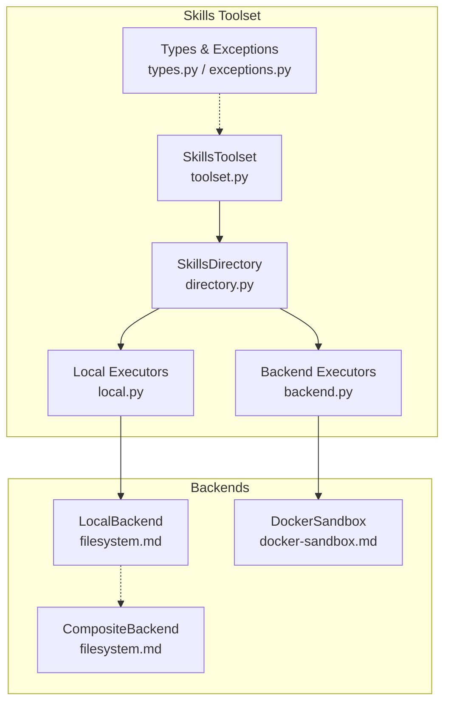
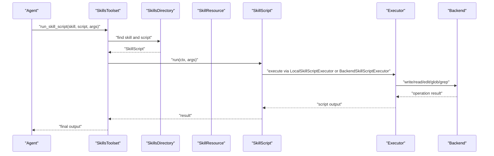
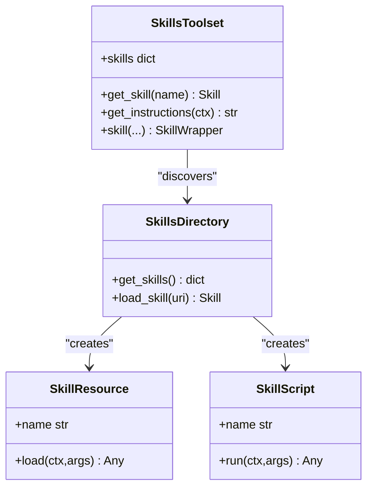
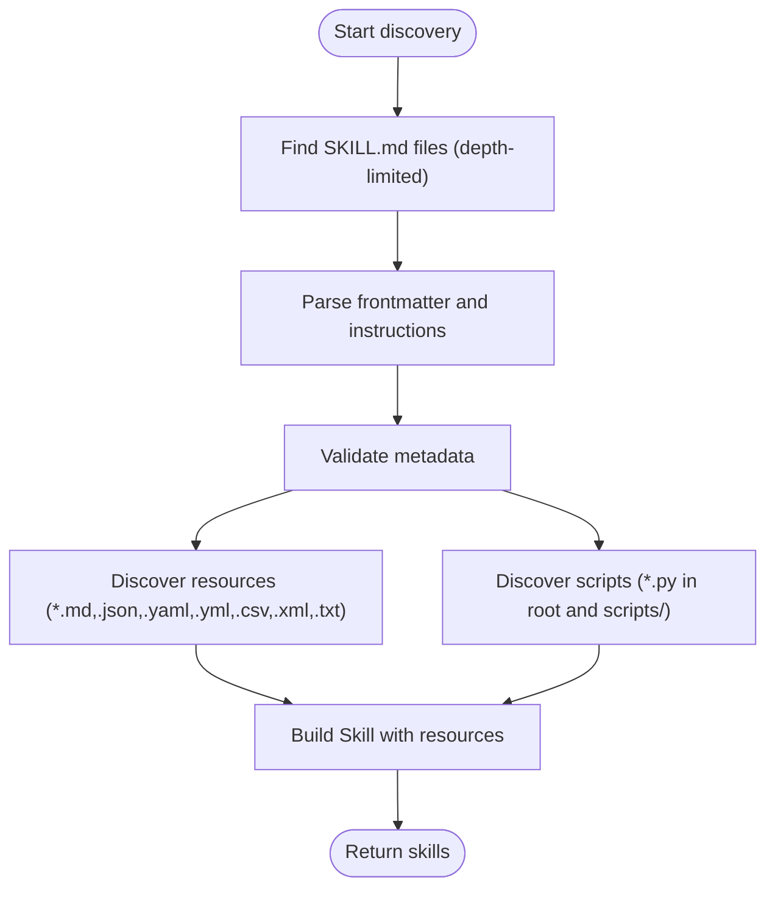
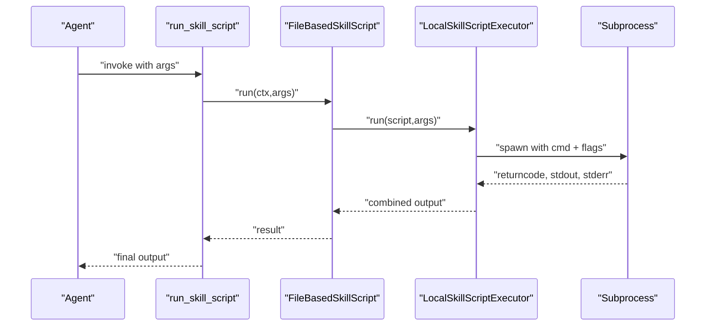
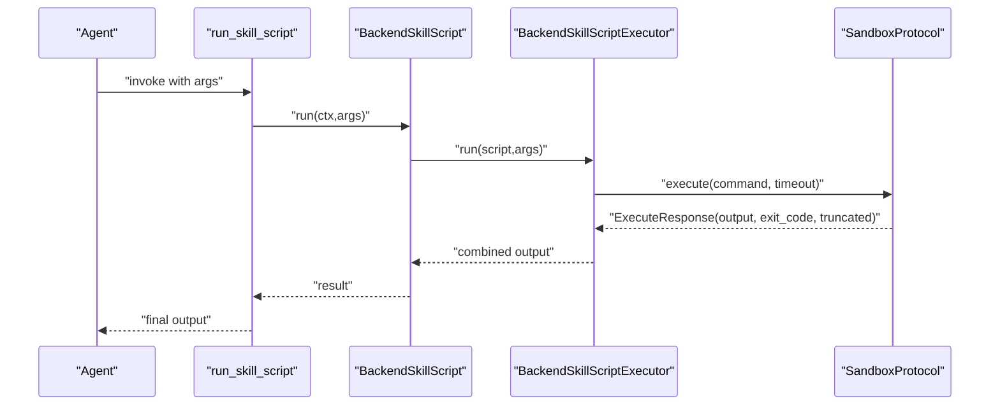
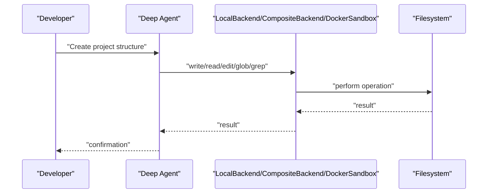
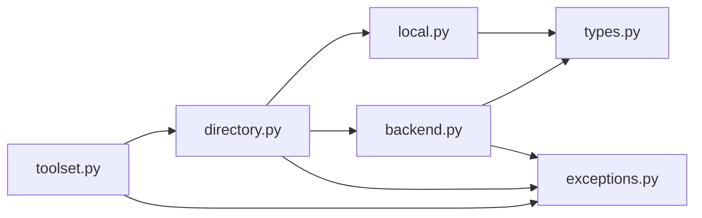

# Filesystem Operations

<cite>
**Referenced Files in This Document**
- [filesystem.md](file://docs/examples/filesystem.md)
- [filesystem_backend.py](file://examples/filesystem_backend.py)
- [docker-sandbox.md](file://docs/examples/docker-sandbox.md)
- [docker_sandbox.py](file://examples/docker_sandbox.py)
- [Dockerfile](file://apps/deepresearch/Dockerfile)
- [docker-compose.yml](file://apps/deepresearch/docker-compose.yml)
- [toolset.py](file://pydantic_deep/toolsets/skills/toolset.py)
- [directory.py](file://pydantic_deep/toolsets/skills/directory.py)
- [local.py](file://pydantic_deep/toolsets/skills/local.py)
- [backend.py](file://pydantic_deep/toolsets/skills/backend.py)
- [types.py](file://pydantic_deep/toolsets/skills/types.py)
- [exceptions.py](file://pydantic_deep/toolsets/skills/exceptions.py)
</cite>

## Table of Contents
1. [Introduction](#introduction)
2. [Project Structure](#project-structure)
3. [Core Components](#core-components)
4. [Architecture Overview](#architecture-overview)
5. [Detailed Component Analysis](#detailed-component-analysis)
6. [Dependency Analysis](#dependency-analysis)
7. [Performance Considerations](#performance-considerations)
8. [Troubleshooting Guide](#troubleshooting-guide)
9. [Conclusion](#conclusion)
10. [Appendices](#appendices)

## Introduction
This document describes the Filesystem Operations toolset and related capabilities for safe, sandboxed file manipulation. It covers:
- Console and file operations across local and backend sandboxes
- Sandbox integration, security considerations, and permission management
- File operations (create, delete, move, copy, edit, search) with robust error handling
- Practical workflows, path management, and integration with other toolsets
- The filesystem abstraction layer, security hooks, and best practices
- Docker sandboxing, container security, and production deployment considerations

## Project Structure
The filesystem operations are implemented across:
- A skills-based toolset that discovers and exposes file-backed resources and scripts
- Backend abstractions supporting local, composite, and Docker sandbox backends
- Example documentation and runnable examples demonstrating safe file workflows

**Diagram sources**
- [toolset.py:112-598](file://pydantic_deep/toolsets/skills/toolset.py#L112-L598)
- [directory.py:444-532](file://pydantic_deep/toolsets/skills/directory.py#L444-L532)
- [local.py:35-313](file://pydantic_deep/toolsets/skills/local.py#L35-L313)
- [backend.py:46-565](file://pydantic_deep/toolsets/skills/backend.py#L46-L565)
- [filesystem.md:147-171](file://docs/examples/filesystem.md#L147-L171)
- [docker-sandbox.md:244-266](file://docs/examples/docker-sandbox.md#L244-L266)

**Section sources**
- [filesystem.md:147-171](file://docs/examples/filesystem.md#L147-L171)
- [docker-sandbox.md:244-266](file://docs/examples/docker-sandbox.md#L244-L266)

## Core Components
- SkillsToolset: Registers and exposes tools for listing skills, loading skill details, reading skill resources, and running skill scripts. These scripts can encapsulate file operations safely within a sandbox.
- SkillsDirectory: Discovers skills from filesystem directories, validating metadata and building resource/script lists. It enforces safe discovery by resolving paths and guarding against symlink escapes.
- LocalSkillScriptExecutor: Executes file-based scripts in a subprocess with timeouts and argument marshalling.
- BackendSkillResource/BackendSkillScriptExecutor: Loads resources and executes scripts via backend protocols, enabling Docker sandbox execution.
- BackendSkillsDirectory: Discovers skills from backend filesystems (e.g., Docker containers) and builds resource/script lists for execution.
- Types and Exceptions: Strongly typed models for skills, resources, and scripts, plus a dedicated exception hierarchy for robust error handling.

Key capabilities:
- Safe file-backed resources (JSON, YAML, CSV, XML, TXT) with automatic parsing
- Executable scripts packaged with skills, executed via subprocess or backend sandbox
- Backend-agnostic file operations (read, write, edit, list, glob, grep) via backends
- Human-in-the-loop approvals for execution-sensitive operations

**Section sources**
- [toolset.py:112-598](file://pydantic_deep/toolsets/skills/toolset.py#L112-L598)
- [directory.py:444-532](file://pydantic_deep/toolsets/skills/directory.py#L444-L532)
- [local.py:35-313](file://pydantic_deep/toolsets/skills/local.py#L35-L313)
- [backend.py:46-565](file://pydantic_deep/toolsets/skills/backend.py#L46-L565)
- [types.py:75-521](file://pydantic_deep/toolsets/skills/types.py#L75-L521)
- [exceptions.py:20-42](file://pydantic_deep/toolsets/skills/exceptions.py#L20-L42)

## Architecture Overview
The filesystem operations layer sits atop a skills abstraction that can source resources and scripts from local or backend filesystems. Scripts can be executed locally or within Docker sandboxes, depending on the backend configuration.

**Diagram sources**
- [toolset.py:425-456](file://pydantic_deep/toolsets/skills/toolset.py#L425-L456)
- [directory.py:347-442](file://pydantic_deep/toolsets/skills/directory.py#L347-L442)
- [local.py:112-182](file://pydantic_deep/toolsets/skills/local.py#L112-L182)
- [backend.py:133-190](file://pydantic_deep/toolsets/skills/backend.py#L133-L190)

## Detailed Component Analysis

### SkillsToolset and Skill Management
- Provides tools: list_skills, load_skill, read_skill_resource, run_skill_script
- Supports programmatic skills and directory-based discovery
- Integrates with RunContext for dependency access and schema generation

**Diagram sources**
- [toolset.py:112-598](file://pydantic_deep/toolsets/skills/toolset.py#L112-L598)
- [directory.py:444-532](file://pydantic_deep/toolsets/skills/directory.py#L444-L532)
- [types.py:75-177](file://pydantic_deep/toolsets/skills/types.py#L75-L177)

**Section sources**
- [toolset.py:112-598](file://pydantic_deep/toolsets/skills/toolset.py#L112-L598)
- [types.py:75-177](file://pydantic_deep/toolsets/skills/types.py#L75-L177)

### SkillsDirectory: Safe Discovery and Parsing
- Discovers SKILL.md files with depth-limited recursion
- Parses YAML frontmatter and instructions, with fallback parsing
- Validates skill metadata and warns on issues
- Builds resource lists from supported extensions (.md, .json, .yaml/.yml, .csv, .xml, .txt)
- Builds script lists from root and scripts/ subdirectory, excluding __init__.py
- Guards against symlink escapes by resolving paths and checking containment

**Diagram sources**
- [directory.py:347-442](file://pydantic_deep/toolsets/skills/directory.py#L347-L442)
- [directory.py:220-344](file://pydantic_deep/toolsets/skills/directory.py#L220-L344)

**Section sources**
- [directory.py:347-442](file://pydantic_deep/toolsets/skills/directory.py#L347-L442)
- [directory.py:220-344](file://pydantic_deep/toolsets/skills/directory.py#L220-L344)

### Local Executors: Subprocess-Based Script Execution
- Executes file-based scripts via subprocess with argument marshalling
- Supports boolean flags, repeated flags for lists, and string conversion
- Enforces timeouts and captures stdout/stderr
- Provides a callable executor wrapper for custom execution logic

**Diagram sources**
- [local.py:112-182](file://pydantic_deep/toolsets/skills/local.py#L112-L182)
- [toolset.py:425-456](file://pydantic_deep/toolsets/skills/toolset.py#L425-L456)

**Section sources**
- [local.py:112-182](file://pydantic_deep/toolsets/skills/local.py#L112-L182)

### Backend Executors: Docker Sandbox Integration
- BackendSkillResource reads files via BackendProtocol._read_bytes with JSON/YAML auto-parsing
- BackendSkillScriptExecutor executes scripts via SandboxProtocol.execute with command construction and quoting
- BackendSkillsDirectory discovers skills from backend filesystems and builds resource/script lists
- Supports timeout control and output truncation reporting

**Diagram sources**
- [backend.py:133-190](file://pydantic_deep/toolsets/skills/backend.py#L133-L190)
- [backend.py:397-565](file://pydantic_deep/toolsets/skills/backend.py#L397-L565)

**Section sources**
- [backend.py:133-190](file://pydantic_deep/toolsets/skills/backend.py#L133-L190)
- [backend.py:397-565](file://pydantic_deep/toolsets/skills/backend.py#L397-L565)

### Practical Workflows and Examples
- LocalBackend example: Demonstrates creating a project structure and verifying files on disk
- CompositeBackend example: Routes operations to different backends by path prefix
- DockerSandbox example: Isolated execution with approval prompts, persistent volumes, and runtime configurations

**Diagram sources**
- [filesystem_backend.py:14-60](file://examples/filesystem_backend.py#L14-L60)
- [filesystem.md:147-171](file://docs/examples/filesystem.md#L147-L171)
- [docker_sandbox.py:17-93](file://examples/docker_sandbox.py#L17-L93)

**Section sources**
- [filesystem_backend.py:14-60](file://examples/filesystem_backend.py#L14-L60)
- [filesystem.md:147-171](file://docs/examples/filesystem.md#L147-L171)
- [docker_sandbox.py:17-93](file://examples/docker_sandbox.py#L17-L93)

## Dependency Analysis
- SkillsToolset depends on SkillsDirectory for discovery and types for modeling
- SkillsDirectory depends on local.py and backend.py for executors and on types.py for models
- BackendSkillsDirectory depends on backend.py executors and directory.py parsing utilities
- Exceptions module centralizes error handling across the skills subsystem

**Diagram sources**
- [toolset.py:112-598](file://pydantic_deep/toolsets/skills/toolset.py#L112-L598)
- [directory.py:444-532](file://pydantic_deep/toolsets/skills/directory.py#L444-L532)
- [local.py:35-313](file://pydantic_deep/toolsets/skills/local.py#L35-L313)
- [backend.py:46-565](file://pydantic_deep/toolsets/skills/backend.py#L46-L565)
- [types.py:75-521](file://pydantic_deep/toolsets/skills/types.py#L75-L521)
- [exceptions.py:20-42](file://pydantic_deep/toolsets/skills/exceptions.py#L20-L42)

**Section sources**
- [toolset.py:112-598](file://pydantic_deep/toolsets/skills/toolset.py#L112-L598)
- [directory.py:444-532](file://pydantic_deep/toolsets/skills/directory.py#L444-L532)
- [local.py:35-313](file://pydantic_deep/toolsets/skills/local.py#L35-L313)
- [backend.py:46-565](file://pydantic_deep/toolsets/skills/backend.py#L46-L565)
- [types.py:75-521](file://pydantic_deep/toolsets/skills/types.py#L75-L521)
- [exceptions.py:20-42](file://pydantic_deep/toolsets/skills/exceptions.py#L20-L42)

## Performance Considerations
- Depth-limited discovery prevents excessive scanning in large directory trees
- YAML parsing is optional and falls back to text when unavailable
- Subprocess execution includes timeouts to avoid hanging operations
- Backend execution reports truncated output to prevent oversized responses
- Use globbing and grep for efficient search rather than manual traversal

[No sources needed since this section provides general guidance]

## Troubleshooting Guide
Common issues and resolutions:
- Skill not found: Verify skill name and ensure SKILL.md exists with required metadata
- Resource/script not found: Confirm exact names and paths; resources exclude SKILL.md and scripts exclude __init__.py
- Execution failures: Check backend availability, permissions, and timeouts; review stderr output
- Symlink escape warnings: Ensure paths resolve within the intended directory
- Docker sandbox errors: Confirm Docker is running, images are pulled, and volumes are correctly mapped

**Section sources**
- [exceptions.py:20-42](file://pydantic_deep/toolsets/skills/exceptions.py#L20-L42)
- [directory.py:220-344](file://pydantic_deep/toolsets/skills/directory.py#L220-L344)
- [docker-sandbox.md:286-300](file://docs/examples/docker-sandbox.md#L286-L300)

## Conclusion
The Filesystem Operations toolset provides a secure, extensible framework for discovering, reading, and executing file-backed resources and scripts. By leveraging backend abstractions—local, composite, and Docker sandbox—you can enforce strict security policies, manage permissions, and integrate with production-grade containerized environments. Use the provided examples and best practices to build reliable workflows for file manipulation while maintaining safety and traceability.

[No sources needed since this section summarizes without analyzing specific files]

## Appendices

### Backend Operations Reference
- glob_info(pattern, path): Find files by glob pattern
- grep_raw(pattern, path): Search content across files
- read(path, offset=None, limit=None): Read partial content
- edit(path, old_string, new_string): Replace content safely
- ls_info(path): List directory entries
- write(path, content): Write content to file

**Section sources**
- [filesystem.md:151-171](file://docs/examples/filesystem.md#L151-L171)
- [docker-sandbox.md:244-266](file://docs/examples/docker-sandbox.md#L244-L266)

### Production Deployment Notes
- Docker sandboxing: Use slim images, set timeouts, require approvals, and clean up containers
- Persistent storage: Mount volumes or use SessionManager for per-session workspaces
- Multi-backend routing: Use CompositeBackend to separate temporary and persistent storage
- Application packaging: Build with Dockerfile and compose for reproducible deployments

**Section sources**
- [docker-sandbox.md:113-175](file://docs/examples/docker-sandbox.md#L113-L175)
- [docker-sandbox.md:214-243](file://docs/examples/docker-sandbox.md#L214-L243)
- [Dockerfile:1-48](file://apps/deepresearch/Dockerfile#L1-L48)
- [docker-compose.yml:1-29](file://apps/deepresearch/docker-compose.yml#L1-L29)