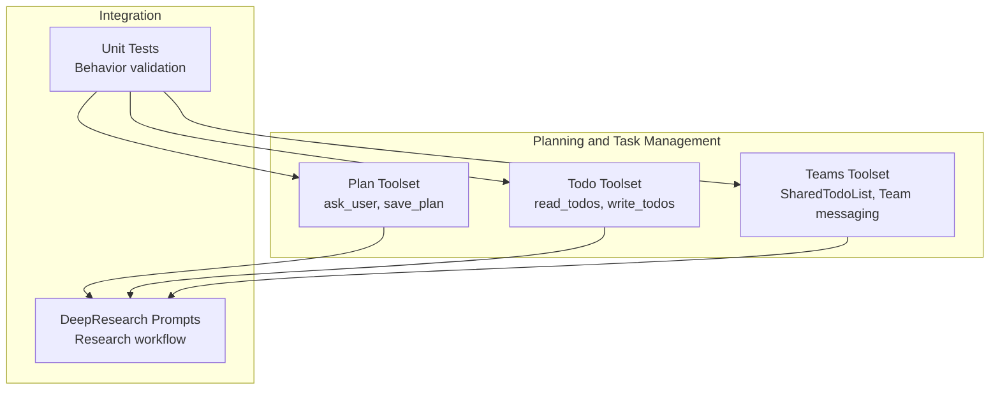
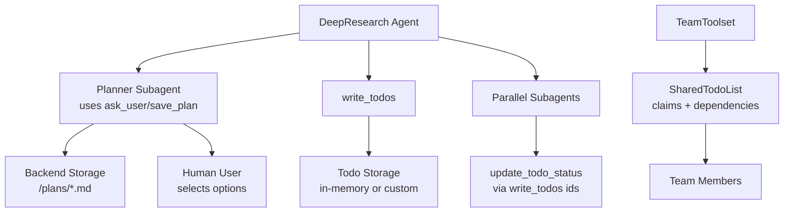
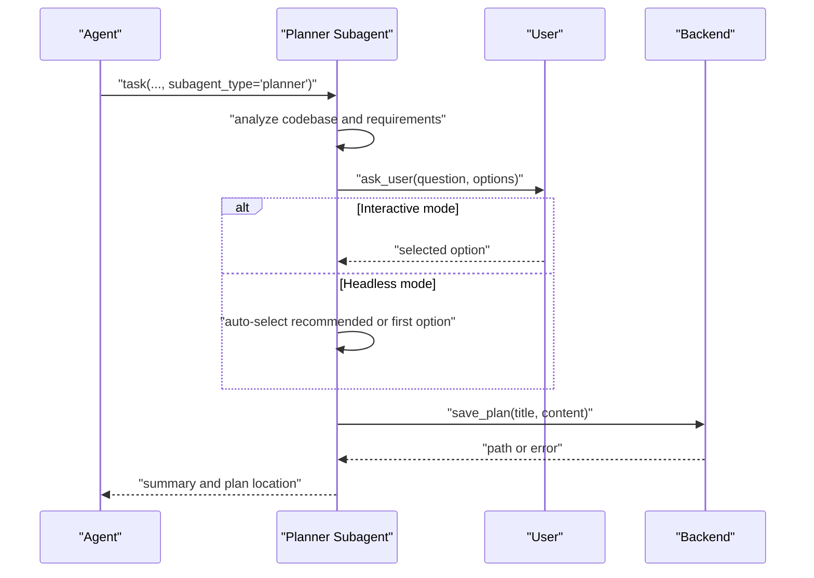
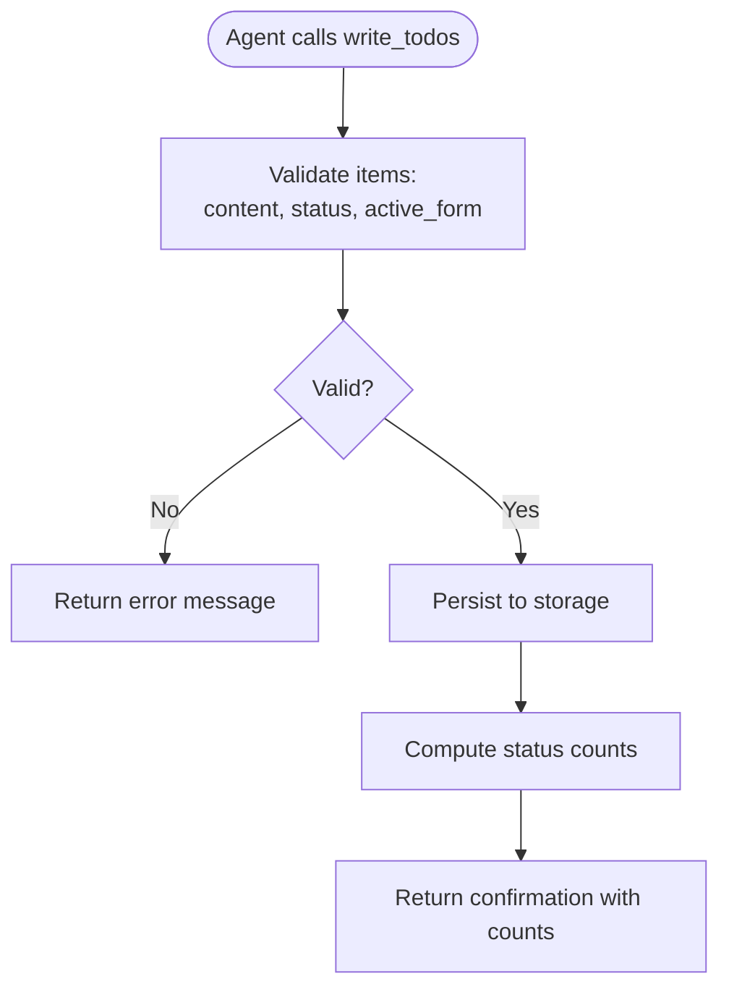
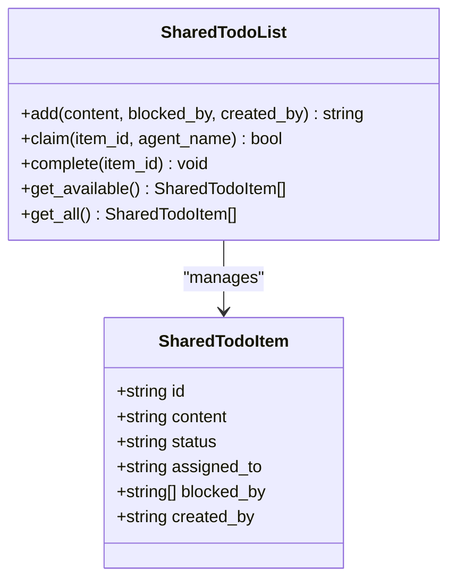
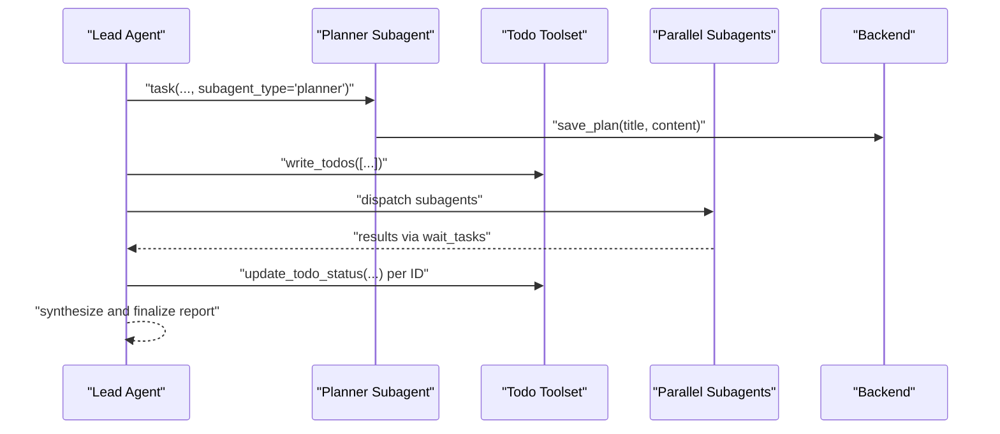
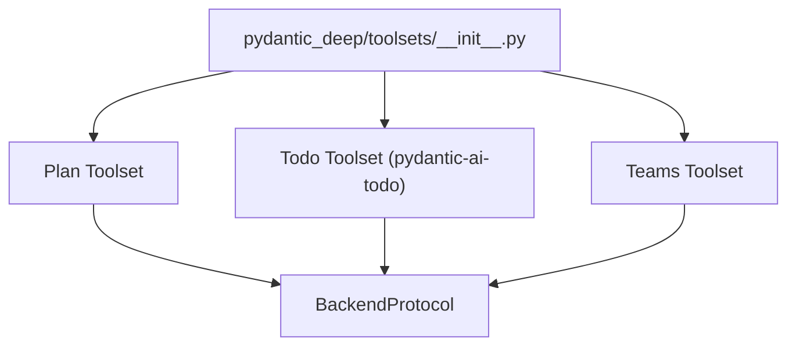

# Planning and Task Management

<cite>
**Referenced Files in This Document**
- [toolset.py](file://pydantic_deep/toolsets/plan/toolset.py)
- [__init__.py](file://pydantic_deep/toolsets/__init__.py)
- [teams.py](file://pydantic_deep/toolsets/teams.py)
- [prompts.py](file://apps/deepresearch/src/deepresearch/prompts.py)
- [toolsets.md](file://docs/concepts/toolsets.md)
- [toolsets.md](file://docs/api/toolsets.md)
- [plan-mode.md](file://docs/advanced/plan-mode.md)
- [teams.md](file://docs/advanced/teams.md)
- [test_toolsets.py](file://tests/test_toolsets.py)
- [test_teams.py](file://tests/test_teams.py)
- [events.jsonl (workspace 05f28b7b-77d5-4778-82f7-6fea79fc77f5)](file://apps/deepresearch/workspaces/05f28b7b-77d5-4778-82f7-6fea79fc77f5/events.jsonl)
- [events.jsonl (workspace a9edd236-3c97-42ee-951f-34557dabf067)](file://apps/deepresearch/workspaces/a9edd236-3c97-42ee-951f-34557dabf067/events.jsonl)
- [events.jsonl (workspace aece0dae-a97c-42fe-9d18-ec04835c1107)](file://apps/deepresearch/workspaces/aece0dae-a97c-42fe-9d18-ec04835c1107/events.jsonl)
- [events.jsonl (workspace 47506bec-2ee8-4538-9225-e69769817d67)](file://apps/deepresearch/workspaces/47506bec-2ee8-4538-9225-e69769817d67/events.jsonl)
- [events.jsonl (workspace a182fd1a-d29c-458c-bd81-51f264506988)](file://apps/deepresearch/workspaces/a182fd1a-d29c-458c-bd81-51f264506988/events.jsonl)
- [events.jsonl (workspace e47c0d09-ca4e-4121-95f1-b720d727f89a)](file://apps/deepresearch/workspaces/e47c0d09-ca4e-4121-95f1-b720d727f89a/events.jsonl)
- [events.jsonl (workspace b34d69f1-4dbc-4c4e-98c6-f48ae0ad200e)](file://apps/deepresearch/workspaces/b34d69f1-4dbc-4c4e-98c6-f48ae0ad200e/events.jsonl)
</cite>

## Table of Contents
1. [Introduction](#introduction)
2. [Project Structure](#project-structure)
3. [Core Components](#core-components)
4. [Architecture Overview](#architecture-overview)
5. [Detailed Component Analysis](#detailed-component-analysis)
6. [Dependency Analysis](#dependency-analysis)
7. [Performance Considerations](#performance-considerations)
8. [Troubleshooting Guide](#troubleshooting-guide)
9. [Conclusion](#conclusion)
10. [Appendices](#appendices)

## Introduction
This document describes the Planning and Task Management toolset within the pydantic-deep agent framework. It focuses on:
- The Plan toolset for interactive planning with “ask_user” and “save_plan”
- The Todo toolset for task creation, status tracking, and progress monitoring
- The Teams toolset for shared task coordination and dependency-aware assignment
- How planning coordinates with execution phases and integrates with other toolsets

It explains how complex tasks are broken down into manageable subtasks, how dependencies are tracked and resolved automatically, and how status updates drive execution. Practical examples illustrate research planning, development workflows, and multi-step problem solving.

## Project Structure
The Planning and Task Management capabilities are implemented across three primary modules:
- Plan toolset: interactive planning with user questions and plan persistence
- Todo toolset: task list management with read/write operations
- Teams toolset: shared task lists with claiming and dependency resolution

**Diagram sources**
- [toolset.py:139-220](file://pydantic_deep/toolsets/plan/toolset.py#L139-L220)
- [__init__.py:8-13](file://pydantic_deep/toolsets/__init__.py#L8-L13)
- [teams.py:38-129](file://pydantic_deep/toolsets/teams.py#L38-L129)
- [prompts.py:72-182](file://apps/deepresearch/src/deepresearch/prompts.py#L72-L182)
- [test_toolsets.py:10-49](file://tests/test_toolsets.py#L10-L49)
- [test_teams.py:818-849](file://tests/test_teams.py#L818-L849)

**Section sources**
- [toolset.py:1-220](file://pydantic_deep/toolsets/plan/toolset.py#L1-L220)
- [__init__.py:1-25](file://pydantic_deep/toolsets/__init__.py#L1-L25)
- [teams.py:1-533](file://pydantic_deep/toolsets/teams.py#L1-L533)
- [prompts.py:1-320](file://apps/deepresearch/src/deepresearch/prompts.py#L1-L320)
- [toolsets.md:1-418](file://docs/concepts/toolsets.md#L1-L418)
- [toolsets.md:1-81](file://docs/api/toolsets.md#L1-L81)
- [plan-mode.md:62-130](file://docs/advanced/plan-mode.md#L62-L130)
- [teams.md:43-79](file://docs/advanced/teams.md#L43-L79)
- [test_toolsets.py:1-68](file://tests/test_toolsets.py#L1-L68)
- [test_teams.py:818-849](file://tests/test_teams.py#L818-L849)

## Core Components
- Plan Toolset
  - ask_user: Pauses planning to ask the user predefined questions; in headless mode, auto-selects a recommended option
  - save_plan: Persists the plan to a markdown file in the backend
- Todo Toolset
  - read_todos: Returns formatted task list with status indicators
  - write_todos: Updates the task list with new items and returns a confirmation summary
- Teams Toolset
  - SharedTodoList: Async-safe shared task tracker supporting claiming and dependency resolution
  - Team messaging: Peer-to-peer messaging for team coordination

These components integrate with the broader agent ecosystem and are used in the DeepResearch workflow to plan, track, and execute complex tasks.

**Section sources**
- [toolset.py:139-220](file://pydantic_deep/toolsets/plan/toolset.py#L139-L220)
- [toolsets.md:1-81](file://docs/api/toolsets.md#L1-L81)
- [teams.py:38-129](file://pydantic_deep/toolsets/teams.py#L38-L129)
- [teams.md:43-79](file://docs/advanced/teams.md#L43-L79)

## Architecture Overview
The Planning and Task Management architecture connects planning, task tracking, and execution:

**Diagram sources**
- [toolset.py:139-220](file://pydantic_deep/toolsets/plan/toolset.py#L139-L220)
- [prompts.py:72-182](file://apps/deepresearch/src/deepresearch/prompts.py#L72-L182)
- [teams.py:38-129](file://pydantic_deep/toolsets/teams.py#L38-L129)

## Detailed Component Analysis

### Plan Toolset
The Plan toolset enables interactive planning with two core tools:
- ask_user: Validates options, supports a recommended flag, and either invokes a user callback or auto-selects in headless mode
- save_plan: Generates a slugified filename from the title, writes the plan to backend storage, and returns a success or error message

**Diagram sources**
- [toolset.py:167-218](file://pydantic_deep/toolsets/plan/toolset.py#L167-L218)
- [plan-mode.md:113-130](file://docs/advanced/plan-mode.md#L113-L130)

Implementation highlights:
- Options validation enforces 2–4 choices and optional “recommended” flag
- Headless fallback ensures non-blocking execution
- Backend write encapsulates persistence and error reporting

**Section sources**
- [toolset.py:139-220](file://pydantic_deep/toolsets/plan/toolset.py#L139-L220)
- [plan-mode.md:62-130](file://docs/advanced/plan-mode.md#L62-L130)

### Todo Toolset
The Todo toolset provides:
- read_todos: Returns a formatted list with status icons and summary
- write_todos: Accepts a list of items with content, status, and active_form; returns confirmation with status counts

**Diagram sources**
- [toolsets.md:33-67](file://docs/api/toolsets.md#L33-L67)

Usage patterns:
- Explicit IDs for todos enable precise status updates
- active_form improves readability and user experience
- Status transitions: pending → in_progress → completed

**Section sources**
- [toolsets.md:1-81](file://docs/api/toolsets.md#L1-L81)
- [test_toolsets.py:13-49](file://tests/test_toolsets.py#L13-L49)

### Teams Toolset
The Teams toolset coordinates multi-agent task execution with:
- SharedTodoList: Adds tasks, claims tasks for agents, resolves dependencies, and exposes available tasks
- Team messaging: Broadcasts and sends direct messages between registered agents

**Diagram sources**
- [teams.py:21-129](file://pydantic_deep/toolsets/teams.py#L21-L129)

Operational flow:
- Tasks are added with optional dependencies
- Agents claim pending, unblocked tasks
- Completing a dependency unblocks downstream tasks
- Available tasks are filtered by pending, unclaimed, and unblocked criteria

**Section sources**
- [teams.py:38-129](file://pydantic_deep/toolsets/teams.py#L38-L129)
- [teams.md:43-79](file://docs/advanced/teams.md#L43-L79)
- [test_teams.py:818-849](file://tests/test_teams.py#L818-L849)

### Research Workflow Integration
The DeepResearch workflow demonstrates end-to-end planning and task management:
- Step 1: Use planner subagent to create a research plan
- Step 2: Create todos with explicit IDs and active forms
- Step 3: Dispatch parallel subagents for sub-topics
- Step 4: Wait for all results
- Step 5: Handle failures and continue
- Step 6: Synthesize and iterate on report sections
- Step 7: Present results

**Diagram sources**
- [prompts.py:72-182](file://apps/deepresearch/src/deepresearch/prompts.py#L72-L182)
- [toolset.py:139-220](file://pydantic_deep/toolsets/plan/toolset.py#L139-L220)
- [toolsets.md:1-81](file://docs/api/toolsets.md#L1-L81)

**Section sources**
- [prompts.py:1-320](file://apps/deepresearch/src/deepresearch/prompts.py#L1-L320)
- [toolsets.md:182-194](file://docs/concepts/toolsets.md#L182-L194)

## Dependency Analysis
The Planning and Task Management toolset integrates with:
- pydantic-ai-todo for Todo operations
- pydantic-ai-backends for backend storage and console toolset
- subagents-pydantic-ai for subagent orchestration
- Internal DeepAgentDeps for runtime dependencies

**Diagram sources**
- [__init__.py:3-13](file://pydantic_deep/toolsets/__init__.py#L3-L13)

**Section sources**
- [__init__.py:1-25](file://pydantic_deep/toolsets/__init__.py#L1-L25)

## Performance Considerations
- Asynchronous operations: SharedTodoList uses asyncio.Lock to ensure thread-safety under concurrency
- Minimal overhead: Todo operations are lightweight and suitable for frequent updates
- Scalability: Team messaging queues support broadcast and point-to-point communication without central coordination bottlenecks
- Persistence: Plans are persisted as markdown files, enabling offline inspection and audit trails

[No sources needed since this section provides general guidance]

## Troubleshooting Guide
Common issues and resolutions:
- ask_user options validation
  - Ensure 2–4 options are provided with label and description; optionally mark one as recommended
  - In headless mode, the recommended option is auto-selected if present
- save_plan errors
  - Verify backend write permissions and path availability
  - Confirm the title generates a valid slugified filename
- Todo status transitions
  - Always provide explicit IDs when creating todos to enable precise updates
  - Transition status in order: pending → in_progress → completed
- SharedTodoList blocking
  - Ensure upstream dependencies are marked completed before claiming downstream tasks
  - Use get_available to filter eligible tasks

**Section sources**
- [toolset.py:167-218](file://pydantic_deep/toolsets/plan/toolset.py#L167-L218)
- [toolsets.md:33-67](file://docs/api/toolsets.md#L33-L67)
- [teams.py:93-108](file://pydantic_deep/toolsets/teams.py#L93-L108)

## Conclusion
The Planning and Task Management toolset provides a cohesive framework for decomposing complex tasks, tracking progress, and coordinating execution across agents. The Plan toolset enables interactive planning with automatic dependency resolution, while the Todo and Teams toolsets offer robust task lifecycle management and multi-agent coordination. Together, they support research planning, development workflows, and multi-step problem solving with clear status tracking and seamless integration with other toolsets.

[No sources needed since this section summarizes without analyzing specific files]

## Appendices

### Practical Examples and Scenarios
- Research planning
  - Use planner subagent to define sub-topics and clarify scope
  - Create todos with explicit IDs and active forms
  - Dispatch parallel subagents and wait for results
  - Update todo statuses and synthesize the final report
- Development workflows
  - Break monolithic tasks into subtasks with clear dependencies
  - Claim tasks from the shared list and resolve blockers automatically
  - Use team messaging to coordinate handoffs and share context
- Multi-step problem solving
  - Use ask_user to select among multiple valid approaches
  - Persist the plan to markdown for auditability
  - Track progress iteratively with frequent status updates

**Section sources**
- [prompts.py:72-182](file://apps/deepresearch/src/deepresearch/prompts.py#L72-L182)
- [toolset.py:139-220](file://pydantic_deep/toolsets/plan/toolset.py#L139-L220)
- [teams.md:43-79](file://docs/advanced/teams.md#L43-L79)

### Parameter Specifications
- ask_user
  - question: string
  - options: list of dicts with keys label, description, optional recommended
- save_plan
  - title: string
  - content: string (markdown)
- write_todos
  - todos: list of dicts with keys content, status, active_form

**Section sources**
- [toolset.py:167-218](file://pydantic_deep/toolsets/plan/toolset.py#L167-L218)
- [toolsets.md:43-67](file://docs/api/toolsets.md#L43-L67)

### Integration Notes
- Enable toolsets in agent configuration
- Use get_todo_system_prompt to inject current task state into agent instructions
- Leverage team toolset for multi-agent collaboration with shared state

**Section sources**
- [toolsets.md:203-219](file://docs/concepts/toolsets.md#L203-L219)
- [test_toolsets.py:25-49](file://tests/test_toolsets.py#L25-L49)

### Evidence of Usage in Workspaces
- Planner subagent invocation examples
  - [events.jsonl (workspace 47506bec-2ee8-4538-9225-e69769817d67):67-78](file://apps/deepresearch/workspaces/47506bec-2ee8-4538-9225-e69769817d67/events.jsonl#L67-L78)
  - [events.jsonl (workspace a182fd1a-d29c-458c-bd81-51f264506988):89-97](file://apps/deepresearch/workspaces/a182fd1a-d29c-458c-bd81-51f264506988/events.jsonl#L89-L97)
  - [events.jsonl (workspace e47c0d09-ca4e-4121-95f1-b720d727f89a):56-67](file://apps/deepresearch/workspaces/e47c0d09-ca4e-4121-95f1-b720d727f89a/events.jsonl#L56-L67)
  - [events.jsonl (workspace b34d69f1-4dbc-4c4e-98c6-f48ae0ad200e):56-64](file://apps/deepresearch/workspaces/b34d69f1-4dbc-4c4e-98c6-f48ae0ad200e/events.jsonl#L56-L64)
- Todo creation and updates
  - [events.jsonl (workspace 05f28b7b-77d5-4778-82f7-6fea79fc77f5):111-121](file://apps/deepresearch/workspaces/05f28b7b-77d5-4778-82f7-6fea79fc77f5/events.jsonl#L111-L121)
  - [events.jsonl (workspace a9edd236-3c97-42ee-951f-34557dabf067):881-891](file://apps/deepresearch/workspaces/a9edd236-3c97-42ee-951f-34557dabf067/events.jsonl#L881-L891)
  - [events.jsonl (workspace aece0dae-a97c-42fe-9d18-ec04835c1107):1100-3155](file://apps/deepresearch/workspaces/aece0dae-a97c-42fe-9d18-ec04835c1107/events.jsonl#L1100-L3155)