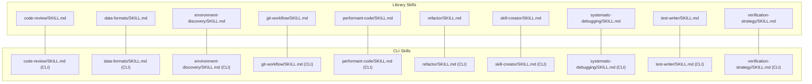
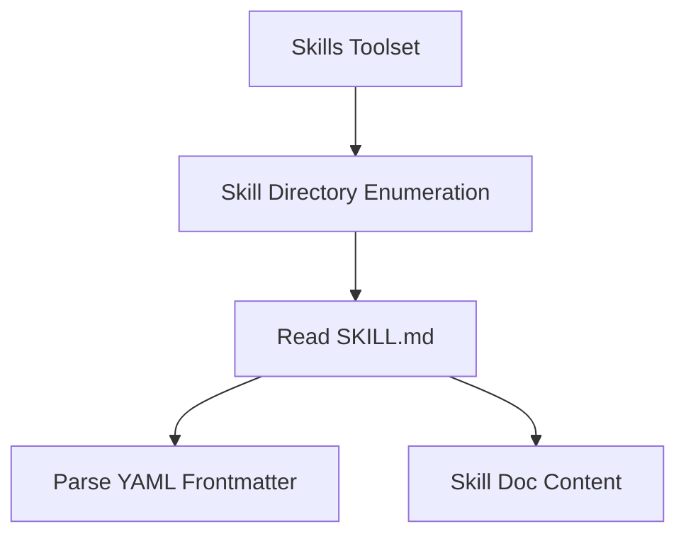
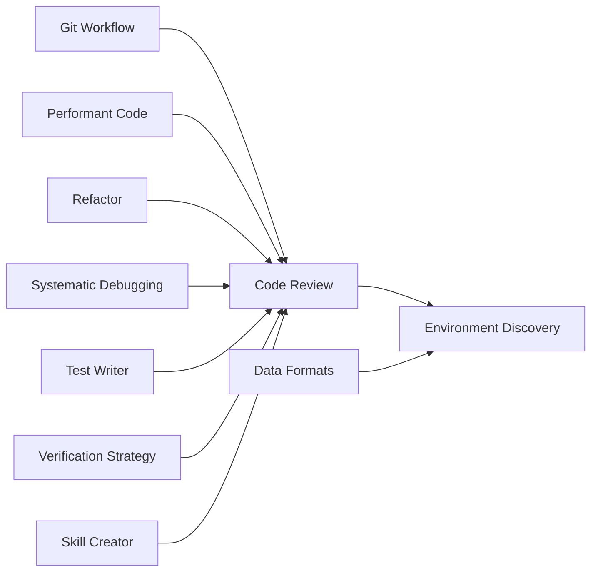

# Bundled Skills

<cite>
**Referenced Files in This Document**
- [code-review SKILL.md](file://pydantic_deep/bundled_skills/code-review/SKILL.md)
- [data-formats SKILL.md](file://pydantic_deep/bundled_skills/data-formats/SKILL.md)
- [environment-discovery SKILL.md](file://pydantic_deep/bundled_skills/environment-discovery/SKILL.md)
- [git-workflow SKILL.md](file://pydantic_deep/bundled_skills/git-workflow/SKILL.md)
- [performant-code SKILL.md](file://pydantic_deep/bundled_skills/performant-code/SKILL.md)
- [refactor SKILL.md](file://pydantic_deep/bundled_skills/refactor/SKILL.md)
- [skill-creator SKILL.md](file://pydantic_deep/bundled_skills/skill-creator/SKILL.md)
- [systematic-debugging SKILL.md](file://pydantic_deep/bundled_skills/systematic-debugging/SKILL.md)
- [test-writer SKILL.md](file://pydantic_deep/bundled_skills/test-writer/SKILL.md)
- [verification-strategy SKILL.md](file://pydantic_deep/bundled_skills/verification-strategy/SKILL.md)
- [code-review SKILL.md (CLI)](file://cli/skills/code-review/SKILL.md)
- [data-formats SKILL.md (CLI)](file://cli/skills/data-formats/SKILL.md)
- [environment-discovery SKILL.md (CLI)](file://cli/skills/environment-discovery/SKILL.md)
- [git-workflow SKILL.md (CLI)](file://cli/skills/git-workflow/SKILL.md)
- [performant-code SKILL.md (CLI)](file://cli/skills/performant-code/SKILL.md)
- [refactor SKILL.md (CLI)](file://cli/skills/refactor/SKILL.md)
- [skill-creator SKILL.md (CLI)](file://cli/skills/skill-creator/SKILL.md)
- [systematic-debugging SKILL.md (CLI)](file://cli/skills/systematic-debugging/SKILL.md)
- [test-writer SKILL.md (CLI)](file://cli/skills/test-writer/SKILL.md)
- [verification-strategy SKILL.md (CLI)](file://cli/skills/verification-strategy/SKILL.md)
</cite>

## Table of Contents
1. [Introduction](#introduction)
2. [Project Structure](#project-structure)
3. [Core Components](#core-components)
4. [Architecture Overview](#architecture-overview)
5. [Detailed Component Analysis](#detailed-component-analysis)
6. [Dependency Analysis](#dependency-analysis)
7. [Performance Considerations](#performance-considerations)
8. [Troubleshooting Guide](#troubleshooting-guide)
9. [Conclusion](#conclusion)

## Introduction
This document describes the nine bundled skills that ship with the project as ready-to-use capabilities. Each skill is packaged as a self-contained Markdown file with a YAML frontmatter and a structured guide. The skills cover code review, data formats, environment discovery, Git workflow, performance optimization, refactoring, skill creation, systematic debugging, test writing, and verification strategy. They are designed to be discoverable and executable by agents and users alike, with clear instructions, examples, and best practices.

## Project Structure
The bundled skills are organized under two primary locations:
- pydantic_deep/bundled_skills: core library skills used by the agent runtime
- cli/skills: CLI-focused skills for terminal-driven workflows

Each skill resides in its own directory with a SKILL.md file containing:
- YAML frontmatter with metadata (name, description, tags, version)
- A structured guide with purpose, steps, examples, and guidelines

**Diagram sources**
- [code-review SKILL.md](file://pydantic_deep/bundled_skills/code-review/SKILL.md)
- [data-formats SKILL.md](file://pydantic_deep/bundled_skills/data-formats/SKILL.md)
- [environment-discovery SKILL.md](file://pydantic_deep/bundled_skills/environment-discovery/SKILL.md)
- [git-workflow SKILL.md](file://pydantic_deep/bundled_skills/git-workflow/SKILL.md)
- [performant-code SKILL.md](file://pydantic_deep/bundled_skills/performant-code/SKILL.md)
- [refactor SKILL.md](file://pydantic_deep/bundled_skills/refactor/SKILL.md)
- [skill-creator SKILL.md](file://pydantic_deep/bundled_skills/skill-creator/SKILL.md)
- [systematic-debugging SKILL.md](file://pydantic_deep/bundled_skills/systematic-debugging/SKILL.md)
- [test-writer SKILL.md](file://pydantic_deep/bundled_skills/test-writer/SKILL.md)
- [verification-strategy SKILL.md](file://pydantic_deep/bundled_skills/verification-strategy/SKILL.md)
- [code-review SKILL.md (CLI)](file://cli/skills/code-review/SKILL.md)
- [data-formats SKILL.md (CLI)](file://cli/skills/data-formats/SKILL.md)
- [environment-discovery SKILL.md (CLI)](file://cli/skills/environment-discovery/SKILL.md)
- [git-workflow SKILL.md (CLI)](file://cli/skills/git-workflow/SKILL.md)
- [performant-code SKILL.md (CLI)](file://cli/skills/performant-code/SKILL.md)
- [refactor SKILL.md (CLI)](file://cli/skills/refactor/SKILL.md)
- [skill-creator SKILL.md (CLI)](file://cli/skills/skill-creator/SKILL.md)
- [systematic-debugging SKILL.md (CLI)](file://cli/skills/systematic-debugging/SKILL.md)
- [test-writer SKILL.md (CLI)](file://cli/skills/test-writer/SKILL.md)
- [verification-strategy SKILL.md (CLI)](file://cli/skills/verification-strategy/SKILL.md)

**Section sources**
- [code-review SKILL.md](file://pydantic_deep/bundled_skills/code-review/SKILL.md)
- [data-formats SKILL.md](file://pydantic_deep/bundled_skills/data-formats/SKILL.md)
- [environment-discovery SKILL.md](file://pydantic_deep/bundled_skills/environment-discovery/SKILL.md)
- [git-workflow SKILL.md](file://pydantic_deep/bundled_skills/git-workflow/SKILL.md)
- [performant-code SKILL.md](file://pydantic_deep/bundled_skills/performant-code/SKILL.md)
- [refactor SKILL.md](file://pydantic_deep/bundled_skills/refactor/SKILL.md)
- [skill-creator SKILL.md](file://pydantic_deep/bundled_skills/skill-creator/SKILL.md)
- [systematic-debugging SKILL.md](file://pydantic_deep/bundled_skills/systematic-debugging/SKILL.md)
- [test-writer SKILL.md](file://pydantic_deep/bundled_skills/test-writer/SKILL.md)
- [verification-strategy SKILL.md](file://pydantic_deep/bundled_skills/verification-strategy/SKILL.md)

## Core Components
Each skill is a standalone unit with:
- Metadata: name, description, tags, version
- Purpose and scope
- Step-by-step instructions
- Examples and expected outcomes
- Best practices and pitfalls

Key characteristics across skills:
- Consistent YAML frontmatter format
- Hierarchical Markdown sections for instructions and examples
- Practical tips and safety rules where applicable
- Guidance on output formats and verification

**Section sources**
- [code-review SKILL.md](file://pydantic_deep/bundled_skills/code-review/SKILL.md)
- [data-formats SKILL.md](file://pydantic_deep/bundled_skills/data-formats/SKILL.md)
- [environment-discovery SKILL.md](file://pydantic_deep/bundled_skills/environment-discovery/SKILL.md)
- [git-workflow SKILL.md](file://pydantic_deep/bundled_skills/git-workflow/SKILL.md)
- [performant-code SKILL.md](file://pydantic_deep/bundled_skills/performant-code/SKILL.md)
- [refactor SKILL.md](file://pydantic_deep/bundled_skills/refactor/SKILL.md)
- [skill-creator SKILL.md](file://pydantic_deep/bundled_skills/skill-creator/SKILL.md)
- [systematic-debugging SKILL.md](file://pydantic_deep/bundled_skills/systematic-debugging/SKILL.md)
- [test-writer SKILL.md](file://pydantic_deep/bundled_skills/test-writer/SKILL.md)
- [verification-strategy SKILL.md](file://pydantic_deep/bundled_skills/verification-strategy/SKILL.md)

## Architecture Overview
The skills are discovered and loaded by the agent runtime via a skills toolset. The toolset enumerates skill directories and reads the SKILL.md file to extract metadata and instructions. The CLI mirrors this structure for terminal-based workflows.

[No sources needed since this diagram shows conceptual workflow, not actual code structure]

## Detailed Component Analysis

### Code Review
Purpose
- Systematic review of correctness, security, performance, style, and testing coverage.

Capabilities
- Provides a structured checklist across five categories.
- Defines severity levels and output format for findings.

Resources and Scripts
- No executable scripts included; relies on agent interpretation of instructions.

Practical Usage
- Invoke the skill to analyze code diffs or files.
- Expect findings with file:line, category, description, suggested fix, and severity.

Parameters and Outputs
- Inputs: code context, files, diffs.
- Output: structured review comments.

Best Practices
- Follow the checklist rigorously.
- Prioritize critical issues first.

Common Use Cases
- Pull request reviews.
- Post-merge quality checks.

Dependencies and Compatibility
- Works with any language; requires appropriate tooling installed in the environment.

Customization
- Adjust categories and severity thresholds as needed for project standards.

**Section sources**
- [code-review SKILL.md](file://pydantic_deep/bundled_skills/code-review/SKILL.md)
- [code-review SKILL.md (CLI)](file://cli/skills/code-review/SKILL.md)

### Data Formats
Purpose
- Guidance for detecting and parsing diverse data formats (binary, structured text, model files, databases).

Capabilities
- Format detection strategies.
- Parsing strategies for unknown formats and large files.
- Common pitfalls and remedies.

Resources and Scripts
- Includes shell and Python snippets for inspection and parsing.

Practical Usage
- Use detection commands before attempting to parse.
- Apply sampling and validation for large files.

Parameters and Outputs
- Inputs: filenames, file samples.
- Output: format identification, parsing plan.

Best Practices
- Inspect first, then parse.
- Respect endianness and alignment.

Common Use Cases
- Data ingestion pipelines.
- Reverse engineering unknown binaries.

Dependencies and Compatibility
- Requires standard Unix tools and Python libraries.

Customization
- Extend parsing strategies for domain-specific formats.

**Section sources**
- [data-formats SKILL.md](file://pydantic_deep/bundled_skills/data-formats/SKILL.md)
- [data-formats SKILL.md (CLI)](file://cli/skills/data-formats/SKILL.md)

### Environment Discovery
Purpose
- Systematic exploration of unknown environments prior to work.

Capabilities
- Workspace understanding.
- Data file inspection.
- Tool availability checks.
- Existing code review.

Resources and Scripts
- Shell commands for listing, inspecting, and checking tools.

Practical Usage
- Run discovery steps before writing or modifying code.
- Plan for large files and binary formats.

Parameters and Outputs
- Inputs: working directory, file paths.
- Output: environment profile, tool inventory.

Best Practices
- Never assume file formats or tool availability.
- Spend time exploring to avoid costly debugging later.

Common Use Cases
- Onboarding onto new repositories.
- Investigating CI failures.

Dependencies and Compatibility
- Requires standard Unix/Linux tooling.

Customization
- Adapt discovery steps to project-specific layouts.

**Section sources**
- [environment-discovery SKILL.md](file://pydantic_deep/bundled_skills/environment-discovery/SKILL.md)
- [environment-discovery SKILL.md (CLI)](file://cli/skills/environment-discovery/SKILL.md)

### Git Workflow
Purpose
- Standardized Git operations for commits, branches, pull requests, and conflict resolution.

Capabilities
- Commit message conventions.
- Branching workflow.
- Conflict resolution steps.
- Safety rules.

Resources and Scripts
- Shell commands for common Git operations.

Practical Usage
- Use commit message types consistently.
- Resolve conflicts by understanding both versions.

Parameters and Outputs
- Inputs: current branch, upstream state, diffs.
- Output: clean history, resolved conflicts.

Best Practices
- Small, focused commits.
- Squash-merge after review.

Common Use Cases
- Feature development.
- Team collaboration.

Dependencies and Compatibility
- Requires Git installed and configured.

Customization
- Align types and safety rules with team standards.

**Section sources**
- [git-workflow SKILL.md](file://pydantic_deep/bundled_skills/git-workflow/SKILL.md)
- [git-workflow SKILL.md (CLI)](file://cli/skills/git-workflow/SKILL.md)

### Performant Code
Purpose
- Write efficient code that scales to large inputs and meets constraints.

Capabilities
- Scaling considerations by data size.
- I/O optimization strategies.
- Algorithmic complexity guidance.
- Language-specific tips.

Resources and Scripts
- Guidance for mmap, buffered reads/writes, and profiling.

Practical Usage
- Choose I/O and algorithmic approaches based on data size.
- Profile before optimizing.

Parameters and Outputs
- Inputs: data size, constraints.
- Output: optimized implementation plan.

Best Practices
- Prefer O(n) solutions; avoid nested loops on large data.
- Respect memory and time limits.

Common Use Cases
- Competitive programming tasks.
- Data processing pipelines.

Dependencies and Compatibility
- Applies broadly; requires language toolchains.

Customization
- Tune strategies per language and platform.

**Section sources**
- [performant-code SKILL.md](file://pydantic_deep/bundled_skills/performant-code/SKILL.md)
- [performant-code SKILL.md (CLI)](file://cli/skills/performant-code/SKILL.md)

### Refactor
Purpose
- Improve code structure without changing external behavior.

Capabilities
- A four-phase process: understand, plan, execute, verify.
- Common refactoring patterns: extract, simplify, rename, reorganize.
- Behavioral safety rules.

Resources and Scripts
- No scripts; focuses on process and patterns.

Practical Usage
- Incremental changes with frequent verification.
- Keep refactors isolated.

Parameters and Outputs
- Inputs: codebase, tests.
- Output: improved structure, passing tests.

Best Practices
- One refactoring type per commit.
- Preserve behavior.

Common Use Cases
- Legacy code modernization.
- Design cleanup.

Dependencies and Compatibility
- Independent of language; depends on test coverage.

Customization
- Align patterns with project conventions.

**Section sources**
- [refactor SKILL.md](file://pydantic_deep/bundled_skills/refactor/SKILL.md)
- [refactor SKILL.md (CLI)](file://cli/skills/refactor/SKILL.md)

### Skill Creator
Purpose
- Create new reusable skills from conversation context.

Capabilities
- Directory structure for a new skill.
- Required SKILL.md frontmatter and content sections.
- Guidelines for naming, description, instructions, and examples.

Resources and Scripts
- Template layout and frontmatter schema.

Practical Usage
- Capture recurring task patterns as skills.
- Provide examples and edge cases.

Parameters and Outputs
- Inputs: task pattern, instructions, examples.
- Output: skill directory with SKILL.md and optional resources.

Best Practices
- Use clear, specific instructions.
- Include examples and templates.

Common Use Cases
- Onboarding new team members.
- Capturing institutional knowledge.

Dependencies and Compatibility
- Requires filesystem access to create skill directories.

Customization
- Extend templates and examples for domain needs.

**Section sources**
- [skill-creator SKILL.md](file://pydantic_deep/bundled_skills/skill-creator/SKILL.md)
- [skill-creator SKILL.md (CLI)](file://cli/skills/skill-creator/SKILL.md)

### Systematic Debugging
Purpose
- Structured approach to diagnosing and fixing errors.

Capabilities
- Five-step debugging loop: reproduce, isolate, diagnose, fix, verify.
- Error type guidance and instrumentation tips.
- Common failure patterns.

Resources and Scripts
- Minimal instrumentation examples for C and Python.

Practical Usage
- Follow the loop strictly; avoid guesswork.
- Add minimal instrumentation to narrow scope.

Parameters and Outputs
- Inputs: failure symptoms, stack traces, environment.
- Output: root cause and fix.

Best Practices
- Change one thing at a time.
- Verify fixes with multiple inputs.

Common Use Cases
- CI failures.
- Production incidents.

Dependencies and Compatibility
- Applies across languages and platforms.

Customization
- Adapt instrumentation to project tooling.

**Section sources**
- [systematic-debugging SKILL.md](file://pydantic_deep/bundled_skills/systematic-debugging/SKILL.md)
- [systematic-debugging SKILL.md (CLI)](file://cli/skills/systematic-debugging/SKILL.md)

### Test Writer
Purpose
- Generate comprehensive test suites for existing code.

Capabilities
- Process for reading code and aligning with existing frameworks.
- Coverage strategy across happy path, edge cases, error cases, and integration.
- Testing guidelines.

Resources and Scripts
- No scripts; focuses on methodology and coverage.

Practical Usage
- Follow coverage strategy to ensure robust tests.
- Use fixtures and mocks consistently.

Parameters and Outputs
- Inputs: source code, testing framework.
- Output: test suite.

Best Practices
- One behavior per test function.
- Mock external dependencies.

Common Use Cases
- Adding tests to legacy code.
- QA assurance.

Dependencies and Compatibility
- Depends on project’s testing framework.

Customization
- Align naming and structure with project conventions.

**Section sources**
- [test-writer SKILL.md](file://pydantic_deep/bundled_skills/test-writer/SKILL.md)
- [test-writer SKILL.md (CLI)](file://cli/skills/test-writer/SKILL.md)

### Verification Strategy
Purpose
- Thorough verification of completed work before declaring done.

Capabilities
- Six-step verification checklist: re-read task, check outputs, compile/run, validate, test edge cases, check constraints.
- Reading and interpreting test scripts.
- Common verification failures.

Resources and Scripts
- Shell commands for listing, counting bytes, format detection, and preview.

Practical Usage
- Go through the checklist systematically.
- Match exact file paths, names, and formats.

Parameters and Outputs
- Inputs: implementation, task spec, test scripts.
- Output: verified deliverables.

Best Practices
- Verify constraints explicitly.
- Clean up debug artifacts.

Common Use Cases
- Final checks before submission.
- CI gate verification.

Dependencies and Compatibility
- Requires environment matching task requirements.

Customization
- Tailor checklist to project’s CI expectations.

**Section sources**
- [verification-strategy SKILL.md](file://pydantic_deep/bundled_skills/verification-strategy/SKILL.md)
- [verification-strategy SKILL.md (CLI)](file://cli/skills/verification-strategy/SKILL.md)

## Dependency Analysis
- Each skill is independent and self-contained.
- Skills share a common metadata schema (YAML frontmatter).
- CLI and library variants mirror each other for parity.

[No sources needed since this diagram shows conceptual relationships, not actual code structure]

## Performance Considerations
- Prefer streaming and chunked processing for large files (see Performant Code).
- Use buffered I/O and minimize system calls (see Performant Code).
- Profile before optimizing; focus on bottlenecks (see Performant Code).

[No sources needed since this section provides general guidance]

## Troubleshooting Guide
- If a skill seems misapplied, re-run Environment Discovery to understand the workspace and tools.
- For parsing failures, re-run Data Formats detection and sampling strategies.
- For CI issues, apply Systematic Debugging to reproduce and isolate problems.
- For incorrect outputs, consult Verification Strategy to ensure exact compliance with task specs.

**Section sources**
- [environment-discovery SKILL.md](file://pydantic_deep/bundled_skills/environment-discovery/SKILL.md)
- [data-formats SKILL.md](file://pydantic_deep/bundled_skills/data-formats/SKILL.md)
- [systematic-debugging SKILL.md](file://pydantic_deep/bundled_skills/systematic-debugging/SKILL.md)
- [verification-strategy SKILL.md](file://pydantic_deep/bundled_skills/verification-strategy/SKILL.md)

## Conclusion
The nine bundled skills provide a comprehensive toolkit for code quality, environment readiness, workflow discipline, performance, refactoring, debugging, testing, and verification. Their standardized structure and consistent metadata enable seamless integration across library and CLI contexts, while their practical guidance supports both novice and experienced users in delivering reliable, maintainable results.