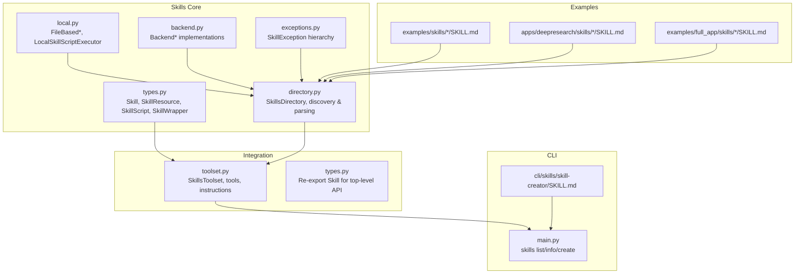
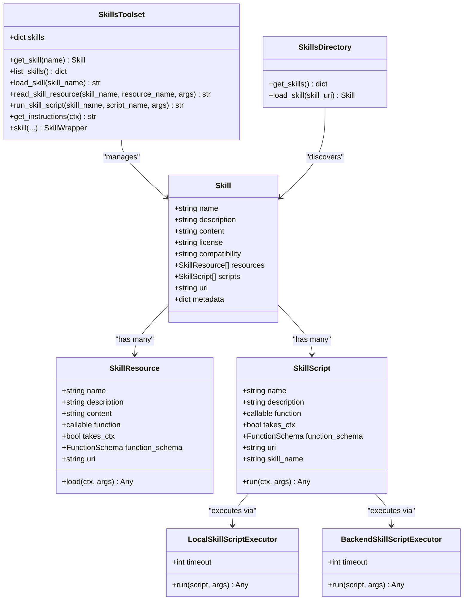
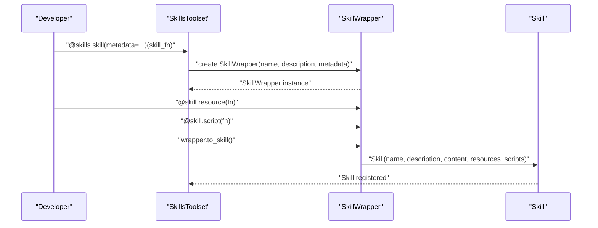
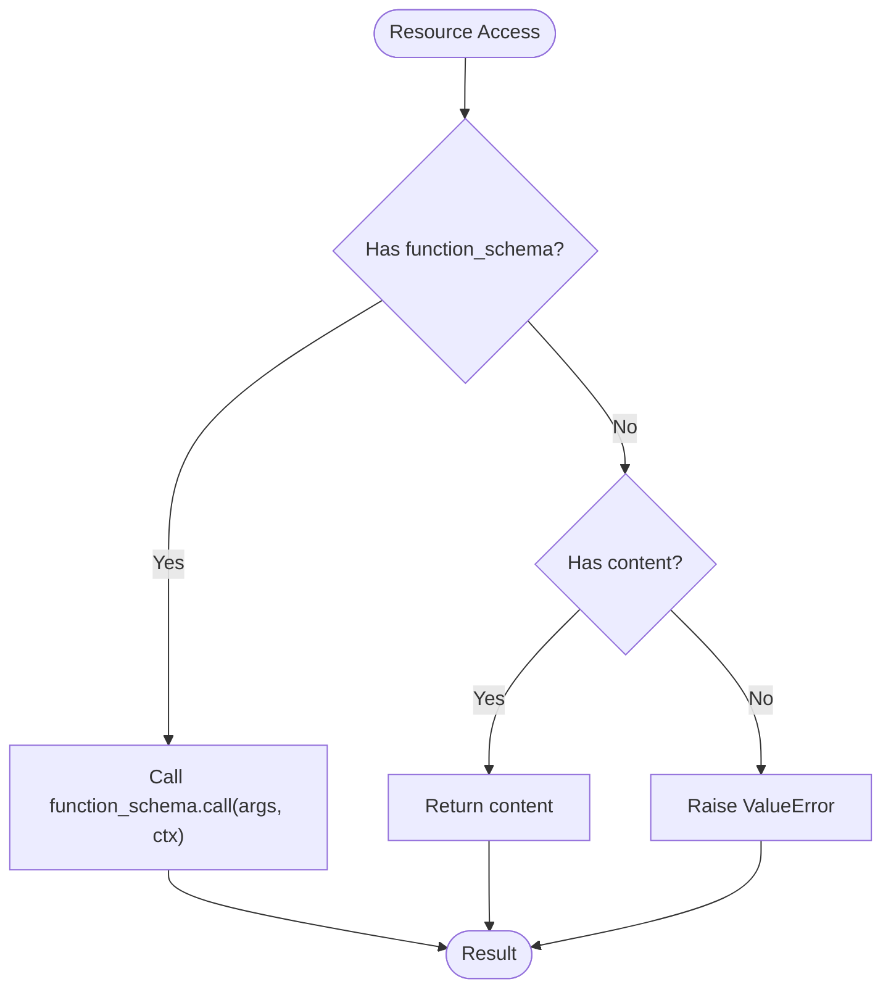
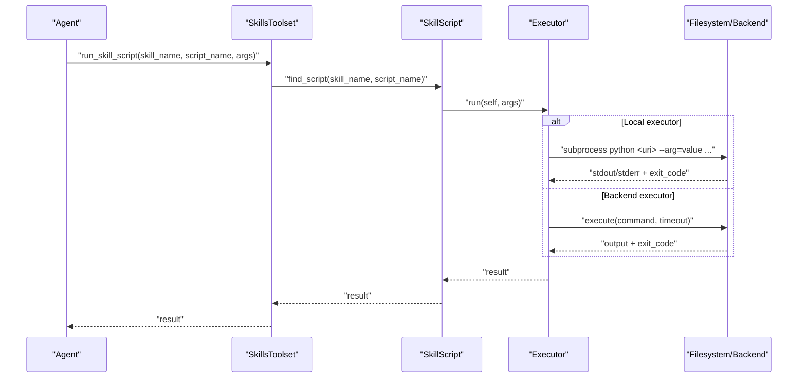
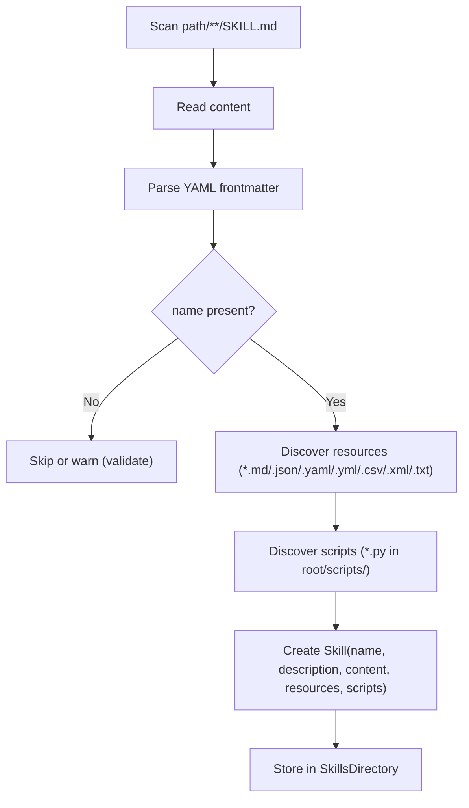
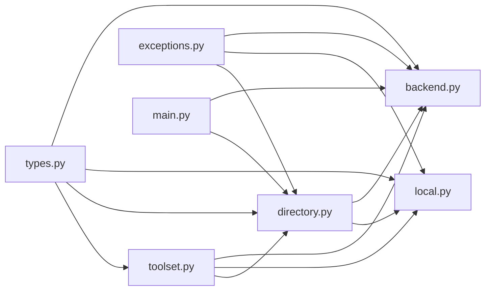

# Custom Skills Development

<cite>
**Referenced Files in This Document**
- [types.py](file://pydantic_deep\types.py)
- [toolset.py](file://pydantic_deep\toolsets\skills\toolset.py)
- [types.py](file://pydantic_deep\toolsets\skills\types.py)
- [directory.py](file://pydantic_deep\toolsets\skills\directory.py)
- [local.py](file://pydantic_deep\toolsets\skills\local.py)
- [backend.py](file://pydantic_deep\toolsets\skills\backend.py)
- [exceptions.py](file://pydantic_deep\toolsets\skills\exceptions.py)
- [SKILL.md](file://cli\skills\skill-creator\SKILL.md)
- [SKILL.md](file://examples\skills\code-review\SKILL.md)
- [SKILL.md](file://examples\skills\test-generator\SKILL.md)
- [SKILL.md](file://apps\deepresearch\skills\report-writing\SKILL.md)
- [SKILL.md](file://apps\deepresearch\skills\diagram-design\SKILL.md)
- [SKILL.md](file://examples\full_app\skills\data-analysis\SKILL.md)
- [main.py](file://cli\main.py)
- [skills_usage.py](file://examples\skills_usage.py)
</cite>

## Table of Contents
1. [Introduction](#introduction)
2. [Project Structure](#project-structure)
3. [Core Components](#core-components)
4. [Architecture Overview](#architecture-overview)
5. [Detailed Component Analysis](#detailed-component-analysis)
6. [Dependency Analysis](#dependency-analysis)
7. [Performance Considerations](#performance-considerations)
8. [Troubleshooting Guide](#troubleshooting-guide)
9. [Conclusion](#conclusion)
10. [Appendices](#appendices)

## Introduction
This document explains how to develop custom skills to extend agent capabilities in the pydantic-deep ecosystem. It covers the Skill dataclass structure, SkillResource and SkillScript definitions, and the skill development lifecycle from concept to implementation. It also documents skill directory structure, SKILL.md specification, resource organization patterns, the skill decorator pattern, function-based skill creation, and programmatic skill construction. Additionally, it addresses skill validation, error handling, debugging techniques, distribution, packaging, sharing best practices, and the skill-creator CLI tool for automated skill development workflows.

## Project Structure
The skills system is implemented primarily in the pydantic_deep.toolsets.skills package and integrated with the CLI and example applications. Key areas include:
- Core types and dataclasses for skills, resources, and scripts
- Discovery and loading from filesystem and backend environments
- Toolset integration for agents
- CLI commands for skill scaffolding and management
- Example skills demonstrating best practices

**Diagram sources**
- [types.py:180-521](file://pydantic_deep\toolsets\skills\types.py#L180-L521)
- [directory.py:444-532](file://pydantic_deep\toolsets\skills\directory.py#L444-L532)
- [local.py:1-313](file://pydantic_deep\toolsets\skills\local.py#L1-L313)
- [backend.py:1-565](file://pydantic_deep\toolsets\skills\backend.py#L1-L565)
- [exceptions.py:1-42](file://pydantic_deep\toolsets\skills\exceptions.py#L1-L42)
- [toolset.py:112-598](file://pydantic_deep\toolsets\skills\toolset.py#L112-L598)
- [types.py:34-61](file://pydantic_deep\types.py#L34-L61)
- [main.py:338-496](file://cli\main.py#L338-L496)
- [SKILL.md:1-55](file://cli\skills\skill-creator\SKILL.md#L1-L55)
- [SKILL.md:1-68](file://examples\skills\code-review\SKILL.md#L1-L68)
- [SKILL.md:1-64](file://apps\deepresearch\skills\report-writing\SKILL.md#L1-L64)
- [SKILL.md:1-113](file://apps\deepresearch\skills\diagram-design\SKILL.md#L1-L113)
- [SKILL.md:1-226](file://examples\full_app\skills\data-analysis\SKILL.md#L1-L226)

**Section sources**
- [types.py:34-61](file://pydantic_deep\types.py#L34-L61)
- [toolset.py:112-598](file://pydantic_deep\toolsets\skills\toolset.py#L112-L598)
- [types.py:180-521](file://pydantic_deep\toolsets\skills\types.py#L180-L521)
- [directory.py:444-532](file://pydantic_deep\toolsets\skills\directory.py#L444-L532)
- [local.py:1-313](file://pydantic_deep\toolsets\skills\local.py#L1-L313)
- [backend.py:1-565](file://pydantic_deep\toolsets\skills\backend.py#L1-L565)
- [exceptions.py:1-42](file://pydantic_deep\toolsets\skills\exceptions.py#L1-L42)
- [main.py:338-496](file://cli\main.py#L338-L496)
- [SKILL.md:1-55](file://cli\skills\skill-creator\SKILL.md#L1-L55)

## Core Components
This section documents the foundational types and patterns used to define and manage skills.

- Skill: The central dataclass representing a skill with metadata, content, resources, and scripts. It supports both programmatic construction and decorator-based composition.
- SkillResource: Represents a static or callable resource within a skill. It supports content strings, callables, and URIs for file-based resources. It includes automatic JSON schema generation for callable resources.
- SkillScript: Represents an executable script within a skill. It supports programmatic functions or file-based scripts executed via subprocess or backend sandbox.
- SkillWrapper: A generic wrapper for decorator-based skill creation with type-safe dependencies, enabling attaching resources and scripts to a skill function.
- SkillsToolset: Integrates skills with agents, exposing tools to list skills, load instructions, read resources, and run scripts. It builds system instructions and manages tool registration.

Key validation and naming utilities:
- normalize_skill_name: Validates and normalizes function names to skill names.
- SKILL_NAME_PATTERN: Regex enforcing lowercase letters, numbers, and hyphens (no consecutive hyphens).

**Section sources**
- [types.py:34-73](file://pydantic_deep\toolsets\skills\types.py#L34-L73)
- [types.py:75-125](file://pydantic_deep\toolsets\skills\types.py#L75-L125)
- [types.py:127-177](file://pydantic_deep\toolsets\skills\types.py#L127-L177)
- [types.py:179-340](file://pydantic_deep\toolsets\skills\types.py#L179-L340)
- [types.py:341-521](file://pydantic_deep\toolsets\skills\types.py#L341-L521)
- [toolset.py:112-149](file://pydantic_deep\toolsets\skills\toolset.py#L112-L149)

## Architecture Overview
The skills system is designed around a layered architecture:
- Data model layer: Skill, SkillResource, SkillScript, and SkillWrapper define the structure and behavior.
- Discovery and loading layer: SkillsDirectory discovers skills from filesystem, parses SKILL.md, and creates Skill instances with resources and scripts. BackendSkillsDirectory mirrors this for backend environments.
- Execution layer: LocalSkillScriptExecutor runs file-based scripts via subprocess; BackendSkillScriptExecutor runs them via backend sandbox.
- Integration layer: SkillsToolset registers tools for agents, builds system instructions, and exposes skill management APIs.
- CLI layer: Provides commands to list, show details, and scaffold new skills.

**Diagram sources**
- [types.py:75-177](file://pydantic_deep\toolsets\skills\types.py#L75-L177)
- [toolset.py:112-598](file://pydantic_deep\toolsets\skills\toolset.py#L112-L598)
- [directory.py:444-532](file://pydantic_deep\toolsets\skills\directory.py#L444-L532)
- [local.py:88-182](file://pydantic_deep\toolsets\skills\local.py#L88-L182)
- [backend.py:109-190](file://pydantic_deep\toolsets\skills\backend.py#L109-L190)

## Detailed Component Analysis

### Skill Dataclass and Decorator Pattern
- Programmatic construction: Create a Skill instance with name, description, content, and optional metadata. Attach resources and scripts via lists.
- Decorator pattern: Use SkillsToolset.skill to define a skill function returning content. The decorator infers name/description and returns a SkillWrapper. Attach resources and scripts using @skill_instance.resource and @skill_instance.script. Convert to Skill with to_skill().
- Naming: normalize_skill_name enforces valid skill names; SKILL_NAME_PATTERN validates names.

**Diagram sources**
- [toolset.py:485-577](file://pydantic_deep\toolsets\skills\toolset.py#L485-L577)
- [types.py:503-521](file://pydantic_deep\toolsets\skills\types.py#L503-L521)
- [types.py:235-338](file://pydantic_deep\toolsets\skills\types.py#L235-L338)

**Section sources**
- [toolset.py:485-577](file://pydantic_deep\toolsets\skills\toolset.py#L485-L577)
- [types.py:503-521](file://pydantic_deep\toolsets\skills\types.py#L503-L521)
- [types.py:235-338](file://pydantic_deep\toolsets\skills\types.py#L235-L338)
- [types.py:34-73](file://pydantic_deep\toolsets\skills\types.py#L34-L73)

### SkillResource: Static Files and Callable Resources
- Static content: Provide content as a string; useful for templates, schemas, or instructions.
- Callable resources: Provide a function with optional RunContext dependency. Schema is auto-generated for parameter descriptions and docstring parsing.
- File-based resources: Use create_file_based_resource with a URI pointing to a file. The loader reads and parses JSON/YAML when possible.

**Diagram sources**
- [types.py:104-125](file://pydantic_deep\toolsets\skills\types.py#L104-L125)
- [local.py:35-86](file://pydantic_deep\toolsets\skills\local.py#L35-L86)

**Section sources**
- [types.py:75-125](file://pydantic_deep\toolsets\skills\types.py#L75-L125)
- [local.py:35-86](file://pydantic_deep\toolsets\skills\local.py#L35-L86)

### SkillScript: Executable Functions and File-Based Scripts
- Programmatic scripts: Provide a function with optional RunContext dependency. Schema is auto-generated for parameter descriptions.
- File-based scripts: Use create_file_based_script with a URI to a .py file. Executed via LocalSkillScriptExecutor (subprocess) or BackendSkillScriptExecutor (sandbox).
- Argument passing: Arguments are converted to command-line flags for subprocess execution; booleans emit flags, lists repeat flags, others stringify.

**Diagram sources**
- [toolset.py:425-456](file://pydantic_deep\toolsets\skills\toolset.py#L425-L456)
- [local.py:112-182](file://pydantic_deep\toolsets\skills\local.py#L112-L182)
- [backend.py:133-190](file://pydantic_deep\toolsets\skills\backend.py#L133-L190)

**Section sources**
- [toolset.py:425-456](file://pydantic_deep\toolsets\skills\toolset.py#L425-L456)
- [local.py:112-182](file://pydantic_deep\toolsets\skills\local.py#L112-L182)
- [backend.py:133-190](file://pydantic_deep\toolsets\skills\backend.py#L133-L190)

### Skill Discovery and Directory Management
- SkillsDirectory discovers skills by scanning for SKILL.md files, parsing YAML frontmatter, and building Skill instances with resources and scripts.
- Resource discovery includes .md, .json, .yaml, .yml, .csv, .xml, .txt files excluding SKILL.md.
- Script discovery includes .py files in root and scripts/ subdirectory, with safety checks against symlink escapes.
- Validation includes name/description/compatibility length limits and instruction line count recommendations.

**Diagram sources**
- [directory.py:266-442](file://pydantic_deep\toolsets\skills\directory.py#L266-L442)

**Section sources**
- [directory.py:266-442](file://pydantic_deep\toolsets\skills\directory.py#L266-L442)

### Backend-Aware Implementations
- BackendSkillResource: Loads content via BackendProtocol._read_bytes, auto-parsing JSON/YAML.
- BackendSkillScriptExecutor: Executes scripts via SandboxProtocol.execute, converting args to command-line flags.
- BackendSkillsDirectory: Discovers skills and resources via backend filesystem APIs, with deduplication and depth-limited search.

**Section sources**
- [backend.py:46-107](file://pydantic_deep\toolsets\skills\backend.py#L46-L107)
- [backend.py:109-190](file://pydantic_deep\toolsets\skills\backend.py#L109-L190)
- [backend.py:397-565](file://pydantic_deep\toolsets\skills\backend.py#L397-L565)

### SKILL.md Specification and Best Practices
- Frontmatter: Required name and description; optional tags, version, author, license, compatibility, and auto_load flags.
- Content: Markdown instructions; keep instructions concise and split long content into resources.
- Examples: See built-in examples for structure and guidance.

**Section sources**
- [SKILL.md:1-55](file://cli\skills\skill-creator\SKILL.md#L1-L55)
- [SKILL.md:1-68](file://examples\skills\code-review\SKILL.md#L1-L68)
- [SKILL.md:1-93](file://examples\skills\test-generator\SKILL.md#L1-L93)
- [SKILL.md:1-64](file://apps\deepresearch\skills\report-writing\SKILL.md#L1-L64)
- [SKILL.md:1-113](file://apps\deepresearch\skills\diagram-design\SKILL.md#L1-L113)
- [SKILL.md:1-226](file://examples\full_app\skills\data-analysis\SKILL.md#L1-L226)

### Skill Lifecycle: From Concept to Implementation
- Concept: Define the skill’s purpose, instructions, and scope. Use SKILL.md frontmatter to declare metadata.
- Scaffold: Use CLI to create a new skill directory with SKILL.md template.
- Develop: Add resources (templates, schemas) and scripts (.py files). Optionally use callable resources for dynamic content.
- Integrate: Register skills via SkillsToolset with directories or programmatic Skill instances.
- Validate: Rely on discovery validation and explicit checks; handle SkillValidationError and related exceptions.
- Debug: Use agent tools to list skills, load instructions, read resources, and run scripts with args.
- Distribute: Package skills as directories with SKILL.md and supporting files; share via repositories or backend storage.

**Section sources**
- [main.py:468-496](file://cli\main.py#L468-L496)
- [main.py:404-466](file://cli\main.py#L404-L466)
- [directory.py:44-121](file://pydantic_deep\toolsets\skills\directory.py#L44-L121)
- [exceptions.py:20-42](file://pydantic_deep\toolsets\skills\exceptions.py#L20-L42)
- [toolset.py:325-456](file://pydantic_deep\toolsets\skills\toolset.py#L325-L456)

## Dependency Analysis
The skills system exhibits clear separation of concerns:
- Cohesion: Each module encapsulates a specific responsibility (types, discovery, execution, toolset integration).
- Coupling: SkillsToolset depends on types and directory/local/backend implementations. Directory implementations depend on types and executor interfaces.
- External dependencies: pydantic_ai for function schema generation and tool integration; pydantic_ai_backends for backend protocol support; YAML parsing; subprocess execution.

**Diagram sources**
- [types.py:1-521](file://pydantic_deep\toolsets\skills\types.py#L1-L521)
- [toolset.py:1-598](file://pydantic_deep\toolsets\skills\toolset.py#L1-L598)
- [directory.py:1-532](file://pydantic_deep\toolsets\skills\directory.py#L1-L532)
- [local.py:1-313](file://pydantic_deep\toolsets\skills\local.py#L1-L313)
- [backend.py:1-565](file://pydantic_deep\toolsets\skills\backend.py#L1-L565)
- [exceptions.py:1-42](file://pydantic_deep\toolsets\skills\exceptions.py#L1-L42)
- [main.py:338-496](file://cli\main.py#L338-L496)

**Section sources**
- [types.py:1-521](file://pydantic_deep\toolsets\skills\types.py#L1-L521)
- [toolset.py:1-598](file://pydantic_deep\toolsets\skills\toolset.py#L1-L598)
- [directory.py:1-532](file://pydantic_deep\toolsets\skills\directory.py#L1-L532)
- [local.py:1-313](file://pydantic_deep\toolsets\skills\local.py#L1-L313)
- [backend.py:1-565](file://pydantic_deep\toolsets\skills\backend.py#L1-L565)
- [exceptions.py:1-42](file://pydantic_deep\toolsets\skills\exceptions.py#L1-L42)
- [main.py:338-496](file://cli\main.py#L338-L496)

## Performance Considerations
- Discovery depth: SkillsDirectory limits depth to avoid scanning large trees; adjust max_depth as needed.
- Resource parsing: JSON/YAML parsing adds overhead; cache results when feasible.
- Script execution: Subprocess and backend execution introduce latency; configure timeouts appropriately.
- Instruction size: Keep SKILL.md concise; split long content into resources to reduce parsing and transmission costs.

[No sources needed since this section provides general guidance]

## Troubleshooting Guide
Common issues and resolutions:
- Skill not found: Use list_skills to verify availability; confirm exact names; check SkillsToolset initialization.
- Resource not found: Ensure resource names match exactly; verify resource discovery patterns.
- Script execution failures: Check script URIs, permissions, and timeouts; review stderr output.
- Validation errors: Fix name/description length limits; ensure YAML frontmatter is valid; shorten instructions.
- Backend/script execution errors: Confirm backend supports sandbox execute; verify command-line argument conversion.

**Section sources**
- [toolset.py:242-258](file://pydantic_deep\toolsets\skills\toolset.py#L242-L258)
- [toolset.py:410-456](file://pydantic_deep\toolsets\skills\toolset.py#L410-L456)
- [directory.py:44-121](file://pydantic_deep\toolsets\skills\directory.py#L44-L121)
- [exceptions.py:20-42](file://pydantic_deep\toolsets\skills\exceptions.py#L20-L42)

## Conclusion
The skills system provides a robust, extensible framework for developing, distributing, and integrating reusable capabilities into agents. By adhering to the SKILL.md specification, leveraging the decorator and programmatic patterns, and using the provided toolset and CLI utilities, developers can rapidly build, validate, and share skills tailored to diverse domains.

[No sources needed since this section summarizes without analyzing specific files]

## Appendices

### A. CLI Skill Commands
- skills list: Lists built-in and user skills with name and description.
- skills info: Shows details for a specific skill, including source and path.
- skills create: Generates a new skill scaffold with a SKILL.md template.

**Section sources**
- [main.py:404-466](file://cli\main.py#L404-L466)
- [main.py:468-496](file://cli\main.py#L468-L496)

### B. Example Usage Patterns
- Discover and list skills from directories.
- Load skill instructions on demand.
- Use skill resources and scripts through agent tools.

**Section sources**
- [skills_usage.py:1-151](file://examples\skills_usage.py#L1-L151)