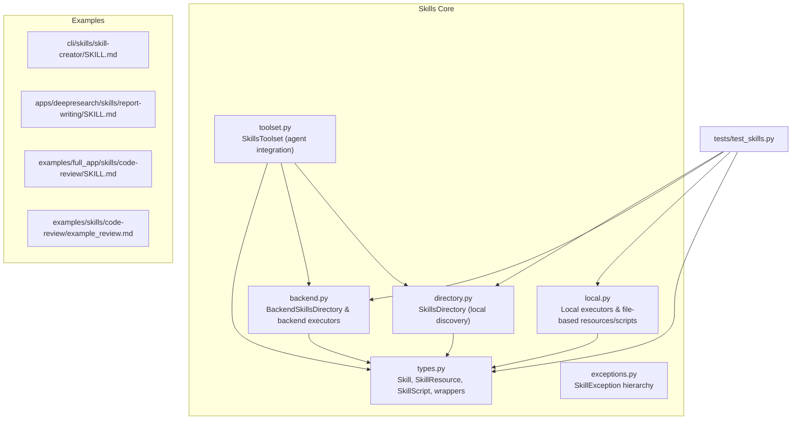
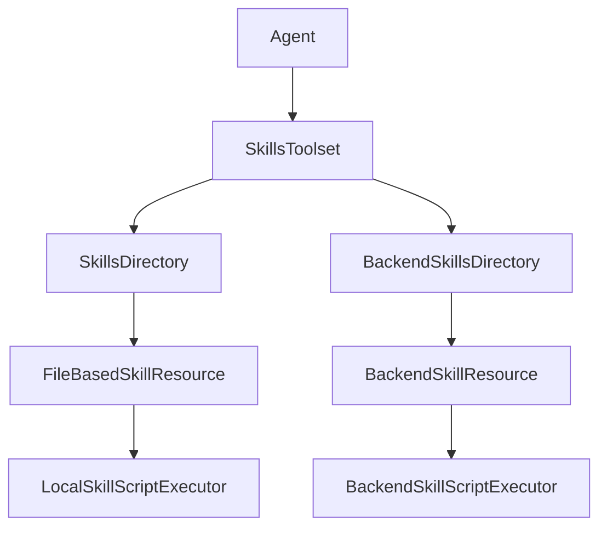
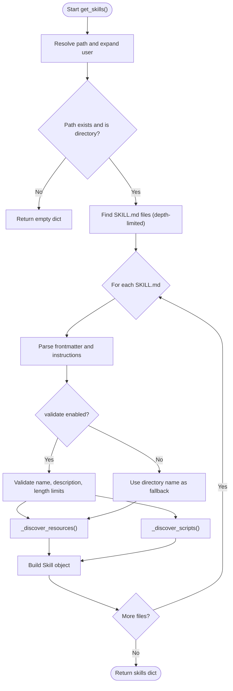
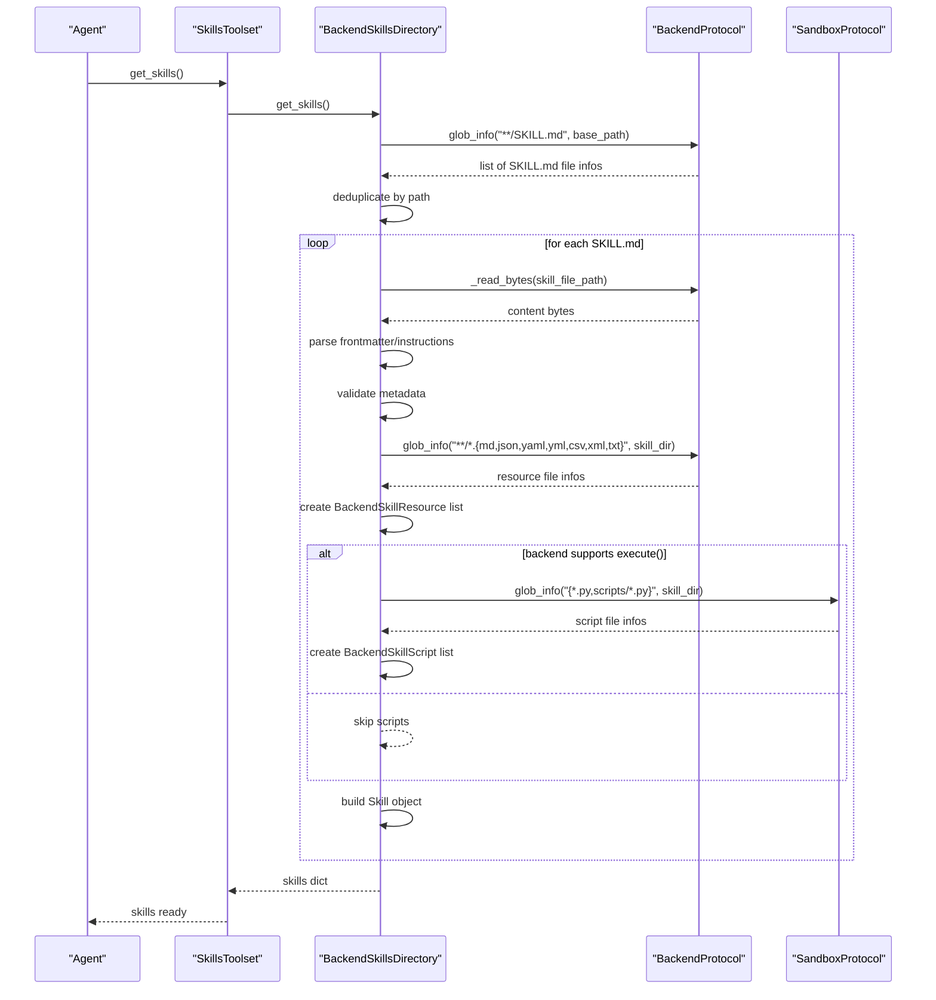
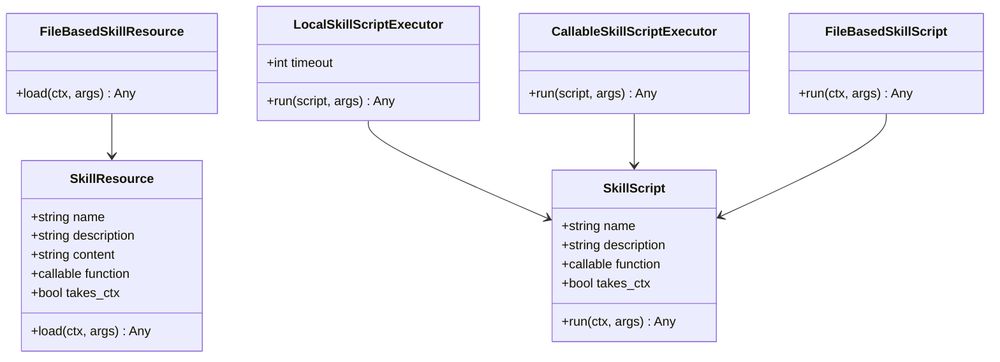
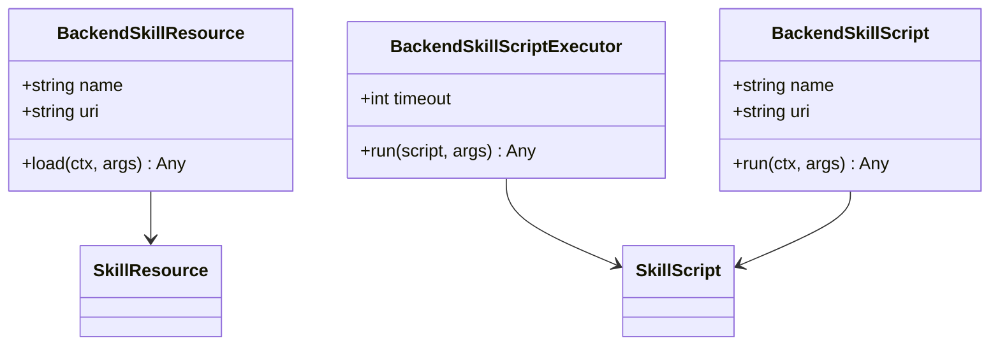
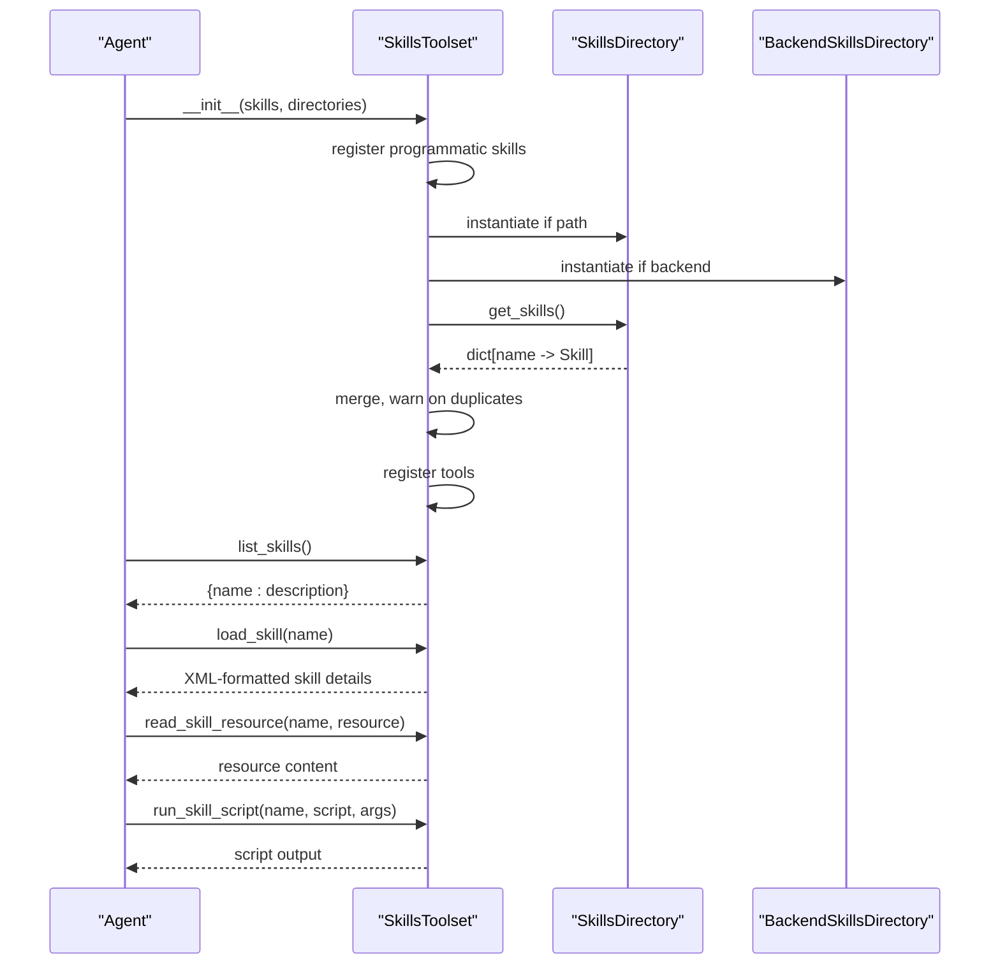
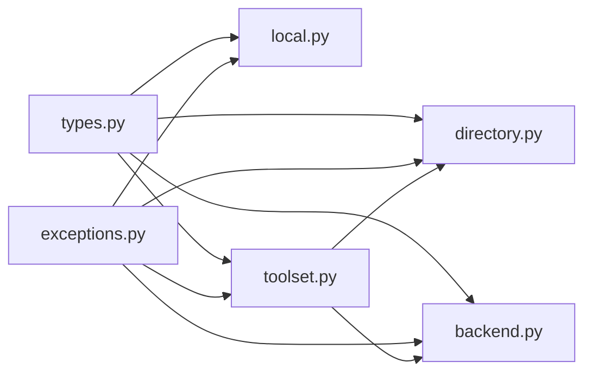

# Skill Management and Distribution

<cite>
**Referenced Files in This Document**
- [directory.py](file://pydantic_deep/toolsets/skills/directory.py)
- [backend.py](file://pydantic_deep/toolsets/skills/backend.py)
- [local.py](file://pydantic_deep/toolsets/skills/local.py)
- [types.py](file://pydantic_deep/toolsets/skills/types.py)
- [exceptions.py](file://pydantic_deep/toolsets/skills/exceptions.py)
- [toolset.py](file://pydantic_deep/toolsets/skills/toolset.py)
- [SKILL.md](file://cli/skills/skill-creator/SKILL.md)
- [SKILL.md](file://apps/deepresearch/skills/report-writing/SKILL.md)
- [SKILL.md](file://examples/full_app/skills/code-review/SKILL.md)
- [example_review.md](file://examples/skills/code-review/example_review.md)
- [test_skills.py](file://tests/test_skills.py)
</cite>

## Table of Contents
1. [Introduction](#introduction)
2. [Project Structure](#project-structure)
3. [Core Components](#core-components)
4. [Architecture Overview](#architecture-overview)
5. [Detailed Component Analysis](#detailed-component-analysis)
6. [Dependency Analysis](#dependency-analysis)
7. [Performance Considerations](#performance-considerations)
8. [Troubleshooting Guide](#troubleshooting-guide)
9. [Conclusion](#conclusion)
10. [Appendices](#appendices)

## Introduction
This document explains the skill management and distribution systems in the repository, focusing on:
- Local skill discovery and loading via SkillsDirectory
- Remote skill access and execution via BackendSkillsDirectory
- Local skill execution patterns using file-based resources and scripts
- Backend skill integration and sandboxed execution
- Versioning, conflict resolution, and duplicate handling
- Practical distribution strategies, repository organization, and team-based sharing
- Security considerations, permissions, and sandboxing
- Update mechanisms, dependency resolution, and compatibility checking
- Best practices for skill organization, naming, and metadata

## Project Structure
The skill system is implemented primarily under pydantic_deep/toolsets/skills, with supporting modules for toolset integration, testing, and example skills.

**Diagram sources**
- [toolset.py:112-598](file://pydantic_deep/toolsets/skills/toolset.py#L112-L598)
- [directory.py:444-532](file://pydantic_deep/toolsets/skills/directory.py#L444-L532)
- [backend.py:397-565](file://pydantic_deep/toolsets/skills/backend.py#L397-L565)
- [local.py:1-313](file://pydantic_deep/toolsets/skills/local.py#L1-L313)
- [types.py:1-521](file://pydantic_deep/toolsets/skills/types.py#L1-L521)
- [exceptions.py:1-42](file://pydantic_deep/toolsets/skills/exceptions.py#L1-L42)
- [SKILL.md:1-55](file://cli/skills/skill-creator/SKILL.md#L1-L55)
- [SKILL.md:1-64](file://apps/deepresearch/skills/report-writing/SKILL.md#L1-L64)
- [SKILL.md:1-68](file://examples/full_app/skills/code-review/SKILL.md#L1-L68)
- [example_review.md:1-42](file://examples/skills/code-review/example_review.md#L1-L42)
- [test_skills.py:1-724](file://tests/test_skills.py#L1-L724)

**Section sources**
- [toolset.py:112-598](file://pydantic_deep/toolsets/skills/toolset.py#L112-L598)
- [directory.py:444-532](file://pydantic_deep/toolsets/skills/directory.py#L444-L532)
- [backend.py:397-565](file://pydantic_deep/toolsets/skills/backend.py#L397-L565)
- [local.py:1-313](file://pydantic_deep/toolsets/skills/local.py#L1-L313)
- [types.py:1-521](file://pydantic_deep/toolsets/skills/types.py#L1-L521)
- [exceptions.py:1-42](file://pydantic_deep/toolsets/skills/exceptions.py#L1-L42)
- [SKILL.md:1-55](file://cli/skills/skill-creator/SKILL.md#L1-L55)
- [SKILL.md:1-64](file://apps/deepresearch/skills/report-writing/SKILL.md#L1-L64)
- [SKILL.md:1-68](file://examples/full_app/skills/code-review/SKILL.md#L1-L68)
- [example_review.md:1-42](file://examples/skills/code-review/example_review.md#L1-L42)
- [test_skills.py:1-724](file://tests/test_skills.py#L1-L724)

## Core Components
- SkillsDirectory: Discovers skills from a local filesystem path, parses SKILL.md YAML frontmatter, validates metadata, and builds Skill objects with associated resources and scripts.
- BackendSkillsDirectory: Discovers skills from a backend filesystem using BackendProtocol and SandboxProtocol, enabling remote execution via sandbox environments.
- LocalSkillScriptExecutor and FileBasedSkillResource: Execute scripts locally via subprocess and load file-based resources with automatic parsing for JSON/YAML.
- BackendSkillScriptExecutor and BackendSkillResource: Execute scripts via backend sandbox and load resources via backend APIs.
- SkillsToolset: Integrates skills with Pydantic AI agents, exposing tools to list skills, load instructions, read resources, and run scripts.
- Types and Validation: Skill, SkillResource, SkillScript dataclasses with decorators for attaching resources/scripts; normalization and validation helpers; exception hierarchy.

**Section sources**
- [directory.py:444-532](file://pydantic_deep/toolsets/skills/directory.py#L444-L532)
- [backend.py:397-565](file://pydantic_deep/toolsets/skills/backend.py#L397-L565)
- [local.py:1-313](file://pydantic_deep/toolsets/skills/local.py#L1-L313)
- [toolset.py:112-598](file://pydantic_deep/toolsets/skills/toolset.py#L112-L598)
- [types.py:1-521](file://pydantic_deep/toolsets/skills/types.py#L1-L521)
- [exceptions.py:1-42](file://pydantic_deep/toolsets/skills/exceptions.py#L1-L42)

## Architecture Overview
The system separates discovery, execution, and agent integration:
- Discovery: SkillsDirectory and BackendSkillsDirectory produce Skill objects with resources and scripts.
- Execution: LocalSkillScriptExecutor runs scripts in subprocesses; BackendSkillScriptExecutor runs them in backend sandboxes.
- Integration: SkillsToolset registers tools for agents and composes system instructions.

**Diagram sources**
- [toolset.py:112-598](file://pydantic_deep/toolsets/skills/toolset.py#L112-L598)
- [directory.py:444-532](file://pydantic_deep/toolsets/skills/directory.py#L444-L532)
- [backend.py:397-565](file://pydantic_deep/toolsets/skills/backend.py#L397-L565)
- [local.py:1-313](file://pydantic_deep/toolsets/skills/local.py#L1-L313)

## Detailed Component Analysis

### SkillsDirectory (Local Discovery)
SkillsDirectory traverses a filesystem path to find SKILL.md files up to a configurable depth, parses YAML frontmatter, validates metadata, discovers resources and scripts, and constructs Skill objects.

Key behaviors:
- Directory traversal with depth limit to avoid performance issues.
- YAML frontmatter parsing with fallback to regex when pyyaml is unavailable.
- Metadata validation for name, description, compatibility, and instruction length.
- Resource discovery for supported extensions excluding SKILL.md.
- Script discovery in root and scripts/ subdirectory with safety checks against symlink escapes.
- Construction of Skill objects with resources and scripts.

**Diagram sources**
- [directory.py:490-532](file://pydantic_deep/toolsets/skills/directory.py#L490-L532)
- [directory.py:347-442](file://pydantic_deep/toolsets/skills/directory.py#L347-L442)
- [directory.py:220-345](file://pydantic_deep/toolsets/skills/directory.py#L220-L345)
- [directory.py:123-218](file://pydantic_deep/toolsets/skills/directory.py#L123-L218)

**Section sources**
- [directory.py:444-532](file://pydantic_deep/toolsets/skills/directory.py#L444-L532)
- [directory.py:347-442](file://pydantic_deep/toolsets/skills/directory.py#L347-L442)
- [directory.py:220-345](file://pydantic_deep/toolsets/skills/directory.py#L220-L345)
- [directory.py:123-218](file://pydantic_deep/toolsets/skills/directory.py#L123-L218)

### BackendSkillsDirectory (Remote Discovery)
BackendSkillsDirectory discovers skills from a backend filesystem using BackendProtocol’s glob_info and _read_bytes, and optionally executes scripts via SandboxProtocol.

Key behaviors:
- Globbing for SKILL.md files with depth-limited patterns.
- Deduplication by file path.
- Frontmatter parsing and metadata validation.
- Resource discovery via backend glob_info.
- Script discovery only when backend supports sandbox execution.
- Construction of Skill objects with backend-backed resources and scripts.

**Diagram sources**
- [backend.py:419-565](file://pydantic_deep/toolsets/skills/backend.py#L419-L565)
- [backend.py:397-494](file://pydantic_deep/toolsets/skills/backend.py#L397-L494)
- [backend.py:310-394](file://pydantic_deep/toolsets/skills/backend.py#L310-L394)

**Section sources**
- [backend.py:397-565](file://pydantic_deep/toolsets/skills/backend.py#L397-L565)
- [backend.py:310-394](file://pydantic_deep/toolsets/skills/backend.py#L310-L394)

### Local Execution Patterns
Local execution uses subprocess-based script execution and file-based resource loading with automatic parsing for JSON/YAML.

Key behaviors:
- FileBasedSkillResource loads content and parses JSON/YAML when applicable.
- LocalSkillScriptExecutor runs scripts with optional arguments passed as CLI flags; supports timeouts and exit code reporting.
- CallableSkillScriptExecutor wraps arbitrary callables for script execution.
- FileBasedSkillScript delegates execution to the configured executor.

**Diagram sources**
- [types.py:75-177](file://pydantic_deep/toolsets/skills/types.py#L75-L177)
- [local.py:35-313](file://pydantic_deep/toolsets/skills/local.py#L35-L313)

**Section sources**
- [local.py:1-313](file://pydantic_deep/toolsets/skills/local.py#L1-L313)
- [types.py:75-177](file://pydantic_deep/toolsets/skills/types.py#L75-L177)

### Backend Execution Patterns
Backend execution leverages SandboxProtocol for secure script execution and BackendProtocol for resource access.

Key behaviors:
- BackendSkillResource loads content via backend._read_bytes and auto-parses JSON/YAML.
- BackendSkillScriptExecutor constructs command lines from script URIs and arguments, executes via backend.execute, and handles exit codes and truncation.
- BackendSkillsDirectory conditionally discovers scripts only when backend supports sandbox execution.

**Diagram sources**
- [backend.py:46-226](file://pydantic_deep/toolsets/skills/backend.py#L46-L226)
- [backend.py:109-226](file://pydantic_deep/toolsets/skills/backend.py#L109-L226)
- [backend.py:192-226](file://pydantic_deep/toolsets/skills/backend.py#L192-L226)

**Section sources**
- [backend.py:46-226](file://pydantic_deep/toolsets/skills/backend.py#L46-L226)
- [backend.py:109-226](file://pydantic_deep/toolsets/skills/backend.py#L109-L226)
- [backend.py:192-226](file://pydantic_deep/toolsets/skills/backend.py#L192-L226)

### SkillsToolset Integration
SkillsToolset aggregates skills from multiple sources and exposes tools to agents.

Key behaviors:
- Accepts pre-defined skills and/or directories/backends for discovery.
- Registers tools: list_skills, load_skill, read_skill_resource, run_skill_script.
- Builds system instructions with available skills.
- Handles duplicates by overriding previous occurrences with a warning.
- Supports excluding tools and customizing descriptions.

**Diagram sources**
- [toolset.py:151-236](file://pydantic_deep/toolsets/skills/toolset.py#L151-L236)
- [toolset.py:259-284](file://pydantic_deep/toolsets/skills/toolset.py#L259-L284)
- [toolset.py:325-456](file://pydantic_deep/toolsets/skills/toolset.py#L325-L456)

**Section sources**
- [toolset.py:151-236](file://pydantic_deep/toolsets/skills/toolset.py#L151-L236)
- [toolset.py:259-284](file://pydantic_deep/toolsets/skills/toolset.py#L259-L284)
- [toolset.py:325-456](file://pydantic_deep/toolsets/skills/toolset.py#L325-L456)

### Skill Naming, Versioning, and Metadata
- Naming: Lowercase letters, digits, and hyphens; no consecutive hyphens; enforced by normalize_skill_name and SKILL_NAME_PATTERN.
- Versioning: Supported via metadata fields in SKILL.md frontmatter (e.g., version).
- Compatibility: Optional compatibility string validated during discovery.
- Metadata: Arbitrary key-value pairs stored in Skill.metadata.

Practical example skills demonstrate versioning and tags:
- [SKILL.md:1-55](file://cli/skills/skill-creator/SKILL.md#L1-L55)
- [SKILL.md:1-68](file://examples/full_app/skills/code-review/SKILL.md#L1-L68)

**Section sources**
- [types.py:34-72](file://pydantic_deep/toolsets/skills/types.py#L34-L72)
- [directory.py:44-120](file://pydantic_deep/toolsets/skills/directory.py#L44-L120)
- [SKILL.md:1-55](file://cli/skills/skill-creator/SKILL.md#L1-L55)
- [SKILL.md:1-68](file://examples/full_app/skills/code-review/SKILL.md#L1-L68)

### Conflict Resolution and Duplicate Handling
- Duplicate detection: SkillsToolset warns and overrides when multiple skills share the same name.
- Backend deduplication: BackendSkillsDirectory deduplicates SKILL.md file paths before loading.

**Section sources**
- [toolset.py:277-283](file://pydantic_deep/toolsets/skills/toolset.py#L277-L283)
- [backend.py:467-474](file://pydantic_deep/toolsets/skills/backend.py#L467-L474)

### Security Considerations
- Local discovery safeguards:
  - Symlink escape prevention by resolving paths and verifying relative containment.
  - Depth-limited traversal to avoid scanning large trees.
- Backend discovery safeguards:
  - Backend glob_info and _read_bytes used for controlled access.
- Execution safeguards:
  - Local execution via subprocess with timeouts.
  - Backend execution via SandboxProtocol for isolation.
- Resource loading:
  - Automatic parsing with fallback to raw content on parse errors.

**Section sources**
- [directory.py:234-263](file://pydantic_deep/toolsets/skills/directory.py#L234-L263)
- [directory.py:286-344](file://pydantic_deep/toolsets/skills/directory.py#L286-L344)
- [local.py:112-182](file://pydantic_deep/toolsets/skills/local.py#L112-L182)
- [backend.py:310-394](file://pydantic_deep/toolsets/skills/backend.py#L310-L394)
- [local.py:35-86](file://pydantic_deep/toolsets/skills/local.py#L35-L86)

### Practical Distribution Strategies and Team Sharing
- Repository organization:
  - Keep SKILL.md with YAML frontmatter and supporting resources in a dedicated skill directory.
  - Place example scripts under scripts/ or at the root for discoverability.
- Versioning and tags:
  - Use version and tags in SKILL.md frontmatter for categorization and updates.
- Example structure and guidance:
  - See [SKILL.md:1-55](file://cli/skills/skill-creator/SKILL.md#L1-L55) for a canonical structure and naming conventions.
- Team-based sharing:
  - Distribute skills as directories with SKILL.md and resources; integrate via SkillsToolset directories or BackendSkillsDirectory for centralized access.

**Section sources**
- [SKILL.md:1-55](file://cli/skills/skill-creator/SKILL.md#L1-L55)

### Update Mechanisms, Dependency Resolution, and Compatibility Checking
- Updates:
  - Replace SKILL.md and related resources; SkillsToolset merges and overrides duplicates.
- Dependencies:
  - SkillsToolset does not enforce runtime dependencies; scripts/resources can access agent-provided dependencies via function_schema.call.
- Compatibility:
  - Use compatibility field in SKILL.md frontmatter; validation enforces length limits.

**Section sources**
- [toolset.py:277-283](file://pydantic_deep/toolsets/skills/toolset.py#L277-L283)
- [directory.py:99-118](file://pydantic_deep/toolsets/skills/directory.py#L99-L118)
- [types.py:179-338](file://pydantic_deep/toolsets/skills/types.py#L179-L338)

### Best Practices for Organization, Naming, and Metadata
- Naming: Use lowercase with hyphens; avoid consecutive hyphens; keep under 64 characters.
- Descriptions: One-sentence descriptions starting with verbs.
- Instructions: Specific enough for reproducible execution; include edge cases and examples.
- Metadata: Use tags, version, author, and compatibility fields for discoverability and maintenance.
- Resources: Separate templates, schemas, and data into distinct files alongside SKILL.md.

**Section sources**
- [types.py:34-72](file://pydantic_deep/toolsets/skills/types.py#L34-L72)
- [SKILL.md:47-55](file://cli/skills/skill-creator/SKILL.md#L47-L55)

## Dependency Analysis
The following diagram shows key internal dependencies among modules:

**Diagram sources**
- [types.py:1-521](file://pydantic_deep/toolsets/skills/types.py#L1-L521)
- [directory.py:1-532](file://pydantic_deep/toolsets/skills/directory.py#L1-L532)
- [backend.py:1-565](file://pydantic_deep/toolsets/skills/backend.py#L1-L565)
- [local.py:1-313](file://pydantic_deep/toolsets/skills/local.py#L1-L313)
- [toolset.py:1-598](file://pydantic_deep/toolsets/skills/toolset.py#L1-L598)
- [exceptions.py:1-42](file://pydantic_deep/toolsets/skills/exceptions.py#L1-L42)

**Section sources**
- [types.py:1-521](file://pydantic_deep/toolsets/skills/types.py#L1-L521)
- [directory.py:1-532](file://pydantic_deep/toolsets/skills/directory.py#L1-L532)
- [backend.py:1-565](file://pydantic_deep/toolsets/skills/backend.py#L1-L565)
- [local.py:1-313](file://pydantic_deep/toolsets/skills/local.py#L1-L313)
- [toolset.py:1-598](file://pydantic_deep/toolsets/skills/toolset.py#L1-L598)
- [exceptions.py:1-42](file://pydantic_deep/toolsets/skills/exceptions.py#L1-L42)

## Performance Considerations
- Depth-limited discovery: Both local and backend directories limit traversal depth to prevent scanning very large trees.
- Resource parsing: JSON/YAML parsing occurs lazily when resources are loaded; invalid content falls back to raw text.
- Script execution: Subprocess execution includes timeouts; backend execution respects backend-imposed limits.
- Merging skills: Duplicate detection and override occur during merge; prefer unique names to minimize conflicts.

[No sources needed since this section provides general guidance]

## Troubleshooting Guide
Common issues and resolutions:
- Skill not found:
  - Verify skill name matches exactly; use list_skills to confirm availability.
  - Check directories/backends passed to SkillsToolset.
- Resource not found:
  - Confirm resource name matches the exact name listed in the skill.
  - Ensure resource files are placed next to SKILL.md or in supported locations.
- Script execution failures:
  - Check script arguments and ensure they are passed as CLI flags.
  - Increase timeout for long-running scripts.
  - Inspect stderr output appended to results.
- YAML parsing errors:
  - Invalid YAML falls back to raw content; fix YAML syntax or remove pyyaml to rely on regex fallback.
- Backend execution errors:
  - Ensure backend supports sandbox execution; scripts are only discovered when backend implements execute().
- Duplicates:
  - SkillsToolset warns and overrides duplicates; rename skills to avoid collisions.

**Section sources**
- [toolset.py:242-257](file://pydantic_deep/toolsets/skills/toolset.py#L242-L257)
- [toolset.py:409-455](file://pydantic_deep/toolsets/skills/toolset.py#L409-L455)
- [local.py:112-182](file://pydantic_deep/toolsets/skills/local.py#L112-L182)
- [local.py:35-86](file://pydantic_deep/toolsets/skills/local.py#L35-L86)
- [backend.py:348-394](file://pydantic_deep/toolsets/skills/backend.py#L348-L394)
- [toolset.py:277-283](file://pydantic_deep/toolsets/skills/toolset.py#L277-L283)

## Conclusion
The skill management system provides a robust, extensible framework for local and remote skill discovery, execution, and agent integration. It enforces naming and metadata standards, supports both file-based and backend-backed execution, and offers clear pathways for versioning, conflict resolution, and team-based distribution. By following the documented best practices and leveraging the provided toolset, teams can reliably share and evolve skills across diverse environments.

[No sources needed since this section summarizes without analyzing specific files]

## Appendices

### Example Skills and Usage
- Skill creator guidance and structure: [SKILL.md:1-55](file://cli/skills/skill-creator/SKILL.md#L1-L55)
- Report writing skill: [SKILL.md:1-64](file://apps/deepresearch/skills/report-writing/SKILL.md#L1-L64)
- Code review skill with example: [SKILL.md:1-68](file://examples/full_app/skills/code-review/SKILL.md#L1-L68), [example_review.md:1-42](file://examples/skills/code-review/example_review.md#L1-L42)

**Section sources**
- [SKILL.md:1-55](file://cli/skills/skill-creator/SKILL.md#L1-L55)
- [SKILL.md:1-64](file://apps/deepresearch/skills/report-writing/SKILL.md#L1-L64)
- [SKILL.md:1-68](file://examples/full_app/skills/code-review/SKILL.md#L1-L68)
- [example_review.md:1-42](file://examples/skills/code-review/example_review.md#L1-L42)

### Tests Reference
- Comprehensive tests validating types, executors, and discovery behaviors:
  - [test_skills.py:1-724](file://tests/test_skills.py#L1-L724)

**Section sources**
- [test_skills.py:1-724](file://tests/test_skills.py#L1-L724)