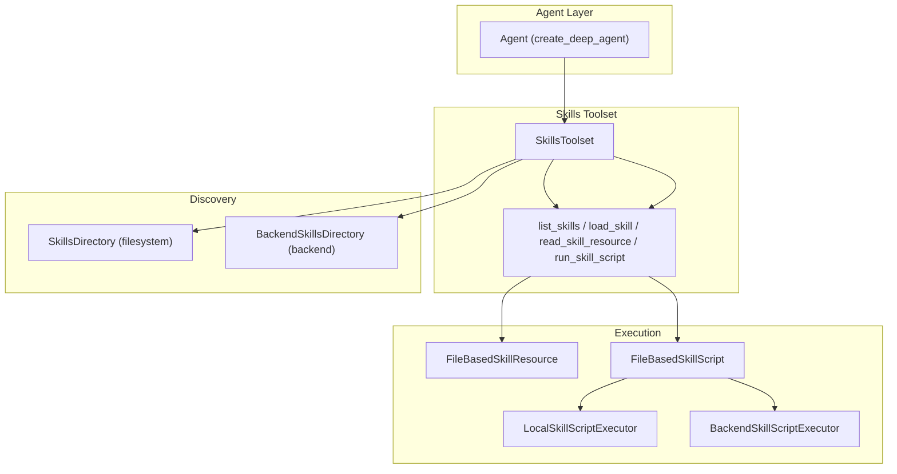
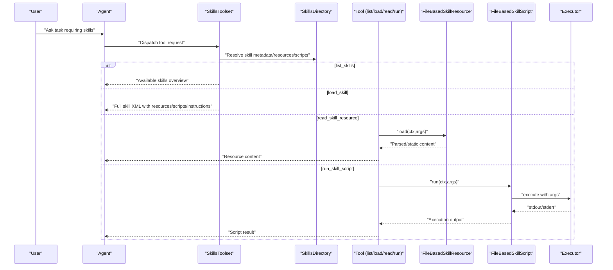
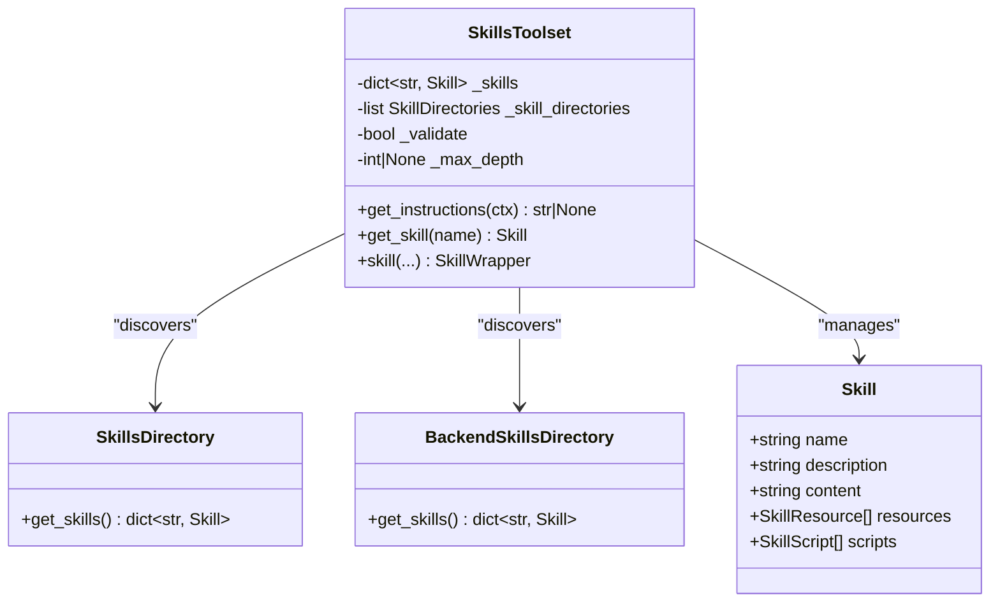
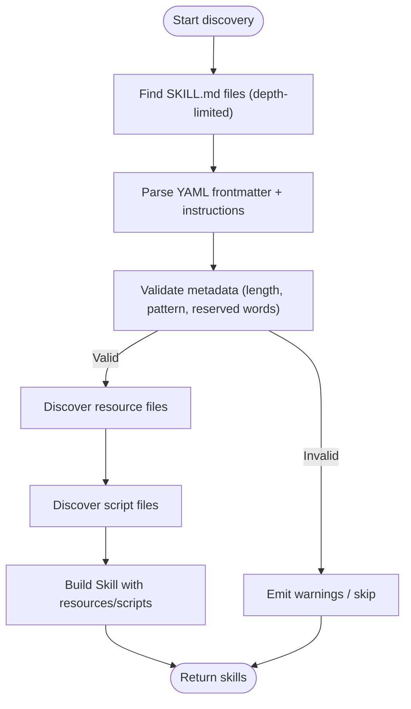
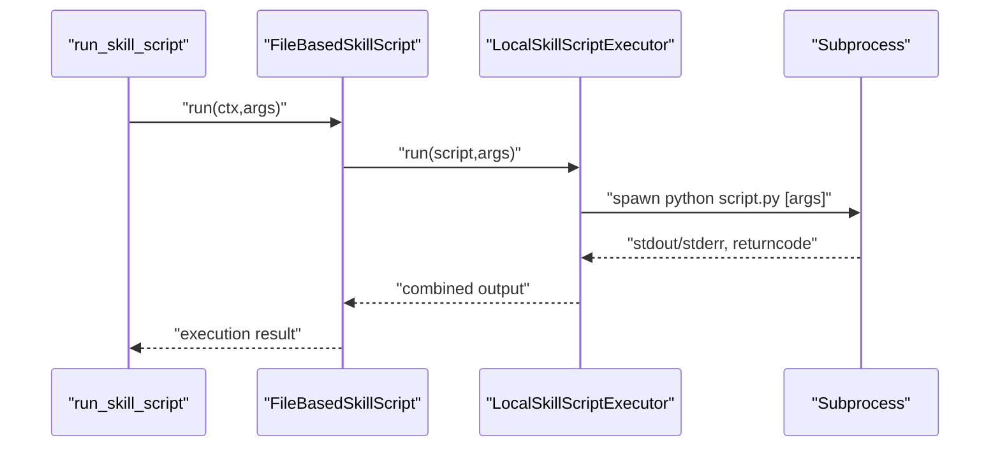
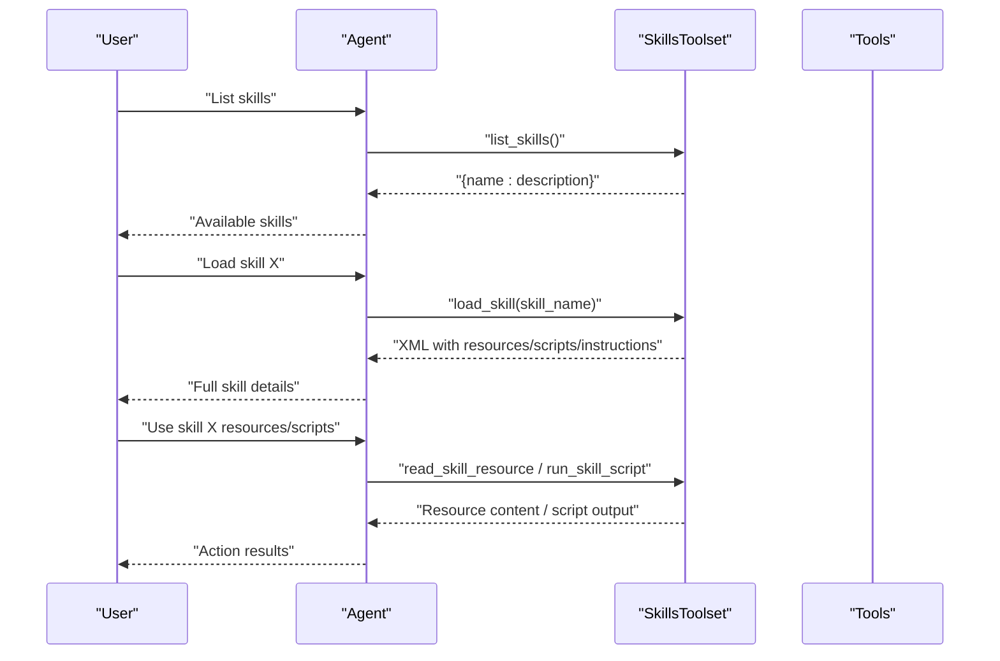
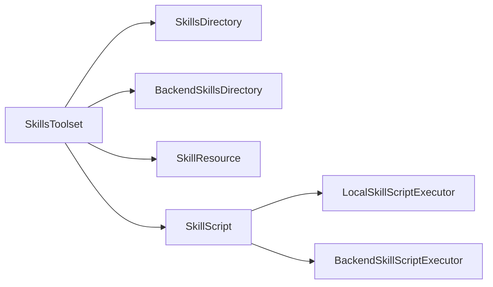

# Skills Framework

<cite>
**Referenced Files in This Document**
- [SKILL.md](file://pydantic_deep/bundled_skills/code-review/SKILL.md)
- [SKILL.md](file://pydantic_deep/bundled_skills/data-formats/SKILL.md)
- [SKILL.md](file://pydantic_deep/bundled_skills/environment-discovery/SKILL.md)
- [SKILL.md](file://pydantic_deep/bundled_skills/git-workflow/SKILL.md)
- [SKILL.md](file://pydantic_deep/bundled_skills/performant-code/SKILL.md)
- [SKILL.md](file://pydantic_deep/bundled_skills/refactor/SKILL.md)
- [SKILL.md](file://pydantic_deep/bundled_skills/test-writer/SKILL.md)
- [SKILL.md](file://pydantic_deep/bundled_skills/verification-strategy/SKILL.md)
- [toolset.py](file://pydantic_deep/toolsets/skills/toolset.py)
- [local.py](file://pydantic_deep/toolsets/skills/local.py)
- [backend.py](file://pydantic_deep/toolsets/skills/backend.py)
- [directory.py](file://pydantic_deep/toolsets/skills/directory.py)
- [agent.py](file://pydantic_deep/agent.py)
- [skills_usage.py](file://examples/skills_usage.py)
- [test_skills.py](file://tests/test_skills.py)
</cite>

## Table of Contents
1. [Introduction](#introduction)
2. [Project Structure](#project-structure)
3. [Core Components](#core-components)
4. [Architecture Overview](#architecture-overview)
5. [Detailed Component Analysis](#detailed-component-analysis)
6. [Dependency Analysis](#dependency-analysis)
7. [Performance Considerations](#performance-considerations)
8. [Troubleshooting Guide](#troubleshooting-guide)
9. [Conclusion](#conclusion)
10. [Appendices](#appendices)

## Introduction
The Skills Framework provides a modular, extensible capability system for agents. It enables domain-specific abilities to be packaged as SKILL.md files with YAML frontmatter, Markdown instructions, and optional resources/scripts. Skills integrate seamlessly with Pydantic AI agents via a dedicated toolset that supports:
- Discovery from local filesystem or backend-backed storage
- On-demand loading of skill instructions
- Access to skill resources (static or dynamic)
- Execution of skill scripts (local subprocess or backend sandbox)

Bundled skills demonstrate practical domains such as code review, data formats, environment discovery, git workflow, and performance optimization. This document explains the architecture, resource management, execution patterns, and best practices for building and distributing skills.

## Project Structure
The Skills Framework spans several modules:
- Skills toolset: orchestration and tool registration
- Local execution: filesystem-based resources/scripts and subprocess execution
- Backend execution: backend-aware resources/scripts and sandbox execution
- Discovery: filesystem and backend skill directory loaders
- Agent integration: factory function wiring skills into agents

**Diagram sources**
- [agent.py:623-661](file://pydantic_deep/agent.py#L623-L661)
- [toolset.py:112-598](file://pydantic_deep/toolsets/skills/toolset.py#L112-L598)
- [directory.py:444-532](file://pydantic_deep/toolsets/skills/directory.py#L444-L532)
- [backend.py:397-565](file://pydantic_deep/toolsets/skills/backend.py#L397-L565)
- [local.py:88-313](file://pydantic_deep/toolsets/skills/local.py#L88-L313)

**Section sources**
- [agent.py:623-661](file://pydantic_deep/agent.py#L623-L661)
- [toolset.py:112-598](file://pydantic_deep/toolsets/skills/toolset.py#L112-L598)
- [directory.py:444-532](file://pydantic_deep/toolsets/skills/directory.py#L444-L532)
- [backend.py:397-565](file://pydantic_deep/toolsets/skills/backend.py#L397-L565)
- [local.py:88-313](file://pydantic_deep/toolsets/skills/local.py#L88-L313)

## Core Components
- SkillsToolset: registers and exposes four tools to agents; builds system prompt with available skills; supports programmatic skills and directory-based discovery.
- SkillsDirectory: discovers skills from a local filesystem, parses SKILL.md, validates metadata, and auto-discovers resources and scripts.
- BackendSkillsDirectory: mirrors discovery for backend-backed storage, enabling skills in sandboxed or remote environments.
- LocalSkillScriptExecutor: executes file-based scripts via subprocess with argument marshalling and timeouts.
- BackendSkillScriptExecutor: executes scripts via backend sandbox execute API.
- FileBasedSkillResource/FileBasedSkillScript: resource/script abstractions backed by filesystem or backend storage.

Key capabilities:
- Progressive disclosure: list_skills for overview, load_skill for full instructions
- Resource access: static files and dynamic callables
- Script execution: local subprocess or backend sandbox
- Validation: name patterns, length limits, and metadata checks

**Section sources**
- [toolset.py:112-598](file://pydantic_deep/toolsets/skills/toolset.py#L112-L598)
- [directory.py:444-532](file://pydantic_deep/toolsets/skills/directory.py#L444-L532)
- [backend.py:397-565](file://pydantic_deep/toolsets/skills/backend.py#L397-L565)
- [local.py:88-313](file://pydantic_deep/toolsets/skills/local.py#L88-L313)

## Architecture Overview
The agent factory composes a SkillsToolset when enabled, passing either preloaded skills or skill directories. The toolset injects a system prompt describing available skills and registers tools for listing, loading, reading resources, and running scripts. Execution flows differ by environment:
- Local: FileBasedSkillScript delegates to LocalSkillScriptExecutor, which spawns a subprocess with sanitized arguments.
- Backend: FileBasedSkillScript delegates to BackendSkillScriptExecutor, which invokes SandboxProtocol.execute with a constructed command.

**Diagram sources**
- [agent.py:623-661](file://pydantic_deep/agent.py#L623-L661)
- [toolset.py:325-456](file://pydantic_deep/toolsets/skills/toolset.py#L325-L456)
- [directory.py:444-532](file://pydantic_deep/toolsets/skills/directory.py#L444-L532)
- [local.py:88-313](file://pydantic_deep/toolsets/skills/local.py#L88-L313)
- [backend.py:397-565](file://pydantic_deep/toolsets/skills/backend.py#L397-L565)

## Detailed Component Analysis

### SkillsToolset
SkillsToolset is the central integration point. It:
- Initializes from programmatic skills and/or directories
- Registers four tools: list_skills, load_skill, read_skill_resource, run_skill_script
- Builds a system prompt listing available skills and guidance
- Supports excluding tools and overriding descriptions

**Diagram sources**
- [toolset.py:112-598](file://pydantic_deep/toolsets/skills/toolset.py#L112-L598)
- [directory.py:444-532](file://pydantic_deep/toolsets/skills/directory.py#L444-L532)
- [backend.py:397-565](file://pydantic_deep/toolsets/skills/backend.py#L397-L565)

**Section sources**
- [toolset.py:112-598](file://pydantic_deep/toolsets/skills/toolset.py#L112-L598)

### SkillsDirectory (Filesystem Discovery)
Discovers skills by scanning for SKILL.md files up to a configurable depth. It:
- Parses YAML frontmatter and Markdown instructions
- Validates metadata (name, description, compatibility)
- Auto-discovers resources (*.md, *.json, *.yaml, *.yml, *.csv, *.xml, *.txt)
- Auto-discovers scripts (*.py in root and scripts/ subdirectory)
- Guards against symlink escapes and unsupported patterns

**Diagram sources**
- [directory.py:444-532](file://pydantic_deep/toolsets/skills/directory.py#L444-L532)

**Section sources**
- [directory.py:444-532](file://pydantic_deep/toolsets/skills/directory.py#L444-L532)

### BackendSkillsDirectory (Backend Discovery)
Mirrors filesystem discovery for backend-backed storage:
- Uses BackendProtocol.glob_info and _read_bytes
- Supports resource discovery and script discovery only if backend is a SandboxProtocol
- Constructs resource/script objects with backend-aware executors

**Section sources**
- [backend.py:397-565](file://pydantic_deep/toolsets/skills/backend.py#L397-L565)

### Local Execution Pipeline
File-based resources are read from disk; JSON/YAML are parsed, others as text. Scripts execute via subprocess with:
- Argument marshalling: booleans emit flags, lists repeat flags, others stringify
- Timeout protection
- Combined stdout/stderr handling
- Non-zero exit codes reported

**Diagram sources**
- [local.py:88-313](file://pydantic_deep/toolsets/skills/local.py#L88-L313)

**Section sources**
- [local.py:88-313](file://pydantic_deep/toolsets/skills/local.py#L88-L313)

### Backend Execution Pipeline
Backend scripts execute via SandboxProtocol.execute with:
- Command construction from script URI and args
- Timeout and truncation handling
- Exit code reporting

**Section sources**
- [backend.py:109-226](file://pydantic_deep/toolsets/skills/backend.py#L109-L226)

### Bundled Skills
The repository ships several bundled skills demonstrating practical domains:
- code-review: systematic checklist for correctness, security, performance, style, and testing
- data-formats: detection, parsing strategies, pitfalls for binary/text/structured formats
- environment-discovery: safe exploration of unknown workspaces
- git-workflow: commit messages, branching, PRs, conflict resolution
- performant-code: I/O optimization, algorithmic complexity, language tips
- refactor: incremental improvement without changing behavior
- test-writer: coverage strategy and guidelines
- verification-strategy: final checks before completion

These are authored as SKILL.md files with YAML frontmatter and Markdown instructions.

**Section sources**
- [SKILL.md:1-47](file://pydantic_deep/bundled_skills/code-review/SKILL.md#L1-L47)
- [SKILL.md:1-83](file://pydantic_deep/bundled_skills/data-formats/SKILL.md#L1-L83)
- [SKILL.md:1-59](file://pydantic_deep/bundled_skills/environment-discovery/SKILL.md#L1-L59)
- [SKILL.md:1-44](file://pydantic_deep/bundled_skills/git-workflow/SKILL.md#L1-L44)
- [SKILL.md:1-71](file://pydantic_deep/bundled_skills/performant-code/SKILL.md#L1-L71)
- [SKILL.md:1-45](file://pydantic_deep/bundled_skills/refactor/SKILL.md#L1-L45)
- [SKILL.md:1-47](file://pydantic_deep/bundled_skills/test-writer/SKILL.md#L1-L47)
- [SKILL.md:1-90](file://pydantic_deep/bundled_skills/verification-strategy/SKILL.md#L1-L90)

### Practical Examples and Workflows
- Listing and loading skills: the example demonstrates listing available skills and loading full instructions for a specific skill.
- Using skills with agents: the example shows creating an agent with skills, then invoking skills to review code and generate tests.
- Progressive disclosure: agents first list skills, then load detailed instructions, then use resources/scripts.

**Diagram sources**
- [skills_usage.py:23-101](file://examples/skills_usage.py#L23-L101)
- [toolset.py:325-456](file://pydantic_deep/toolsets/skills/toolset.py#L325-L456)

**Section sources**
- [skills_usage.py:23-101](file://examples/skills_usage.py#L23-L101)

## Dependency Analysis
SkillsToolset depends on:
- SkillsDirectory or BackendSkillsDirectory for discovery
- SkillResource and SkillScript implementations for resources/scripts
- LocalSkillScriptExecutor or BackendSkillScriptExecutor for execution

**Diagram sources**
- [toolset.py:112-598](file://pydantic_deep/toolsets/skills/toolset.py#L112-L598)
- [directory.py:444-532](file://pydantic_deep/toolsets/skills/directory.py#L444-L532)
- [backend.py:397-565](file://pydantic_deep/toolsets/skills/backend.py#L397-L565)
- [local.py:88-313](file://pydantic_deep/toolsets/skills/local.py#L88-L313)

**Section sources**
- [toolset.py:112-598](file://pydantic_deep/toolsets/skills/toolset.py#L112-L598)
- [directory.py:444-532](file://pydantic_deep/toolsets/skills/directory.py#L444-L532)
- [backend.py:397-565](file://pydantic_deep/toolsets/skills/backend.py#L397-L565)
- [local.py:88-313](file://pydantic_deep/toolsets/skills/local.py#L88-L313)

## Performance Considerations
- Depth-limited discovery prevents scanning very large trees; adjust max_depth as needed.
- Resource/script discovery filters by extension; ensure files are placed under supported extensions.
- Local execution uses timeouts to avoid hanging scripts; tune timeouts per skill.
- Backend execution reports truncation; consider streaming or chunked outputs for large results.
- Progressive disclosure reduces prompt size by loading only needed instructions.

## Troubleshooting Guide
Common issues and resolutions:
- Missing or invalid SKILL.md: ensure YAML frontmatter is valid and includes required fields; validation warns and can skip invalid skills.
- Duplicate skill names: later occurrences override earlier ones with a warning.
- Resource/script not found: tools return error messages listing available names.
- Execution timeouts or non-zero exit codes: inspect stderr and exit codes; adjust timeouts or script logic.
- Symlink escape attempts: discovery skips resources/scripts whose resolved paths escape the skill directory.

**Section sources**
- [directory.py:220-344](file://pydantic_deep/toolsets/skills/directory.py#L220-L344)
- [local.py:112-181](file://pydantic_deep/toolsets/skills/local.py#L112-L181)
- [backend.py:133-189](file://pydantic_deep/toolsets/skills/backend.py#L133-L189)
- [toolset.py:277-283](file://pydantic_deep/toolsets/skills/toolset.py#L277-L283)

## Conclusion
The Skills Framework offers a robust, modular way to extend agent capabilities. By packaging domain expertise in SKILL.md files with resources and scripts, teams can compose powerful, reusable capabilities. The dual-local/backend execution model ensures portability across environments, while validation and progressive disclosure keep systems reliable and efficient.

## Appendices

### Best Practices for Custom Skills
- Author SKILL.md with clear YAML frontmatter (name, description, tags, version) and Markdown instructions.
- Place resources under supported extensions; use JSON/YAML for structured data.
- Keep instructions concise; use resources for detailed templates or data.
- Provide scripts for automatable tasks; document required arguments.
- Validate skill names and lengths; avoid reserved words.
- Use progressive disclosure: list_skills for overview, load_skill for details.

### Distribution and Versioning
- Distribute skills as directories with SKILL.md and associated files.
- Use semantic versioning in frontmatter; include changelog in instructions.
- Pin compatible environments via compatibility metadata.
- Share via filesystem or backend storage; BackendSkillsDirectory enables centralized distribution.

### Parameter Passing and Execution
- Arguments are passed as command-line flags to scripts; booleans emit flags, lists repeat flags, others stringify.
- For backend execution, arguments are embedded into a shell command string.
- Resource access supports both static files and dynamic callables with function_schema.

**Section sources**
- [local.py:112-181](file://pydantic_deep/toolsets/skills/local.py#L112-L181)
- [backend.py:133-189](file://pydantic_deep/toolsets/skills/backend.py#L133-L189)
- [directory.py:220-344](file://pydantic_deep/toolsets/skills/directory.py#L220-L344)