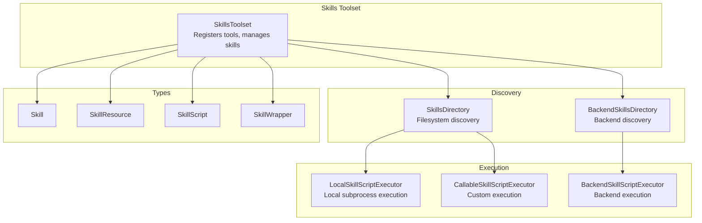
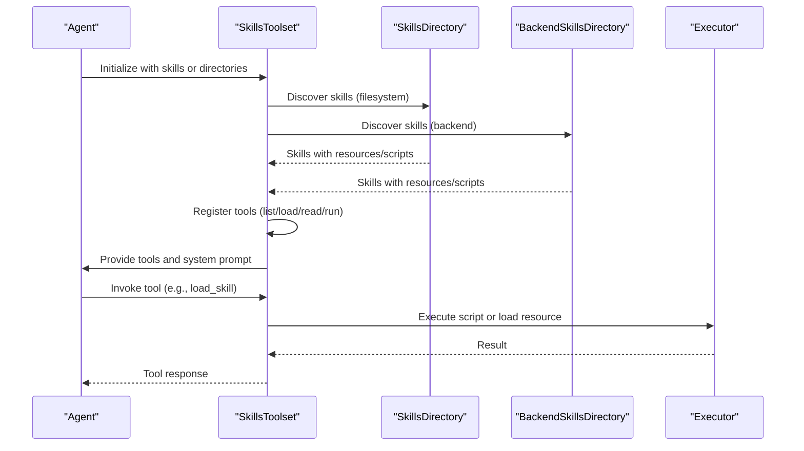
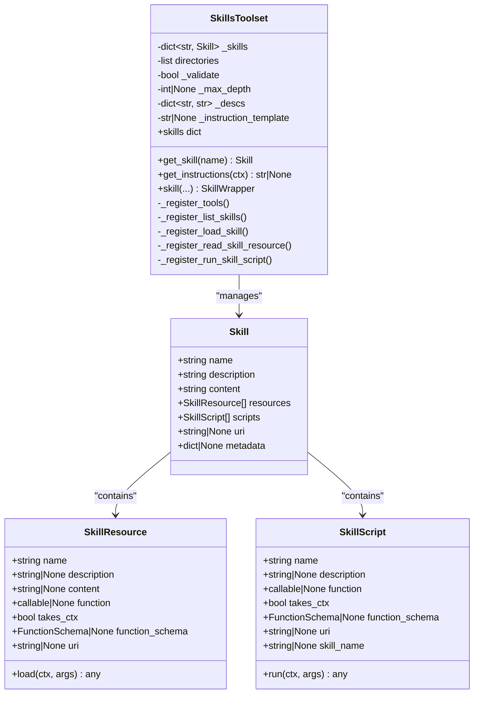
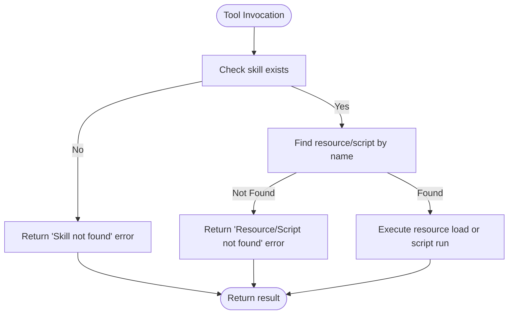
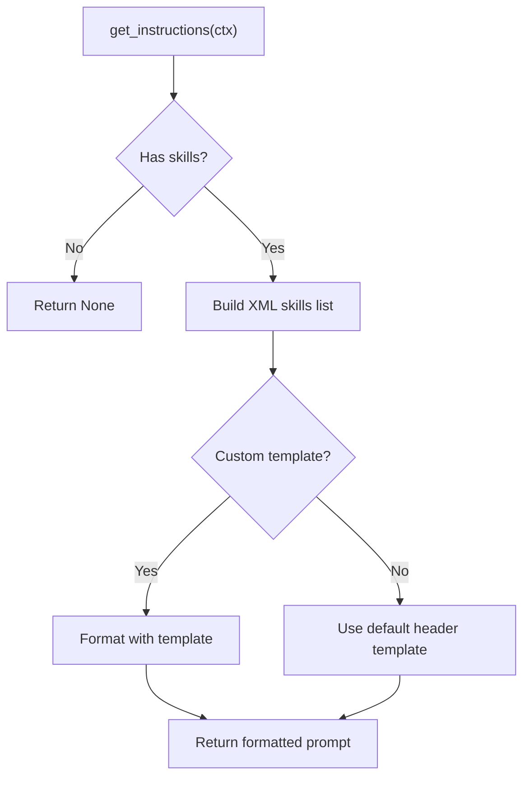
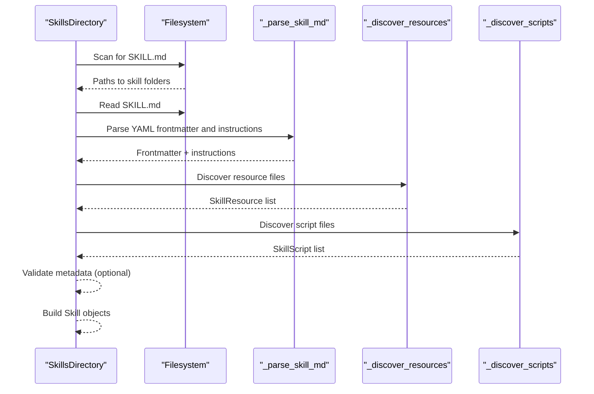
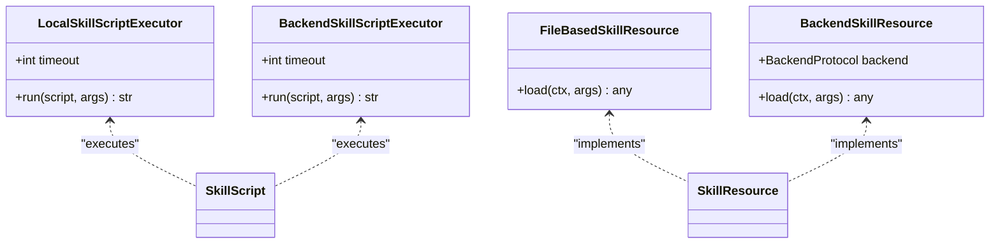
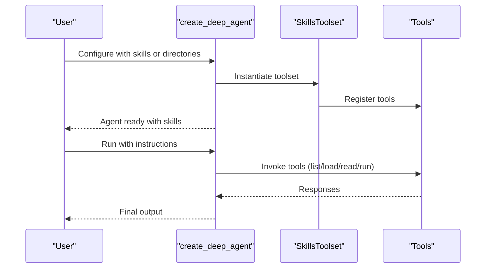
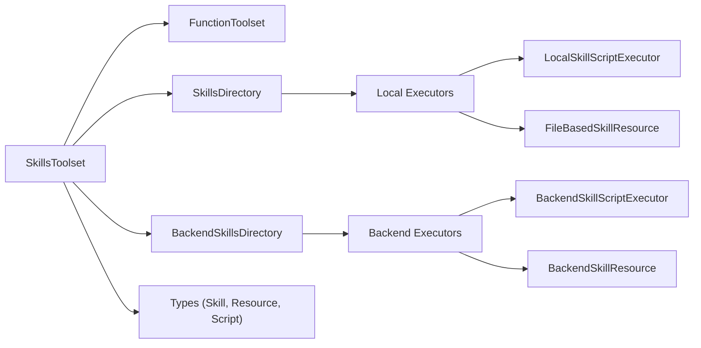

# Skills Toolset

<cite>
**Referenced Files in This Document**
- [toolset.py](file://pydantic_deep/toolsets/skills/toolset.py)
- [directory.py](file://pydantic_deep/toolsets/skills/directory.py)
- [local.py](file://pydantic_deep/toolsets/skills/local.py)
- [backend.py](file://pydantic_deep/toolsets/skills/backend.py)
- [types.py](file://pydantic_deep/toolsets/skills/types.py)
- [exceptions.py](file://pydantic_deep/toolsets/skills/exceptions.py)
- [agent.py](file://pydantic_deep/agent.py)
- [skills_usage.py](file://examples/skills_usage.py)
- [test_skills.py](file://tests/test_skills.py)
- [test_skills_extended.py](file://tests/test_skills_extended.py)
</cite>

## Table of Contents
1. [Introduction](#introduction)
2. [Project Structure](#project-structure)
3. [Core Components](#core-components)
4. [Architecture Overview](#architecture-overview)
5. [Detailed Component Analysis](#detailed-component-analysis)
6. [Dependency Analysis](#dependency-analysis)
7. [Performance Considerations](#performance-considerations)
8. [Troubleshooting Guide](#troubleshooting-guide)
9. [Conclusion](#conclusion)
10. [Appendices](#appendices)

## Introduction
The Skills Toolset is the core interface for integrating modular skills with Pydantic AI agents. It enables agents to discover, manage, and execute skills dynamically, providing progressive disclosure of capabilities and resources. The toolset exposes four primary tools:
- list_skills: Enumerate available skills and their descriptions
- load_skill: Retrieve a skill’s complete instructions and metadata
- read_skill_resource: Access static or dynamic skill resources
- run_skill_script: Execute skill scripts for actions or computations

It supports both local filesystem-based skills and backend-backed skills, with robust validation, error handling, and customization options for descriptions, exclusion, and instruction templates.

## Project Structure
The Skills Toolset is organized around a central toolset class and supporting modules for discovery, execution, and types:
- Toolset: Central orchestrator for skills and tool registration
- Directory: Filesystem-based discovery and parsing
- Local: File-based resources/scripts and local execution
- Backend: Backend-aware discovery and execution
- Types: Data structures and decorators for skills
- Exceptions: Skill-specific error types

**Diagram sources**
- [toolset.py:112-598](file://pydantic_deep/toolsets/skills/toolset.py#L112-L598)
- [directory.py:444-532](file://pydantic_deep/toolsets/skills/directory.py#L444-L532)
- [local.py:88-313](file://pydantic_deep/toolsets/skills/local.py#L88-L313)
- [backend.py:397-565](file://pydantic_deep/toolsets/skills/backend.py#L397-L565)
- [types.py:75-521](file://pydantic_deep/toolsets/skills/types.py#L75-L521)

**Section sources**
- [toolset.py:1-110](file://pydantic_deep/toolsets/skills/toolset.py#L1-L110)
- [directory.py:1-50](file://pydantic_deep/toolsets/skills/directory.py#L1-L50)
- [local.py:1-25](file://pydantic_deep/toolsets/skills/local.py#L1-L25)
- [backend.py:1-30](file://pydantic_deep/toolsets/skills/backend.py#L1-L30)
- [types.py:1-30](file://pydantic_deep/toolsets/skills/types.py#L1-L30)

## Core Components
- SkillsToolset: Initializes with skills or directories, validates and registers tools, builds system prompt instructions, and exposes the four tools
- SkillsDirectory: Discovers skills from filesystem, parses SKILL.md, discovers resources/scripts, and validates metadata
- LocalSkillScriptExecutor: Executes scripts via subprocess with argument marshalling
- BackendSkillsDirectory and BackendSkillScriptExecutor: Parallel backend implementations for discovery and execution
- Types: Skill, SkillResource, SkillScript, SkillWrapper with decorators for attaching resources/scripts
- Exceptions: Hierarchical error types for skill-related failures

Key configuration options:
- skills: Preloaded Skill objects
- directories: Paths or SkillsDirectory/BackendSkillsDirectory instances
- validate: Enable/disable validation during discovery
- max_depth: Limit discovery depth
- id: Toolset identifier
- instruction_template: Custom template for system prompt injection
- exclude_tools: Exclude specific tools by name
- descriptions: Override tool descriptions

**Section sources**
- [toolset.py:151-236](file://pydantic_deep/toolsets/skills/toolset.py#L151-L236)
- [directory.py:444-532](file://pydantic_deep/toolsets/skills/directory.py#L444-L532)
- [local.py:88-182](file://pydantic_deep/toolsets/skills/local.py#L88-L182)
- [backend.py:397-565](file://pydantic_deep/toolsets/skills/backend.py#L397-L565)
- [types.py:75-521](file://pydantic_deep/toolsets/skills/types.py#L75-L521)
- [exceptions.py:20-42](file://pydantic_deep/toolsets/skills/exceptions.py#L20-L42)

## Architecture Overview
The Skills Toolset integrates with Pydantic AI agents through the FunctionToolset base, registering tools dynamically and injecting a skills-aware system prompt. Discovery can originate from local filesystem or backend storage, with execution delegated to appropriate executors.

**Diagram sources**
- [toolset.py:112-598](file://pydantic_deep/toolsets/skills/toolset.py#L112-L598)
- [directory.py:444-532](file://pydantic_deep/toolsets/skills/directory.py#L444-L532)
- [backend.py:397-565](file://pydantic_deep/toolsets/skills/backend.py#L397-L565)
- [local.py:88-182](file://pydantic_deep/toolsets/skills/local.py#L88-L182)

## Detailed Component Analysis

### SkillsToolset Initialization and Configuration
- Constructor accepts skills, directories, validation flags, depth limits, id, instruction template, tool exclusions, and custom descriptions
- Validates exclude_tools against known tool names and warns if critical tools are removed
- Loads programmatic skills first, then directory-based skills, with duplicate detection and warnings
- Registers tools based on exclude list

**Diagram sources**
- [toolset.py:112-598](file://pydantic_deep/toolsets/skills/toolset.py#L112-L598)
- [types.py:75-521](file://pydantic_deep/toolsets/skills/types.py#L75-L521)

**Section sources**
- [toolset.py:151-236](file://pydantic_deep/toolsets/skills/toolset.py#L151-L236)
- [toolset.py:325-335](file://pydantic_deep/toolsets/skills/toolset.py#L325-L335)
- [toolset.py:579-598](file://pydantic_deep/toolsets/skills/toolset.py#L579-L598)

### Tool Registration and Parameter Validation
- Tools are conditionally registered based on exclude_tools
- Tool signatures validate presence of required parameters and return formatted responses
- Error handling returns descriptive messages when skills/resources/scripts are not found

**Diagram sources**
- [toolset.py:346-390](file://pydantic_deep/toolsets/skills/toolset.py#L346-L390)
- [toolset.py:391-424](file://pydantic_deep/toolsets/skills/toolset.py#L391-L424)
- [toolset.py:425-456](file://pydantic_deep/toolsets/skills/toolset.py#L425-L456)

**Section sources**
- [toolset.py:336-345](file://pydantic_deep/toolsets/skills/toolset.py#L336-L345)
- [toolset.py:346-390](file://pydantic_deep/toolsets/skills/toolset.py#L346-L390)
- [toolset.py:391-424](file://pydantic_deep/toolsets/skills/toolset.py#L391-L424)
- [toolset.py:425-456](file://pydantic_deep/toolsets/skills/toolset.py#L425-L456)

### Instruction Template System and System Prompt Injection
- get_instructions builds an XML-formatted skills list and injects it into the agent’s system prompt
- Supports custom instruction_template with {skills_list} placeholder
- Returns None when no skills are loaded

**Diagram sources**
- [toolset.py:457-484](file://pydantic_deep/toolsets/skills/toolset.py#L457-L484)

**Section sources**
- [toolset.py:39-75](file://pydantic_deep/toolsets/skills/toolset.py#L39-L75)
- [toolset.py:457-484](file://pydantic_deep/toolsets/skills/toolset.py#L457-L484)

### Skill Discovery and Management
- SkillsDirectory discovers skills from filesystem, parses SKILL.md, validates metadata, and finds resources/scripts
- BackendSkillsDirectory mirrors discovery for backend filesystems
- Both support depth-limited search and security checks for symlinks

**Diagram sources**
- [directory.py:444-532](file://pydantic_deep/toolsets/skills/directory.py#L444-L532)
- [directory.py:347-442](file://pydantic_deep/toolsets/skills/directory.py#L347-L442)
- [directory.py:184-218](file://pydantic_deep/toolsets/skills/directory.py#L184-L218)
- [directory.py:220-264](file://pydantic_deep/toolsets/skills/directory.py#L220-L264)
- [directory.py:288-345](file://pydantic_deep/toolsets/skills/directory.py#L288-L345)

**Section sources**
- [directory.py:444-532](file://pydantic_deep/toolsets/skills/directory.py#L444-L532)
- [directory.py:184-218](file://pydantic_deep/toolsets/skills/directory.py#L184-L218)
- [directory.py:220-264](file://pydantic_deep/toolsets/skills/directory.py#L220-L264)
- [directory.py:288-345](file://pydantic_deep/toolsets/skills/directory.py#L288-L345)

### Script Execution and Resource Loading
- LocalSkillScriptExecutor executes scripts via subprocess with CLI argument marshalling and timeout handling
- FileBasedSkillResource loads static files or parses JSON/YAML
- BackendSkillScriptExecutor executes scripts via backend sandbox with exit code and truncation reporting

**Diagram sources**
- [local.py:88-182](file://pydantic_deep/toolsets/skills/local.py#L88-L182)
- [local.py:35-86](file://pydantic_deep/toolsets/skills/local.py#L35-L86)
- [backend.py:109-190](file://pydantic_deep/toolsets/skills/backend.py#L109-L190)
- [backend.py:46-107](file://pydantic_deep/toolsets/skills/backend.py#L46-L107)

**Section sources**
- [local.py:88-182](file://pydantic_deep/toolsets/skills/local.py#L88-L182)
- [local.py:35-86](file://pydantic_deep/toolsets/skills/local.py#L35-L86)
- [backend.py:109-190](file://pydantic_deep/toolsets/skills/backend.py#L109-L190)
- [backend.py:46-107](file://pydantic_deep/toolsets/skills/backend.py#L46-L107)

### Practical Examples and Integration Patterns
- Example usage demonstrates listing skills, loading instructions, and using resources/scripts
- Integration with create_deep_agent shows how to include skills via skills or skill_directories

**Diagram sources**
- [skills_usage.py:23-101](file://examples/skills_usage.py#L23-L101)
- [agent.py:196-600](file://pydantic_deep/agent.py#L196-L600)

**Section sources**
- [skills_usage.py:23-101](file://examples/skills_usage.py#L23-L101)
- [agent.py:196-600](file://pydantic_deep/agent.py#L196-L600)

## Dependency Analysis
The Skills Toolset depends on:
- pydantic_ai FunctionToolset for tool registration and invocation
- pydantic_ai_backends for backend protocol and sandbox execution
- Internal types and executors for resource/script handling

**Diagram sources**
- [toolset.py:23-37](file://pydantic_deep/toolsets/skills/toolset.py#L23-L37)
- [directory.py:21-28](file://pydantic_deep/toolsets/skills/directory.py#L21-L28)
- [local.py:21-25](file://pydantic_deep/toolsets/skills/local.py#L21-L25)
- [backend.py:21-30](file://pydantic_deep/toolsets/skills/backend.py#L21-L30)

**Section sources**
- [toolset.py:14-37](file://pydantic_deep/toolsets/skills/toolset.py#L14-L37)
- [directory.py:11-28](file://pydantic_deep/toolsets/skills/directory.py#L11-L28)
- [local.py:12-25](file://pydantic_deep/toolsets/skills/local.py#L12-L25)
- [backend.py:12-30](file://pydantic_deep/toolsets/skills/backend.py#L12-L30)

## Performance Considerations
- Discovery depth limits reduce scanning overhead; default depth is three levels
- YAML parsing falls back to regex when pyyaml is unavailable
- Script execution timeouts prevent hanging processes
- Resource auto-parsing avoids unnecessary conversions

[No sources needed since this section provides general guidance]

## Troubleshooting Guide
Common issues and resolutions:
- Unknown tool exclusions: Raises ValueError with valid tool names
- Excluding critical tools: Warning issued for load_skill exclusion
- Missing default skills directory: Warning when no ./skills present
- Duplicate skills: Warning and override behavior
- Validation failures: SkillValidationError raised or suppressed based on validate flag
- Resource/script not found: Descriptive error messages with available items
- Execution errors: SkillScriptExecutionError with backend or subprocess details

**Section sources**
- [toolset.py:186-206](file://pydantic_deep/toolsets/skills/toolset.py#L186-L206)
- [toolset.py:221-232](file://pydantic_deep/toolsets/skills/toolset.py#L221-L232)
- [toolset.py:579-598](file://pydantic_deep/toolsets/skills/toolset.py#L579-L598)
- [directory.py:438-441](file://pydantic_deep/toolsets/skills/directory.py#L438-L441)
- [exceptions.py:20-42](file://pydantic_deep/toolsets/skills/exceptions.py#L20-L42)
- [test_skills.py:42-57](file://tests/test_skills.py#L42-L57)
- [test_skills_extended.py:389-402](file://tests/test_skills_extended.py#L389-L402)
- [test_skills_extended.py:403-424](file://tests/test_skills_extended.py#L403-L424)

## Conclusion
The Skills Toolset provides a robust, extensible framework for integrating modular skills into Pydantic AI agents. It supports flexible discovery from local and backend sources, progressive disclosure of capabilities, and secure execution of resources and scripts. With comprehensive validation, error handling, and customization options, it enables agents to adapt dynamically to diverse domains and workflows.

[No sources needed since this section summarizes without analyzing specific files]

## Appendices

### Tool Descriptions and Customization
- Built-in descriptions for list_skills, load_skill, read_skill_resource, and run_skill_script
- Custom descriptions override built-ins via descriptions mapping
- Tool exclusion prevents registration of specific tools

**Section sources**
- [toolset.py:79-110](file://pydantic_deep/toolsets/skills/toolset.py#L79-L110)
- [toolset.py:175-180](file://pydantic_deep/toolsets/skills/toolset.py#L175-L180)
- [toolset.py:186-197](file://pydantic_deep/toolsets/skills/toolset.py#L186-L197)

### Relationship Between Skills and Agent Capabilities
- Skills extend agent capabilities through tools and system prompt injection
- create_deep_agent integrates skills via skills or skill_directories parameters
- SkillsToolset.get_instructions contributes to dynamic system prompts

**Section sources**
- [agent.py:256-472](file://pydantic_deep/agent.py#L256-L472)
- [toolset.py:457-484](file://pydantic_deep/toolsets/skills/toolset.py#L457-L484)