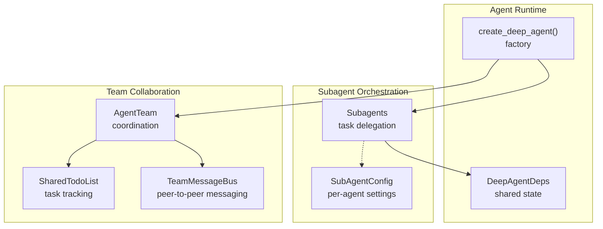
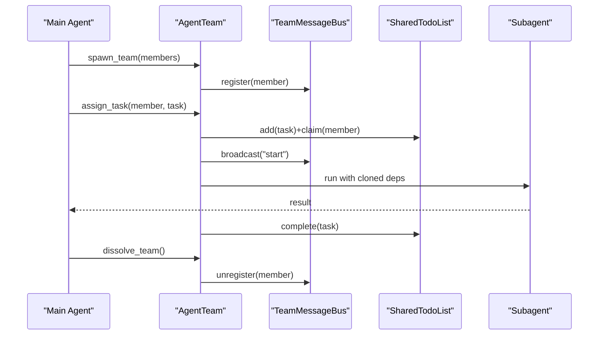
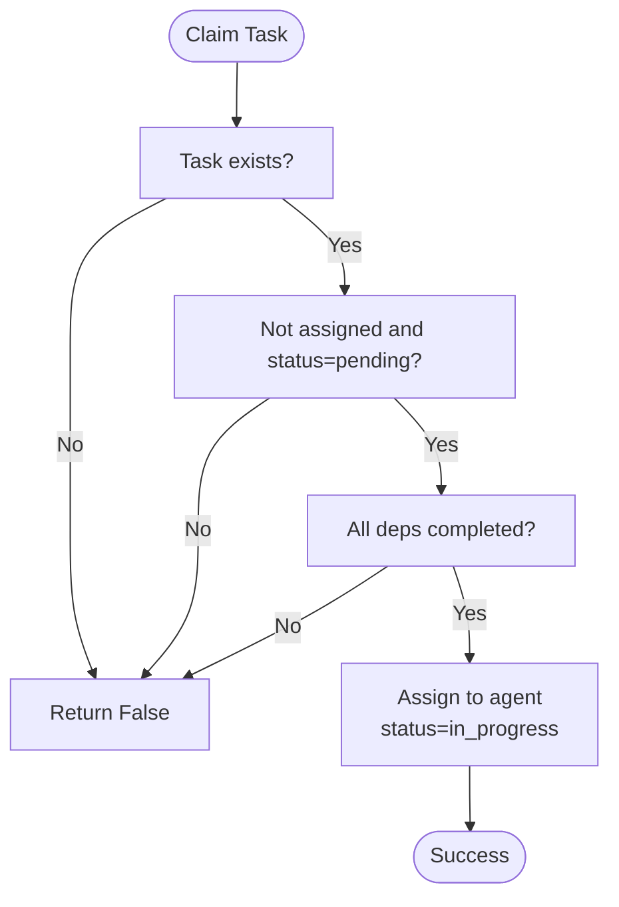
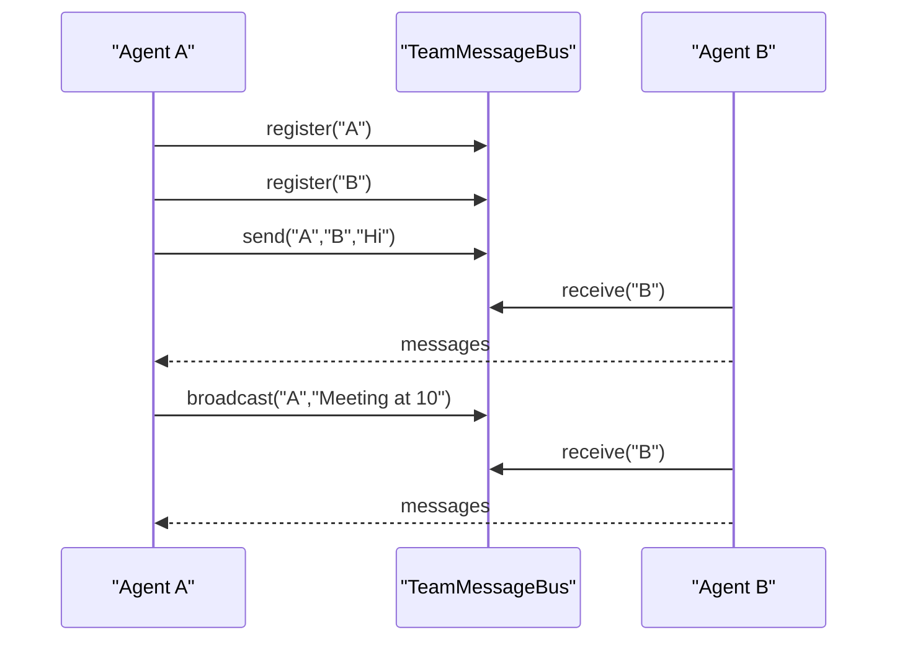
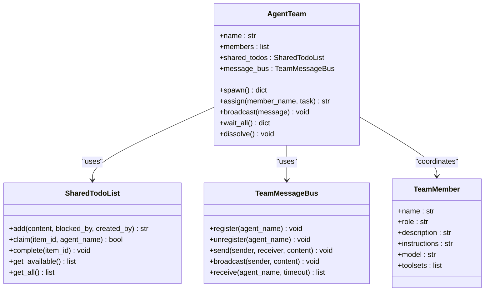
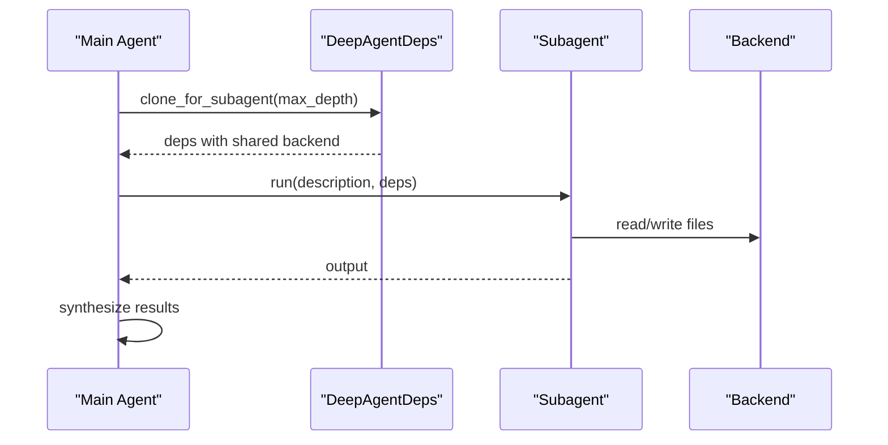
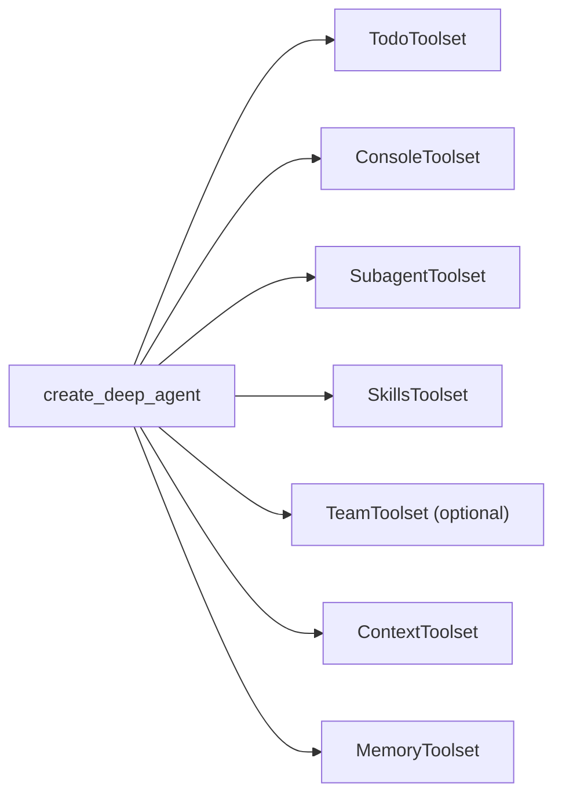

# Subagent Orchestration

<cite>
**Referenced Files in This Document**
- [teams.py](file://pydantic_deep/toolsets/teams.py)
- [subagents.md](file://docs/advanced/subagents.md)
- [teams.md](file://docs/advanced/teams.md)
- [subagents.py](file://examples/subagents.py)
- [agent.py](file://pydantic_deep/agent.py)
- [deps.py](file://pydantic_deep/deps.py)
- [types.py](file://pydantic_deep/types.py)
- [test_teams.py](file://tests/test_teams.py)
- [toolsets.md](file://docs/api/toolsets.md)
</cite>

## Table of Contents
1. [Introduction](#introduction)
2. [Project Structure](#project-structure)
3. [Core Components](#core-components)
4. [Architecture Overview](#architecture-overview)
5. [Detailed Component Analysis](#detailed-component-analysis)
6. [Dependency Analysis](#dependency-analysis)
7. [Performance Considerations](#performance-considerations)
8. [Troubleshooting Guide](#troubleshooting-guide)
9. [Conclusion](#conclusion)
10. [Appendices](#appendices)

## Introduction
This document describes the Subagent Orchestration toolset for building multi-agent collaboration and delegation systems. It covers two complementary approaches:
- Subagents: Parent-child delegation where a main agent spawns specialized agents to execute tasks in isolation with shared context.
- Agent Teams: Flat, peer-to-peer collaboration with shared TODO lists and messaging for coordinated workflows.

The documentation explains task delegation strategies, parallel execution patterns, inter-agent communication, shared state management, and collaborative workflows. It includes practical examples, scaling considerations, load balancing, and fault tolerance guidance.

## Project Structure
The Subagent Orchestration toolset spans several modules:
- Teams toolset: Shared TODO lists, peer-to-peer messaging, and team coordination primitives.
- Agent factory: Integrates subagents, teams, and other toolsets into a configurable agent.
- Deps container: Provides shared state and cloning semantics for subagents.
- Docs and examples: Guidance and runnable examples for subagent orchestration.

**Diagram sources**
- [agent.py:196-800](file://pydantic_deep/agent.py#L196-L800)
- [deps.py:18-207](file://pydantic_deep/deps.py#L18-L207)
- [teams.py:252-533](file://pydantic_deep/toolsets/teams.py#L252-L533)
- [subagents.md:1-471](file://docs/advanced/subagents.md#L1-L471)

**Section sources**
- [agent.py:196-800](file://pydantic_deep/agent.py#L196-L800)
- [deps.py:18-207](file://pydantic_deep/deps.py#L18-L207)
- [teams.py:252-533](file://pydantic_deep/toolsets/teams.py#L252-L533)
- [subagents.md:1-471](file://docs/advanced/subagents.md#L1-L471)

## Core Components
- SharedTodoList: Async-safe task tracker supporting claiming, dependencies, and auto-unblocking.
- TeamMessageBus: Peer-to-peer message routing with direct and broadcast modes.
- AgentTeam: Orchestrator that registers members, assigns tasks, broadcasts messages, and manages lifecycle.
- DeepAgentDeps: Shared dependency container with cloning semantics for subagents.
- create_deep_agent: Factory that integrates subagents and teams into a single agent.

Key capabilities:
- Parallel execution via subagents and team members.
- Shared state via backend and shared todos.
- Inter-agent communication via messaging bus.
- Lifecycle management via team dissolution and task completion.

**Section sources**
- [teams.py:38-129](file://pydantic_deep/toolsets/teams.py#L38-L129)
- [teams.py:147-217](file://pydantic_deep/toolsets/teams.py#L147-L217)
- [teams.py:252-307](file://pydantic_deep/toolsets/teams.py#L252-L307)
- [deps.py:174-196](file://pydantic_deep/deps.py#L174-L196)
- [agent.py:538-621](file://pydantic_deep/agent.py#L538-L621)

## Architecture Overview
The system supports two collaboration models:

- Subagents (parent-child):
  - Main agent delegates tasks to specialized subagents.
  - Subagents inherit shared backend and optionally share todos.
  - Subagents can ask questions to the parent agent for clarification.

- Agent Teams (peer-to-peer):
  - Flat teams with shared TODO lists and messaging.
  - Members claim tasks, update status, and communicate directly.

**Diagram sources**
- [teams.py:252-307](file://pydantic_deep/toolsets/teams.py#L252-L307)
- [teams.py:147-217](file://pydantic_deep/toolsets/teams.py#L147-L217)
- [deps.py:174-196](file://pydantic_deep/deps.py#L174-L196)

**Section sources**
- [teams.md:23-141](file://docs/advanced/teams.md#L23-L141)
- [subagents.md:61-106](file://docs/advanced/subagents.md#L61-L106)

## Detailed Component Analysis

### Shared TODO List
The SharedTodoList provides thread-safe task management with:
- Adding tasks with optional dependencies.
- Claiming tasks with dependency checks.
- Completing tasks and auto-unblocking dependents.
- Listing available tasks and counts.

**Diagram sources**
- [teams.py:66-83](file://pydantic_deep/toolsets/teams.py#L66-L83)

**Section sources**
- [teams.py:38-129](file://pydantic_deep/toolsets/teams.py#L38-L129)
- [test_teams.py:101-292](file://tests/test_teams.py#L101-L292)

### Team Message Bus
The TeamMessageBus enables:
- Registration/unregistration of agents.
- Direct messaging and broadcast to all except sender.
- Inbox retrieval with optional timeouts.

**Diagram sources**
- [teams.py:147-217](file://pydantic_deep/toolsets/teams.py#L147-L217)

**Section sources**
- [teams.py:147-217](file://pydantic_deep/toolsets/teams.py#L147-L217)
- [test_teams.py:331-454](file://tests/test_teams.py#L331-L454)

### Agent Team Coordinator
AgentTeam orchestrates:
- Spawning members and registering on the message bus.
- Assigning tasks to members via shared TODO list.
- Broadcasting messages to all members.
- Waiting for completion and dissolving the team cleanly.

**Diagram sources**
- [teams.py:252-307](file://pydantic_deep/toolsets/teams.py#L252-L307)
- [teams.py:38-129](file://pydantic_deep/toolsets/teams.py#L38-L129)
- [teams.py:147-217](file://pydantic_deep/toolsets/teams.py#L147-L217)

**Section sources**
- [teams.py:252-307](file://pydantic_deep/toolsets/teams.py#L252-L307)
- [test_teams.py:514-644](file://tests/test_teams.py#L514-L644)

### Subagent Orchestration
Subagents enable parent-child delegation with:
- Specialized instructions per subagent.
- Context isolation via DeepAgentDeps.clone_for_subagent().
- Optional question-back channel to the parent agent.
- Execution modes: sync, async, or auto.

**Diagram sources**
- [deps.py:174-196](file://pydantic_deep/deps.py#L174-L196)
- [subagents.md:82-106](file://docs/advanced/subagents.md#L82-L106)

**Section sources**
- [subagents.md:12-106](file://docs/advanced/subagents.md#L12-L106)
- [agent.py:538-621](file://pydantic_deep/agent.py#L538-L621)
- [types.py:30-32](file://pydantic_deep/types.py#L30-L32)

### Practical Examples
- Subagent pipeline: Configure specialized subagents (reviewer, writer, generator) and delegate tasks from the main agent.
- Team collaboration: Spawn a team, assign tasks via shared TODO list, broadcast updates, and dissolve when complete.

**Section sources**
- [subagents.py:15-114](file://examples/subagents.py#L15-L114)
- [teams.md:104-141](file://docs/advanced/teams.md#L104-L141)

## Dependency Analysis
The agent factory composes multiple toolsets:
- Todo toolset for planning.
- Console toolset for file operations and execution.
- Subagent toolset for delegation.
- Skills toolset for modular capabilities.
- Team toolset for collaboration (optional).

**Diagram sources**
- [agent.py:506-707](file://pydantic_deep/agent.py#L506-L707)

**Section sources**
- [agent.py:506-707](file://pydantic_deep/agent.py#L506-L707)

## Performance Considerations
- Parallelism: Subagents and team members execute concurrently; use async execution modes for long-running tasks.
- Shared state: Lock-protected shared TODO list ensures thread safety under concurrency.
- Messaging overhead: Broadcast messages scale with team size; prefer targeted messaging for large teams.
- Context isolation: Subagent cloning avoids context bloat and improves performance for focused tasks.
- Cost control: Use model selection per subagent and enable cost tracking middleware.

[No sources needed since this section provides general guidance]

## Troubleshooting Guide
Common issues and resolutions:
- Team already active: Call dissolve_team before spawning a new team.
- Unknown team member: Use check_teammates to list available members.
- Unregistered receiver: Ensure agent is registered on the message bus.
- Task not claimable: Verify dependencies are completed and task is pending.
- Timeout receiving messages: Increase timeout or ensure sender registered.

**Section sources**
- [test_teams.py:685-793](file://tests/test_teams.py#L685-L793)
- [teams.py:166-217](file://pydantic_deep/toolsets/teams.py#L166-L217)
- [teams.py:66-83](file://pydantic_deep/toolsets/teams.py#L66-L83)

## Conclusion
The Subagent Orchestration toolset provides robust primitives for multi-agent collaboration:
- Subagents enable specialized, context-isolated delegation with optional question-back to the parent.
- Agent teams offer peer-to-peer coordination via shared TODO lists and messaging.
- The system supports parallel execution, shared state, and lifecycle management.
- With careful configuration and monitoring, teams can scale effectively while maintaining reliability.

[No sources needed since this section summarizes without analyzing specific files]

## Appendices

### API and Toolset References
- Subagent task tool parameters and execution modes.
- Team toolset operations: spawn_team, assign_task, check_teammates, message_teammate, dissolve_team.

**Section sources**
- [toolsets.md:197-226](file://docs/api/toolsets.md#L197-L226)
- [teams.py:354-532](file://pydantic_deep/toolsets/teams.py#L354-L532)