# Toolsets and Capabilities

<cite>
**Referenced Files in This Document**
- [pydantic_deep/toolsets/__init__.py](file://pydantic_deep/toolsets/__init__.py)
- [pydantic_deep/toolsets/plan/toolset.py](file://pydantic_deep/toolsets/plan/toolset.py)
- [pydantic_deep/toolsets/skills/toolset.py](file://pydantic_deep/toolsets/skills/toolset.py)
- [pydantic_deep/toolsets/context.py](file://pydantic_deep/toolsets/context.py)
- [pydantic_deep/toolsets/memory.py](file://pydantic_deep/toolsets/memory.py)
- [pydantic_deep/toolsets/teams.py](file://pydantic_deep/toolsets/teams.py)
- [pydantic_deep/toolsets/web.py](file://pydantic_deep/toolsets/web.py)
- [pydantic_deep/toolsets/checkpointing.py](file://pydantic_deep/toolsets/checkpointing.py)
- [pydantic_deep/toolsets/skills/backend.py](file://pydantic_deep/toolsets/skills/backend.py)
- [pydantic_deep/toolsets/skills/directory.py](file://pydantic_deep/toolsets/skills/directory.py)
- [docs/concepts/toolsets.md](file://docs/concepts/toolsets.md)
- [docs/concepts/skills.md](file://docs/concepts/skills.md)
- [docs/examples/skills.md](file://docs/examples/skills.md)
- [examples/skills_usage.py](file://examples/skills_usage.py)
- [pydantic_deep/bundled_skills/data-formats/SKILL.md](file://pydantic_deep/bundled_skills/data-formats/SKILL.md)
</cite>

## Table of Contents
1. [Introduction](#introduction)
2. [Project Structure](#project-structure)
3. [Core Components](#core-components)
4. [Architecture Overview](#architecture-overview)
5. [Detailed Component Analysis](#detailed-component-analysis)
6. [Dependency Analysis](#dependency-analysis)
7. [Performance Considerations](#performance-considerations)
8. [Troubleshooting Guide](#troubleshooting-guide)
9. [Conclusion](#conclusion)
10. [Appendices](#appendices)

## Introduction
This document explains the Toolsets and Capabilities system that extends agent abilities in the project. Toolsets are standardized, modular packages that expose tools and dynamic system prompt contributions to agents. They integrate with the agent runtime via FunctionToolset and related patterns, enabling capabilities such as planning, filesystem operations, skills, memory, context injection, teams, web tools, and checkpointing. The document covers how toolsets are structured, how they integrate with agents, and how to combine them effectively.

## Project Structure
The toolsets are organized under a dedicated package with one module per capability. The top-level initializer exposes commonly used toolsets and related utilities.

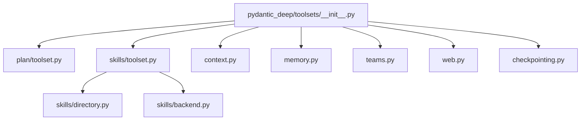

**Diagram sources**
- [pydantic_deep/toolsets/__init__.py:1-25](file://pydantic_deep/toolsets/__init__.py#L1-L25)
- [pydantic_deep/toolsets/plan/toolset.py:1-220](file://pydantic_deep/toolsets/plan/toolset.py#L1-L220)
- [pydantic_deep/toolsets/skills/toolset.py:1-598](file://pydantic_deep/toolsets/skills/toolset.py#L1-L598)
- [pydantic_deep/toolsets/context.py:1-208](file://pydantic_deep/toolsets/context.py#L1-L208)
- [pydantic_deep/toolsets/memory.py:1-231](file://pydantic_deep/toolsets/memory.py#L1-L231)
- [pydantic_deep/toolsets/teams.py:1-533](file://pydantic_deep/toolsets/teams.py#L1-L533)
- [pydantic_deep/toolsets/web.py:1-408](file://pydantic_deep/toolsets/web.py#L1-L408)
- [pydantic_deep/toolsets/checkpointing.py:1-603](file://pydantic_deep/toolsets/checkpointing.py#L1-L603)
- [pydantic_deep/toolsets/skills/directory.py:1-532](file://pydantic_deep/toolsets/skills/directory.py#L1-L532)
- [pydantic_deep/toolsets/skills/backend.py:1-565](file://pydantic_deep/toolsets/skills/backend.py#L1-L565)

**Section sources**
- [pydantic_deep/toolsets/__init__.py:1-25](file://pydantic_deep/toolsets/__init__.py#L1-L25)

## Core Components
This section summarizes the built-in toolsets and their primary responsibilities:

- Planning (PlanToolset): Interactive planning with ask_user and save_plan.
- Filesystem (Console): File operations via the backend (ls, read_file, write_file, edit_file, glob, grep, execute).
- Subagents: Delegation to specialized subagents (task orchestration).
- Skills: Modular capability packages with progressive disclosure (list_skills, load_skill, read_skill_resource, run_skill_script).
- Context: Injects project context files into the system prompt.
- Memory: Persistent agent memory with read/write/update tools.
- Teams: Multi-agent collaboration with shared todos and messaging.
- Web Tools: Web search, URL fetching, and HTTP requests with pluggable providers.
- Checkpointing: Manual checkpoint controls and middleware for conversation state management.

These toolsets integrate with agents through FunctionToolset and contribute dynamic system prompts via get_instructions() where applicable.

**Section sources**
- [docs/concepts/toolsets.md:1-418](file://docs/concepts/toolsets.md#L1-L418)
- [pydantic_deep/toolsets/plan/toolset.py:1-220](file://pydantic_deep/toolsets/plan/toolset.py#L1-L220)
- [pydantic_deep/toolsets/skills/toolset.py:1-598](file://pydantic_deep/toolsets/skills/toolset.py#L1-L598)
- [pydantic_deep/toolsets/context.py:1-208](file://pydantic_deep/toolsets/context.py#L1-L208)
- [pydantic_deep/toolsets/memory.py:1-231](file://pydantic_deep/toolsets/memory.py#L1-L231)
- [pydantic_deep/toolsets/teams.py:1-533](file://pydantic_deep/toolsets/teams.py#L1-L533)
- [pydantic_deep/toolsets/web.py:1-408](file://pydantic_deep/toolsets/web.py#L1-L408)
- [pydantic_deep/toolsets/checkpointing.py:1-603](file://pydantic_deep/toolsets/checkpointing.py#L1-L603)

## Architecture Overview
The toolsets follow a consistent pattern:
- Each toolset is a FunctionToolset subclass or a factory that returns a FunctionToolset.
- Tools are registered via decorators and can require approval or special handling.
- Some toolsets contribute dynamic system prompt content via get_instructions().
- Backend-aware variants (e.g., skills backend, console) integrate with the configured backend.

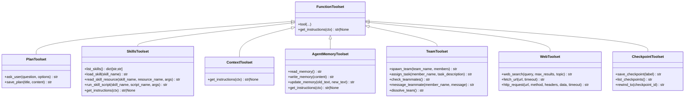

**Diagram sources**
- [pydantic_deep/toolsets/plan/toolset.py:139-220](file://pydantic_deep/toolsets/plan/toolset.py#L139-L220)
- [pydantic_deep/toolsets/skills/toolset.py:112-598](file://pydantic_deep/toolsets/skills/toolset.py#L112-L598)
- [pydantic_deep/toolsets/context.py:150-208](file://pydantic_deep/toolsets/context.py#L150-L208)
- [pydantic_deep/toolsets/memory.py:130-231](file://pydantic_deep/toolsets/memory.py#L130-L231)
- [pydantic_deep/toolsets/teams.py:354-533](file://pydantic_deep/toolsets/teams.py#L354-L533)
- [pydantic_deep/toolsets/web.py:214-408](file://pydantic_deep/toolsets/web.py#L214-L408)
- [pydantic_deep/toolsets/checkpointing.py:448-603](file://pydantic_deep/toolsets/checkpointing.py#L448-L603)

## Detailed Component Analysis

### Planning (PlanToolset)
The planning toolset enables interactive planning with ask_user and save_plan. It integrates with the agent runtime and can operate in interactive or headless modes depending on whether a user callback is provided.

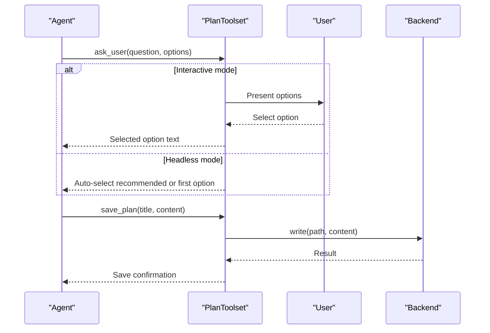

**Diagram sources**
- [pydantic_deep/toolsets/plan/toolset.py:167-218](file://pydantic_deep/toolsets/plan/toolset.py#L167-L218)

**Section sources**
- [pydantic_deep/toolsets/plan/toolset.py:1-220](file://pydantic_deep/toolsets/plan/toolset.py#L1-L220)

### Filesystem (Console) Toolset
The console toolset provides filesystem operations backed by the configured backend. It supports listing, reading/writing files, editing, pattern matching, searching, and executing commands when permitted.

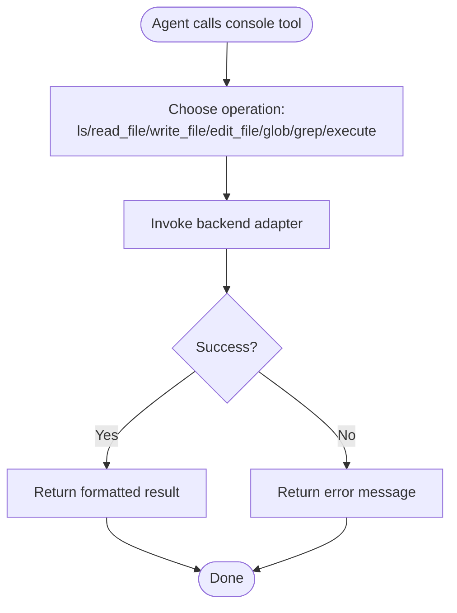

**Diagram sources**
- [docs/concepts/toolsets.md:41-94](file://docs/concepts/toolsets.md#L41-L94)

**Section sources**
- [docs/concepts/toolsets.md:41-94](file://docs/concepts/toolsets.md#L41-L94)

### Subagents
Subagents enable delegation to specialized agents. The toolset supports spawning tasks, checking status, listing active tasks, and cancellation.

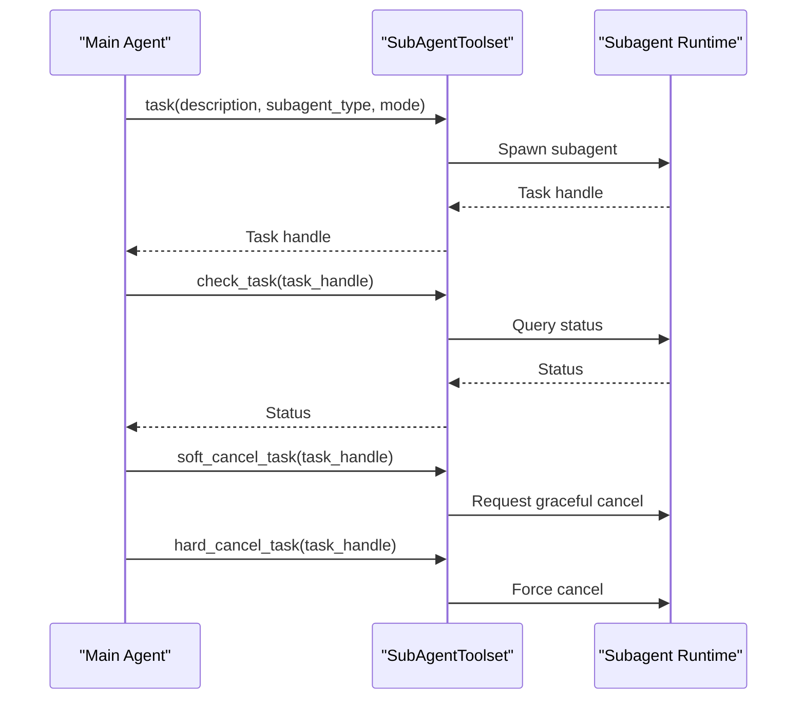

**Diagram sources**
- [docs/concepts/toolsets.md:95-121](file://docs/concepts/toolsets.md#L95-L121)

**Section sources**
- [docs/concepts/toolsets.md:95-121](file://docs/concepts/toolsets.md#L95-L121)

### Skills Framework
Skills are modular capability packages with progressive disclosure. The SkillsToolset discovers skills from directories or backend, registers tools, and contributes dynamic system prompt content.

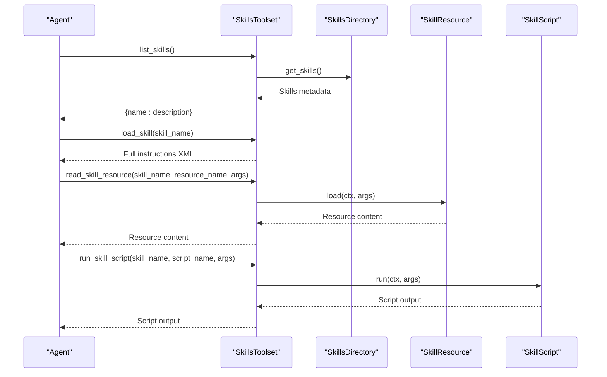

**Diagram sources**
- [pydantic_deep/toolsets/skills/toolset.py:325-456](file://pydantic_deep/toolsets/skills/toolset.py#L325-L456)
- [pydantic_deep/toolsets/skills/directory.py:444-532](file://pydantic_deep/toolsets/skills/directory.py#L444-L532)
- [pydantic_deep/toolsets/skills/backend.py:397-565](file://pydantic_deep/toolsets/skills/backend.py#L397-L565)

**Section sources**
- [pydantic_deep/toolsets/skills/toolset.py:1-598](file://pydantic_deep/toolsets/skills/toolset.py#L1-L598)
- [pydantic_deep/toolsets/skills/directory.py:1-532](file://pydantic_deep/toolsets/skills/directory.py#L1-L532)
- [pydantic_deep/toolsets/skills/backend.py:1-565](file://pydantic_deep/toolsets/skills/backend.py#L1-L565)
- [docs/concepts/skills.md:1-440](file://docs/concepts/skills.md#L1-L440)
- [docs/examples/skills.md:1-292](file://docs/examples/skills.md#L1-L292)
- [examples/skills_usage.py:1-151](file://examples/skills_usage.py#L1-L151)

### Context Injection
The ContextToolset loads project context files from the backend and injects them into the system prompt. It supports explicit paths or auto-discovery and respects subagent filtering.

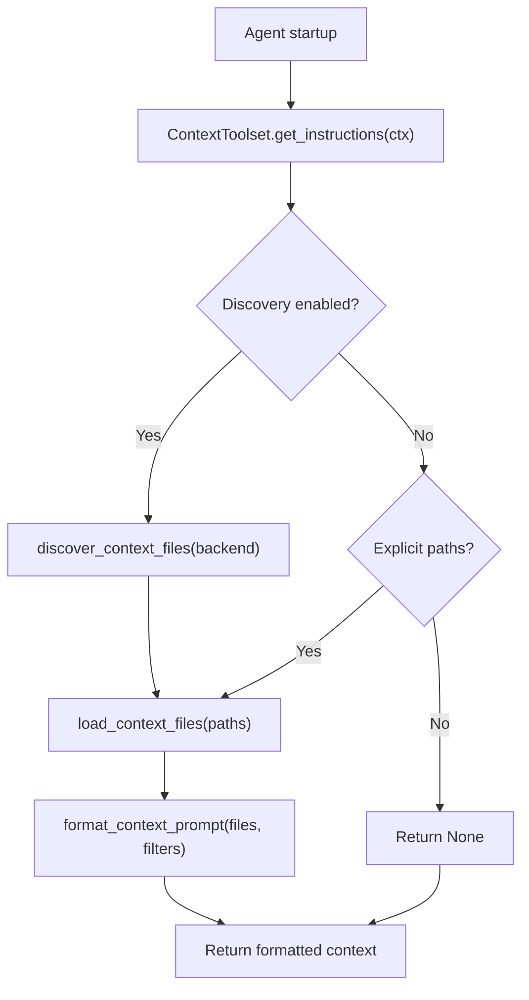

**Diagram sources**
- [pydantic_deep/toolsets/context.py:181-208](file://pydantic_deep/toolsets/context.py#L181-L208)

**Section sources**
- [pydantic_deep/toolsets/context.py:1-208](file://pydantic_deep/toolsets/context.py#L1-L208)
- [docs/concepts/toolsets.md:195-202](file://docs/concepts/toolsets.md#L195-L202)

### Memory
The AgentMemoryToolset provides persistent memory per agent with read, append, and update operations. It also injects memory into the system prompt.

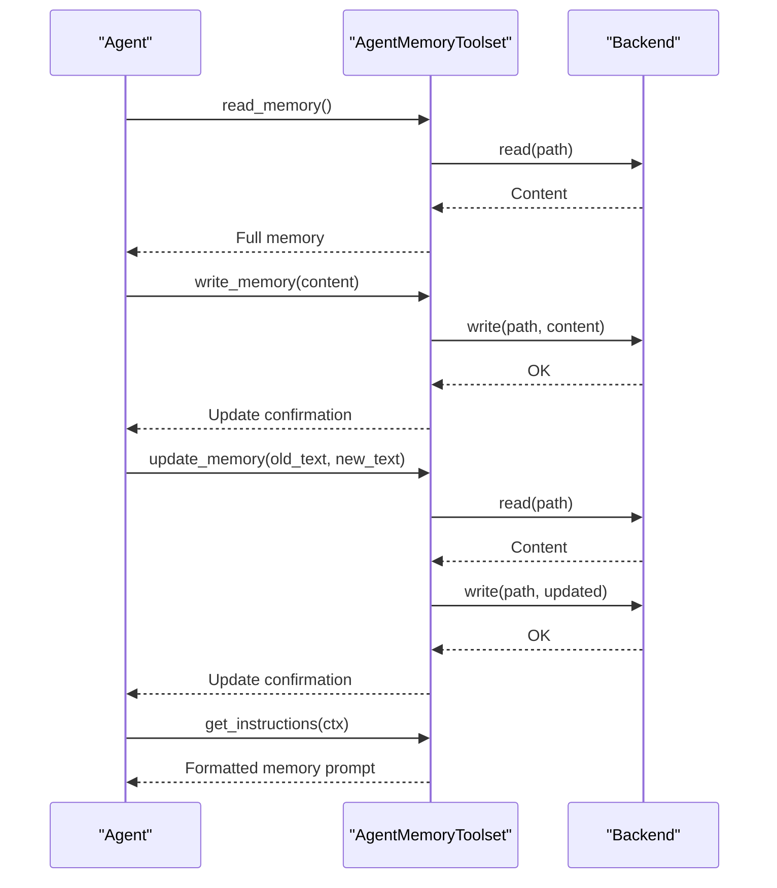

**Diagram sources**
- [pydantic_deep/toolsets/memory.py:170-231](file://pydantic_deep/toolsets/memory.py#L170-L231)

**Section sources**
- [pydantic_deep/toolsets/memory.py:1-231](file://pydantic_deep/toolsets/memory.py#L1-L231)
- [docs/concepts/toolsets.md:168-181](file://docs/concepts/toolsets.md#L168-L181)

### Teams
The TeamToolset coordinates multi-agent collaboration with shared todos and peer-to-peer messaging.

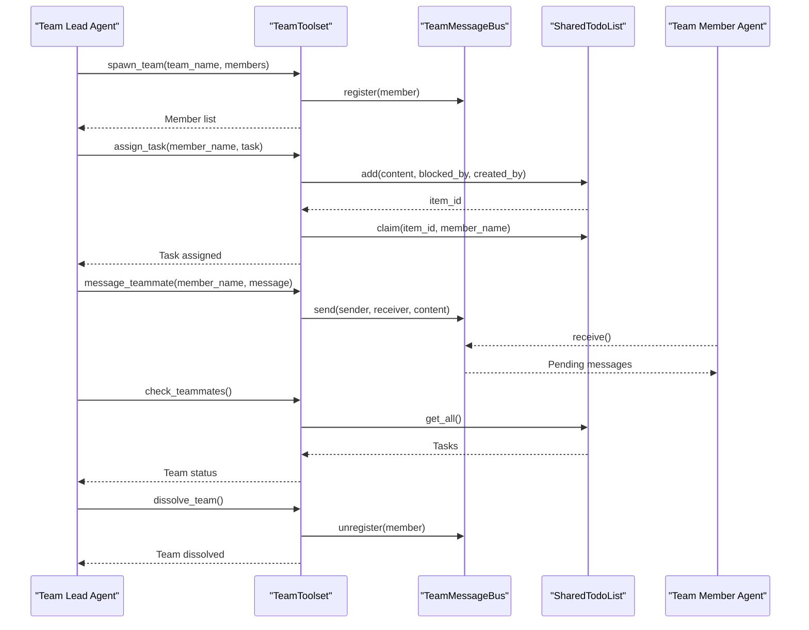

**Diagram sources**
- [pydantic_deep/toolsets/teams.py:354-533](file://pydantic_deep/toolsets/teams.py#L354-L533)

**Section sources**
- [pydantic_deep/toolsets/teams.py:1-533](file://pydantic_deep/toolsets/teams.py#L1-L533)
- [docs/concepts/toolsets.md:152-167](file://docs/concepts/toolsets.md#L152-L167)

### Web Tools
The WebToolset provides web search, URL fetching, and HTTP requests with a pluggable search provider protocol.

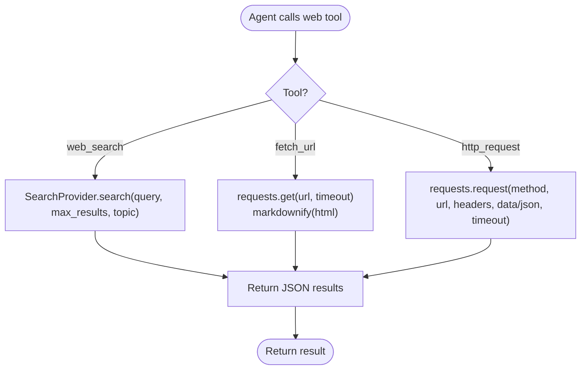

**Diagram sources**
- [pydantic_deep/toolsets/web.py:214-408](file://pydantic_deep/toolsets/web.py#L214-L408)

**Section sources**
- [pydantic_deep/toolsets/web.py:1-408](file://pydantic_deep/toolsets/web.py#L1-L408)
- [docs/concepts/toolsets.md:1-418](file://docs/concepts/toolsets.md#L1-L418)

### Checkpointing
The CheckpointToolset and middleware enable manual checkpoint controls and automatic snapshots.

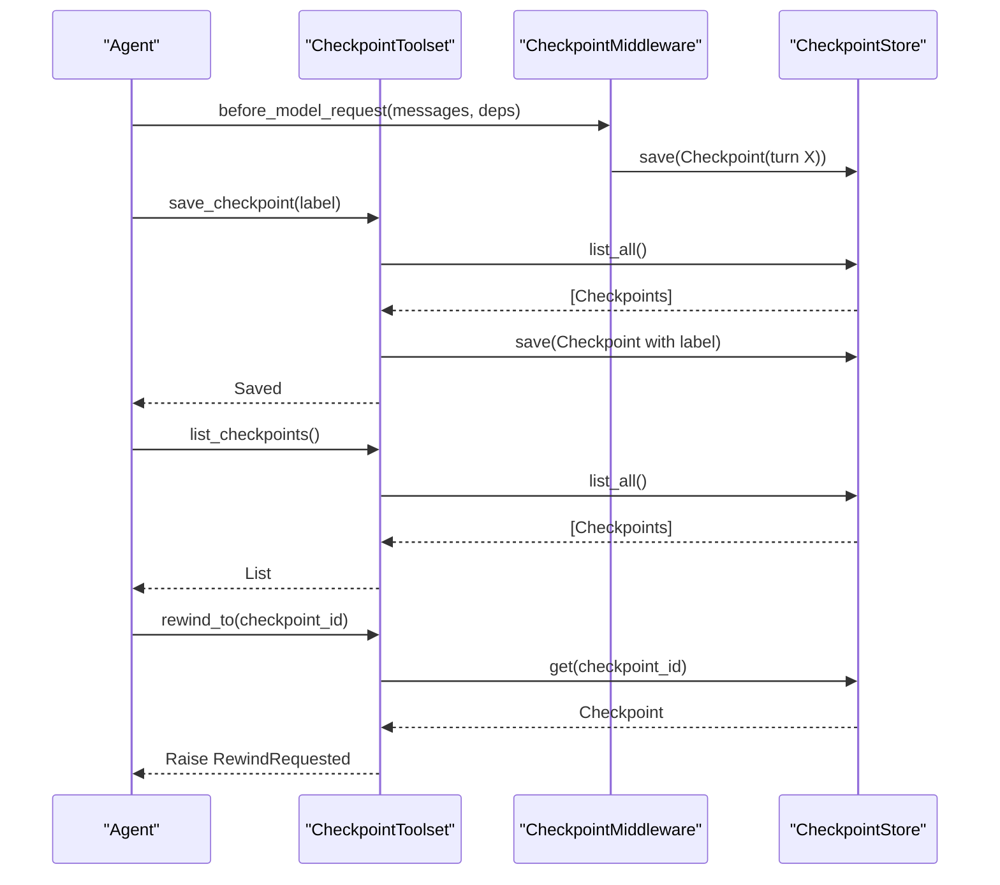

**Diagram sources**
- [pydantic_deep/toolsets/checkpointing.py:448-603](file://pydantic_deep/toolsets/checkpointing.py#L448-L603)

**Section sources**
- [pydantic_deep/toolsets/checkpointing.py:1-603](file://pydantic_deep/toolsets/checkpointing.py#L1-L603)
- [docs/concepts/toolsets.md:138-151](file://docs/concepts/toolsets.md#L138-L151)

## Dependency Analysis
Toolsets depend on the agent runtime and backend abstractions. Skills toolset depends on directory and backend discovery modules. The initializer aggregates toolsets for convenient import.

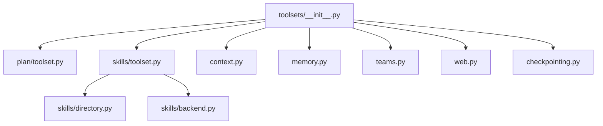

**Diagram sources**
- [pydantic_deep/toolsets/__init__.py:1-25](file://pydantic_deep/toolsets/__init__.py#L1-L25)
- [pydantic_deep/toolsets/skills/toolset.py:27-37](file://pydantic_deep/toolsets/skills/toolset.py#L27-L37)
- [pydantic_deep/toolsets/skills/directory.py:1-532](file://pydantic_deep/toolsets/skills/directory.py#L1-L532)
- [pydantic_deep/toolsets/skills/backend.py:1-565](file://pydantic_deep/toolsets/skills/backend.py#L1-L565)

**Section sources**
- [pydantic_deep/toolsets/__init__.py:1-25](file://pydantic_deep/toolsets/__init__.py#L1-L25)

## Performance Considerations
- Skills discovery scans directories; limit recursion depth and number of directories for speed.
- Progressive disclosure reduces token usage by loading full instructions only when needed.
- Web tool calls may incur latency; tune timeouts and consider caching results externally.
- Memory and context injection are truncated to stay within token budgets.
- Teams and subagents introduce concurrency overhead; manage task volume and message bus throughput.

[No sources needed since this section provides general guidance]

## Troubleshooting Guide
Common issues and resolutions:
- Skills not found: Verify skill directory paths and names; ensure SKILL.md frontmatter is valid.
- Resource/script errors: Check backend permissions and script URIs; confirm script execution environment.
- Web tool dependencies: Install optional extras for web tools; ensure API keys are configured.
- Memory/Context not injected: Confirm backend paths and file existence; adjust max_chars/truncation.
- Team messaging failures: Ensure agents are registered; check timeouts and queue availability.
- Checkpoint errors: Validate store configuration and checkpoint IDs; handle RewindRequested appropriately.

**Section sources**
- [pydantic_deep/toolsets/skills/backend.py:25-31](file://pydantic_deep/toolsets/skills/backend.py#L25-L31)
- [pydantic_deep/toolsets/web.py:11-12](file://pydantic_deep/toolsets/web.py#L11-L12)
- [pydantic_deep/toolsets/checkpointing.py:87-108](file://pydantic_deep/toolsets/checkpointing.py#L87-L108)

## Conclusion
Toolsets provide a standardized, modular way to extend agent capabilities. By leveraging FunctionToolset and backend integrations, they enable planning, skills, context, memory, teams, web tools, and checkpointing. Use progressive disclosure, configure approvals thoughtfully, and combine toolsets strategically to balance power and safety.

[No sources needed since this section summarizes without analyzing specific files]

## Appendices

### Practical Examples and Patterns
- Skills usage example demonstrates discovery, listing, loading, and resource access.
- Skills concept and example docs show end-to-end usage and best practices.
- Bundled skills demonstrate real-world skill composition.

**Section sources**
- [examples/skills_usage.py:1-151](file://examples/skills_usage.py#L1-L151)
- [docs/examples/skills.md:1-292](file://docs/examples/skills.md#L1-L292)
- [docs/concepts/skills.md:1-440](file://docs/concepts/skills.md#L1-L440)
- [pydantic_deep/bundled_skills/data-formats/SKILL.md:1-83](file://pydantic_deep/bundled_skills/data-formats/SKILL.md#L1-L83)