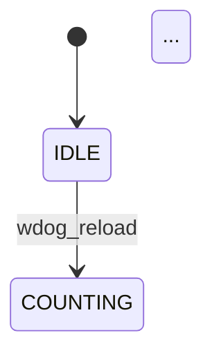

# Simics DML Device Analysis Tools

Design document for the `simics_device_tools` package located at
`code-graph-providers/potpie/app/modules/intelligence/tools/simics_device_tools/`.

---

## 1. End-to-End Working Flow

The pipeline transforms a raw Simics DML device in a Neo4j code graph into a
set of structured, human-readable hardware-capability specifications and
multi-audience wiki documentation.

```
┌──────────────────────────────────────────────────────────────────────────────┐
│  Step 1 — Exploration                                                        │
│  explore_simics_device                                                       │
│   ├─ Query Neo4j: DEVICE → BANK → REGISTER → FIELD                          │
│   ├─ Query Neo4j: DEVICE → BANK[:IMPLEMENTS fsm.dml:fsm] (FSMs)             │
│   ├─ Query Neo4j: DEVICE → EVENT                                             │
│   └─ Query Neo4j: DEVICE → PORT / CONNECT (via direct or GROUP path)        │
│                     ↓ structural inventory stored in device_storage          │
└──────────────────────────────────────────────────────────────────────────────┘
                          ↓
┌──────────────────────────────────────────────────────────────────────────────┐
│  Step 2 — Component Analysis (four independent sub-steps)                   │
│                                                                              │
│  ┌─────────────────────────────┐   ┌────────────────────────────────┐       │
│  │ analyze_register_side_effect│   │ analyze_interface              │       │
│  │  • write_effect, read_effect│   │  • PORT feature + keywords     │       │
│  │  • keywords per register    │   │  • CONNECT feature + keywords  │       │
│  └──────────────┬──────────────┘   └───────────────┬────────────────┘       │
│                 │                                   │                        │
│  ┌──────────────▼──────────────┐   ┌───────────────▼────────────────┐       │
│  │ analyze_fsm                 │   │ analyze_event                  │       │
│  │  • Mermaid state diagram    │   │  • timer/deferred-action feat. │       │
│  │  • feature + keywords       │   │  • keywords per event          │       │
│  └──────────────┬──────────────┘   └───────────────┬────────────────┘       │
│                 └─────────────────┬─────────────────┘                        │
│          all keywords merged into device-level capability_keywords           │
└──────────────────────────────────────────────────────────────────────────────┘
                          ↓
┌──────────────────────────────────────────────────────────────────────────────┐
│  Step 3 — Capability Analysis                                                │
│  analyze_capability                                                          │
│   ├─ LLM: categorise keyword list → named capability domains                │
│   ├─ Per domain: gather seed nodes + KG embedding search → chunk nodes      │
│   └─ LLM map-reduce: produce structured spec per domain                     │
│                     ↓ capabilities stored in device_storage                 │
└──────────────────────────────────────────────────────────────────────────────┘
                          ↓
┌──────────────────────────────────────────────────────────────────────────────┐
│  Step 4 — Wiki Generation                                                    │
│  simics_device_wiki_agent                                                    │
│   ├─ ensure_capabilities_ready — verify Step 3 is complete (or run it)      │
│   ├─ Read structure inventory from device_storage                            │
│   ├─ Generate section pages: registers, interfaces, FSMs (one page each)    │
│   ├─ Generate capability pages: one wiki page per capability (batched)      │
│   ├─ Generate overview page: Mermaid block diagram + page index             │
│   └─ Write .repowiki/en/content/Simics Device/<device>/<section>/*.md       │
└──────────────────────────────────────────────────────────────────────────────┘
                          ↓
┌──────────────────────────────────────────────────────────────────────────────┐
│  Step 5 — Dump / Export                                                      │
│  list_capability (show --feature capability --gen-specs --output <dir>)     │
│   └─ Write <output>/<capability-name>/spec.md  (OpenSpec pattern)           │
└──────────────────────────────────────────────────────────────────────────────┘
```

The pipeline is **incremental**: every tool checks `device_storage` before
doing work, skips already-analysed items (`status == done`), and writes
results atomically.  Any sub-step can be re-run in isolation with `--refresh`.
The wiki agent (Step 4) requires Steps 1-3 to be complete before it runs.

---

## 2. Tool Reference

### 2.1 `ExploreSimicsDeviceTool`

| | |
|---|---|
| **Module** | `explore_simics_device_tool.py` |
| **LangChain name** | `explore_simics_device` |
| **Pipeline step** | Step 1 — `PipelineStep.EXPLORATION` |

#### Goal

Build the full structural inventory of a DML device by traversing the Neo4j
code graph.  Outputs every register bank, register, bit-field, FSM, time
event, and PORT/CONNECT interface node, together with their Neo4j `node_id`,
`name`, and `docstring`.

#### Context construction

Four independent graph traversals are issued (in parallel when missing
sections exist):

| Section | Cypher path |
|---|---|
| `registers` | `DEVICE -[:CONTAINS]-> BANK -[:CONTAINS]-> REGISTER -[:CONTAINS]-> FIELD` |
| `interfaces` | `DEVICE -[:CONTAINS]-> PORT` and `DEVICE -[:CONTAINS]-> GROUP -[:CONTAINS]-> PORT` (same for CONNECT) |
| `fsms` | `DEVICE -[:CONTAINS]-> BANK -[:IMPLEMENTS]-> TEMPLATE` where template path ends with `fsm.dml:fsm` |
| `events` | `DEVICE -[:CONTAINS]-> EVENT` |

BANK nodes that implement the FSM template are **excluded** from `banks` and
reported separately in `fsms`.

#### Caching behaviour

On each call the tool checks `storage.structure_is_populated()`.  When all
four sections are present and `refresh=False`, the cached structure is
returned immediately without any Neo4j queries.  When `refresh=True` (or
sections are missing), only the missing/stale sections are re-queried.

#### Output layout

```json
{
  "banks": [
    {
      "node_id":   "<bank-node-id>",
      "name":      "<bank-name>",
      "docstring": "...",
      "registers": [
        {
          "node_id":   "<reg-node-id>",
          "name":      "<reg-name>",
          "docstring": "...",
          "fields": [
            { "node_id": "...", "name": "...", "docstring": "..." }
          ]
        }
      ]
    }
  ],
  "fsms": [
    { "node_id": "...", "name": "...", "docstring": "..." }
  ],
  "events": [
    { "node_id": "...", "name": "...", "docstring": "...", "text": "..." }
  ],
  "interfaces": {
    "input":  [ { "node_id": "...", "name": "...", "docstring": "..." } ],
    "output": [ { "node_id": "...", "name": "...", "docstring": "..." } ]
  }
}
```

#### Side effects on storage

After each section query, `storage.upsert_structure()` is called.  This
auto-populates `registers{}`, `interfaces{}`, `fsm_items{}`, and
`event_items{}` with `status = "pending"` for every newly discovered node so
the Step-2 analysis tools can start immediately.

---

### 2.2 `AnalyzeRegisterSideEffectTool`

| | |
|---|---|
| **Module** | `analyze_register_side_effect_tool.py` |
| **LangChain name** | `analyze_register_side_effect` |
| **Pipeline step** | Step 2a — `PipelineStep.REGISTER_ANALYSIS` |

#### Goal

For every register in the device, determine:

- `write_effect` — what hardware state the model simulates on write (counter
  reload, FSM trigger, interrupt arm, lock sequence, …).
- `read_effect` — what data or status the model returns on read, plus any
  read side-effects (e.g. status-clear-on-read).
- `keywords` — 2-5 short hardware-concept names characterising the register
  (e.g. `"watchdog-counter"`, `"interrupt-enable"`).

#### Context construction

For each register the tool assembles a DML context blob from the Neo4j graph:

1. Source text of the REGISTER node and its FIELDs.
2. TEMPLATE nodes the register implements, with their source text.
3. Up to `_MAX_CALLED_BY` FUNCTION nodes that call into the register's
   callbacks (fan-in), and up to `_MAX_CALLS` FUNCTION nodes called by those
   callbacks (fan-out).

When the context exceeds `chunk_tokens` (default 15 000 tokens) it is split
into chunks and processed in a **map-reduce** pattern:

- **MAP**: each chunk is analysed independently → partial `write_effect`,
  `read_effect`, `keywords`.
- **REDUCE**: a final LLM call synthesises the partial results into a single
  coherent record.

Registers whose templates are all in `_DEFAULT_TEMPLATES` (pure storage
registers with no DML callbacks) are classified as *passive* and skipped
(`skipped_passive` counter).

#### Parallelism

Registers are dispatched in batches of `batch_size` (default 5) using
`asyncio.gather`.  Each batch flushes results to storage before the next
batch starts so a crash only loses one batch.

#### Output layout

```json
{
  "device_name":         "watchdog",
  "project_id":          "<uuid>",
  "total_registers":     12,
  "done":                10,
  "failed":              0,
  "skipped_passive":     2,
  "capability_keywords": ["watchdog-counter", "interrupt-enable", ...],
  "status_counts": {
    "pending": 0, "processing": 0, "done": 10, "failed": 0, "all": 12
  }
}
```

Full per-register data is persisted to `storage.registers{}`.

---

### 2.3 `AnalyzeInterfaceTool`

| | |
|---|---|
| **Module** | `analyze_interface_tool.py` |
| **LangChain name** | `analyze_interface` |
| **Pipeline step** | Step 2b — `PipelineStep.INTERFACE_ANALYSIS` |

#### Goal

For every PORT (input) and CONNECT (output) node, determine:

- `feature` — 3-5 sentence description covering: what hardware
  signal/protocol is simulated, how the DML model implements it, and which
  source files contain it.
- `keywords` — 2-5 short hardware-concept names (e.g. `"interrupt-output"`,
  `"reset-input"`, `"AXI-slave"`, `"Q-channel"`).

#### Context construction

For each PORT or CONNECT node:

1. TEMPLATE nodes it IMPLEMENTS, with 1-hop call-chain context.
2. INTERFACE nodes it IMPLEMENTS (PORT) or REFERENCES (CONNECT), with 1-hop
   call-chain context.
3. FUNCTION nodes directly CONTAINed by the PORT/CONNECT, with 1-hop
   call-chain context (up to `_MAX_CALLED_BY` callers and `_MAX_CALLS`
   callees).

Chunked map-reduce applies when the assembled context exceeds `chunk_tokens`.

#### Output layout

```json
{
  "device_name":    "watchdog",
  "project_id":     "<uuid>",
  "total_ports":    2,
  "total_connects": 1,
  "done":           3,
  "failed":         0,
  "status_counts":  { ... },
  "interfaces": [
    {
      "node_id":  "...",
      "name":     "int_line",
      "kind":     "connect",
      "feature":  "The int_line CONNECT drives an interrupt controller's signal port ...",
      "keywords": ["interrupt-output", "signal"]
    }
  ]
}
```

Full per-interface data is persisted to `storage.interfaces{}`.

---

### 2.4 `AnalyzeFsmTool`

| | |
|---|---|
| **Module** | `analyze_fsm_tool.py` |
| **LangChain name** | `analyze_fsm` |
| **Pipeline step** | Step 2c — `PipelineStep.FSM_ANALYSIS` |

#### Goal

For every FSM (BANK node implementing `common/code/abstractions/fsm/fsm.dml:fsm`)
produce:

- `flowchart` — a Mermaid `stateDiagram-v2` diagram of all states and the
  events that trigger each transition.
- `feature` — 5-10 sentence hardware-level description of the capability the
  FSM models.
- `keywords` — 2-5 short hardware-concept names.

#### Context construction

For each FSM the following graph nodes are collected:

| What | Graph path |
|---|---|
| FSM-level functions | `FSM_BANK -[:CONTAINS]-> FUNCTION` with call chains |
| Events group | `FSM_BANK -[:CONTAINS]-> GROUP` where name ends with `<fsm_name>.events`; source text parsed to extract event name list |
| Initial states | `FSM_BANK -[:CONTAINS]-> GROUP -[:IMPLEMENTS]-> TEMPLATE` where template suffix == `fsm_init_state` |
| Regular states | Same but template suffix == `fsm_state` |
| Event handlers (per state) | `STATE_GROUP -[:CONTAINS]-> GROUP -[:IMPLEMENTS]-> TEMPLATE` where suffix == `fsm_event_handler` |
| Handler functions | FUNCTION nodes CONTAINed by each handler GROUP, with call chains; `handle` function highlighted |
| Entry points | FUNCTION nodes anywhere in the project that call `<fsm>.events.<event>.run_now` or `run_delayed` |

When the total state+handler context exceeds `_DEFAULT_CHUNK_LIMIT` (10
states per chunk) the states are split across MAP chunks and reduced.

#### Output layout

```json
{
  "device_name":    "watchdog",
  "project_id":     "<uuid>",
  "total_fsms":     1,
  "done":           1,
  "failed":         0,
  "total_keywords": 4,
  "status":         "complete"
}
```

Full per-FSM data (including `flowchart`, `feature`, `states`,
`event_triggering_points`) is persisted to `storage.fsm_analyses[]`.

---

### 2.5 `AnalyzeEventTool`

| | |
|---|---|
| **Module** | `analyze_event_tool.py` |
| **LangChain name** | `analyze_event` |
| **Pipeline step** | Step 2d — `PipelineStep.EVENT_ANALYSIS` |

#### Goal

For every EVENT node produce:

- `feature` — 5-8 sentence hardware reference covering: what timer or
  deferred action is modelled, what triggers it, what happens on fire
  (register updates, interrupts, FSM transitions), when it is cancelled.
- `keywords` — 2-5 short hardware-concept names (e.g.
  `"watchdog-timeout"`, `"periodic-interrupt"`).

#### Context construction

For each event:

1. TEMPLATE nodes it IMPLEMENTS, with 1-hop fan-in/fan-out call chains.
2. FUNCTION nodes directly CONTAINed by the EVENT, with 1-hop call chains.
3. Four **semantic searches** run in parallel (top-10 results each):
   - `"{event_name}.post"` — call sites that schedule the event.
   - `"{event_name}.remove"` — call sites that cancel it.
   - `"{event_name}.posted"` — guards that check whether it is queued.
   - `"{event_name}.next"` — sites that read the time-to-fire value.

#### Output layout

```json
{
  "device_name":    "watchdog",
  "project_id":     "<uuid>",
  "total_events":   2,
  "done":           2,
  "failed":         0,
  "total_keywords": 5,
  "status":         "complete"
}
```

Full per-event data is persisted to `storage.event_items{}`.

---

### 2.6 `AnalyzeCapabilityTool`

| | |
|---|---|
| **Module** | `analyze_capability_tool.py` |
| **LangChain name** | `analyze_capability` |
| **Pipeline step** | Step 3 — `PipelineStep.CAPABILITY_ANALYSIS` |

#### Goal

Combine all per-component keywords into named hardware capability domains
and generate a comprehensive structured description for each domain.

#### Working flow

```
Step 0  Prerequisite check
        └─ capability_keywords must be populated (register + interface + FSM + event analyses done)

Step 1  Keyword categorisation (one LLM call)
        └─ Flat keyword list → {domain_name: [keyword, ...]} grouping
           Domain names are concise hardware-architecture terms
           (e.g. "watchdog-countdown-timer", "interrupt-and-reset-generation")

Step 2  Per-domain evidence gathering (parallel, up to _BATCH_SIZE domains at once)
        ├─ 2a  Seed nodes  — every node referenced in capability_keywords for this domain
        ├─ 2b  Expanded nodes — KG embedding search with domain keywords → extra related nodes
        ├─ 2c  Fetch details — retrieve docstring + source text + file_path from Neo4j
        └─ 2d  Chunk nodes — split node list into token-bounded chunks (15 000 tokens default)

Step 3  LLM description generation (map-reduce per domain)
        ├─ Single chunk  → one LLM call → final description
        └─ Multi-chunk   → MAP (one call per chunk, parallel) + REDUCE (synthesis call)

Step 4  Persist
        └─ storage.set_capabilities(capabilities)
           storage.save()
```

Each LLM call produces a Pydantic-structured output with nine fields:

| Field | Content |
|---|---|
| `overview` | 3 sentences: what is simulated, how (Simics primitives), central source files |
| `how_simulated` | How the DML model implements the capability |
| `working_flow` | Step-by-step sequence of a typical hardware interaction |
| `register_effects` | One `### REGISTER` block per register with write/read callbacks |
| `state_and_fsm_behavior` | One block per FSM (includes verbatim Mermaid diagram) + persistent state vars |
| `event_scheduling` | One block per Simics time event (post/fire/cancel) |
| `interface_output` | One block per CONNECT node (output signal/bus) |
| `interface_input` | One block per PORT node (input signal/bus) |
| `code_map` | Resolved from `source_refs` node IDs → file paths (post-processing) |

#### Output layout

```json
{
  "device_name":  "watchdog",
  "project_id":   "<uuid>",
  "capabilities": [
    {
      "watchdog-countdown-timer": {
        "spec":     "## Overview\n...\n## Register Side-Effects\n...",
        "keywords": ["watchdog-counter", "reload-trigger", ...]
      }
    }
  ]
}
```

---

### 2.7 `ListCapabilityTool`

| | |
|---|---|
| **Module** | `list_capability_tool.py` |
| **LangChain name** | `list_capability` |

#### Goal

Retrieve all stored capability descriptions and, optionally, write them to
disk as **OpenSpec-pattern** `spec.md` files or generate richer LLM-based
OpenSpec documents.

#### Behaviour

1. Reads `storage.get_capabilities()`.
2. If no capabilities are stored, automatically invokes `AnalyzeCapabilityTool`
   first, then returns the result (`generated=True`).
3. Parses each capability's `spec` markdown by splitting on `## <Heading>`
   markers into structured fields.
4. When `gen_specs=True` and `output` directory is provided, calls
   `_build_openspec_prompt()` → LLM → writes one `spec.md` per capability.

#### OpenSpec `spec.md` format

```markdown
# <capability-name>

## Overview
<3-sentence implementation summary>

## How It's Simulated
<which Simics primitives (callbacks, FSM, events, signals) implement this>

## Working Flows
<numbered steps of a typical hardware interaction>

## Register Side-Effects
### <bank>.<register>
Write: ...
Read: ...

## State & FSM Behavior


## Event Scheduling
### <event_name>
Triggered by: ...  Fire action: ...

## Interface Output (CONNECT nodes)
### <connect_name>
...

## Interface Input (PORT nodes)
### <port_name>
...

## Code Map
path/to/watchdog.dml
path/to/fsm/fsm.dml
```

#### Return value

```json
{
  "device_name":       "watchdog",
  "project_id":        "<uuid>",
  "cached":            true,
  "generated":         false,
  "capability_status": "done",
  "capabilities": {
    "watchdog-countdown-timer": {
      "overview":               "...",
      "how_simulated":          "...",
      "working_flow":           "...",
      "register_effects":       "...",
      "state_and_fsm_behavior": "...",
      "event_scheduling":       "...",
      "interface_output":       "...",
      "interface_input":        "...",
      "code_map":               "...",
      "code_snippets":          ["..."],
      "keywords":               ["watchdog-counter", ...]
    }
  }
}
```

---

### 2.8 `ListSimicsDeviceFeatureTool`

| | |
|---|---|
| **Module** | `list_simics_device_feature.py` |
| **LangChain name** | `list_simics_device_feature` |

#### Goal

Unified listing entry-point that consolidates all per-component results.
Accepts `feature="register"`, `"interface"`, `"fsm"`, `"event"`, `"keyword"`,
or any `+`-separated combination (e.g. `"register+fsm"`), or `"all"`.

If the requested analysis has not been run yet, it is triggered automatically.

Results are returned flat (single feature) or under a `"features"` key
(multiple features).

---

### 2.9 `SimicsDeviceWikiAgent`

| | |
|---|---|
| **Module** | `chat_agents/system_agents/simics_device_wiki_agent.py` |
| **Agent ID** | `simics_device_wiki_agent` |
| **Pipeline step** | Step 4 — Wiki Generation |

#### Goal

Generate comprehensive, multi-page wiki documentation for a Simics DML
device model by consuming the results of the analysis pipeline (Steps 1-3)
and producing structured Markdown pages suitable for three target audiences:

| Audience | Focus |
|---|---|
| **Simics device model developers** | DML implementation details, code structure, template dependencies, extension points |
| **Software feature validators** | Behavioural specifications, test case scenarios, observable register state transitions |
| **Platform architects** | System-level integration, interface summary, block diagram, capability dependencies |

#### Pipeline (internal)

The agent orchestrates the following sequence on each invocation:

```
1. ensure_capabilities_ready
   └─ Verify capability analysis (Step 3) is complete.
      If not, run the full analysis pipeline (explore → analyse → capability)
      automatically before proceeding.

2. get_capabilities_with_nodes
   └─ Retrieve all capability specs and their referenced node IDs from
      device_storage.

3. Read structure inventory
   └─ Load banks, registers, interfaces, FSMs, and events from
      device_storage.

4. Generate section pages (three aggregate pages)
   ├─ Registers page  — consolidated register-map table, per-register
   │                    write/read side-effect descriptions.
   ├─ Interfaces page — PORT (input) and CONNECT (output) endpoint
   │                    descriptions with LLM-analysed feature details.
   └─ FSMs page       — Mermaid stateDiagram-v2 diagrams for every FSM,
                        feature descriptions, states, event triggering
                        points, and event schedules.

5. Generate capability pages (batched, with retries)
   └─ One wiki page per capability domain.  Default batch size: 5,
      max 3 retries per page on LLM failure.  Each page is enriched
      with code-graph context via get_code_graph_from_node_id,
      search_semantic, nl_cypher_query, and neo4j_graph_rag.

6. Generate overview page
   └─ Mermaid block diagram of the device architecture plus a
      summary index linking to all sub-pages.
```

#### Toolset

The agent has access to both pipeline tools and enrichment tools:

| Category | Tools |
|---|---|
| **Pipeline** | `explore_simics_device`, `analyze_register_side_effect`, `list_register_side_effect`, `analyze_interface`, `list_interface_feature`, `analyze_capability`, `list_capability`, `analyze_event`, `analyze_attribute` |
| **Enrichment** | `get_code_graph_from_node_id`, `search_semantic`, `nl_cypher_query`, `neo4j_graph_rag` |

#### Output layout

Pages are written to `.repowiki/en/content/Simics Device/<device_name>/`:

```
.repowiki/en/content/Simics Device/<device_name>/
├── Overview/
│   └── Overview.md          ← Mermaid block diagram + page index
├── Registers/
│   └── Registers.md          ← Register-map table + per-register side-effects
├── Interfaces/
│   └── Interfaces.md         ← PORT/CONNECT endpoint descriptions
├── Finite State Machines/
│   └── Finite State Machines.md  ← FSM diagrams + feature descriptions
└── Capabilities/
    ├── <capability-name-1>/
    │   └── <capability-name-1>.md
    ├── <capability-name-2>/
    │   └── <capability-name-2>.md
    └── ...
```

#### Key behaviours

- **Idempotent**: Already-generated pages are skipped on re-run unless
  `--force` is passed.
- **Automatic pipeline**: If capability analysis has not been run, the agent
  runs the full explore → analyse → capability pipeline first.
- **Token budgeting**: Each LLM prompt is capped at 130 000 characters
  (~37 000 input tokens) to stay under typical 64 K model limits.
- **Atomic writes**: Pages are written using write-to-tmp + rename so
  partially-written pages are never visible.

---

## 3. Device Storage Design

### `SimicsDeviceStorage`

All analysis results for a single device are stored in one unified JSON file:

```
{SIMICS_DEVICE_STORAGE_DIR}/{project_id}/{device_name}-storage.json
```

`SIMICS_DEVICE_STORAGE_DIR` defaults to `simics_device_storage` (overridable
via environment variable).

The class is **thread-safe** (Python `threading.RLock`) and uses
**atomic writes** (write to `.tmp`, then `rename`).

### Full JSON Schema

```json
{
  "device_name": "<resolved Neo4j name>",
  "project_id":  "<UUID>",
  "created_at":  "<ISO-8601>",
  "updated_at":  "<ISO-8601>",

  "pipeline_flags": {
    "exploration":         "not_ready | processing | ready | failed",
    "register_analysis":   "not_ready | processing | ready | failed",
    "interface_analysis":  "not_ready | processing | ready | failed",
    "fsm_analysis":        "not_ready | processing | ready | failed",
    "event_analysis":      "not_ready | processing | ready | failed",
    "capability_analysis": "not_ready | processing | ready | failed"
  },

  "structure": {
    "banks": [
      {
        "node_id": "...", "name": "...", "docstring": "...",
        "registers": [
          {
            "node_id": "...", "name": "...", "docstring": "...",
            "fields": [ { "node_id": "...", "name": "...", "docstring": "..." } ]
          }
        ]
      }
    ],
    "fsms":   [ { "node_id": "...", "name": "...", "docstring": "..." } ],
    "events": [ { "node_id": "...", "name": "...", "docstring": "...", "text": "..." } ],
    "interfaces": {
      "input":  [ { "node_id": "...", "name": "...", "docstring": "..." } ],
      "output": [ { "node_id": "...", "name": "...", "docstring": "..." } ]
    },
    "no_registers":  false,
    "no_interfaces": false,
    "no_fsms":       false,
    "no_events":     false
  },

  "registers": {
    "<node_id>": {
      "node_id":     "...",
      "reg_name":    "WDOGLOAD",
      "bank_name":   "regs",
      "device_name": "watchdog",
      "project_id":  "...",
      "status":      "pending | processing | done | failed",
      "created_at":  "...",
      "updated_at":  "...",
      "write_effect": "...",
      "read_effect":  "...",
      "keywords":     ["watchdog", "counter"],
      "code_map":     "path/to/watchdog.dml\n...",
      "error_msg":    null
    }
  },

  "interfaces": {
    "<node_id>": {
      "node_id":     "...",
      "name":        "int_line",
      "kind":        "port | connect",
      "docstring":   "...",
      "device_name": "watchdog",
      "project_id":  "...",
      "status":      "pending | processing | done | failed",
      "created_at":  "...",
      "updated_at":  "...",
      "feature":     "...",
      "keywords":    ["interrupt-output", "signal"],
      "error_msg":   null
    }
  },

  "fsm_analyses": [
    {
      "node_id":    "<bank-node-id>",
      "name":       "<fsm-bank-name>",
      "docstring":  "...",
      "flowchart":  "stateDiagram-v2\n  [*] --> IDLE\n  ...",
      "feature":    "...",
      "keywords":   ["watchdog-countdown", "timeout-reset"],
      "event_group_node_id": "...",
      "event_names":  ["wdog_timeout", "wdog_reload"],
      "init_states":  [ { "node_id": "...", "name": "...", "docstring": "..." } ],
      "states":       [ { "node_id": "...", "name": "...", "docstring": "..." } ],
      "unconditional_handlers": [ { "node_id": "...", "name": "...", "event_name": "..." } ],
      "event_triggering_points": [
        { "node_id": "...", "name": "...", "file_path": "...", "event_name": "..." }
      ]
    }
  ],

  "event_items": {
    "<node_id>": {
      "node_id":    "...",
      "name":       "wdog_timeout",
      "docstring":  "...",
      "status":     "pending | processing | done | failed",
      "feature":    "...",
      "keywords":   ["watchdog-timeout", "interrupt-trigger"],
      "error_msg":  null
    }
  },

  "capability_keywords": {
    "<keyword>": [
      { "node_id": "...", "name": "WDOGCONTROL", "type": "register | interface | fsm | event" }
    ]
  },

  "capabilities": {
    "<capability-name>": {
      "spec":     "## Overview\n...",
      "keywords": ["<keyword>", "..."]
    }
  }
}
```

### Status enumerations

| Class | Values |
|---|---|
| `RegStatus` | `pending`, `processing`, `done`, `failed` |
| `FsmStatus` | `pending`, `processing`, `done`, `failed` |
| `StepStatus` | `not_ready`, `processing`, `ready`, `failed` |

### `PipelineStep` constants

| Constant | String key | Owning tool |
|---|---|---|
| `EXPLORATION` | `"exploration"` | `ExploreSimicsDeviceTool` |
| `REGISTER_ANALYSIS` | `"register_analysis"` | `AnalyzeRegisterSideEffectTool` |
| `INTERFACE_ANALYSIS` | `"interface_analysis"` | `AnalyzeInterfaceTool` |
| `FSM_ANALYSIS` | `"fsm_analysis"` | `AnalyzeFsmTool` |
| `EVENT_ANALYSIS` | `"event_analysis"` | `AnalyzeEventTool` |
| `CAPABILITY_ANALYSIS` | `"capability_analysis"` | `AnalyzeCapabilityTool` |

### Thread-safety and persistence

- All reads and writes go through `threading.RLock`.
- `storage.save()` uses a write-to-tmp + atomic rename so a crash never
  corrupts the JSON file.
- `get_device_storage(project_id, device_name)` is a module-level factory
  that caches one `SimicsDeviceStorage` instance per `(project_id,
  device_name)` pair in a `threading.Lock`-guarded dict.

---

## 4. CLI Usage

The `simics-device` sub-command is registered in `apps/cli/main.py` as a
Typer sub-app under the root `pydantic-deep` CLI.  It provides four
sub-commands that mirror the pipeline steps:

| Command | Pipeline Step | Description |
|---|---|---|
| `explore` | Step 1 | Discover and cache device structure |
| `analyze` | Step 2-3 | Run component/capability analysis |
| `show` | Step 5 | Inspect stored results or dump spec files |
| `wiki` | Step 4 | Generate multi-page wiki documentation |

### `explore` — discover and cache device structure

```bash
pydantic-deep simics-device explore \
  --project-id <project-uuid> \
  --device-name <device-name> \
  [--refresh]
```

| Option | Default | Description |
|---|---|---|
| `--project-id` / `-p` | required | Potpie project UUID |
| `--device-name` / `-d` | required | DML device name or partial name (case-insensitive) |
| `--refresh` | `false` | Force re-query of all structure sections (registers, interfaces, fsms, events) instead of using cached data |

`explore` runs `explore_simics_device` directly and stores the structural
inventory in device storage. It is useful for validating discovery before
running downstream analysis steps.

**Examples:**

```bash
# Explore and cache structure (uses cache if already complete)
pydantic-deep simics-device explore -p 550e8400-... -d watchdog

# Force a full refresh from the graph
pydantic-deep simics-device explore -p 550e8400-... -d watchdog --refresh
```

---

### `analyze` — run analysis pipeline

```bash
pydantic-deep simics-device analyze \
  --project-id <project-uuid> \
  --device-name <device-name> \
  [--feature register|interface|fsm|event|capability|all] \
  [--refresh] \
  [--user-id <uid>]
```

| Option | Default | Description |
|---|---|---|
| `--project-id` / `-p` | required | Potpie project UUID (from `potpie-cli parse repo`) |
| `--device-name` / `-d` | required | DML device name or partial name (case-insensitive) |
| `--feature` / `-f` | `all` | Which analysis to run: `register`, `interface`, `fsm`, `event`, `capability`, or `all` |
| `--refresh` | `false` | Force re-analysis even when cached results exist |
| `--user-id` | `defaultuser` | User ID passed to the tool |

When `--feature all` is used, the tools run in order:
`register → interface → fsm → event → capability`.

**Examples:**

```bash
# Full pipeline for a watchdog device
pydantic-deep simics-device analyze -p 550e8400-... -d watchdog

# Re-run only register analysis
pydantic-deep simics-device analyze -p 550e8400-... -d watchdog --feature register --refresh

# Generate capability descriptions after all component analyses are done
pydantic-deep simics-device analyze -p 550e8400-... -d watchdog --feature capability
```

---

### `show` — inspect stored results

```bash
pydantic-deep simics-device show \
  --project-id <project-uuid> \
  --device-name <device-name> \
  [--feature register|interface|fsm|event|capability|all] \
  [--json] \
  [--gen-specs] \
  [--output <dir>] \
  [--user-id <uid>]
```

| Option | Default | Description |
|---|---|---|
| `--project-id` / `-p` | required | Potpie project UUID |
| `--device-name` / `-d` | required | DML device name |
| `--feature` / `-f` | `all` | What to show (same values as `analyze`) |
| `--json` | `false` | Print raw JSON instead of Rich-formatted output |
| `--gen-specs` | `false` | Write per-capability `spec.md` files to `--output` dir (capability only) |
| `--output` / `-o` | `None` | Output directory for capability spec files |
| `--user-id` | `defaultuser` | User ID |

**Examples:**

```bash
# Show all stored features
pydantic-deep simics-device show -p 550e8400-... -d watchdog

# Show register analysis as JSON
pydantic-deep simics-device show -p 550e8400-... -d watchdog --feature register --json

# Show capabilities and dump spec.md files to ./specs/watchdog/
pydantic-deep simics-device show -p 550e8400-... -d watchdog \
  --feature capability --gen-specs --output ./specs/watchdog
```

After `--gen-specs`, the output directory contains:

```
specs/watchdog/
├── watchdog-countdown-timer/
│   └── spec.md
├── interrupt-and-reset-generation/
│   └── spec.md
└── write-protection/
    └── spec.md
```

Each `spec.md` follows the OpenSpec pattern described in §2.7.

---

### `wiki` — generate wiki documentation

```bash
pydantic-deep simics-device wiki \
  --project-id <project-uuid> \
  --device-name <device-name> \
  [--force] \
  [--output <dir>] \
  [--user-id <uid>]
```

| Option | Default | Description |
|---|---|---|
| `--project-id` / `-p` | required | Potpie project UUID |
| `--device-name` / `-d` | required | DML device name (passed as query to the wiki agent) |
| `--force` | `false` | Force regeneration even if wiki pages already exist |
| `--output` / `-o` | `.repowiki/en/content` or `POTPIE_WIKI_OUTPUT_DIR` env var | Root directory for wiki pages |
| `--user-id` | `defaultuser` | User ID passed to the agent |

The `wiki` command invokes the `SimicsDeviceWikiAgent` (§2.9) to generate a
full set of structured Markdown wiki pages.  If the analysis pipeline (Steps
1-3) has not been run yet, the agent runs it automatically before generating
pages.

**Examples:**

```bash
# Generate wiki for a watchdog device
pydantic-deep simics-device wiki -p 550e8400-... -d watchdog

# Force regeneration of all pages
pydantic-deep simics-device wiki -p 550e8400-... -d watchdog --force

# Write pages to a custom output directory
pydantic-deep simics-device wiki -p 550e8400-... -d watchdog -o ./wiki
```

After running, the output directory contains:

```
.repowiki/en/content/Simics Device/watchdog/
├── Overview/
│   └── Overview.md
├── Registers/
│   └── Registers.md
├── Interfaces/
│   └── Interfaces.md
├── Finite State Machines/
│   └── Finite State Machines.md
└── Capabilities/
    ├── watchdog-countdown-timer/
    │   └── watchdog-countdown-timer.md
    ├── interrupt-and-reset-generation/
    │   └── interrupt-and-reset-generation.md
    └── ...
```

---

## 5. Dependency Graph

```
ExploreSimicsDeviceTool
        │
        ├──────────────────────────┬─────────────────────────┐
        ▼                          ▼                         ▼                        ▼
AnalyzeRegisterSideEffectTool  AnalyzeInterfaceTool  AnalyzeFsmTool  AnalyzeEventTool
        │                          │                         │                        │
        └──────────────────────────┴─────────────────────────┴────────────────────────┘
                                           │
                                           ▼  (capability_keywords populated)
                                  AnalyzeCapabilityTool
                                           │
                                           ├──────────────────────────┐
                                           ▼                          ▼
                                   ListCapabilityTool        SimicsDeviceWikiAgent
                                    (→ spec.md files)         (→ wiki pages via
                                                              explore → analyse →
                                                              capability pipeline)
```

Each Step-2 tool reads the structural inventory (`storage.structure`) and
writes its results back to `device_storage` before Step-3 starts.
`AnalyzeCapabilityTool` requires at least one Step-2 tool to have merged
keywords into `capability_keywords`.

The `SimicsDeviceWikiAgent` (Step 4) consumes all Step 1-3 outputs and runs
the pipeline automatically if capability analysis is not yet complete. It
produces multi-page wiki documentation targeting developers, validators, and
architects.  `ListCapabilityTool` (Step 5) with `--gen-specs` produces
standalone OpenSpec-format `spec.md` files independent of the wiki.
